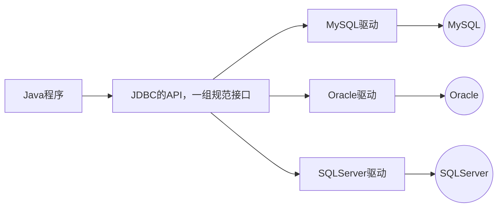

# JDBC

JDBC 提供了一套基本的 API 来实现 Java 程序与关系型数据库之间的连接和数据操作

JDBC 是 Java 提供的一组独立于任何数据库管理系统的 API

Java 提供接囗规范，由各个数据库厂商提供接囗的实现，厂商提供的实现类封装成jar文件，也就是我们俗称的数据库驱动jar 包



:::info[接口规范]
为了项目代码的可移植性，可维护性， SUN 公司从最初就制定了 Java 程序连接各种数据库的统一接囗规范。不管是连接哪一种 DBMS 软件， Java 代码可以保持一致性

接口存储在 `java.sql` 和 `javax.sql` 包下
:::
:::info[实现规范]
因为各个数据库厂商的 DBMS 软件各有不同，那么各自的内部如何通过 SQL 实现增、删、改、查等操作管理数据，只有这个数据库厂商自己更清楚，因此把接口规范的实现交给各个数据库厂商自己实现

厂商将实现内容和过程封装成 jar 文件，我们程序员只需要将 jar 文件引入到项目中集成即可，就可以开发调角实现过程操作数据库了
:::

## 示例

1. 创建数据库`mini_chat`
2. 添加表格数据

```sql
use mini_chat;

create table t_user(
    id int auto_increment comment '用户id' primary key,
    name varchar(100) not null comment '姓名',
    age int not null comment '年龄',
    points double(10,5) not null comment '积分'
);

insert into t_user (name, age, points) values
('zhangsan', 32, 777.77),
('lisi', 41, 666.66),
('wangwu', 23, 111),
('jack', 26, 123),
('aaa', 28, 123);
```

3. 引入MySQL驱动，以Maven项目为例

```xml
<dependency>
    <groupId>mysql</groupId>
    <artifactId>mysql-connector-java</artifactId>
    <version>8.0.33</version>
</dependency>
```

4. 编写代码

```java
// 注册驱动
Class.forName("com.mysql.cj.jdbc.Driver");

// 获取连接对象
String url = "jdbc:mysql://localhost:3307/mini_chat";
String username = "root";
String password = "password";
Connection connection = DriverManager.getConnection(url, username, password);

// 获取执行SQL的对象
Statement statement = connection.createStatement();

// 编写SQL语句并执行
String sql = "select id, name, age, points from t_user";
ResultSet resultSet = statement.executeQuery(sql);

while (resultSet.next()) {
    int id = resultSet.getInt("id");
    String name = resultSet.getString("name");
    int age = resultSet.getInt("age");
    double points = resultSet.getDouble("points");
    System.out.println(id + "\t" + name + "\t" + age + "\t" + points);
}

// 释放资源
resultSet.close();
statement.close();
connection.close();
```

## 核心API

### 注册驱动

在 Java 中，当使用 JDBC (Java Database Connectivity) 连接数据库时，需要加载数据库特定的驱动程序，以便与数据库进行通信

加载驱动程序的目的是为了注册驱动程序，使得 JDBC API 能够识别并与特定的数据库进行交互

:::note
从 JDK6 开始，不再需要显式地调用 `Class.forName()` 来加载驱动程序，只要在类路径中集成了对应的 jar 文件，会自动在初始化时注册驱动程序
:::

### Connection

Connection 接囗是 JDBC API 的重要接口，用于建立与数据库的通信通道。换而言之，Connection 对象不为空，则代表一次数据库连接

在建立连接时，需要指定数据库 URL 、用户名、密码参数

```bash
# jdbc:mysql://IP地址:端口号/数据库名称?参数键值对1&参数键值对2
jdbc:mysql://localhost:3307/mini_chat
```

Connection 接囗还负责管理事务， Connection 接口提供了 `commit` 和 `rollback` 方法，用于提交事务和回滚事务

可以创建 statement 对象，用于执行 SQL 语句并与数据库进行交互

在使用 JDBC 技术时，必须要先获取 Connection 对象，在使用完毕后，要释放资源，避免资源占用浪费及泄漏

```java
// 获取连接对象
String url = "jdbc:mysql://localhost:3307/mini_chat";
String username = "root";
String password = "password";
Connection connection = DriverManager.getConnection(url, username, password);

// 其他操作...

// 释放资源
connection.close();
```

### Statement

Statement 接口用于执行 SQL 语句并与数据库进行交互。它是 JDBC API 中的一个重要接口，通过 Statement 对象，可以向数据库发送 SQL 语句并获取执行结果

结果可以是一个或多个

* 增删该：受影响行数单个结果
* 查询：单行单例、多行多列、单行多列等结果

:::warning
Statement 接口在执行 SQL 语句时，会产生 SQL 注入攻击问题

当使用 Statement 执行**动态构建**的 SQL 询时，往往需要将查询条件与 SQL 语句拼接在一起，直接将参数和 SQL 语句一并生成，可以让 SQL 的查询条件始终为 true 得到结果
:::

```java title="SQL注入演示"
// 获取连接

// String queryName = "zhangsan";
// error line
String queryName = "111' or '1' = '1";

// 编写SQL语句并执行
String sql = "select id, name, age, points from t_user where name = '" + queryName + "'";
ResultSet resultSet = statement.executeQuery(sql);

while (resultSet.next()) {
    int id = resultSet.getInt("id");
    String name = resultSet.getString("name");
    int age = resultSet.getInt("age");
    double points = resultSet.getDouble("points");
    System.out.println(id + "\t" + name + "\t" + age + "\t" + points);
}

// 释放资源
```

上面的代码SQL拼接后为：`select id, name, age, points from t_user where name = '111' or '1' = '1'`，是可以查询到所有数据的

### PreparedStatement

PreparedStatement 是 Statement 接口的子接囗，用于执行预编泽的 SQL 询，有以下作用：

* **预编译 SQL 语句**：在创建 PreparedStatement 时，就会预编译 SQL 语句，也就是 SQL 语句已经固定
* **防止 SQL 注入**： PreparedStatement 支持参数化查询，将数据作为为参数传递到 SQL 语句中，采用 `?` 占位符的方式，将传入的参数用一对单引号包裹起来 `''` ，无论传递什么都作为值。有效防止传入关键字或值导致 SQL 注入问题
* **性能提升**： PreparedStatement 是预编译SQL语句，同一 SQL 语句多次执行的情况下，可以复用，不必每次重新编译和解析

:::note
设置参数时下标从 `1` 开始
:::

```java
// 获取连接

// 获取PreparedStatement
String sql = "select id, name, age, points from t_user where name = ?";
PreparedStatement statement = connection.prepareStatement(sql);

// 设置参数
statement.setString(1, "zhangsan");

// 处理数据...

// 释放资源
```

### ResultSet

Resu1tSet 是 JDBC API 中的一个接口，用于表示从数据库中执行**查询语句**所返回的结果集。它提供了一种用于遍历和访问查询结果的方式

**遍历结果**： ResultSet 可以使用 `next()` 方法将游标移动到结果集的下一行，逐行遍历数据库查询的结果，返回值为 boolean 类型

**获取单列结果**：可以通过 `getXxx()` 的方法获取单列的数据，该方法为重载方法，支持**索引**和**列名**进行获取

```java
// 获取连接

// 准备查询数据

// 获取结果
ResultSet resultSet = statement.executeQuery();

while (resultSet.next()) {
    // 通过列下标获取数据，下标从1开始，不推荐
    int id = resultSet.getInt(1);
    String name = resultSet.getString("name");
    int age = resultSet.getInt("age");
    double points = resultSet.getDouble("points");
    System.out.println(id + "\t" + name + "\t" + age + "\t" + points);
}

// 释放资源
```

## 实现增删改查

### 查询单行单列

```java {1,6,8}
String sql = "select count(*) from t_user";
PreparedStatement statement = connection.prepareStatement(sql);

ResultSet resultSet = statement.executeQuery();
// 只有行，不需要遍历
if (resultSet.next()) {
    // 只有一列，可以直接使用下标获取数据
    long count = resultSet.getLong(1);
    System.out.println(count);
}
// 释放资源
resultSet.close();
statement.close();
```
