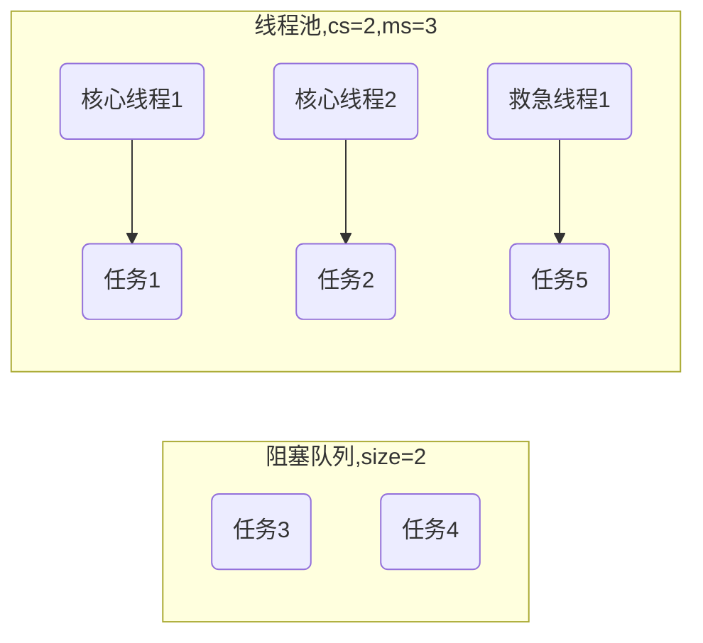

# 线程池

## 自定义线程池

> [详细代码](https://github.com/follow1123/java-basics/blob/main/src/main/java/cn/y/java/juc/thread_pool/custom_thread_pool)

## ThreadPoolExecutor

> [详细代码](https://github.com/follow1123/java-basics/blob/main/src/main/java/cn/y/java/juc/thread_pool/ThreadPoolExecutorTest.java)

### 线程池状态

* **ThreadPoolExecutor**使用`int`的高3位来表示线程池状态，低29位表示线程数量
* 使用一个`int`来表示这两种状态的原因：是可以用一次CAS操作修改这两个状态

| 状态    | 高3位    | 接收新任务    | 处理阻塞队列任务    | 说明    |
|---------------- | --------------- | --------------- | --------------- | --------------- |
| `RUNNING`    | 111    | Y    | N    |    |
| `SHUTDOWN`   | 000   | N   | Y   | 不会接收新任务，但会处理阻塞队列剩余任务   |
| `STOP`   | 001   | N   | N   | 会中断正在执行的任务，并抛弃阻塞队列任务   |
| `TIDYING`   | 010   | -   | -   | 任务全执行完成，活动线程为0，即将进入终结   |
| `TERMINATED` | 011 | - | - | 终结 |

### 构造方法

* `corePoolSize` - 核心线程数目（最多保留的线程数）
* `maximumPoolSize` - 最大线程数目
* `keepAliveTime` - 生存时间-针对救急线程
* `unit` - 时间单位-针对救急线程
* `workQueue` - 阻塞队列
* `threadFactory` - 线程工厂-可以为线程创建时起个好名字
* `handler` - 拒绝策略

### 核心线程

* 使用`corePoolSize`参数定义最大数量
* 核心线程默认会一直存在
* 可以使用`allowCoreThreadTimeOut(true)`方法将核心线程设置为可超时，超时时间默认和救急线程的超时时间一样

### 救急线程

* **最大线程数(maximumPoolSize)减核心线程数(corePoolSize)** 就是救急线程的数量
* 救急线程不会一直存在，任务执行完成后，等待`keepAliveTime`和`unit`定义的时间后停止
* 救急线程只有在[阻塞队列](#阻塞队列)满了之后才会开始创建并运行，如果**阻塞队列**是无界队列，那救急线程永远不会运行

### 阻塞队列

* 用于在核心线程忙不过来的时候保存提交的任务

| 实现 | 说明 |
| --- | --- |
| ArrayBlockingQueue | 如果你有固定数量的任务且需要限制队列的容量，可以使用这个**有界队列** |
| LinkedBlockingQueue | 当任务量不确定或可能变得非常大，如果不需要限制队列大小，可以当**无界队列**队列使用 |
| SynchronousQueue | 如果你希望每个提交的任务都被立即处理，可以使用 SynchronousQueue |
| DelayQueue | 适用于任务的执行有延迟要求的场景，比如定时任务或者某些任务的延迟执行 |

### 拒绝策略

* 当核心线程正在运行，**有界**阻塞队列也已经满了，并且救急线程也正在运行的时候，再提交新的任务就会执行拒绝策略

| 实现 | 说明 |
| --- | --- |
| AbortPolicy | 直接抛出异常 |
| CallerRunsPolicy | 在调用者的线程执行这个任务 |
| DiscardPolicy | 丢弃这个任务 |
| DiscardOldestPolicy | 丢弃最早提交的任务 |

### 线程工厂

* 一般用来给线程起名，实现`ThreadFactory`接口进行自定义

### 使用

#### 救急线程的执行时机

* 当核心线程正在运行，并且**有界**任务队列已满时，救急线程才会执行



```java
ThreadPoolExecutor pool = new ThreadPoolExecutor(2, 3, 5,
        TimeUnit.SECONDS, new ArrayBlockingQueue<>(2));
for (int i = 0; i < 5; i++) {
    long[] valRef = new long[]{i, 1000};
    if (i == 0 || i == 1){
        valRef[1] = 1000000;
    }
    pool.submit(() -> {
        log.info("start {} task", valRef[0]);
        try{Thread.sleep(valRef[1]);}catch(InterruptedException e){e.printStackTrace();}
        log.info("end {} task", valRef[0]);
    });
}

try{Thread.sleep(5000);}catch(InterruptedException e){e.printStackTrace();}
log.info("core size: {}, largest size: {}", pool.getCorePoolSize(), pool.getLargestPoolSize());
log.info("all task: {}, complete task: {}", pool.getTaskCount(), pool.getCompletedTaskCount());
```

#### newFixedThreadPool

* 创建：`ExecutorService pool = Executors.newFixedThreadPool(5);`
* 没有救急线程，阻塞队列是无界的，可以放任意数量的任务
* 用于执行任务量已知，相对耗时的任务

#### newCachedThreadPool

* 创建：`ExecutorService pool = Executors.newCachedThreadPool();`
* 核心线程数是0，最大线程数是`Integer.MAX_VALUE`，救急线程的空闲生存时间是60s
    * 全部都是救急线程（ 60S 后可以回收）
    * 救急线程可以无限创建
* 队列采用了`SynchronousQueue`实现特点是，它没有容量，没有线程来取是放不进去的（一手交钱、一手交货）
* 适合任务数比较密集，但每个任务执行时间较短的情况
* 测试SynchronousQueue

```java
SynchronousQueue<Integer> queue = new SynchronousQueue<>();
new Thread(() -> {
    log.info("putting 1");
    try {queue.put(1);} catch (InterruptedException e) {throw new RuntimeException(e);}
    log.info("1 putted");

    log.info("putting 2");
    try {queue.put(2);} catch (InterruptedException e) {throw new RuntimeException(e);}
    log.info("2 putted");
}).start();

// 一秒后取1时才能添加1
try{Thread.sleep(1000);}catch(InterruptedException e){e.printStackTrace();}
new Thread(() -> {
    log.info("take 1");
    try {queue.take();} catch (InterruptedException e) {throw new RuntimeException(e);}
}).start();

// 再一秒后取2时才能添加2
try{Thread.sleep(1000);}catch(InterruptedException e){e.printStackTrace();}
new Thread(() -> {
    log.info("take 2");
    try {queue.take();} catch (InterruptedException e) {throw new RuntimeException(e);}
}).start();
```

* 测试使用缓存线程池

```java
ThreadPoolExecutor pool = (ThreadPoolExecutor) Executors.newCachedThreadPool();
for (int i = 0; i < 10; i++) {
    int num = i;
    pool.submit(() -> {
        log.info("start {}", num);
        try{Thread.sleep(10000000);}catch(InterruptedException e){e.printStackTrace();}
    });
}
try{Thread.sleep(1000);}catch(InterruptedException e){e.printStackTrace();}
log.info("core size: {}, largest size: {}", pool.getCorePoolSize(), pool.getLargestPoolSize());
log.info("all task: {}, complete task: {}", pool.getTaskCount(), pool.getCompletedTaskCount());
```

#### newSingleThreadExecutor

* 创建：`ExecutorService pool = Executors.newSingleThreadExecutor();`
* 希望多个任务排队执行。线程数固定为1，任务数多于1时，会放入无界队列排队。任务执行完毕，这唯一的线程也不会被释放
* 某一个任务执行抛出异常也不会影响后续的任务
* 无法通过获取具体实现类修改线程池大小，创建的是`FinalizableDelegatedExecutorService`，无法定义，而且没有修改线程池大小的方法

```java
ExecutorService pool = Executors.newSingleThreadExecutor();
for (int i = 0; i < 5; i++) {
    int num = i;
    pool.submit(() -> {
        log.info("execute {}", num);
        // 出现异常后也会执行后续的任务
        if (num == 2) throw new RuntimeException("err");
        try{Thread.sleep(1000);}catch(InterruptedException e){e.printStackTrace();}
    });
}
```

#### 提交任务相关方法

* 提交单个任务

```java
ExecutorService pool = Executors.newFixedThreadPool(3);
pool.execute(() -> log.info("execute runnable task"));
pool.submit(() -> log.info("submit runnable task"));
Future<Integer> t1 = pool.submit(() -> {
    log.info("submit callable task");
    return 1;
});
try {System.out.println(t1.get());} catch (InterruptedException | ExecutionException e) {throw new RuntimeException(e);}
// 指定一个返回值，用于确认线程是否完成
Future<String> t2 = pool.submit(() -> {
    int i = 1/0;
    log.info("submit runnable task with result");
}, "done");
try {System.out.println(t2.get());} catch (InterruptedException | ExecutionException e) {throw new RuntimeException(e);}
```

* 提交全部任务，并获取所有任务的返回值

```java
ExecutorService pool = Executors.newFixedThreadPool(3);
ArrayList<Callable<String>> tasks = new ArrayList<>();
for (int i = 0; i < 5; i++) {
    int num = i;
    tasks.add(() -> num + "");
}
try {
    List<Future<String>> futures = pool.invokeAll(tasks);
    for (Future<String> future : futures) {
        log.info(future.get());
    }
} catch (InterruptedException | ExecutionException e) {
    throw new RuntimeException(e);
}
```

* 提交全部任务，并获取最快执行完成的任务的返回值
    * 其他任务，如果正在执行的就打断，没执行的就放弃

```java
ThreadPoolExecutor pool = (ThreadPoolExecutor) Executors.newFixedThreadPool(3);
ArrayList<Callable<String>> tasks = new ArrayList<>();
Random random = new Random();
for (int i = 0; i < 5; i++) {
    int mills = random.nextInt(0, 10) * 100;
    int num = i;
    tasks.add(() -> {
        try{Thread.sleep(mills);}catch(InterruptedException e){e.printStackTrace();}
        return num + "";
    });
}
/*
    只会获取最快执行完成的一个任务的结果
    其他任务，如果正在执行的就打断，没执行的就放弃
 */
try {log.info(pool.invokeAny(tasks));} catch (Exception e) {throw new RuntimeException(e);}
log.info("core size: {}, largest size: {}", pool.getCorePoolSize(), pool.getLargestPoolSize());
log.info("all task: {}, complete task: {}", pool.getTaskCount(), pool.getCompletedTaskCount());
```

#### 关闭线程

* `shutdown()`

```java
// ThreadPoolExecutor pool = (ThreadPoolExecutor) Executors.newFixedThreadPool(3);
ThreadPoolExecutor pool = new ThreadPoolExecutor(3, 3, 3, TimeUnit.SECONDS,
        new LinkedBlockingQueue<>(), new ThreadPoolExecutor.CallerRunsPolicy());

for (int i = 0; i < 5; i++) {
    int num = i;
    pool.submit(() -> {
        log.info("execute {}", num);
        try{Thread.sleep(2000);}catch(InterruptedException e){e.printStackTrace();}
    });
}
log.info("before shutdown");
// 不会阻塞当前线程，所有已经提交的任务都会执行完成
pool.shutdown();
log.info("other");

// 线程关闭后再提交任务就会执行默认或指定的拒绝策略
pool.submit(() -> log.info("execute after shutdown"));
```

* `shutdownNow()`

```java
ThreadPoolExecutor pool = (ThreadPoolExecutor) Executors.newFixedThreadPool(3);
// ThreadPoolExecutor pool = new ThreadPoolExecutor(3, 3, 3, TimeUnit.SECONDS,
//         new LinkedBlockingQueue<>(), new ThreadPoolExecutor.CallerRunsPolicy());

for (int i = 0; i < 5; i++) {
    int num = i;
    pool.submit(() -> {
        log.info("execute {}", num);
        try{Thread.sleep(2000);}catch(InterruptedException e){e.printStackTrace();}
    });
}
log.info("before shutdown");
/*
 不会阻塞当前线程
 正在运行的任务直接打断
 阻塞队列中的任务不会执行，会返回
 */
List<Runnable> tasks = pool.shutdownNow();
log.info("runnable tasks myself");
tasks.forEach(Runnable::run);

// 线程关闭后再提交任务，就会执行默认或指定的拒绝策略
pool.submit(() -> log.info("execute after shutdown"));
```

* `isShutdown()` - 不在RUNNING状态的线程池，此方法就返回true
* `isTerminated()` - 线程池状态是否是TERMINATED
* `awaitTermination(long timeout, TimeUnit unit)` - 调用shutdown后，由于调用线程并不会等待所有任务运行结束，因此如果它想在线程池TERMINATED后做些事情，可以利用此方法等待

## 线程池异常处理

* 使用`execute()`方法执行的任务，出现异常后，如果不在任务内处理就会导致执行的线程崩溃，会直接打印异常信息
* 使用`submit()`方法执行的任务，出现异常后，如果没有使用`future.get()`方法获取，则不会打印任何异常信息
    * 使用`future.get()`方法时，会抛出任务内的异常，可以在此时处理异常

```java
ThreadPoolExecutor pool = (ThreadPoolExecutor) Executors.newFixedThreadPool(3);
log.info("submit task start");
Future<Integer> t1 = pool.submit(() -> {
    log.info("run task1");
    return 1 / 0;
});
log.info("submit task end");

try {
    // 使用Future.get方法时，如果任务执行时出现了异常，在get时会抛出
    Integer result = t1.get();

    log.info("result: {}", result);
} catch (InterruptedException | ExecutionException e) {
    log.error("handle task exception: ", e);
}
```

## 线程池创建多少线程合适

* 过小会导致程序不能充分地利用系统资源、容易导致饥饿
* 过大会导致更多的线程上下文切换，占用更多内存

### CPU密集型运算

* 通常采用**CPU核数+1**能够实现最优的CPU利用率， +1是保证当线程由于页缺失故障（操作系统）或其它原因导致暂停时，额外的这个线程就能顶上去，保证CPU时钟周期不被浪费

### I/O密集型运算

* CPU不总是处于繁忙状态，例如，当你执行业务计算时，这时候会使用CPU资源，但当你执行操作时、远程RPC调用时，包括进行数据库操作时，这时候就闲下来了，你可以利用多线程提高它的利用率
* 公式：`线程数 = 核数 * 期望CPU利用率 * 总时间(CPU计算时间 + 等待时间) / CPU计算时间`
* 例如4核计算时间是50％，其它等待时间是50％，期望CPU被100％利用，套用公式：`4 * 100% * 100% / 50％ = 8`
* 例如4核计算时间是10％，其它等待时间是90％，期望CPU被100％利用，套用公式：`4 * 100% * 100% / 10％ = 40`
* CPU计算时间越短，线程数应该越多

## 任务调度线程池

### Timer

* 旧版任务调度实现
* 所有任务使用同一个线程执行，一个任务执行耗时操作会影响到另一个线程

```java
Timer timer = new Timer();
TimerTask t1 = new TimerTask() {
    @Override
    public void run() {
        // int i = 1/0;
        // 由于任务使用同一个线程执行，一个任务执行耗时会影响后面的任务执行时机
        try{Thread.sleep(2000);}catch(InterruptedException e){e.printStackTrace();}
        log.info("execute t1");
    }
};
TimerTask t2 = new TimerTask() {
    @Override
    public void run() {
        log.info("execute t2");
    }
};

timer.schedule(t1, 1000);
timer.schedule(t2, 1000);
```

### ScheduledThreadPool

* 创建：`ScheduledExecutorService pool = Executors.newScheduledThreadPool(3)`
* 每秒执行一次任务

```java
ScheduledExecutorService pool = Executors.newScheduledThreadPool(3);
// 两秒后每隔1秒执行一次这个任务
pool.scheduleAtFixedRate(() -> log.info("execute"), 2, 1, TimeUnit.SECONDS);
```

* 每天晚上23点执行任务

```java
ScheduledExecutorService pool = Executors.newScheduledThreadPool(3);

// 默认间隔时间，24小时
long delay = 24 * 60 * 60;
LocalTime localTime = LocalTime.now();
LocalTime scheduleTime = LocalTime.of(23, 0, 0);
Duration between = Duration.between(localTime, scheduleTime);
/*
    计算出当前时间距离晚上11点还剩多少秒
    果是负数，说明已经超过了晚上11点了，直接减去多余的秒数
 */
long seconds = between.toSeconds();
long initDelay = seconds >= 0 ? seconds : delay + seconds;
LocalDate localDate = LocalDate.now();
LocalDateTime localDateTime = localDate.atTime(localTime.plusSeconds(initDelay));
log.info("execute time: {}", localDateTime);
log.info("next execute time: {}", localDateTime.plusSeconds(delay));
pool.scheduleWithFixedDelay(() -> log.info("execute"), initDelay, delay, TimeUnit.SECONDS);
```

## Fork/Join

* Fork/Join是JDK1.7加入的新的线程池实现，它体现的是一种分治思想，适用于能够进行任务拆分的cpu密集型运算
* 任务拆分就是将一个大任务拆分为算法去上相同的小任务，直至不能拆分可以直接求解。跟递归相关的一些计算，如归并排序、斐波那契数列、都可以用分治思想进行求解
* Fork/Join在分治的基础上加入了多线程，可以把每个任务的分解和合并交给不同的线程来完成，进一步提升了运算效率
* Fork/Join默认会创建与cpu核心数大小相同的线程池

```java
public static void main(String[] args) {
    ForkJoinPool pool = new ForkJoinPool();
    log.info("result: {}", pool.invoke(new Add(10)));
}

@Slf4j(topic = "Add")
public static class Add extends RecursiveTask<Integer>{

    private final int num;
    public Add(int num) {this.num = num;}

    @Override
    protected Integer compute() {
        if (num == 1){
            log.info("end");
            return 1;
        }
        log.info("fork: {}", num);
        // 分解任务
        Add add = new Add(num - 1);
        add.fork();

        // 等待分解的任务执行完成
        Integer result = add.join();
        log.info("join: {}, result: {}", result, result + num);
        return result + num;
    }
}
```
