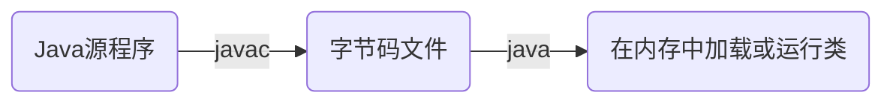

# 异常处理

* 在使用计算机语言进行项目开发的过程中，即使程序员把代码写的尽善尽美，
在系统运行过程中任然会遇到一些问题，因为很多问题不是能靠代码避免的，比如：客户输入的数据格式问题、
读取文件是否存在，网络是否通畅等
* **异常**：指的是程序在运行的过程中，出现了非正常的情况，如果不处理最终会导致JVM的非正常停止
* Java中异常的抛出机制
    * java中把不同的异常用不同的类表示，一旦发生某种异常，就创建该类异常类型的对象，并且抛出（throw）。
    然后程序员可以捕获（catch）到这个异常类，并处理；如果没有捕获（catch）这个异常类，
    那么这个异常对象会导致程序终止

## Java异常体系

### Throwable

* `java.lang.Throwable`类是java程序执行过程中发生的异常事件对应的类的根父类。
* Throwable中的常用方法：
    * `printStackTrace()`：打印异常的详细信息
    * `getMessage()`：获取发生异常的原因

### Error和Exception

* Throwable可以分为两类：Error和Exception。分别对应`java.lang.Error`和`java.lang.Exception`两个类
* **Error**：java虚拟机无法解决的严重问题。如：JVM系统内部错误、资源耗尽等严重情况。一般不编写针对性的代码进行处理
    * 例如：`StackOverflowError`（栈内存溢出）和`OutOfMemoryError`（堆内存溢出，简称OOM）
* **Exception**：其他因编程错误或偶然的外在因素导致的一般性问题，需要使用针对性代码进行处理，
使程序继续运行，否则一旦出现异常，程序也会挂掉。例如：
    * 空指针访问，试图读取不存在的文件，网络连接中断等

#### Error

* 模拟错误

```java
public static void main(String[] args) {
    // 模拟StackOverflowError错误
    // main(args);

    // 模拟OutOfMemoryError错误
    int[] ints = new int[100000000 * 100000000];
}
```

#### Exception

##### 编译时异常和运行时异常

* java程序的执行分为编译时过程和运行时过程。有的错误只有在运行时才会发生。



* 根据异常可能出现的阶段分为：
    * **编译时异常**（即checked异常、受检异常）：在代码编译阶段，
    编译器就能明确警示当前代码可能发生（不一定发生）xx异常，并明确督促程序员提前编写处理它的代码。
    如果程序员没有编写对应的异常处理代码，则编译器就会直接判定编译失败，从而不能生成字节码文件
    * **运行时异常**（即runtime异常、unchecked异常、非受检异常）：在代码的编译阶段，编译器完全不做任何检查，
    无论该异常是否会发生，编译器都不给出任何提示。只有等代码运行起来并确实发生了xx异常，它才能被发现。
    通常这类异常时程序员编写代码不当引起，只要编写时判断就可以大部分避免
        * 在java中`java.lang.RuntimeException`类及它的子类都是运行时异常

##### 代码示例

* 运行时异常

```java
/**
 * 测试ArrayIndexOutOfBoundsException
 */
@Test
public void testArrayIndexOutOfBoundsException() {
    int[] ints = new int[4];
    System.out.println(ints[4]);
}

/**
 * 测试NullPointerException
 */
@Test
public void testNullPointerException() {
    String name = "zs";
    name = null;
    System.out.println(name.length());
}

/**
 * 测试ClassCastException
 */
@Test
public void testClassCastException() {
    Object o = new Object();
    Date date = (Date) o;
    System.out.println(date);
}

/**
 * 测试NumberFormatException
 */
@Test
public void testNumberFormatException() {
    String number = "132abc";
    Integer integer = Integer.valueOf(number);
    System.out.println(integer);
}

/**
 * 测试ArithmeticException
 */
@Test
public void testArithmeticException() {
    System.out.println(10 / 0);
}
```

* 编译时异常

```java
/**
 * 测试ClassNotFoundException编译时异常
 */
@Test
public void testClassNotFoundException() {
    // Class.forName("a.b.c").var
}

/**
 * 测试FileNotFoundException和IOException编译时异常
 */
@Test
public void testFileNotFoundExceptionAndIOException() {
    // FileNotFoundException
    // FileInputStream fis = new FileInputStream("a.txt");
    // IOException
    // fis.close();
}
```

## Java异常的处理

* java采用的异常处理机制，是将异常处理和程序代码集中在一起，与正常的程序代码分开，时程序简洁、易于维护
* java异常处理的方式
    * `try-catch-finally`
    * `throws+异常类型`

### 捕获异常（try-catch-finally）

* 基本结构：

```java
try{
    // 可能产生异常的代码
}catch(异常类型1 e){
    // 当产生异常类型1时的处理措施
}catch(异常类型2 e){
    // 当产生异常类型2时的处理措施
}finally{
    // 无论是否发生异常，都无条件执行的语句
}
```
* finally语句和catch语句是可选的，但finally不能单独使用
* 如果声明了多个catch结构，不同异常类型在不存在父子类关系的情况下，声明的顺序无所谓，
如果多个异常满足父子类关系，则子类catch必须声明在父类的上面，否则报错
* catch中异常处理的方式：
    * 自己编写输出语句
    * 使用printStackTrace打印信息
    * 使用getMessage获取异常的原因

* 对应运行时异常不进行显示的处理，对应编译时异常一定要处理，否则编译不通过

#### 代码示例

```java
public class TryCatchFinallyTest {
    
    @Test
    public void testTryCatch() {
        String s = "123abc";
        try {
            Integer integer = Integer.valueOf(s);
            System.out.println(integer);
        }catch (NumberFormatException e){
            System.out.println("程序出错");
        }catch (NullPointerException e){ // NumberFormatException与NullPointerException异常是并列关系，所以捕获的顺序无所谓
            System.out.println("程序出错");
        }catch (RuntimeException e){ // RuntimeException是上面两个异常的父类，必须放在最后，如果放在第一个，则表示把子类异常一起捕获了
            System.out.println("运行时异常");
        }
        System.out.println("程序结束");
    }

    @Test
    public void testTryCatchAndPrintStackTrace() {
        String s = "123abc";
        try {
            Integer integer = Integer.valueOf(s);
            System.out.println(integer);
        }catch (NumberFormatException e){
            e.printStackTrace();
        }
        System.out.println("程序结束");
    }

    private int strToInt(String str){
        try {
            Integer integer = Integer.valueOf(str);
            return integer;
        }catch (NumberFormatException e){
            return -1;
        }finally {
            System.out.println("程序执行完成");
        }
    }

    @Test
    public void testTryCatchFinally() {
        System.out.println(strToInt("123abc"));
    }
}
```

### 抛出异常（throws）

* 格式：

```java
public void method() throws 异常1, 异常2 {
    // 可能有移除的代码
}
```
* 使用throws并不是真正处理了异常，对**使用者**来说是没有异常了，但是对于**调用者**来说还是要处理异常

#### 代码示例

```java
public class ThrowsTest {

    public void method() throws IOException {
        FileInputStream fis = new FileInputStream("a.txt");
        fis.close();
    }

    @Test
    public void testThrows() {
        try {
            method();
        } catch (IOException e) {
            e.printStackTrace();
        }
    }
}
```

### 两种异常处理方式的选择

* 如果程序代码中，涉及到资源的调用（流、数据库连接、网络连接等），
则必须考虑使用`try-catch-finally`来处理，保证不出现内存泄露
* 如果父类被重写的方法没有`throws`异常类型，子类重写的方法内出现了异常，只能使用`try-catch-finally`进行处理
* 如果方法a是使用者，方法b、c是被使用者，那边如果方法b、c方法内如果出现了异常可以使用`throws`方式，
方法a内的异常可以使用`try-catch-finally`处理

## 手动抛出异常

* 格式：`throw 异常对象`
* 在实际开发中，如果出现不满足具体场景的代码问题，我们就可以手动抛出异常
* `throw`和`throws`的区别
    * `throws`用于声明方法可能抛出的异常，而`throw`是直接抛出具体的异常

```java
public class ThrowTest {

    public void setAge(int age){
        if (age < 0){
            throw new RuntimeException("年龄不能为负数");
        }
        System.out.println(age);
    }

    /**
     * 测试手动抛出运行时异常
     */
    @Test
    public void testThrowRuntimeException() {
        setAge(10);

        setAge(-10); // 报错
    }

    public void setPhone(String phone) throws Exception {
        if (phone.length() != 11){
            throw new Exception("电话号码必须为11位");
        }
        System.out.println(phone);
    }

    /**
     * 测试手动抛出编译时异常
     */
    @Test
    public void testThrowException() {
        try {
            setPhone("12345678901");
        } catch (Exception e) {
            e.printStackTrace();
        }
    }
}
```

## 自定义异常

* 自定义异常类步骤
    1. 继承现有的异常体系，`RuntimeException`或`Exception`
    2. 提供几个重载的构造器
    3. 提供一个全局常量，声明为：`static final long serialVersionUID`
* 自定义异常类要做到**见名知意**，程序运行过程中出现异常后可以根据异常的命名快速定位问题

> [详细代码](https://github.com/follow1123/java-basics/blob/main/src/main/java/cn/y/java/exceptions/custom_exception/CustomExceptionTest.java)

* 定义异常

```java
/**
 * 错误年龄异常
 */
public class WrongAgeException extends RuntimeException{

    @java.io.Serial
    private static final long serialVersionUID = -7034897290745766939L;

    public WrongAgeException(String message) {
        super(message);
    }

    public WrongAgeException(String message, Throwable cause) {
        super(message, cause);
    }
}
```

* 定义另一个异常

```java
/**
 * 错误手机号异常
 */
public class WrongPhoneNumberException extends RuntimeException{

    @java.io.Serial
    private static final long serialVersionUID = -7034997290745766939L;

    public WrongPhoneNumberException(String message) {
        super(message);
    }

    public WrongPhoneNumberException(String message, Throwable cause) {
        super(message, cause);
    }
}
```

* 测试

```java
public class CustomExceptionTest {

    public void setAge(int age) {
        if (age < 0) {
            throw new WrongAgeException("年龄不能为负数");
        }
        System.out.println(age);
    }

    /**
     * 测试手动抛出自定义WrongAgeException运行时异常
     */
    @Test
    public void testThrowRuntimeException() {
        setAge(10);

        setAge(-10); // 报错
    }

    public void setPhone(String phone) throws WrongPhoneNumberException {
        if (phone.length() != 11) {
            throw new WrongPhoneNumberException("电话号码必须为11位");
        }
        System.out.println(phone);
    }

    /**
     * 测试手动抛出WrongPhoneNumberException编译时异常
     */
    @Test
    public void testThrowException() {
        try {
            setPhone("123456789011");
        } catch (WrongPhoneNumberException e) {
            e.printStackTrace();
        }
    }
}
```
