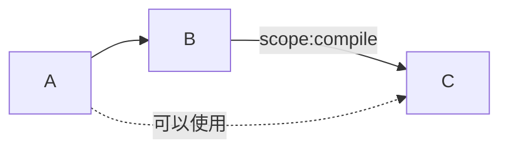
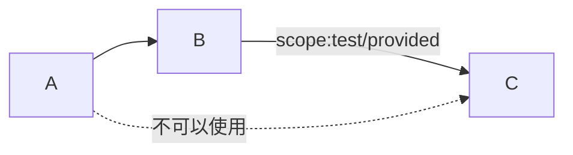
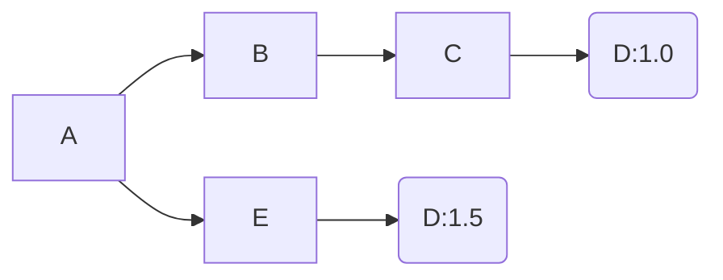
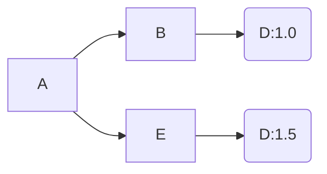
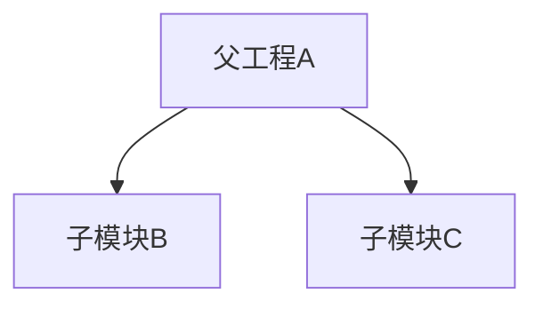

# Maven

* [官网](https://maven.apache.org/)
* [历史版本下载地址](https://archive.apache.org/dist/maven/)

## 安装

* windows: `scoop install maven`
* debian: `sudo apt install maven`
* 或使用压缩包解压安装

## 配置

> settings.xml文件位于`maven安装目录/conf/settings.xml`

* 本地仓库配置

```xml
<!-- 本地仓库配置位置：settings.localRepository -->
<localRepository>/path/to/local/repo</localRepository>
```

* 镜像配置

```xml
<!-- 镜像配置位置：settings.mirrors -->

<!-- 阿里云镜像-->
<mirror>
  <id>alimaven</id>
  <mirrorOf>central</mirrorOf>
  <name>aliyun maven</name>
  <url>http://maven.aliyun.com/nexus/content/repositories/central/</url>
</mirror>

<mirror>
  <id>aliyunmaven</id>
  <mirrorOf>central</mirrorOf>
  <name>aliyun maven</name>
  <url>http://maven.aliyun.com/repository/public</url>
</mirror>

<!-- 中央仓库1 -->
<mirror>
  <id>repo1</id>
  <mirrorOf>central</mirrorOf>
  <name>Human Readable Name for this Mirror.</name>
  <url>http://repo1.maven.org/maven2/</url>
</mirror>

<!-- 中央仓库2 -->
<mirror>
  <id>repo2</id>
  <mirrorOf>central</mirrorOf>
  <name>Human Readable Name for this Mirror.</name>
  <url>http://repo2.maven.org/maven2/</url>
</mirror>
```

## Maven坐标

> 定位jar包，简称`gav`

* `groupId` 公司/项目
* `artifactId` 模块
* `version` 版本

```xml
<dependency>
<!--     a公司的b项目 -->
    <groupId>cn.a.b</groupId> 
<!--     module1模块 -->
    <artifactId>module1</artifactId>
<!--     1.0版本 -->
    <version>1.0</version>
</dependency>
```

## 常用命令

> 构建命令需要在pom.xml路径下执行

| 命令 | 描述 |
| --- | --- |
| `archetype:generate` | 创建maven工程 |
| `wrapper:wrapper` | 为当前maven工程配置单独的maven |
| `help:effective-pom` | 显示项目有效的pom |
| `help:effective-settings` | 显示项目有效的settings |
| `help:system` | 显示当前系统的环境变量 |
| `help:evaluate` | 交互式显示pom配置 |
| `clean` | 清理target目录 |
| `compile` | 编译项目 |
| `test-compile` | 编译测试目录 |
| `test` | 执行测试代码 |
| `package` | 打包 |
| `install` | 安装当前项目到本地仓库 |
| `dependency:list` | 列出当前项目的依赖 |
| `dependency:tree` | 以树型结构列出当前项目依赖 |

<!--     * `mvn install -Dmaven.test.skip=true` 跳过测试 -->
<!-- > 根据gav(Maven坐标可)以找到本地对应的位置 -->

## 依赖

### 依赖范围

> dependencies/dependency/scope标签

| 名称 | main目录是否可用 | test目录是否可用 | 是否参与打包 |
| --- | --- | --- | --- |
| compile(默认) | √ | √ | √ |
| test | × | √ | × |
| provided | √ | √ | × |

* **system**

> 引入系统本地某个目录的包

```xml
<dependency>
    <groupId>cn.a.b</groupId>
    <artifactId>module1</artifactId>
    <version>1.0</version>
    <systemPath>/a/b/c/module1.jar</systemPath>
    <scope>system</scope>
</dependency>
```

* **runtime**

> 引入开发时不需要但运行时需要的包

```xml
<dependency>
    <groupId>cn.a.b</groupId>
    <artifactId>module1</artifactId>
    <version>1.0</version>
    <scope>runtime</scope>
</dependency>
```

* **import**

> 主要进行依赖管理 <br></br>
> 打包类型必须是pom <br></br>
> 只能在dependencyManagement标签下使用

```xml
<dependency>
    <groupId>cn.a.b</groupId>
    <artifactId>module1</artifactId>
    <version>1.0</version>
    <type>pom</type>
    <scope>import</scope>
</dependency>
```

### 依赖传递

* 当B依赖C的scope为compile, A才能使用C，scope为test/provided是不能使用





### 依赖排除

* 在需要排除依赖的标签内添加以下标签

```xml
<dependency>
    <groupId>org.springframework.boot</groupId>
    <artifactId>spring-boot-starter-test</artifactId>
    <scope>test</scope>
    <exclusions>
        <!-- 排除junit包-->
        <exclusion>
            <groupId>junit</groupId>
            <artifactId>junit</artifactId>
        </exclusion>
    </exclusions>
</dependency>
```

### 可选依赖

* 用到的时候才会导入

```xml
<dependency>
    <groupId>cn.a.b</groupId>
    <artifactId>module1</artifactId>
    <version>1.0</version>
    <optional>true</optional>
</dependency>
```

### 版本仲裁

* 最短路径优先



* 路径相同时先声明的优先



## 继承



* 父工程A内pom

> 父工程打包方式必须为pom

```xml
<project>
    <groupId>cn.maven</groupId>
    <artifactId>A</artifactId>
    <version>1.0</version>

    <packaging>pom</packaging>

<!--     这段标签使用ide创建模块会自动生成 -->
    <modules>
        <module>B</module>
        <module>C</module>
    </modules>

<!--     属性 -->
    <properties>
        <D.version>1.0</D.version>
        <E.version>2.0</E.version>
    </properties>

<!--     依赖管理 -->
    <dependencyManagement>
        <dependencies>
            <dependency>
                <groupId>cn.maven</groupId>
                <artifactId>D</artifactId>
                <version>${D.version}</version>
            </dependency>
            <dependency>
                <groupId>cn.maven</groupId>
                <artifactId>E</artifactId>
                <version>${E.version}</version>
            </dependency>
        </dependencies>
    </dependencyManagement>
</project>
```

* 子模块B内pom

```xml
<project>
<!--     配置父工程 -->
    <parent>
        <groupId>cn.maven</groupId>
        <artifactId>A</artifactId>
        <version>1.0</version>
    </parent>

<!--     子模块内groupId和version如果和父工程一样则可用省略 -->
    <artifactId>B</artifactId>

    <dependencies>
<!--      引入父工程管理的D依赖
         使用父工程内管理的依赖无需指定版本
         如果指定版本则会使用当前指定的版本
         -->
        <dependency>
            <groupId>cn.maven</groupId>
            <artifactId>D</artifactId>
        </dependency>
    </dependencies>
</project>
```

* 子模块C内pom

```xml
<project>
<!--     配置父工程 -->
    <parent>
        <groupId>cn.maven</groupId>
        <artifactId>A</artifactId>
        <version>1.0</version>
    </parent>

<!--     子模块内groupId和version如果和父工程一样则可用省略 -->
    <artifactId>C</artifactId>
    <dependencies>
<!--      引入父工程管理的D依赖
         使用父工程内管理的依赖无需指定版本
         如果指定版本则会使用当前指定的版本
         -->
        <dependency>
            <groupId>cn.maven</groupId>
            <artifactId>E</artifactId>
        </dependency>
    </dependencies>
</project>
```

## 生命周期

> [参考](https://maven.apache.org/guides/introduction/introduction-to-the-lifecycle.html)

### clean

* 用于清理target目录

### default

* 用于构建项目，包含compile、test、package、install等目标
* 执行一个目标时会把这个目标前面的目标依次执行

### site(不常用)

* 用于生成项目站点

## build标签

> [参考](https://maven.apache.org/pom.html#Build_Settings)

* 约定的目录结构

```xml
<build>
    <sourceDirectory>${project.basedir}/src/main/java</sourceDirectory>
    <scriptSourceDirectory>${project.basedir}/src/main/scripts</scriptSourceDirectory>
    <testSourceDirectory>${project.basedir}/src/test/java</testSourceDirectory>
    <outputDirectory>${project.basedir}/target/classes</outputDirectory>
    <testOutputDirectory>${project.basedir}/target/test-classes</testOutputDirectory>
</build>
```

* 插件管理

* 插件配置

## profile

> [参考](https://maven.apache.org/guides/introduction/introduction-to-profiles.html)
