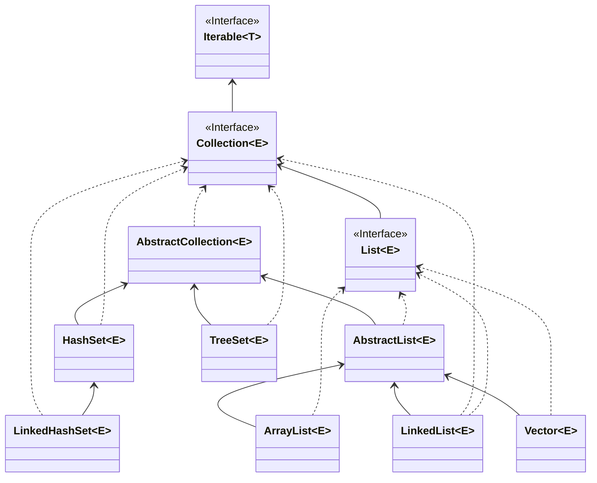
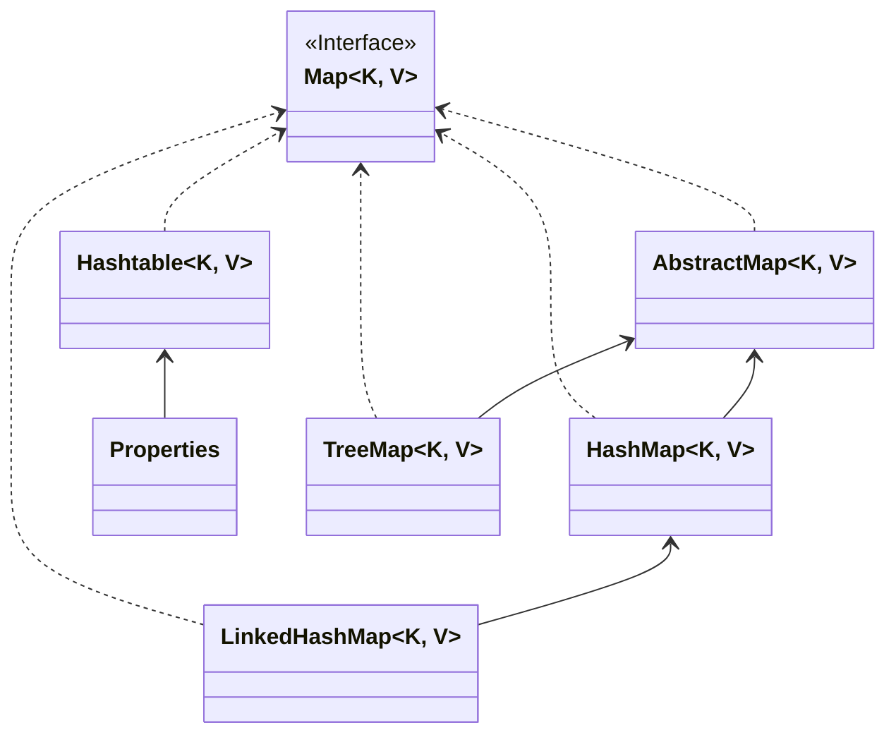

# 集合框架

## 集合框架类图

### java.util.Collection



* List：存储有序、可重复的数据
* Set：存储无序、不可重复的数据

### java.util.Map



* Map：存储key-value键值对

---

## java.util.Collection

### 常用方法

* 添加

```java
// 添加元素
Collection c1 = new ArrayList();
c1.add("string");
c1.add(123);
c1.add(new Object());
System.out.println(c1);

Collection c2 = new ArrayList();
c2.add(1);
c2.add(2);

// 添加集合
c1.addAll(c2);
System.out.println(c1);
```

* 判断

```java
// 添加元素
Collection c1 = new ArrayList();
c1.add("string");
c1.add(123);
c1.add(new Object());
System.out.println(c1);

Collection c2 = new ArrayList();
c2.add(1);
c2.add(2);

// 添加集合
c1.addAll(c2);
System.out.println(c1);

// 获取集合内元素个数
System.out.println(c1.size()); // 5

// 判断集合是否为空
System.out.println(c1.isEmpty()); // false

// 判断集合内是否有指定的元素，如果要判断自定义类型，需要重写equals方法
System.out.println(c1.contains(1)); // true

// 判断集合内是否包含另一个集合内的所有元素
System.out.println(c1.containsAll(c2)); // true

// 判断两个集合是否相同
System.out.println(c1.equals(c2)); // false
```

* 删除

```java
// 添加元素
Collection c1 = new ArrayList();
c1.add("string");
c1.add(123);
c1.add(1.1);
c1.add(new Object());

// 删除指定元素，删除自定义元素时也需要重写equals方法
// 如果有多个相同的元素，只会删除一个
c1.remove(1.1);
System.out.println(c1);

// 清空集合，遍历将集合内的所有元素都删除
c1.clear();
System.out.println(c1.size());

// 删除当前集合内所有于另一个集合元素相同的元素
Collection c2 = new ArrayList();
c2.add(1);
c2.add(2);
c2.add(3);
c2.add(4);
Collection c3 = new ArrayList();
c3.add(2);
c3.add(3);

c2.removeAll(c3);
System.out.println(c2); // [1, 4]

// 取两个集合的交集
Collection c4 = new ArrayList();
c4.add(1);
c4.add(2);
c4.add(3);
c4.add(4);
Collection c5 = new ArrayList();
c5.add(3);
c5.add(4);
c5.add(5);
c5.add(6);

c4.retainAll(c5);
System.out.println(c4); // [3, 4]
```

* 其他

```java
// 添加元素
Collection c1 = new ArrayList();
c1.add("string");
c1.add(123);
c1.add(1.1);
c1.add(new Object());

// 集合转换为数组
Object[] array = c1.toArray();

// 计算集合的hash值
System.out.println(c1.hashCode());

// 返回迭代器，用于遍历集合
c1.iterator();
```

### 集合和数组的相互转换

```java
// 添加元素
Collection c1 = new ArrayList();
c1.add("string");
c1.add(123);
c1.add(1.1);
c1.add(new Object());

// 集合转换为数组
Object[] array = c1.toArray();

// 数组转换为集合
Collection c2 = Arrays.asList(1, 2, 3, 4);
System.out.println(c2.size()); // 4

// asList方法内传入对象数组，才会作为数组，传入基本数据类型的引用只会作为一个元素
Collection c3 = Arrays.asList(new int[]{1, 2, 3});
System.out.println(c3.size()); // 1
```

### 集合使用说明

* 放入集合内的元素需要重写`equals()`方法，因为集合内的`contains()`方法和`remove()`等方法会使用到

## 迭代器（Iterator）

* 用来遍历集合内的元素

```java
Collection c1 = new ArrayList();
c1.add("string");
c1.add(123);
c1.add(1.1);
c1.add(new Object());

// 获取迭代器对象
Iterator iterator = c1.iterator();

// // 依次获取集合内的元素
// System.out.println(iterator.next());
// System.out.println(iterator.next());
// System.out.println(iterator.next());
// System.out.println(iterator.next());
// // 如果超出集合内元素的个数则会报错NoSuchElementException
// System.out.println(iterator.next());

// 获取迭代器具体实现
System.out.println(iterator.getClass());

// 使用迭代器遍历集合
while (iterator.hasNext()) {
    System.out.println(iterator.next());
}

// 遍历时删除指定元素
// while (iterator.hasNext()){
//     if (iterator.next().equals(1.1)){
//         iterator.remove();
//     }
// }
```

* foreach增强for循环（jdk5）
    * 底层使用的就是迭代器

```java
Collection c1 = new ArrayList();
c1.add("string");
c1.add(123);
c1.add(1.1);
c1.add(new Object());

for (Object o : c1) {
    System.out.println(o);
}
```

## ArrayList

* 初始化

  * 初始化为一个空的Object数组
  
* 添加元素

  * 添加第一个元素时将elementData初始化为长度为10的object数组才加入元素
  
  * 在添加元素是会先判断数组的容量够不够，不够这会进行扩容
  
  * 方式
  
    * 当添加到数组最后一个位置前进行扩容
    * 新长度为旧长度+（旧长度右移一位）
    * 使用System.arrayCopy()进行操作
  
    ```java
    //旧数组
    int[] is = {1, 2, 3, 4, 5, 6, 7, 8, 9, 123, 321, 4324, 432, 34, 43, 3};
    //新数组
    int[] newIs = new int[is.length + (is.length >> 1)];
  //扩容操作
    System.arraycopy(is, 0, newIs, 0, is.length);
    ```
  
    
  
* 删除元素

  * 使用数组拷贝方式
  * 使用System.arrayCopy()进行操作

  ```java
  int[] is = {1, 2, 3, 4, 5, 6, 7, 8, 9, 123, 321, 4324, 432, 34, 43, 3};
  //拷贝操作
  System.arraycopy(is, 3 + 1, is, 3, is.length - 4);
  //数组最后一位置空
  is[is.length - 1] = 0;
  ```

## LinkedList

* 插入元素

  * 默认使用尾插法

  ```java
  void linkLast(E e) {
      //获取last对象的指针
      final Node<E> l = last;
      //创建一个新的节点对象
      //传入previous节点，赋值
      final Node<E> newNode = new Node<>(l, e, null);
      //last指针指向新的对象
      last = newNode;
      //判断l指针指向的对象是否为空
      if (l == null)
          //为空说明链表为空，将first指针指向这个新的对象
          first = newNode;
      else
          //否则将原last对象的last指针指向这个新的对象
          l.next = newNode;
      //链表的大小加一
      size++;
      modCount++;
  }
  ```

* 获取元素

  ```java
  //根据下标查找
  public E get(int index) {
      //	判断下标是否合法
      checkElementIndex(index);
      		//根据index查值
      return node(index).item;
  }
  //根据index查值
  Node<E> node(int index) {
  	//如果下标小于链表的大小除2则从前往后找
      if (index < (size >> 1)) {
          Node<E> x = first;
          for (int i = 0; i < index; i++)
              x = x.next;
          return x;
          //否则从后往前找
      } else {
          Node<E> x = last;
          for (int i = size - 1; i > index; i--)
              x = x.prev;
          return x;
      }
  }
  
  ```

* 删除元素

  ```java
  public E remove(int index) {
      //	判断下标是否合法
      checkElementIndex(index);
      //找到下表为index的节点并移除
      return unlink(node(index));
  }
  //移除
  E unlink(Node<E> x) {
      // assert x != null;
      final E element = x.item;
      final Node<E> next = x.next;
      final Node<E> prev = x.prev;
  	//该节点的prev节点为空说明该节点就是first节点
      if (prev == null) {
          //将first指针指向next节点
          first = next;
      } else {
          //否则将prev节点的next指针指向next对象
          prev.next = next;
          //该节点的prev对象置空
          x.prev = null;
      }
  	//该节点的prev节点为空说明该节点就是last节点
      if (next == null) {
          //将last指针指向prev节点
          last = prev;
      } else {
          //否则将next节点的prev指针指向prev对象
          next.prev = prev;
          该节点的next对象置空
          x.next = null;
      }
  	//该节点的数据置空
      x.item = null;
      //该链表的大小减一
      size--;
      modCount++;
      return element;
  }
  ```

## HashMap

* HashMap是由数组链表和红黑树（8加入）组成

* 初始化
  * 将默认负载因子初始化为0.75
* 添加元素
  * 方式一：
    * 获取key的hashcode将其%数组的长度旧可以得到对应的下标
    * 将元素存入数组对应下标的链表内，（7 使用的是头插法， 8 使用的是尾插法）
