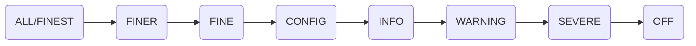

# 日志框架

## java.util.logging

> [详细代码](https://github.com/follow1123/java-frameworks/blob/main/logger/src/main/java/cn/y/java/jul)

> java原生日志框架

* 基础使用

```java
public class UserService {

    private static final Logger log = Logger.getLogger(UserService.class.getName());

    public void addUser(){
        // 添加逻辑
        log.info("add user");
    }

    public void deleteUser(){
        try {
            // 删除逻辑
            log.severe("delete user succeed!");
        }catch (Exception e){
            log.severe("delete user error");
        }
    }
}
```

### 日志级别



* 使用`java.util.logging.Level`类指定
* 日志级别从左到右，设置日志级别也会显示右边所有日志级别

### Logger

```java
// 创建日志对象，一般使用当前class对象的name指定
Logger log = Logger.getLogger("test log");
```

### Handler

* 日志处理器

| 处理程序 | 使用 |
| --- | --- |
| StreamHandler | 写入OutputStream |
| ConsoleHandler | 写入控制台 |
| FileHandler | 写入文件 |
| SocketHandler | 写入到远程TCP端口 |
| MemoryHandler | 写入内存 |

```java
Logger log = Logger.getLogger("test log handler");
// 不使用父logger，自己指定handler
log.setUseParentHandlers(false);

// 创建日志处理器
ConsoleHandler handler = new ConsoleHandler();
/*
    设置日志处理器的级别
    这个日志级别是默认的最高级别
    在这里设置后，使用log.setLevel设置的日志级别不能超过这里的级别
 */
handler.setLevel(Level.ALL);

log.addHandler(handler);
```

#### 日志格式化

```java
// 日志默认日志格式化
handler.setFormatter(new SimpleFormatter());
```

* 继承`java.util.logging.Formatter`类实现`format()`方法

### 配置文件

* 默认配置文件
    * jdk8及之前：`%JAVA_HOME%/conf/logging.properties`
    * jdk8之后：`%JAVA_HOME%/jre/lib/logging.properties`

#### 加载自定义配置文件

* 配置文件模板

```properties
# 添加处理器
handlers= java.util.logging.ConsoleHandler

# 默认日志级别
.level= INFO

# 处理器配置
java.util.logging.ConsoleHandler.level = ALL
java.util.logging.ConsoleHandler.formatter = cn.y.java.jul.CustomFormatter

# 指定包的日志级别配置
cn.y.java.jul.warning_package.level = WARNING
cn.y.java.jul.fine_package.level = FINE
```

## 参考

* [菜鸟教程](https://www.cainiaojc.com/java/java-logging.html)
* [带你掌握Java各种日志框架](https://www.cnblogs.com/antLaddie/p/15867893.html)
* [Java日志-总结](https://blog.csdn.net/imjcoder/article/details/121688831)
