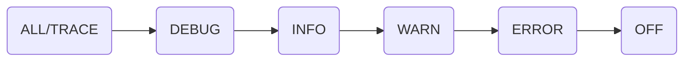

# 日志框架

## java.util.logging

> [详细代码](https://github.com/follow1123/java-frameworks/blob/main/logger/src/main/java/cn/y/java/jul)

* java原生日志框架

```java
public class UserService {

    private static final Logger log = Logger.getLogger(UserService.class.getName());

    public void addUser(){
        // 添加逻辑
        log.info("add user");
    }

    public void deleteUser(){
        try {
            // 删除逻辑
            log.severe("delete user succeed!");
        }catch (Exception e){
            log.severe("delete user error");
        }
    }
}
```

### 日志级别


* 使用`java.util.logging.Level`类指定
* 日志级别从左到右，设置日志级别也会显示右边所有日志级别

### Logger

```java
// 创建日志对象，一般使用当前class对象的name指定
Logger log = Logger.getLogger("test log");
```

### Handler

* 日志处理器

| 处理程序 | 使用 |
| --- | --- |
| StreamHandler | 写入OutputStream |
| ConsoleHandler | 写入控制台 |
| FileHandler | 写入文件 |
| SocketHandler | 写入到远程TCP端口 |
| MemoryHandler | 写入内存 |

```java
Logger log = Logger.getLogger("test log handler");
// 不使用父logger，自己指定handler
log.setUseParentHandlers(false);

// 创建日志处理器
ConsoleHandler handler = new ConsoleHandler();
/*
    设置日志处理器的级别
    这个日志级别是默认的最高级别
    在这里设置后，使用log.setLevel设置的日志级别不能超过这里的级别
 */
handler.setLevel(Level.ALL);

log.addHandler(handler);
```

#### 日志格式化

```java
// 日志默认日志格式化
handler.setFormatter(new SimpleFormatter());
```

* 继承`java.util.logging.Formatter`类实现`format()`方法

### 配置文件

* 默认配置文件
    * jdk8及之前：`%JAVA_HOME%/conf/logging.properties`
    * jdk8之后：`%JAVA_HOME%/jre/lib/logging.properties`

#### 加载自定义配置文件

* 配置文件模板

```properties
# 添加处理器
handlers= java.util.logging.ConsoleHandler

# 默认日志级别
.level= INFO

# 处理器配置
java.util.logging.ConsoleHandler.level = ALL
java.util.logging.ConsoleHandler.formatter = cn.y.java.jul.CustomFormatter

# 指定包的日志级别配置
cn.y.java.jul.warning_package.level = WARNING
cn.y.java.jul.fine_package.level = FINE
```

## Logback

> [详细代码](https://github.com/follow1123/java-frameworks/blob/main/logger/src/main/java/cn/y/java/logback)

* [官方文档](https://logback.qos.ch/manual/)

### 依赖

* `logback-core` - logback核心库
* `logback-classic` - 实现Slf4j，包含核心库，一般引入这个依赖

### 日志级别



### 配置文件

> [官方文档](https://logback.qos.ch/manual/configuration.html#syntax)

* 配置文件默认在类路径下的`logback.xml`文件
* 配置文件主要包含下面几个部分
    * **appender** - 控制日志输出行为
    * **logger** - 控制指定包或类的日志级别
    * **root** - 全局日志级别
    * **variable** - 定义变量

#### 基础配置

```xml
<configuration>
    <appender name="STDOUT" class="ch.qos.logback.core.ConsoleAppender">
        <encoder>
            <pattern>%d{yyyy-MM-dd HH:mm:ss.SSS} [%thread] %-5level %logger{36} %M - %msg%n</pattern>
        </encoder>
    </appender>

    <root level="debug">
        <appender-ref ref="STDOUT" />
    </root>
</configuration>
```

### Appender

> [官方文档](https://logback.qos.ch/manual/configuration.html#configuringAppenders)，[Appender文档](https://logback.qos.ch/manual/appenders.html)

| 类型   | 说明    |
|--------------- | --------------- |
| [ConsoleAppender](https://logback.qos.ch/manual/appenders.html#ConsoleAppender)   | 输出到控制台   |
| [FileAppender](https://logback.qos.ch/manual/appenders.html#FileAppender) | 输出到文件 |
| [RollingFileAppender](https://logback.qos.ch/manual/appenders.html#RollingFileAppender) | 输出到文件，并支持文件滚动 |
| [DBAppender](https://logback.qos.ch/manual/appenders.html#DBAppender) | 输出到数据库 |

```xml
<configuration>
    <appender name="CONSOLE" class="ch.qos.logback.core.ConsoleAppender">
        <encoder>
            <pattern>%d{yyyy-MM-dd HH:mm:ss} %-5level %logger{36} - %msg%n</pattern>
        </encoder>
    </appender>

    <appender name="FILE" class="ch.qos.logback.core.FileAppender">
        <file>testFile.log</file>
        <append>true</append>
        <!-- set immediateFlush to false for much higher logging throughput -->
        <immediateFlush>true</immediateFlush>
        <!-- encoders are assigned the type
             ch.qos.logback.classic.encoder.PatternLayoutEncoder by default -->
        <encoder>
            <pattern>%-4relative [%thread] %-5level %logger{35} -%kvp- %msg%n</pattern>
        </encoder>
    </appender>

    <appender name="FILE" class="ch.qos.logback.core.rolling.RollingFileAppender">
        <file>logFile.log</file>
        <rollingPolicy class="ch.qos.logback.core.rolling.TimeBasedRollingPolicy">
            <!-- daily rollover -->
            <fileNamePattern>logFile.%d{yyyy-MM-dd}.log</fileNamePattern>

            <!-- keep 30 days' worth of history capped at 3GB total size -->
            <maxHistory>30</maxHistory>
            <totalSizeCap>3GB</totalSizeCap>
        </rollingPolicy>

        <encoder>
            <pattern>%-4relative [%thread] %-5level %logger{35} -%kvp- %msg%n</pattern>
        </encoder>
    </appender> 

    <root level="DEBUG">
        <appender-ref ref="CONSOLE" />
    </root>
</configuration>
```

#### Layouts

* 默认使用`PatternLayout`，部分转换词参考[官方文档](https://logback.qos.ch/manual/layouts.html#conversionWord)

### Logger/Root

```xml
<configuration>

    <appender name="STDOUT" class="ch.qos.logback.core.ConsoleAppender">
        <!-- encoders are assigned the type
             ch.qos.logback.classic.encoder.PatternLayoutEncoder by default -->
        <encoder>
          <pattern>%d{HH:mm:ss.SSS} [%thread] %-5level %logger{36} -%kvp- %msg%n</pattern>
        </encoder>
    </appender>

    <!-- 指定cn.a.b下的日志级别 -->
    <logger name="cn.a.b" level="INFO"/>

    <!-- 指定cn.a.c下的日志级别，并指定Appender -->
    <logger name="cn.a.c">
        <appender-ref ref="STDOUT" />
    </logger>

    <!-- Strictly speaking, the level attribute is not necessary since -->
    <!-- the level of the root level is set to DEBUG by default.       -->
    <!-- 默认日志级别和对应的Appender -->
    <root level="DEBUG">
        <appender-ref ref="STDOUT" />
    </root>
</configuration>
```

### Variable

[官方文档](https://logback.qos.ch/manual/configuration.html#variableSubstitution)

```xml
<configuration>

    <!-- 定义变量 -->
    <variable name="USER_HOME" value="/home/sebastien" />

    <!-- 指定properties文件 -->
    <variable file="src/main/java/chapters/configuration/variables1.properties" />

    <!-- 指定类路径下的properties文件 -->
    <variable resource="resource1.properties" />
    <appender name="FILE" class="ch.qos.logback.core.FileAppender">

        <!-- 使用变量 -->
        <file>${USER_HOME}/myApp.log</file>
        <encoder>
            <pattern>%kvp %msg%n</pattern>
        </encoder>
    </appender>

    <root level="debug">
        <appender-ref ref="FILE" />
    </root>
</configuration>
```

### 使用

```xml
<configuration>
    <!-- 在resources目录下添加这个文件即可，添加log_path属性，文件保存路径 -->
    <variable resource="logback-file.properties"/>
    <!-- 控制台输出 -->
    <appender name="STDOUT" class="ch.qos.logback.core.ConsoleAppender">
        <encoder>
            <pattern>%d{yyyy-MM-dd HH:mm:ss.SSS} [%thread] %-5level %logger{36} %M - %msg%n</pattern>
        </encoder>
    </appender>

    <!-- 文件输出 -->
    <appender name="FILE" class="ch.qos.logback.core.rolling.RollingFileAppender">
        <file>${log_path}/logFile.log</file>
        <rollingPolicy class="ch.qos.logback.core.rolling.TimeBasedRollingPolicy">
            <!-- daily rollover -->
            <fileNamePattern>logFile.%d{yyyy-MM-dd}.log</fileNamePattern>

            <!-- keep 30 days' worth of history capped at 1GB total size -->
            <maxHistory>30</maxHistory>
            <totalSizeCap>1GB</totalSizeCap>
        </rollingPolicy>

        <encoder>
            <pattern>%-4relative [%thread] %-5level %logger{35} -%kvp- %msg%n</pattern>
        </encoder>
    </appender>

    <!-- 指定包日志级别 -->
    <logger name="cn.y.java.logback.info_package" level="WARN"/>
    <!-- 指定包日志级别并指定输出到文件 -->
    <logger name="cn.y.java.logback.file_package" level="DEBUG">
        <appender-ref ref="FILE"/>
    </logger>

    <!-- 默认日志级别 -->
    <root level="debug">
        <appender-ref ref="STDOUT"/>
    </root>
</configuration>
```

## Log4j2

* [官方文档](https://logging.apache.org/log4j/2.x/manual/getting-started.html)

### 依赖

* `log4j-core` - 核心库
* `log4j-api` - api，需要配合核心库使用，也相当于是一个日志门面
* `log4j-slf4j2-impl` - Slf4j适配器，一般直接引入这个依赖即可

## 参考

* [菜鸟教程](https://www.cainiaojc.com/java/java-logging.html)
* [带你掌握Java各种日志框架](https://www.cnblogs.com/antLaddie/p/15867893.html)
* [Java日志-总结](https://blog.csdn.net/imjcoder/article/details/121688831)
