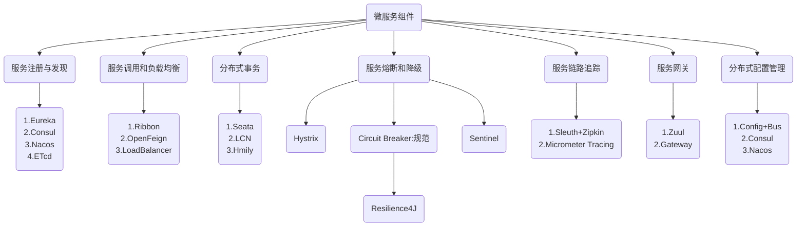

# Spring Cloud



## 项目搭建

### 通用配置

#### SQL

```sql
create database cloud_demo;

use cloud_demo;

drop table if exists `t_pay`;

CREATE TABLE `t_pay` (
    `id` INT(10) UNSIGNED NOT NULL auto_increment,
    `pay_no` VARCHAR(50) not null comment '支付流水号',
    `order_no` VARCHAR(50) not null comment '订单流水号',
    `user_id` INT(10) DEFAULT '1' COMMENT '用户账号ID',
    `amount` DECIMAL(8, 2) not null default '9.9' comment '交易金额',
    `deleted` TINYINT(4) unsigned not null default '0' comment '删除标志，默认0不删除，1删除',
    `create_time` timestamp not null default current_timestamp comment '创建时间',
    `update_time` timestamp not null default current_timestamp on update current_timestamp comment '更新时间',
    primary key (`id`)
) engine=innodb auto_increment=1 default charset=utf8mb4 comment='支付交易表';

insert into t_pay(pay_no, order_no) values('pay1209381920', '0982134jdag123');
```

#### 项目配置

* java版本：`jdk17`
* 包名：`cn.y.demo`
* 构建工具：`maven`

#### MySQL版本

##### 5.7.30

* jdbc驱动

```properties
driverClass=com.mysql.jdbc.Driver
url=jdbc:mysql://localhost:3306/cloud_demo?useUnicode=true&characterEncoding=UTF-8&useSSL=false&nullCatalogMeansCurrent=true&useSSL=false&serverTimezone=GMT%2B8
```

* Maven依赖

```xml
<dependency>
    <groupId>mysql</groupId>
    <artifactId>mysql-connector-java</artifactId>
    <version>5.1.47</version>
</dependency>
```

##### 8.0.x

* 8.0的驱动也兼容5.7版本的MySQL
* jdbc驱动

```properties
driverClass=com.mysql.cj.jdbc.Driver
url=jdbc:mysql://localhost:3306/cloud_demo?characterEncoding=UTF-8&useSSL=false&serverTimezone=GMT%2B8&rewriteBatchedStatements=true&allowPublicKeyRetrieval=true
```

* Maven依赖

```xml
<dependency>
    <groupId>mysql</groupId>
    <artifactId>mysql-connector-java</artifactId>
    <version>8.0.30</version>
</dependency>
```

#### Maven子模块

* 一般在使用IDE创建子模块时会自动在父模块的**pom.xml**文件内添加子模块相关标签
* 如果没有则手动添加以下标签

```xml
<!-- 子模块相关配置，一般放在properties标签上面 -->
<modules>
    <module>子模块名称</module>
    ...
</modules>
```


### 创建父工程<a id="parent"></a>

<pre>
    <code>
<a href="#parent">spring-cloud-demo</a>
├─<a href="#parent-gitignore">.gitignore</a>
└─<a href="#parent-pom-xml">pom.xml</a>
    </code>
</pre>

1. 因为是父工程可以直接删除**src**文件夹
2. 修改<strong>.gitignore</strong>文件<a id="parent-gitignore"></a>

```gitignore
HELP.md
target/
!.mvn/wrapper/maven-wrapper.jar
!**/src/main/**/target/
!**/src/test/**/target/

### STS ###
.apt_generated
.classpath
.factorypath
.project
.settings
.springBeans
.sts4-cache

### IntelliJ IDEA ###
.idea
*.iws
*.iml
*.ipr

### NetBeans ###
/nbproject/private/
/nbbuild/
/dist/
/nbdist/
/.nb-gradle/
build/
!**/src/main/**/build/
!**/src/test/**/build/

### VS Code ###
.vscode/
code-generator/src/main/resources/config.properties
```

<a id="parent-pom-xml"></a>
3. 修改**pom.xml**文件

```xml
<?xml version="1.0" encoding="UTF-8"?>
<project xmlns="http://maven.apache.org/POM/4.0.0"
         xmlns:xsi="http://www.w3.org/2001/XMLSchema-instance"
         xsi:schemaLocation="http://maven.apache.org/POM/4.0.0 http://maven.apache.org/xsd/maven-4.0.0.xsd">
    <modelVersion>4.0.0</modelVersion>

    <groupId>cn.y.demo</groupId>
    <artifactId>spring-cloud-demo</artifactId>
    <version>1.0-SNAPSHOT</version>

    <!-- 父工程打包方式必须是pom -->
    <packaging>pom</packaging>

    <!-- 属性配置 -->
    <properties>
        <maven.compiler.source>17</maven.compiler.source>
        <maven.compiler.target>17</maven.compiler.target>
        <project.build.sourceEncoding>UTF-8</project.build.sourceEncoding>
        <hutool.version>5.8.22</hutool.version>
        <lombok.version>1.18.26</lombok.version>
        <druid.version>1.1.20</druid.version>
        <mybatis.springboot.version>3.0.2</mybatis.springboot.version>
        <mysql.version>8.0.30</mysql.version>
        <swagger3.version>2.2.0</swagger3.version>
        <mybatis-plus.version>3.5.7</mybatis-plus.version>
        <fastjson2.version>2.0.40</fastjson2.version>
        <persistence-api.version>1.0.2</persistence-api.version>
        <spring.boot.test.version>3.1.5</spring.boot.test.version>
        <spring.boot.version>3.2.0</spring.boot.version>
        <spring.cloud.version>2023.0.0</spring.cloud.version>
        <spring.cloud.alibaba.version>2022.0.0.0</spring.cloud.alibaba.version>
    </properties>

    <!-- 版本管理，供子模块使用 -->
    <dependencyManagement>
        <dependencies>
            <!-- 引入spring-boot和spring-cloud的版本管理 -->
            <dependency>
                <groupId>org.springframework.boot</groupId>
                <artifactId>spring-boot-starter-parent</artifactId>
                <version>${spring.boot.version}</version>
                <type>pom</type>
                <scope>import</scope>
            </dependency>
            <dependency>
                <groupId>org.springframework.cloud</groupId>
                <artifactId>spring-cloud-dependencies</artifactId>
                <version>${spring.cloud.version}</version>
                <type>pom</type>
                <scope>import</scope>
            </dependency>
            <!-- 项目使用的包 -->
            <dependency>
                <groupId>com.alibaba.cloud</groupId>
                <artifactId>spring-cloud-alibaba-dependencies</artifactId>
                <version>${spring.cloud.alibaba.version}</version>
                <type>pom</type>
                <scope>import</scope>
            </dependency>
            <dependency>
                <groupId>com.baomidou</groupId>
                <artifactId>mybatis-plus-spring-boot3-starter</artifactId>
                <version>${mybatis-plus.version}</version>
            </dependency>
            <dependency>
                <groupId>mysql</groupId>
                <artifactId>mysql-connector-java</artifactId>
                <version>${mysql.version}</version>
            </dependency>
            <dependency>
                <groupId>com.alibaba</groupId>
                <artifactId>druid-spring-boot-starter</artifactId>
                <version>${druid.version}</version>
            </dependency>
            <dependency>
                <groupId>com.alibaba.fastjson2</groupId>
                <artifactId>fastjson2</artifactId>
                <version>${fastjson2.version}</version>
            </dependency>
            <!-- springdoc就是swagger3 -->
            <dependency>
                <groupId>org.springdoc</groupId>
                <artifactId>springdoc-openapi-starter-webmvc-ui</artifactId>
                <version>${swagger3.version}</version>
            </dependency>
            <dependency>
                <groupId>cn.hutool</groupId>
                <artifactId>hutool-all</artifactId>
                <version>${hutool.version}</version>
            </dependency>
            <dependency>
                <groupId>org.projectlombok</groupId>
                <artifactId>lombok</artifactId>
                <version>${lombok.version}</version>
                <optional>true</optional>
            </dependency>
            <dependency>
                <groupId>org.springframework.boot</groupId>
                <artifactId>spring-boot-starter-test</artifactId>
                <version>${spring.boot.test.version}</version>
                <scope>test</scope>
            </dependency>
        </dependencies>
    </dependencyManagement>
</project>
```

<a id="submodule-1"></a>
### 创建代码生成器子模块

<pre>
    <code>
<a href="#parent">spring-cloud-demo</a>
│
├─<a href="#submodule-1" style={{color:'green',fontWeight:'bold'}}><u>code-generator</u></a> # 代码生成器子模块
│  ├─<strong style={{color:'green'}}>src/main/java/cn/y/demo</strong>
│  │  └─<a href="#submodule-1-main-java" style={{color:'green',fontWeight:'bold'}}><u>Main.java</u></a>
│  ├─<strong style={{color:'green'}}>src/main/resources</strong>
│  │  └─<a href="#submodule-1-resources-config-properties" style={{color:'green',fontWeight:'bold'}}><u>config.properties</u></a>
│  └─<a href="#submodule-1-pom-xml" style={{color:'green',fontWeight:'bold'}}><u>pom.xml</u></a>
│
├─<a href="#parent-gitignore">.gitignore</a>
└─<a href="#parent-pom-xml">pom.xml</a>
    </code>
</pre>

1. 在父工程下新建子模块
2. 修改`pom.xml`文件<a id="submodule-1-pom-xml"></a>

```xml
<?xml version="1.0" encoding="UTF-8"?>
<project xmlns="http://maven.apache.org/POM/4.0.0"
         xmlns:xsi="http://www.w3.org/2001/XMLSchema-instance"
         xsi:schemaLocation="http://maven.apache.org/POM/4.0.0 http://maven.apache.org/xsd/maven-4.0.0.xsd">
    <modelVersion>4.0.0</modelVersion>
    <parent>
        <groupId>cn.y.demo</groupId>
        <artifactId>spring-cloud-demo</artifactId>
        <version>1.0-SNAPSHOT</version>
    </parent>

    <artifactId>code-generator</artifactId>

    <properties>
        <maven.compiler.source>17</maven.compiler.source>
        <maven.compiler.target>17</maven.compiler.target>
        <project.build.sourceEncoding>UTF-8</project.build.sourceEncoding>
    </properties>

    <dependencies>
        <dependency>
            <groupId>com.baomidou</groupId>
            <artifactId>mybatis-plus-spring-boot3-starter</artifactId>
            <version>${mybatis-plus.version}</version>
        </dependency>
        <dependency>
            <groupId>com.baomidou</groupId>
            <artifactId>mybatis-plus-generator</artifactId>
            <version>${mybatis-plus.version}</version>
        </dependency>
        <!-- 代码生成器模板引擎 -->
        <dependency>
            <groupId>org.apache.velocity</groupId>
            <artifactId>velocity-engine-core</artifactId>
            <version>2.3</version>
        </dependency>
        <dependency>
            <groupId>mysql</groupId>
            <artifactId>mysql-connector-java</artifactId>
        </dependency>
        <dependency>
            <groupId>cn.hutool</groupId>
            <artifactId>hutool-all</artifactId>
            <version>${hutool.version}</version>
        </dependency>
        <dependency>
            <groupId>org.projectlombok</groupId>
            <artifactId>lombok</artifactId>
            <version>${lombok.version}</version>
            <optional>true</optional>
        </dependency>
    </dependencies>
</project>
```

<a id="submodule-1-resources-config-properties"></a>
3. 在**src/main/resources**目录下添加**config.properties**文件

```properties
package.name=cn.y.demo
jdbc.url=jdbc:mysql://localhost:3306/cloud_demo?useUnicode=true&characterEncoding=UTF-8&useSSL=false&nullCatalogMeansCurrent=true&useSSL=false&serverTimezone=GMT%2B8
jdbc.username=用户名
jdbc.password=密码
```

<a id="submodule-1-main-java"></a>
4. 在**src/main/java**目录下新建**cn/y/demo**并添加**Main.java**文件

```java
package cn.y.demo;

import cn.hutool.setting.dialect.Props;
import cn.hutool.setting.dialect.PropsUtil;
import cn.hutool.system.SystemUtil;
import com.baomidou.mybatisplus.generator.FastAutoGenerator;
import com.baomidou.mybatisplus.generator.config.OutputFile;

import java.io.File;
import java.util.Collections;

public class Main {

    public static void main(String[] args) {
        Props props = PropsUtil.get("config.properties");
        String url = props.getStr("jdbc.url");
        String username = props.getStr("jdbc.username");
        String password = props.getStr("jdbc.password");
        String packageName = props.getStr("package.name");

        String projectPath = SystemUtil.get(SystemUtil.USER_DIR) + File.separator + "code-generator";
        String codeOutPath = projectPath + "/src/main/java/";
        String mapperOutPath = projectPath + "/src/main/resources/mapper";

        String[] tableNames = new String[]{"t_pay"};

        FastAutoGenerator.create(url, username, password)
                .globalConfig(builder -> {
                    builder.author("yf") // 设置作者
                            .disableOpenDir() // 禁止生成代码后打开文件夹
                            // .enableSwagger()
                            .enableSpringdoc()
                            .outputDir(codeOutPath); // 指定输出目录
                })
                .packageConfig(builder -> {
                    builder.parent(packageName) // 设置父包名
                            .pathInfo(Collections.singletonMap(OutputFile.xml, mapperOutPath)); // 设置mapperXml生成路径
                })
                .strategyConfig(builder -> {
                    builder.addInclude(tableNames) // 设置需要生成的表名
                            .addTablePrefix("t_", "r_") // 设置过滤表前缀
                            // 设置生成实体类时的属性
                            .entityBuilder()
                            .disableSerialVersionUID()
                            .enableChainModel()
                            // .superClass(BasEntity.class)
                            // .addSuperEntityColumns("id", "creator_id", "create_time", "updator_id", "update_time", "del")
                            // .addIgnoreColumns("id", "creator_id", "create_time", "updator_id", "update_time", "del")
                            .enableLombok()
                            // 添加RestController注解
                            .controllerBuilder()
                            .enableRestStyle();
                })
                .execute();
    }
}
```
##### 使用

> 参考[代码生成器配置](https://baomidou.com/reference/new-code-generator-configuration/)

* <a href="#submodule-1-main-java">src/main/java/cn/y/demo/Main.java</a>文件内

```java
// 指定表名生成代码
String[] tableNames = new String[]{"t_pay"};
```

<a id="submodule-2"></a>
### 创建通用API子模块

<pre>
    <code>
<a href="#parent">spring-cloud-demo</a>
│
├─<a href="#submodule-1">code-generator</a> # 代码生成器子模块
│  ├─src/main/java/cn.y.demo
│  │  └─<a href="#submodule-1-main-java">Main.java</a>
│  ├─src/main/resources
│  │  └─<a href="#submodule-1-resources-config-properties">config.properties</a>
│  └─<a href="#submodule-1-pom-xml">pom.xml</a>
│
├─<a href="#submodule-2" style={{color:'green',fontWeight:'bold'}}><u>cloud-api-commons</u></a> # 通用API子模块
│  ├─<strong style={{color:'green'}}>src/main/java/cn/y/demo</strong>
│  │  ├─<strong style={{color:'green'}}>exceptions</strong>
│  │  │  └─<a href="#submodule-2-global-exception-handler" style={{color:'green',fontWeight:'bold'}}><u>GlobalExceptionHandler.java</u></a>
│  │  └─<strong style={{color:'green'}}>resp</strong>
│  │     ├─<a href="#submodule-2-result-data" style={{color:'green',fontWeight:'bold'}}><u>ResultData.java</u></a>
│  │     └─<a href="#submodule-2-return-code-enum" style={{color:'green',fontWeight:'bold'}}><u>ReturnCodeEnum.java</u></a>
│  └─<a href="#submodule-2-pom-xml" style={{color:'green',fontWeight:'bold'}}><u>pom.xml</u></a>
│
├─<a href="#parent-gitignore">.gitignore</a>
└─<a href="#parent-pom-xml">pom.xml</a>
    </code>
</pre>

1. 在父工程下新建子模块
2. 修改**pom.xml**文件<a id="submodule-2-pom-xml"></a>

```xml
<?xml version="1.0" encoding="UTF-8"?>
<project xmlns="http://maven.apache.org/POM/4.0.0"
         xmlns:xsi="http://www.w3.org/2001/XMLSchema-instance"
         xsi:schemaLocation="http://maven.apache.org/POM/4.0.0 http://maven.apache.org/xsd/maven-4.0.0.xsd">
    <modelVersion>4.0.0</modelVersion>
    <parent>
        <groupId>cn.y.demo</groupId>
        <artifactId>spring-cloud-demo</artifactId>
        <version>1.0-SNAPSHOT</version>
    </parent>

    <artifactId>cloud-api-commons</artifactId>

    <properties>
        <maven.compiler.source>17</maven.compiler.source>
        <maven.compiler.target>17</maven.compiler.target>
        <project.build.sourceEncoding>UTF-8</project.build.sourceEncoding>
    </properties>

    <dependencies>
        <dependency>
            <groupId>org.springframework.boot</groupId>
            <artifactId>spring-boot-starter-web</artifactId>
        </dependency>
        <dependency>
            <groupId>org.springframework.boot</groupId>
            <artifactId>spring-boot-actuator</artifactId>
        </dependency>
        <dependency>
            <groupId>cn.hutool</groupId>
            <artifactId>hutool-all</artifactId>
            <version>${hutool.version}</version>
        </dependency>
        <dependency>
            <groupId>org.projectlombok</groupId>
            <artifactId>lombok</artifactId>
            <version>${lombok.version}</version>
            <optional>true</optional>
        </dependency>
    </dependencies>

</project>
```
3. 在**src/main/java**目录下新建包名**cn/y/demo**
4. 在**cn/y/demo**目录下新建**resp**文件夹并添加**ResultData.java**文件和**ReturnCodeEnum.java**文件

**ResultData.java**<a id="submodule-2-result-data"></a>

```java
package cn.y.demo.resp;

import lombok.Data;
import lombok.experimental.Accessors;

@Data
@Accessors(chain = true)
public class ResultData<T> {

    private String code;

    private String message;

    private T data;

    private long timestamp;

    public ResultData() {
        this.timestamp = System.currentTimeMillis();
    }

    public static <T> ResultData<T> success(T data) {
        return new ResultData<T>()
                .setCode(ReturnCodeEnum.RC200.getCode())
                .setMessage(ReturnCodeEnum.RC200.getMessage())
                .setData(data);
    }

    public static <T> ResultData<T> fail(String code, String message) {
        return new ResultData<T>()
                .setCode(code)
                .setMessage(message)
                .setData(null);
    }

}
```

**ReturnCodeEnum.java**<a id="submodule-2-return-code-enum"></a>

```java
package cn.y.demo.resp;

import lombok.Getter;

import java.util.stream.Stream;

@Getter
public enum ReturnCodeEnum {

    RC999("999", "操作失败"),
    RC200("200", "操作成功"),
    RC400("400", "请求错误"),
    RC500("500", "服务员异常");


    private String code;

    private String message;

    ReturnCodeEnum(String code, String message) {
        this.code = code;
        this.message = message;
    }

    public static ReturnCodeEnum getReturnCodeEnum(String code){
        return Stream.of(values()).filter(v -> v.getCode().equals(code)).findFirst().orElse(null);
    }
}
```

5. 在**cn/y/demo**目录下新建**exceptions**文件夹并添加**GlobalExceptionHandler.java**文件<a id="submodule-2-global-exception-handler"></a>

```java
package cn.y.demo.exceptions;

import cn.y.demo.resp.ResultData;
import cn.y.demo.resp.ReturnCodeEnum;
import lombok.extern.slf4j.Slf4j;
import org.springframework.http.HttpStatus;
import org.springframework.web.bind.annotation.ExceptionHandler;
import org.springframework.web.bind.annotation.ResponseStatus;
import org.springframework.web.bind.annotation.RestControllerAdvice;

@Slf4j
@RestControllerAdvice
public class GlobalExceptionHandler {

    @ExceptionHandler(RuntimeException.class)
    @ResponseStatus(HttpStatus.INTERNAL_SERVER_ERROR)
    public ResultData<String> exception(Exception e){
        log.error("全局异常信息{}", e.getMessage(), e);
        return ResultData.fail(ReturnCodeEnum.RC500.getCode(), e.getMessage());
    }
}
```

<a id="submodule-3"></a>
### 创建微服务子模块：支付服务

<pre>
    <code>
<a href="#parent">spring-cloud-demo</a>
│
├─<a href="#submodule-1">code-generator</a> # 代码生成器子模块
│  ├─src/main/java/cn/y/demo
│  │  └─<a href="#submodule-1-main-java">Main.java</a>
│  ├─src/main/resources
│  │  └─<a href="#submodule-1-resources-config-properties">config.properties</a>
│  └─<a href="#submodule-1-pom-xml">pom.xml</a>
│
├─<a href="#submodule-2">cloud-api-commons</a> # 通用API子模块
│  ├─src/main/java/cn/y/demo
│  │  ├─exceptions
│  │  │  └─<a href="#submodule-2-global-exception-handler">GlobalExceptionHandler.java</a>
│  │  └─exceptions
│  │     ├─<a href="#submodule-2-result-data">ResultData.java</a>
│  │     └─<a href="#submodule-2-return-code-enum">ReturnCodeEnum.java</a>
│  └─<a href="#submodule-2-pom-xml">pom.xml</a>
│
├─<a href="#submodule-3" style={{color:'green',fontWeight:'bold'}}><u>cloud-provider-payment</u></a> # 微服务子模块：支付服务
│  ├─<strong style={{color:'green'}}>src/main/java/cn/y/demo</strong>
│  │  ├─<a href="#submodule-3-provider-payment" style={{color:'green',fontWeight:'bold'}}><u>ProviderPayment.java</u></a>
│  ├─<strong style={{color:'green'}}>src/main/resources</strong>
│  │  └─<a href="#submodule-3-resources-application-yaml" style={{color:'green',fontWeight:'bold'}}><u>application.yaml</u></a>
│  └─<a href="#submodule-3-pom-xml" style={{color:'green',fontWeight:'bold'}}><u>pom.xml</u></a>
│
├─<a href="#parent-gitignore">.gitignore</a>
└─<a href="#parent-pom-xml">pom.xml</a>
    </code>
</pre>

1. 在父工程下新建子模块
2. 修改**pom.xml**文件<a id="submodule-3-pom-xml"></a>

```xml
<?xml version="1.0" encoding="UTF-8"?>
<project xmlns="http://maven.apache.org/POM/4.0.0"
         xmlns:xsi="http://www.w3.org/2001/XMLSchema-instance"
         xsi:schemaLocation="http://maven.apache.org/POM/4.0.0 http://maven.apache.org/xsd/maven-4.0.0.xsd">
    <modelVersion>4.0.0</modelVersion>
    <parent>
        <groupId>cn.y.demo</groupId>
        <artifactId>spring-cloud-demo</artifactId>
        <version>1.0-SNAPSHOT</version>
    </parent>

    <artifactId>cloud-provider-payment</artifactId>

    <properties>
        <maven.compiler.source>17</maven.compiler.source>
        <maven.compiler.target>17</maven.compiler.target>
        <project.build.sourceEncoding>UTF-8</project.build.sourceEncoding>
    </properties>

    <dependencies>
        <dependency>
            <groupId>org.springframework.boot</groupId>
            <artifactId>spring-boot-starter-web</artifactId>
        </dependency>
        <dependency>
            <groupId>org.springframework.boot</groupId>
            <artifactId>spring-boot-actuator</artifactId>
        </dependency>
        <dependency>
            <groupId>com.alibaba</groupId>
            <artifactId>druid-spring-boot-starter</artifactId>
            <version>${druid.version}</version>
        </dependency>
        <dependency>
            <groupId>org.springdoc</groupId>
            <artifactId>springdoc-openapi-starter-webmvc-ui</artifactId>
            <version>${swagger3.version}</version>
        </dependency>
        <dependency>
            <groupId>com.baomidou</groupId>
            <artifactId>mybatis-plus-spring-boot3-starter</artifactId>
            <version>${mybatis-plus.version}</version>
        </dependency>
        <dependency>
            <groupId>mysql</groupId>
            <artifactId>mysql-connector-java</artifactId>
            <version>${mysql.version}</version>
        </dependency>
        <dependency>
            <groupId>com.alibaba.fastjson2</groupId>
            <artifactId>fastjson2</artifactId>
            <version>${fastjson2.version}</version>
        </dependency>
        <dependency>
            <groupId>cn.hutool</groupId>
            <artifactId>hutool-all</artifactId>
            <version>${hutool.version}</version>
        </dependency>
        <dependency>
            <groupId>org.projectlombok</groupId>
            <artifactId>lombok</artifactId>
            <version>${lombok.version}</version>
            <optional>true</optional>
        </dependency>
        <dependency>
            <groupId>org.springframework.boot</groupId>
            <artifactId>spring-boot-starter-test</artifactId>
            <version>${spring.boot.test.version}</version>
            <scope>test</scope>
        </dependency>
        <dependency>
            <groupId>cn.y.demo</groupId>
            <artifactId>cloud-api-commons</artifactId>
            <version>1.0-SNAPSHOT</version>
        </dependency>
    </dependencies>

    <build>
        <plugins>
            <plugin>
                <groupId>org.springframework.boot</groupId>
                <artifactId>spring-boot-maven-plugin</artifactId>
            </plugin>
        </plugins>
    </build>

</project>
```
<a id="submodule-3-resources-application-yaml"></a>
3. 添加**application.yaml**文件

```yaml
server:
  port: 8001
spring:
  application:
    name: cloud-payment-service
  datasource:
    type: com.alibaba.druid.pool.DruidDataSource
    driver-class-name: com.mysql.cj.jdbc.Driver
    url: jdbc:mysql://localhost:3306/cloud_demo?characterEncoding=UTF-8&useSSL=false&serverTimezone=GMT%2B8&rewriteBatchedStatements=true&allowPublicKeyRetrieval=true
    username: 用户名
    password: 密码

mybatis-plus:
  type-aliases-package: cn.y.demo.entity
  configuration:
    map-underscore-to-camel-case: true
```

<a id="submodule-3-provider-payment"></a>
4. 在**src/main/java**目录下新建包名**cn/y/demo**并添加**ProviderPayment.java**文件

```java
package cn.y.demo;

import org.mybatis.spring.annotation.MapperScan;
import org.springframework.boot.SpringApplication;
import org.springframework.boot.autoconfigure.SpringBootApplication;

@SpringBootApplication
@MapperScan("cn.y.demo.mapper")
public class ProviderPayment {
    public static void main(String[] args) {
        SpringApplication.run(ProviderPayment.class, args);
    }
}
```

5. 最后使用<a href="#submodule-1">code-generator</a>生成表结构代码放进项目内即可

<a id="submodule-4"></a>
### 创建微服务子模块：订单服务

<pre>
    <code>
<a href="#parent">spring-cloud-demo</a>
│
├─<a href="#submodule-1">code-generator</a> # 代码生成器子模块
│  ├─src/main/java/cn/y/demo
│  │  └─<a href="#submodule-1-main-java">Main.java</a>
│  ├─src/main/resources
│  │  └─<a href="#submodule-1-resources-config-properties">config.properties</a>
│  └─<a href="#submodule-1-pom-xml">pom.xml</a>
│
├─<a href="#submodule-2">cloud-api-commons</a> # 通用API子模块
│  ├─src/main/java/cn/y/demo
│  │  ├─exceptions
│  │  │  └─<a href="#submodule-2-global-exception-handler">GlobalExceptionHandler.java</a>
│  │  └─exceptions
│  │     ├─<a href="#submodule-2-result-data">ResultData.java</a>
│  │     └─<a href="#submodule-2-return-code-enum">ReturnCodeEnum.java</a>
│  └─<a href="#submodule-2-pom-xml">pom.xml</a>
│
├─<a href="#submodule-3">cloud-provider-payment</a> # 微服务子模块，支付服务
│  ├─src/main/java/cn/y/demo
│  │  ├─<a href="#submodule-3-provider-payment">ProviderPayment.java</a>
│  ├─src/main/resources
│  │  └─<a href="#submodule-3-resources-application-yaml">application.yaml</a>
│  └─<a href="#submodule-3-pom-xml">pom.xml</a>
│
├─<a href="#submodule-4" style={{color:'green',fontWeight:'bold'}}><u>cloud-consumer-order</u></a> # 微服务子模块：订单服务
│  ├─<strong style={{color:'green'}}>src/main/java/cn/y/demo</strong>
│  │  ├─<strong style={{color:'green'}}>config</strong>
│  │  │  └─<a href="#submodule-4-rest-template-config" style={{color:'green',fontWeight:'bold'}}><u>RestTemplateConfig.java</u></a>
│  │  ├─<a href="#submodule-4-consumer-order" style={{color:'green',fontWeight:'bold'}}><u>ConsumerOrder.java</u></a>
│  ├─<strong style={{color:'green'}}>src/main/resources</strong>
│  │  └─<a href="#submodule-4-resources-application-yaml" style={{color:'green',fontWeight:'bold'}}><u>application.yaml</u></a>
│  └─<a href="#submodule-4-pom-xml" style={{color:'green',fontWeight:'bold'}}><u>pom.xml</u></a>
│
├─<a href="#parent-gitignore">.gitignore</a>
└─<a href="#parent-pom-xml">pom.xml</a>
    </code>
</pre>

1. 在父工程下新建子模块
2. 修改**pom.xml**文件<a id="submodule-4-pom-xml"></a>

```xml
<?xml version="1.0" encoding="UTF-8"?>
<project xmlns="http://maven.apache.org/POM/4.0.0"
         xmlns:xsi="http://www.w3.org/2001/XMLSchema-instance"
         xsi:schemaLocation="http://maven.apache.org/POM/4.0.0 http://maven.apache.org/xsd/maven-4.0.0.xsd">
    <modelVersion>4.0.0</modelVersion>
    <parent>
        <groupId>cn.y.demo</groupId>
        <artifactId>spring-cloud-demo</artifactId>
        <version>1.0-SNAPSHOT</version>
    </parent>

    <artifactId>cloud-consumer-order</artifactId>

    <properties>
        <maven.compiler.source>17</maven.compiler.source>
        <maven.compiler.target>17</maven.compiler.target>
        <project.build.sourceEncoding>UTF-8</project.build.sourceEncoding>
    </properties>

    <dependencies>
        <dependency>
            <groupId>org.springframework.boot</groupId>
            <artifactId>spring-boot-starter-web</artifactId>
        </dependency>
        <dependency>
            <groupId>org.springframework.boot</groupId>
            <artifactId>spring-boot-starter-actuator</artifactId>
        </dependency>
        <dependency>
            <groupId>cn.hutool</groupId>
            <artifactId>hutool-all</artifactId>
            <version>${hutool.version}</version>
        </dependency>
        <dependency>
            <groupId>org.projectlombok</groupId>
            <artifactId>lombok</artifactId>
            <version>${lombok.version}</version>
            <optional>true</optional>
        </dependency>
        <dependency>
            <groupId>com.alibaba.fastjson2</groupId>
            <artifactId>fastjson2</artifactId>
            <version>${fastjson2.version}</version>
        </dependency>
        <dependency>
            <groupId>org.springdoc</groupId>
            <artifactId>springdoc-openapi-starter-webmvc-ui</artifactId>
            <version>${swagger3.version}</version>
        </dependency>
        <dependency>
            <groupId>cn.y.demo</groupId>
            <artifactId>cloud-api-commons</artifactId>
            <version>1.0-SNAPSHOT</version>
        </dependency>
    </dependencies>

</project>
```

<a id="submodule-4-resources-application-yaml"></a>
3. 添加**application.yaml**文件

```yaml
server:
  port: 81
```

<a id="submodule-4-consumer-order"></a>
4. 在**src/main/java**目录下新建包名**cn/y/demo**并添加**ConsumerOrder.java**文件

```java
package cn.y.demo;

import org.springframework.boot.SpringApplication;
import org.springframework.boot.autoconfigure.SpringBootApplication;
import org.springframework.cloud.client.discovery.EnableDiscoveryClient;

@SpringBootApplication
public class ConsumerOrder {
    public static void main(String[] args) {
        SpringApplication.run(ConsumerOrder.class, args);
    }
}
```

<a id="submodule-4-rest-template-config"></a>
5. 在**cn/y/demo**目录下新建包名**config**并添加**RestTemplateConfig.java**文件

```java
package cn.y.demo.config;

import org.springframework.cloud.client.loadbalancer.LoadBalanced;
import org.springframework.context.annotation.Bean;
import org.springframework.context.annotation.Configuration;
import org.springframework.web.client.RestTemplate;

@Configuration
public class RestTemplateConfig {

    @Bean
    public RestTemplate restTemplate(){
        return new RestTemplate();
    }

}
```

6. 此时就可以使用`RestTemplate`远程调用其他模块

```java
public static final String PAYMENT_SERVICES_URL = "http://localhost:8001";

@Resource
private RestTemplate restTemplate;


@GetMapping("/get/{id}")
@Operation(summary = "根据id查询", description = "根据id查询")
public ResultData getById(@PathVariable("id") Integer id){
    return restTemplate.getForEntity(PAYMENT_SERVICES_URL + "/pay/get/" + id, ResultData.class).getBody();
}
```

## Consul(服务注册与发现)

* 服务发现，分布式配置管理

### 安装

> 以windows下安装为例

* [官网下载](https://developer.hashicorp.com/consul/install#windows) 
* 使用`scoop`包管理器直接安装：`scoop install consul`

### 使用

* 运行`consul agent -dev`
* 打开Consul首页：__http://localhost:8500__
* 创建配置文件并使用`consul agent -config-file '配置文件路径'`打开

```hcl
# 数据目录设置
data_dir = "C:/Users/yf/space/env/consul/data/"

# 绑定地址设置（监听所有 IPv6 地址和所有 IPv4 地址）
# bind_addr = "[::]"
bind_addr = "127.0.0.1"

# advertise_addr = "0.0.0.0"

# 服务节点设置（是否为服务器节点）
server = true

# 这会告诉Consul在引导期间等待1个服务器节点就绪，然后再引导整个集群。
bootstrap_expect = 1

# 客户端地址设置（用于监听客户端请求的地址）
client_addr = "0.0.0.0"

# UI 配置（用于启用内置的 Web UI）
ui_config {
	enabled = true
}
```


#### 配置微服务模块加入Consul

1. 添加`pom.xml`内依赖

```xml
<dependency>
    <groupId>org.springframework.cloud</groupId>
    <artifactId>spring-cloud-starter-consul-discovery</artifactId>
</dependency>
```

2. 添加`application.yaml`配置

```yaml
spring:
  cloud:
    consul:
      host: localhost
      port: 8500
      discovery: # 开启端口
        heartbeat:
          enabled: true
```

3. 主启动内添加`@EnableDiscoveryClient`

```java
@EnableDiscoveryClient
@SpringBootApplication
@MapperScan("cn.y.demo.mapper")
public class ProviderPayment {
    public static void main(String[] args) {
        SpringApplication.run(ProviderPayment.class, args);
    }
}
```

4. 对于远程调用的的模块来说，还需要注入`RestTemplate`时添加`@LoadBalanced`注解，
并使用需要调用的微服务名称替换写死的硬编码URL

```java
// public static final String PAYMENT_SERVICES_URL = "http://localhost:8001";
// 替换为
public static final String PAYMENT_SERVICES_URL = "http://cloud-payment-service";
```

### CAP

* **Consistency**：强一致性
* **Availability**：可用性
* **Partition tolerance**：分区容错性
* CAP理论的核心是：一个分布式系统不可能同时很好的满足一致性，可用性和分区容错性这三个需求
    * **CA**：单点集群，满足一致性，可用性的系统，通常在可扩展性上不太强大
    * **CP**：满足一致性，分区容错性的系统，通常性能不是特别高
    * **AP**：满足可用性，分区容错性的系统，通常对一致性的要求低一点

### 注册中心对比

| 组件    | 语言    | CAP    | 服务健康检查    | 对外暴露接口    |
|---------------- | --------------- | --------------- | --------------- | --------------- |
| Eureka    | Java    | AP    | 可配支持    | HTTP   |
| Consul   | Go   | CP   | 支持   | HTTP/DNS   |
| Zookeeper   | Java   | CP   | 支持   | 客户端   |

