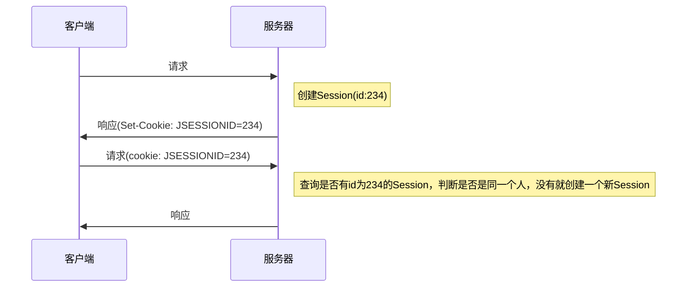
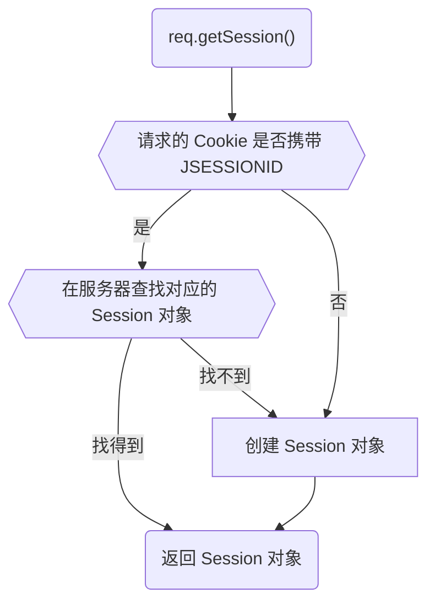
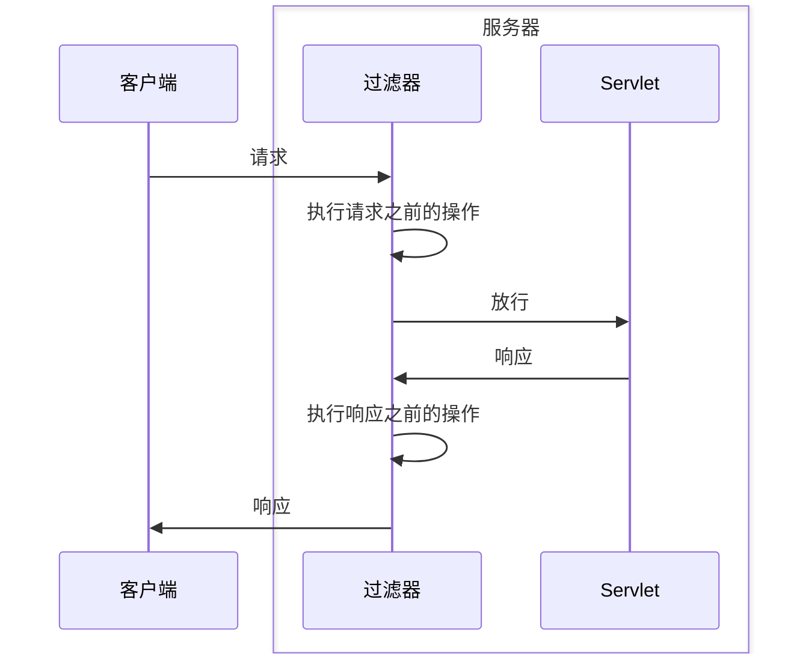
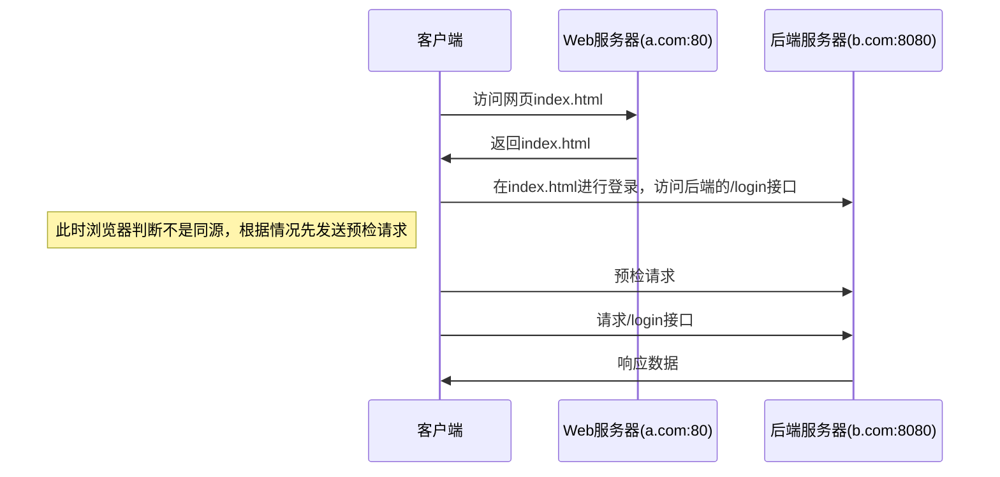

# Servlet

使用 Tomcat 容器

[详细代码](https://github.com/follow1123/java-frameworks/blob/main/servlet)

## Servlet 生命周期

| 生命周期    | 方法    | 执行时机    | 执行次数    |
|---------------- | --------------- | --------------- | --------------- |
| 构造对象    | 构造器    | 第一次请求或容器启动    | 1    |
| 初始化    | `init()`   |  构造完成后   | 1   |
| 处理服务   | `service(req, resp)`   | 每次请求   | 多次   |
| 销毁 | `destroy()` | 容器关闭| 1 |

Servlet 默认在请求时才会初始化，如果需要在 Tomcat 容器启动时就启动 Servlet，可以配置 `loadOnStartup` 参数

:::note
这个数值默认是安装从小到大启动，配置的数值越小，越先启动，推荐从6开始配置
:::

```mdx-code-block
import Tabs from '@theme/Tabs';
import TabItem from '@theme/TabItem';
import CodeBlock from '@theme/CodeBlock';

<Tabs>
  <TabItem value="annotation" label="Annotation" default>
     <CodeBlock language="java">
{
`@WebServlet(value = "/loadonstartup1", loadOnStartup = 101)
public class LoadOnStartup1Servlet extends HttpServlet {

// ...`
}
    </CodeBlock>
  </TabItem>
  <TabItem value="xml" label="XML">
    <CodeBlock language="xml">
{
`<servlet>
    <servlet-name>LoadOnStartup2Servlet</servlet-name>
    <servlet-class>cn.y.java.servlet.lifecycle.LoadOnStartup2Servlet</servlet-class>
    <!-- 配置启动时加载这个Servlet -->
    <load-on-startup>60</load-on-startup>
</servlet>
<servlet-mapping>
    <servlet-name>LoadOnStartup2Servlet</servlet-name>
    <url-pattern>/loadonstartup2</url-pattern>
</servlet-mapping>`
}
    </CodeBlock>
  </TabItem>
</Tabs>
```

## Servlet 继承结构


* `Servlet` - 接口，顶级接口，提供 Servlet 生命周期相关方法
* `GenericServlet` -  抽象类，Servlet 接口的简单实现，用于配置 ServletConfig
* `HttpServlet` -  抽象类，封装HTTP协议基础操作

## Servlet Config

每个 Servlet **独立**的配置，在启动时加载

```mdx-code-block
<Tabs>
  <TabItem value="annotation" label="Annotation" default>
     <CodeBlock language="java">
{
`@WebServlet(value = "/annoconfig",
// highlight-start
        initParams = {
                @WebInitParam(name = "k1", value = "v1"),
                @WebInitParam(name = "k2", value = "v2")
        })
// highlight-end

// ...`
}
    </CodeBlock>
  </TabItem>
  <TabItem value="xml" label="XML">
    <CodeBlock language="xml">
{
`<servlet>
    <servlet-name>XmlServletConfigServlet</servlet-name>
    <servlet-class>cn.y.java.servlet.servlet_config.XmlServletConfigServlet</servlet-class>
// highlight-start
    <init-param>
        <param-name>k1</param-name>
        <param-value>v1</param-value>
    </init-param>
    <init-param>
        <param-name>k2</param-name>
        <param-value>v2</param-value>
    </init-param>
// highlight-end
</servlet>
<servlet-mapping>
    <servlet-name>XmlServletConfigServlet</servlet-name>
    <url-pattern>/xmlconfig</url-pattern>
</servlet-mapping>`
}
    </CodeBlock>
  </TabItem>
</Tabs>
```

:::info
继承 `GenericServlet` 或 `HttpServlet` 的 Servlet 才能调用 `getServletConfig()` 方法
:::

```java
ServletConfig servletConfig = getServletConfig();

// 获取指定key对应的数据
System.out.println(servletConfig.getInitParameter("k1"));

// 获取全部参数
Enumeration<String> params = getServletConfig().getInitParameterNames();
while (params.hasMoreElements()) {
    String key = params.nextElement();
    System.out.println(key + " - " + servletConfig.getInitParameter(key));
}
```

## Servlet Context

上下文对象（域对象）

Tomcat 容器会为每个应用创建一个 Servlet Context

### 初始化参数

```mdx-code-block
<Tabs>
  <TabItem value="xml" label="XML" default>
    <CodeBlock language="xml">
{
`<context-param>
    <param-name>ctx-k2</param-name>
    <param-value>v22</param-value>
</context-param>
<context-param>
    <param-name>ctx-k3</param-name>
    <param-value>v3</param-value>
</context-param>`
}
    </CodeBlock>
  </TabItem>
  <TabItem value="listener" label="Listener">
     <CodeBlock language="java">
{
`@WebListener
public class ServletContextTestListener implements ServletContextListener {

    @Override
    public void contextInitialized(ServletContextEvent sce) {
        System.out.println("context initialized ------------------------");
        ServletContext servletContext = sce.getServletContext();
        servletContext.setInitParameter("ctx-k1", "v1");
        servletContext.setInitParameter("ctx-k2", "v2");
    }
}`
}
    </CodeBlock>
  </TabItem>
</Tabs>
```

:::note
`web.xml` 内的参数配置会覆盖 Listener 内添加的配置
:::

```java
// 单独获取
System.out.println(servletContext.getInitParameter("ctx-k1"));

// 获取全部参数
Enumeration<String> params = servletContext.getInitParameterNames();
while (params.hasMoreElements()){
    String key = params.nextElement();
    System.out.println(key + " - " + servletContext.getInitParameter(key));
}
```

:::info[Servlet Context 也是一个域对象]
* `setAttribute(name, object)` - 添加数据
* `getAttribute(name)` - 获取数据
* `getAttributeNames()` - 获取所有数据的key
* `removeAttribute(name)` - 移除数据
Servlet Context 域内的数据添加后所有 Servlet 内都可以使用
:::

其他

* `getRealPath(path)` - 获取项目运行时的实际路径
* `getContextPath()` - 获取应用上下文路径，（url的前缀）
* `getMimeType(file)` - 获取项目内文件的媒体类型

## HttpServletRequest

Tomcat 在接口客户端的请求后会将 HTTP 协议的报文和封装成 `HttpServletRequest` 对象，对象内可以获取所有HTTP协议相关信息

请求行

* `getRequestURL()` - 获取URL
* `getRequestURI()` - 获取URI
* `getServerPort()` - 获取客户端发送请求时的端口
* `getLocalPort()` - 获取当前应用所在容器的端口
* `getRemotePort()` - 获取客户端程序的端口
* `getScheme()` - 获取请求协议
* `getProtocol()` - 获取请求协议和版本号
* `getMethod()` - 获取请求方法

:::info[URL和URI的区别]
URL 相当于身份证号，URI 相当于电话号码
:::

请求头

* `getHeader(name)` - 获取请求头
* `getHeaderNames()` - 获取所有请求头的key
* `getContentType()` - 获取ContentType请求头

请求参数

* `getQueryString()` - 获取URL上拼接的请求参数
* `getParameter(name)` - 根据名称获取参数的值
* `getParameterValues(name)` - 根据名称获取参数的值，多个值
* `getParameterNames()` - 根据名称获取参数的值，所有值
* `getParameterMap()` - 以Map结构获取请求参数
* `getReader()` - 获取请求内容的Reader
* `getInputStream()` - 获取请求内容的InputStream
* `getContentLength()` - 获取请求长度

其他

* `getServletPath()` - 获取请求的 Servlet 路径
* `getServletContext()` - 获取 Servlet Context 对象
* `getCookies()` - 获取 Cookie
* `getSession()` - 获取 Session
* `setCharacterEncoding(env)` - 设置请求字符集

## HttpServletResponse

Tomcat 在接口客户端的请求后，封装 `HttpServletRequest` 对象的同时会创建一个 `HttpServletResponse` 对象用于存储响应数据，在请求结束时服务器会根据这个对象编码成 HTTP 协议对应的响应报文返回给客户端

响应行

* `setStatus(sc)` - 设置响应状态码

响应头

* `setHeader(name,` - value) 设置响应头信息
* `setContentType(type)` - 设置响应头的content-type，（媒体类型设置）

响应体

* `getWriter()` - 获取响应的 Writer 用于写出数据
* `getOutputStream()` - 获取响应的 OutputStream 用于写出数据
* `setContentLength(len)` - 设置响应内容长度，就是设置 content-length 响应头

其他

* `sendError(sc,` - msg) 响应错误信息
* `addCookie(cookie)` - 设置 Cookie
* `setCharacterEncoding(charset)` - 设置响应字符集

## Content Type

Content Type 是请求和响应头中很重要的一个头信息，参考[请求头](https://developer.mozilla.org/zh-CN/docs/Web/HTTP/Headers)，[MIME Type](https://developer.mozilla.org/zh-CN/docs/Web/HTTP/MIME_types)

常见的 Content Type 和其使用位置

| Content Type | 说明 | 请求 | 响应 |
| --- | --- | --- | --- |
| `application/json` |  请求或响应 json 数据 | √ |  √|
| `application/xml` | 请求或响应 xml 数据 | √ |  √ |
| `text/plain` | 请求或响应纯文本数据 | √ |  √ |
| `multipart/form-data` | 请求文件 | √ | |
| `application/x-www-form-urlencoded` | 请求表单 | √ | |
| `text/html` | 响应 html 文件| | √ |
| `application/pdf` | 响应 pdf 文件 | | √ |
| `image/png或image/jpeg` | 响应图片文件 | | √ |
| `text/css` | 响应 css 文件 | | √ |


## 转发和重定向

转发和重定向是 web 应用间接访问项目资源的方式

转发通过 `HttpServletRequest` 实现，重定向通过 `HttpServletResponse` 实现

### 请求转发


```java
/*
    转发路径如果填写 webapp 下的资源路径，则可以直接转发到资源
    可以转发到 WEB-INF 目录下的受保护资源 "WEB-INF/private.html"
*/
req.getRequestDispatcher("转发地址").forward(req, resp);
```

:::info
请求转发是服务器内部行为，对客户端是屏蔽的，客户端地址栏不会发生变化

由于客户端只发送了一次请求，所以 req resp 对象只有一对

客户端的请求参数在转发到的 Servlet 内可以使用

转发的资源可以是 Servlet 动态资源，也可以是 webapp 目录下的静态资源，也可以是 WEB-INF 目录下的受保护资源

无法转发外部资源，比如一个网址
:::

:::note
可以通过 `req.getAttribute(RequestDispatcher.FORWARD_REQUEST_URI)` 获取是从哪个路径转发过来的
:::

### 响应重定向


```java
/*
    转发路径如果填写 webapp 下的资源路径，则可以直接转发到资源，不可以访问 WEB-INF 目录下的受保护资源
    可以转发到外部资源
*/
resp.sendRedirect("资源路径");
```

:::info
重定向时服务端会响应302响应码，并添加 `Location` 响应头，指定重定向的路径

客户端至少发送了两次请求，地址栏会发生变化

服务器内第一次请求的相关数据不会跟着重定向给指定的路径，因为发送了多次请求，req resp 对象有多个

重定向也可以访问静态资源，但是不能访问 WEB-INF 目录下的受保护资源

重定向可以访问外部资源
:::

## 会话管理

HTTP 协议是一个无状态的协议，这意味着每个请求都是独立的，服务器不会自动记住之前请求的状态或用户的身份

为了在多次请求之间保持状态，尤其是在用户登录后需要维护会话信息时，会话管理（Session Management）就显得非常重要

:::info[Cookie 和 Session 配合实现会话管理]
cookie 是在客户端保少量数据的技术，主要通过响应头向客户端响应一些客户端要保的信息

session 是茌服务端保更多数据的技术，主要通过 HttpSession 对保存一些和客户端相关的信息
:::

### Cookie


```java title="响应时添加 Cookie"
resp.addCookie(new Cookie("aaa", "111"));
```

```java title="客户端请求时携带的 Cookie"
Cookie[] cookies = req.getCookies();
if (cookies != null) {
    for (Cookie cookie : cookies) {
        System.out.println(cookie.getName() + " - " + cookie.getValue());
    }
}
```

#### 相关方法

* `setComment(purpose)` - 添加 Cookie 的注释
* `setDomain(domain)` - 指定 Cookie 可以被哪个域名访问
* `setMaxAge(expiry)` - 设置 Cookie 过期时间，单位秒
* `setPath(uri)` - 指定 Cookie 可以被哪些路径访问
* `setSecure(flag)` - 指定只有使用 **SSL/TLS** 加密的协议才能访问，例如 **HTTPS**
* `setHttpOnly(isHttpOnly)` - 指定 Cookie 是否无法在 JavaScript 内获取，防止 XSS 攻击

### Session

HttpSession 是一种保留更多信息在服务端的一种技术，服务器会为每一个客户端开辟一块内存空间，即 Session 对象．客户端在发送请求时，都可以使用自己的 Session 这样服务端就可以通过 Session 来记录某个客户端的状态了

服务端在为客户端创建 Session 时，会同时将 Session 对象的 id ，即 JSESSIONID 以 Cookie 的形式放入响应对象，创建完后，客户端会收到一个特殊的 Cookie，叫做 JSESSIONID

客户端下一次请求时带 JSESSIONID，后端收到后，根据 JSESSIONID 找到对应的 Session 对象



```java
// 只有在执行这个方法之后才会开始会话
req.getSession();
```



* `isNew()` - 判断 Session 对象是不是新建的

#### Session 也是一个域对象

可以使用 `setAttribute()/getAttribute()` 等方法操作域内的数据

#### Session 时效性

Session 默认 30 分钟后就销毁，如果 30 分钟内有对应 JSESSIONID 请求过来，则重新计时

```xml
<!-- 默认在 Tomcat 安装目录下 conf/web.xml 内配置，可以在当前项目的 web.xml 文件内覆盖，单位分钟 -->
<session-config>
    <session-timeout>30</session-timeout>
</session-config>
```

* `setMaxInactiveInterval(interval)` - 设置 Session 对象的过期时间，单位秒
* `invalidate()` - 让 Session 直接失效

## 三大域对象

* **请求域** - 一次请求响应内
* **会话域** - 一次会话内，可以跨多个请求
* **应用域** - 应用内，可以跨多个会话


```java title="请求域"
// 添加请求域数据
req.setAttribute("name", "value");

// 获取请求域数据
req.getAttribute("name");
```

```java title="会话域"
// 添加会话域数据
req.getSession().setAttribute("name", "value");

// 获取会话域数据
req.getSession().getAttribute("name");
```

```java title="应用域"
// 添加应用域数据
getServletContext().setAttribute("name", "value");

// 获取应用域数据
getServletContext().getAttribute("name");
```

## Filter

Filter（过滤器）是一个用于处理 请求和响应 的组件，它能够在请求到达 Servlet 之前，或者响应返回客户端之前进行一些预处理或后处理



```mdx-code-block
<Tabs>
  <TabItem value="annotation" label="Annotation" default>
     <CodeBlock language="java">
{
`@WebFilter("/*")
public class ConfWithAnnotationFilter extends HttpFilter {

// ...`
}
    </CodeBlock>
  </TabItem>
  <TabItem value="xml" label="XML">
    <CodeBlock language="xml">
{
`<filter>
    <filter-name>ConfWithXmlFilter</filter-name>
    <filter-class>cn.y.java.filter.ConfWithXmlFilter</filter-class>
</filter>
<filter-mapping>
    <filter-name>ConfWithXmlFilter</filter-name>
    <url-pattern>/*</url-pattern>
</filter-mapping>`
}
    </CodeBlock>
  </TabItem>
</Tabs>
```

```java title="完整操作"
@WebFilter("/*")
public class ConfWithAnnotationFilter extends HttpFilter {

    @Override
    protected void doFilter(HttpServletRequest req, HttpServletResponse res, FilterChain chain) throws IOException, ServletException {
        System.out.println("annotation filter 请求之前的操作");

        // 放行
        chain.doFilter(req, res);

        System.out.println("annotation filter 响应之前的操作");
    }
}
```

:::note
方法内如果判断正常一定要执行 `chain.doFilter(req, resp)` 方法放行

`chain.doFilter(req, resp)` 方法之后才是响应之前的操作，这时 Servlet 内的逻辑已经执行完成了
:::

### 生命周期

| 生命周期    | 方法    | 执行时机    | 执行次数    |
|---------------- | --------------- | --------------- | --------------- |
| 构造对象    | 构造器    | 容器启动    | 1    |
| 初始化    | `init()`   |  构造完成后   | 1   |
| 处理服务   | `service(req, resp, filterChain)`   | 每次请求   | 多次   |
| 销毁 | `destroy()` | 容器关闭| 1 |

:::note
生命周期部分和 Servlet 生命周期类似，但是 Filter 是在容器启动时就创建的
:::

### 过滤器链

过滤器链（Filter Chain）是指一系列 Filter（过滤器）按照配置顺序依次处理请求和响应的机制。每个过滤器都可以对请求和响应进行处理，然后将请求传递给下一个过滤器（如果有的话），直到最终的 Servlet 被调用


:::info[Filter 链执行顺序]
如果使用 xml 配置的情况下，根据 filter-mapping 标签的定义顺序执行

如果使用注解方式配置，则根据类名顺序执行
:::

获取过滤器的初始化参数，配置方式参考[Servlet Config](#servlet-config)

```java
getFilterConfig().getInitParameter("name")
```

## Listener

监听器（Listener） 是一种用于监听和处理 Servlet 容器中事件的对象。它是 Servlet 规范的一部分，用于监听容器生命周期中的不同事件（如请求、会话、上下文的创建与销毁等）

| 监听器    | 所属域    | 说明    |
|---------------- | --------------- | --------------- |
| `ServletContextListener`    | **应用域**    | 监听应用域的创建和销毁    |
| `ServletContextAttributeListener`    | **应用域**    | 监听应用域内数据的增删改操作    |
| `HttpSessionListener` | **会话域** | 监听会话域的创建和销毁 |
| `HttpSessionAttributeListener` | **会话域** | 监听会话域内数据的增删改操作 |
| `HttpSessionBindingListener` | **会话域** | 监听会话域内绑定指定绑定解绑操作 |
| `HttpSessionActivationListener` | **会话域** | 监听会话域持久化和激活操作 |
| `ServletRequestListener`    | **请求域**    | 监听请求域的创建和销毁    |
| `ServletRequestAttributeListener`    | **请求域**    | 监听请求域内数据的增删改操作    |

```mdx-code-block
<Tabs>
  <TabItem value="annotation" label="Annotation" default>
     <CodeBlock language="java">
{
`@WebListener
public class ContextTestListener implements ServletContextListener {

// ...`
}
    </CodeBlock>
  </TabItem>
  <TabItem value="xml" label="XML">
    <CodeBlock language="xml">
{
`<listener>
    <listener-class>cn.y.java.listener.SessionTestListener</listener-class>
</listener>`
}
    </CodeBlock>
  </TabItem>
</Tabs>
```

Session 的两个特殊监听器

**HttpSessionBindingListener**

```java
// 绑定操作
session.setAttribute("testBindListener", new SessionBindingTestListener());

// 解绑操作
session.removeAttribute("testBindListener");
```

**HttpSessionActivationListener**

:::info[配置 Session 持久化]
在 webapp 目录下新建 `META-INF/context.xml` 文件

```xml
<Context>
    <!-- maxIdleSwap: 指定 session 对象多长时间不使用就持久化，单位分钟 -->
    <Manager className="org.apache.catalina.session.PersistentManager" maxIdleSwap="1">
    <Store className="org.apache.catalina.session.FileStore" directory="filedir" />
    </Manager>
</Context>
```
:::

## 异步 Servlet/Filter

异步计算

```java
@WebServlet(value = "/async", asyncSupported = true)
public class AsyncServlet extends HttpServlet {

    @Override
    protected void doGet(HttpServletRequest req, HttpServletResponse resp) throws ServletException, IOException {
        // 获取结果，如果有结果直接返回
        Object result = req.getSession().getAttribute("result");
        if (result != null){
            resp.getWriter().write("<h1>OK result: " + result + "</h1>");
            return;
        }
        // 开启异步任务
        AsyncContext asyncContext = req.startAsync();
        System.out.println("asyncContext default timeout: " + asyncContext.getTimeout());
        asyncContext.start(() -> {
            try {
                Thread.sleep(2000);
                HttpSession session = ((HttpServletRequest) asyncContext.getRequest()).getSession();
                session.setAttribute("result", "111");
            }catch (Exception e){
                e.printStackTrace();
            }finally {
                asyncContext.complete();
            }
        });

        // 先返回正在处理
        resp.setContentType("text/html");
        resp.setCharacterEncoding("UTF-8");
        resp.getWriter().write("<h1>正在处理</h1>");
    }
}
```

:::info
如果要正确使用异步 Servlet 那包括这个 Servlet 之内的所有请求链都需要开启异步支持，否则会报错 **startAsync 无法启动async，因为处理链中的下列类不支持**

也就是说所有拦截到这个 Servlet 的 Filter 都需要开启异步
:::

## 常见问题

### 乱码问题

#### 在 Idea 内启动 Tomcat `Localhost Log` 和 `Catalina Log` 控制台乱码

1. 确保 Tomcat 安装目录的 `conf/logging.properties` 内所有的 `encoding` 属性都是 **UTF-8**
2. 找到 Idea 窗口上面的 `Help` 选项，点击 `Edit Custom VM Options...` 在文件内添加：`-Dfile.encoding=UTF-8`
3. 重启 Idea

#### 编写 `System.out.println` 输出中文时乱码

1. 确保 Idea 设置的 `File Encoding` 选项内配置的都是 `UTF-8`
2. 编辑 Tomcat 启动配置，在 `-Dfile.encoding=UTF-8`
3. 重启 Tomcat

### 跨域问题

跨域问题 是指当浏览器在执行跨域请求时，因浏览器的同源策略（Same-Origin Policy）而产生的限制。浏览器的同源策略要求，网页中的脚本只能访问与当前页面同源（协议、域名、端口号都相同）的资源。如果网页需要访问不同域（跨域）的资源，浏览器会阻止该请求，造成 跨域问题



添加以下响应头即可

```java
resp.setHeader("Access-Control-Allow-Origin", "*");
resp.setHeader("Access-Control-Allow-Methods", "POST,GET,PUT,DELETE,OPTIONS,HEAD");
resp.setHeader("Access-Control-Max-Age", "3600");
resp.setHeader("Access-Control-Allow-Headers", "*");
```
:::note
什么时候发送预检请求：PUT、DELETE 方法，或请求头有 `Authorization` 的接口等
:::

## 参考

* [尚硅谷](https://www.bilibili.com/video/BV1UN411x7xe)
