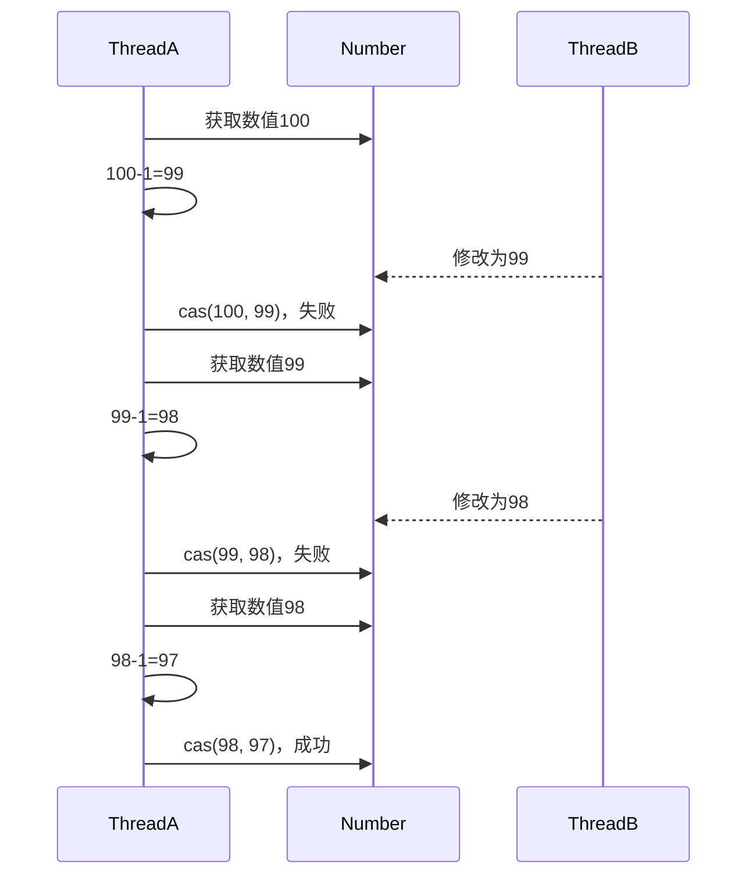
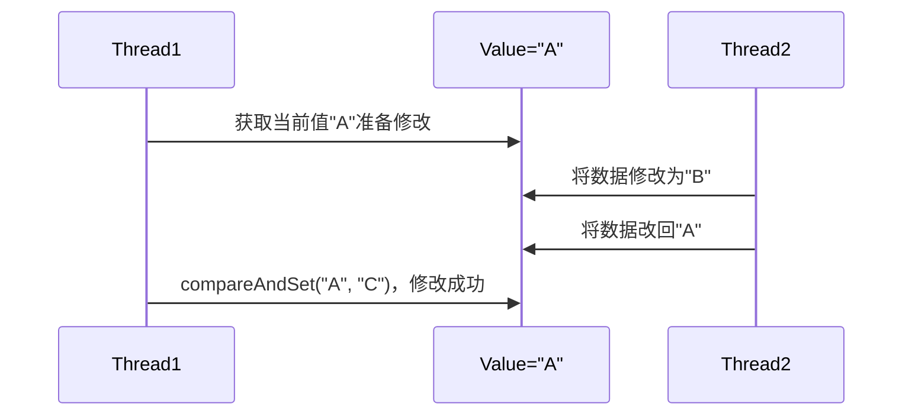
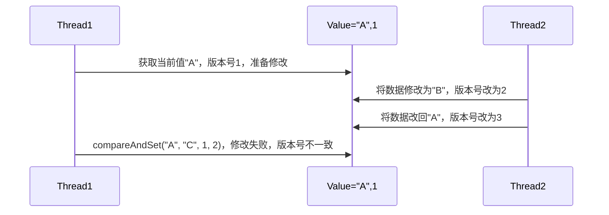
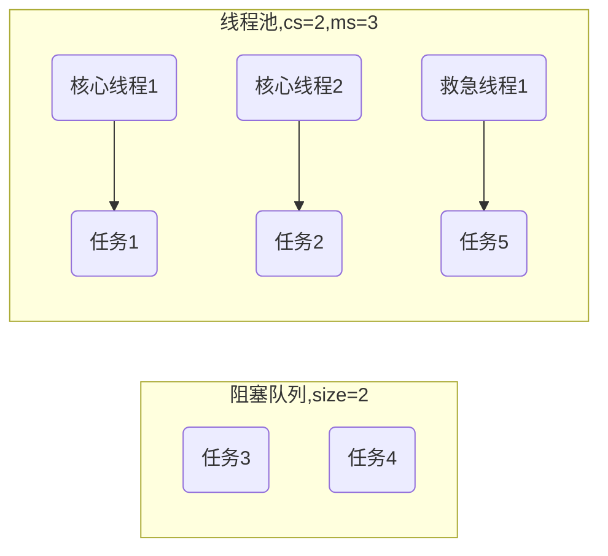
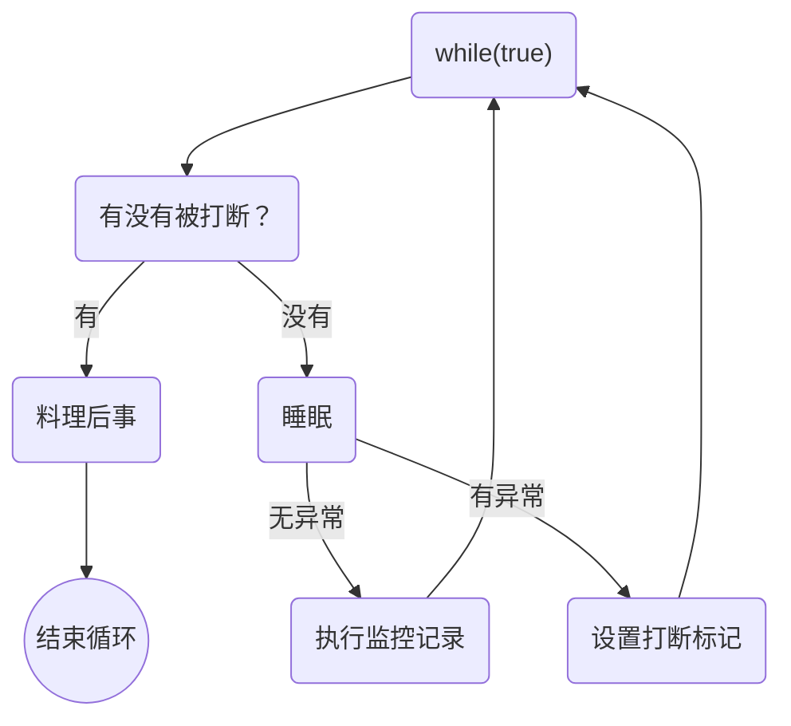
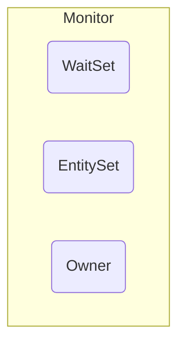

# JUC

## Thread API

### interrupt

> [详细代码](https://github.com/follow1123/java-basics/blob/main/src/main/java/cn/y/java/juc/thread_api/InterruptTest.java)

* `interrupt()` - 打断指定线程
* `isInterrupted()` - 判断指定线程是否被打断
* `static interrupted()` - 判断指定线程是否被打断，并清除打断标记
* 打断阻塞的线程

```java
Thread thread = new Thread(() -> {
    log.info("sleep");
    try {
        Thread.sleep(4000);
    } catch (InterruptedException e) {
        log.info("interrupt after exception: {}", Thread.currentThread().isInterrupted());
        e.printStackTrace();
    }
    log.info("done");
});
thread.start();

try{Thread.sleep(1000);}catch(InterruptedException e){e.printStackTrace();}
log.info("interrupt");
thread.interrupt();
log.info("isInterrupted: {}", thread.isInterrupted());
```

* 打断正在运行的线程

```java
Thread thread = new Thread(() -> {
    while (true) {
        log.info("running");
        if (Thread.currentThread().isInterrupted()){
            log.info("break");
            break;
        }
    }
});
thread.start();

try{Thread.sleep(1000);}catch(InterruptedException e){e.printStackTrace();}
log.info("interrupt");
thread.interrupt();
log.info("isInterrupted: {}", thread.isInterrupted());
```

* 打断使用park()方法阻塞的线程

```java
Thread thread = new Thread(() -> {
    log.info("step 1");
    LockSupport.park();
    // System.out.println(Thread.currentThread().isInterrupted());
    System.out.println(Thread.interrupted());
    log.info("step 2");

    /*
        只是线程不会阻塞，因为park方法判断如果打断标记为true时就不会执行
        上面可以使用Thread.interrupted()输出后清除打断标记
     */
    LockSupport.park();
    log.info("step 3");
});
thread.start();

try{Thread.sleep(1000);}catch(InterruptedException e){e.printStackTrace();}
log.info("interrupt");
thread.interrupt();
```


### 守护线程

> [详细代码](https://github.com/follow1123/java-basics/blob/main/src/main/java/cn/y/java/juc/thread_api/DaemonTest.java)

* 非守护线程

```java
Thread thread = new Thread(() -> {
    while (true) {
        try{Thread.sleep(100);}catch(InterruptedException e){e.printStackTrace();}
        log.info("execute");
    }
});

thread.start();
try{Thread.sleep(1000);}catch(InterruptedException e){e.printStackTrace();}
log.info("done");
```

* 守护线程

```java
Thread thread = new Thread(() -> {
    while (true) {
        try{Thread.sleep(100);}catch(InterruptedException e){e.printStackTrace();}
        log.info("execute");
    }
});

thread.setDaemon(true);
thread.start();

try{Thread.sleep(1000);}catch(InterruptedException e){e.printStackTrace();}
log.info("done");
```

---

## CAS

* 结合CAS和volatile可以实现无锁并发，适用于线程数少、多核CPU的场景下
* CAS是基于乐观锁的思想：最乐观的估计，不怕别的线程来修改共享变量，就算改了也没关系，我吃亏点再重试呗
* synchromzed是基于悲观锁的思想：最悲观的估计，得防着其它线程来修改共享变量，我上了锁你们都别想改，我改完了解开锁，你们才有机会
* CAS体现的是无锁并发、无阻塞并发
    * 因为没有使用synchronized, 所以线程不会陷入阻塞
    * 如果竟争激烈，可以想到重试必然频繁发生，反而效率会受影响



### 使用加锁的方式实现线程安全

> [详细代码](https://github.com/follow1123/java-basics/blob/main/src/main/java/cn/y/java/juc/cas/WithLockTest.java)

```java
@Slf4j(topic = "WithLockTest")
public class WithLockTest {

    private int num = 1000;

    public int getNum() {return num;}

    public void subNum() {
        // log.info("before: {}", num);
        synchronized (this) {num = num - 1;}
    }

    public static void main(String[] args) {
        for (int i = 0; i < 10; i++) test();
    }

    private static void test() {
        WithLockTest withLockTest = new WithLockTest();
        Thread[] threads = new Thread[1000];

        for (int i = 0; i < threads.length; i++) {
            threads[i] = new Thread(withLockTest::subNum);
        }
        long start = System.currentTimeMillis();
        for (Thread thread : threads) thread.start();
        for (Thread thread : threads) {
            try {thread.join();} catch (InterruptedException e) {throw new RuntimeException(e);}
        }
        log.info("result: {}, time: {}ms", withLockTest.getNum(), System.currentTimeMillis() - start);
    }
}
```

### 使用CAS方式实现线程安全

> [详细代码](https://github.com/follow1123/java-basics/blob/main/src/main/java/cn/y/java/juc/cas/WithoutLockTest.java)

```java
@Slf4j(topic = "WithoutLockTest")
public class WithoutLockTest {

    private final AtomicInteger num = new AtomicInteger(1000);

    public int getNum() {return num.get();}

    public void subNum() {
        while (true){
            int prev = num.get();
            int next = prev - 1;
            if (num.compareAndSet(prev, next)) {
                break;
            }
        }
    }

    public static void main(String[] args) {
        for (int i = 0; i < 10; i++) test();
    }

    private static void test() {
        WithoutLockTest withLockTest = new WithoutLockTest();
        Thread[] threads = new Thread[1000];

        for (int i = 0; i < threads.length; i++) {
            threads[i] = new Thread(withLockTest::subNum);
        }
        long start = System.currentTimeMillis();
        for (Thread thread : threads) thread.start();
        for (Thread thread : threads) {
            try {thread.join();} catch (InterruptedException e) {throw new RuntimeException(e);}
        }
        log.info("result: {}, time: {}ms", withLockTest.getNum(), System.currentTimeMillis() - start);
    }
}
```

### ABA问题

> [详细代码](https://github.com/follow1123/java-basics/blob/main/src/main/java/cn/y/java/juc/cas/aba/ABATest.java)



```java
public static void before(){
    AtomicReference<String> str = new AtomicReference<>("A");

    String prev = str.get();
    beforeMidOperate(str);
    try{Thread.sleep(1000);}catch(InterruptedException e){e.printStackTrace();}
    log.info("set to C - {}", str.compareAndSet(prev, "C"));
}

public static void beforeMidOperate(AtomicReference<String> str){
    Thread t1 = new Thread(() -> {
        log.info("set to B - {}", str.compareAndSet(str.get(), "B"));
    });

    Thread t2 = new Thread(() -> {
        log.info("set to A - {}", str.compareAndSet(str.get(), "A"));
    });

    t1.start();
    try{Thread.sleep(100);}catch(InterruptedException e){e.printStackTrace();}
    t2.start();
}
```

* 上面的操作在修改数据前不知道数据已经被修改过几次，但是数据最后被还原成了原来的数据，所以修改还是成功了
* 添加版本号解决ABA问题，使用`AtomicStampedReference`



```java
public static void after(){
    AtomicStampedReference<String> str = new AtomicStampedReference<>("A", 1);
    afterMidOperate(str);

    String prev = str.getReference();
    int stamp = str.getStamp();
    try{Thread.sleep(1000);}catch(InterruptedException e){e.printStackTrace();}
    log.info("set to C - {}", str.compareAndSet(prev, "C", stamp, stamp + 1));
    log.info("reference: {}, stamp: {}", str.getReference(), str.getStamp());
}

public static void afterMidOperate(AtomicStampedReference<String> str){
    Thread t1 = new Thread(() -> {
        String prev = str.getReference();
        int stamp = str.getStamp();
        log.info("set to B - {}", str.compareAndSet(prev, "B", stamp, stamp + 1));
        log.info("reference: {}, stamp: {}", str.getReference(), str.getStamp());
    });

    Thread t2 = new Thread(() -> {
        String prev = str.getReference();
        int stamp = str.getStamp();
        log.info("set to A - {}", str.compareAndSet(prev, "A", stamp, stamp + 1));
        log.info("reference: {}, stamp: {}", str.getReference(), str.getStamp());
    });

    t1.start();
    try{Thread.sleep(100);}catch(InterruptedException e){e.printStackTrace();}
    t2.start();
}
```

---

## JUC锁

### ReentrantLock

> [详细代码](https://github.com/follow1123/java-basics/blob/main/src/main/java/cn/y/java/juc/locks/ReentrantLockTest.java)

* 可中断
* 可以设置超时时间
* 可以设置为公平锁
* 支持多个条件变量
* 可重入
    * 可重入是指同一个线程如果首次获得了这把锁，那么因为它是这把锁的拥有者，因此有权利再次获取这把锁
    * 如果是不可重入锁，那么第二次获得锁时，自己也会被锁挡住

```java
// 获取锁
lock.lock();
try {
    // 代码
    System.out.println(Thread.currentThread());
}finally {
    // 释放锁
    lock.unlock();
}
```

#### 可重入

```java
private static void execute(int i) {
    // 获取锁
    lock.lock();
    try {
        if (i == 0) return;
        execute(i - 1);
        // 代码
        System.out.println(Thread.currentThread());
    } finally {
        // 释放锁
        lock.unlock();
    }
}

public static void testReentrant() {
    execute(5);
}
```

#### 可打断

```java
Thread thread = new Thread(() -> {
    log.info("enter");
    try {
        lock.lockInterruptibly();
        log.info("get lock");
    } catch (InterruptedException e) {
        log.info("interrupted");
        e.printStackTrace();
        return;
    }
    try {
        log.info("execute");
    } finally {
        log.info("release lock");
        lock.unlock();
    }
});

// 主线程先获取锁
log.info("get lock");
lock.lock();
thread.start();
try{Thread.sleep(1000);}catch(InterruptedException e){e.printStackTrace();}
log.info("interrupt");
thread.interrupt();
```

#### 可以设置超时时间

```java
Thread thread = new Thread(() -> {
    log.info("enter");
    try {
        // 立即获取结果
        // boolean succeed = lock.tryLock();
        // 等待1秒，并获取最终的结果
        boolean succeed = lock.tryLock(1, TimeUnit.SECONDS);
        if (!succeed) {
            System.out.println("get lock failed");
            return;
        }
        log.info("get lock");
    } catch (InterruptedException e) {
        e.printStackTrace();
    }
    try {
        log.info("execute");
    } finally {
        log.info("release lock");
        lock.unlock();
    }
});

// 主线程先获取锁
log.info("get lock");
lock.lock();
thread.start();
try{Thread.sleep(2000);}catch(InterruptedException e){e.printStackTrace();}
```

#### 可以设置为公平锁

```java
final ReentrantLock fairLock = new ReentrantLock(true);
for (int i = 0; i < 10; i++) {
    Thread thread = new Thread(() -> {
        log.info("enter");
        fairLock.lock();
        try {
            if ("thread 0".equals(Thread.currentThread().getName())) {
                try{Thread.sleep(1000);}catch(InterruptedException e){e.printStackTrace();}
            }
            log.info("execute");
        } finally {
            fairLock.unlock();
        }
    });

    thread.setName("thread " + i);
    thread.start();
    if (i == 0) {
        try{Thread.sleep(100);}catch(InterruptedException e){e.printStackTrace();}
    }
}
```

#### 支持多个条件变量

```java
Condition c1 = lock.newCondition();
Condition c2 = lock.newCondition();

for (int i = 0; i < 10; i++) {
    boolean flag = i % 2 == 0;
    Thread thread = new Thread(() -> {
        lock.lock();
        log.info("enter");
        try {
            if (flag) {
                try {c1.await();} catch (InterruptedException e) {throw new RuntimeException(e);}
            } else {
                try {c2.await();} catch (InterruptedException e) {throw new RuntimeException(e);}
            }
            log.info("done");
        } finally {
            lock.unlock();
        }
    });
    thread.setName(String.format("thread %d %s", i, flag ? "c1" : "c2"));
    thread.start();
}

// 两秒后唤醒第一批线程
try{Thread.sleep(2000);}catch(InterruptedException e){e.printStackTrace();}
log.info("notify c2");
lock.lock();
c2.signalAll();
lock.unlock();

// 4秒后唤醒第二批线程
try{Thread.sleep(2000);}catch(InterruptedException e){e.printStackTrace();}
log.info("notify c1");
lock.lock();
c1.signalAll();
lock.unlock();
```

## 原子类

* 原子类底层使用CAS这种操作保证线程安全
* 原子类会保证内部每个方法的原子性，也就是说原子类的每**单个方法**都是线程安全的

### 原子整型

> [详细代码](https://github.com/follow1123/java-basics/blob/main/src/main/java/cn/y/java/juc/atomic/AtomicIntegerTest.java)

* 原子整型包含**AtomicInteger** **AtomicLong** **AtomicBoolean**
* 常用方法，其中AtomicInteger和AtomicLong的方法类似，AtomicBoolean没有增加、减少相关方法，其他差不多
    * `get()` - 获取当前值
    * `set(long newValue)` - 设置新值
    * `getAndSet(long newValue)` - 获取当前值并设置为新值
    * `compareAndSet(long expect, long update)` - 如果当前值等于 expect，则将当前值设置为 update，返回 true；否则，返回 false
    * `compareAndExchange(long expectedValue, long newValue)` - 类似于 compareAndSet，但是此方法的返回值是交换前的旧值
    * `getAndIncrement()` - 获取当前值，并将其递增 1
    * `incrementAndGet()` - 将当前值递增 1，并返回更新后的值
    * `getAndDecrement()` - 获取当前值，并将其递减 1
    * `decrementAndGet()` - 将当前值递减 1，并返回更新后的值
    * `addAndGet(long delta)` - 将当前值增加 delta，并返回更新后的值
    * `getAndAdd(long delta)` - 获取当前值，并将其增加 delta
    * `getAndUpdate(LongUnaryOperator updateFunction)` - 获取当前值，并使用提供的函数更新值
    * `updateAndGet(LongUnaryOperator updateFunction)` - 使用提供的函数更新值，并返回更新后的值

```java
AtomicInteger i = new AtomicInteger();
System.out.println(i.get()); // 0
i.set(2);
System.out.println(i.getAndSet(4)); // 2
int prev = i.get();
int next = prev - 1;
System.out.println(i.compareAndSet(prev, next)); // true
prev = i.get();
next = prev + 1;
System.out.println(i.compareAndExchange(prev, next)); // 3
System.out.println(i.getAndIncrement()); // 4
System.out.println(i.incrementAndGet()); // 6
System.out.println(i.getAndDecrement()); // 6
System.out.println(i.decrementAndGet()); // 4
System.out.println(i.addAndGet(6)); // 10
System.out.println(i.getAndAdd(-6)); // 10
System.out.println(i.getAndUpdate(v -> v * 10)); // 4
System.out.println(i.updateAndGet(v -> v * 10)); // 400
```

### 原子引用

#### AtomicReference

> [详细代码](https://github.com/follow1123/java-basics/blob/main/src/main/java/cn/y/java/juc/atomic/reference/AtomicReferenceTest.java)

* AtomicReference的使用和[原子整型](#原子整型)类似
* 常用方法
    * `get()` - 获取当前值
    * `set(V newValue)` - 设置新值
    * `getAndSet(V newValue)` - 获取当前值并设置为新值
    * `getAndUpdate(UnaryOperator<V> updateFunction)` - 获取当前值，并使用提供的函数更新值
    * `updateAndGet(UnaryOperator<V> updateFunction)` - 使用提供的函数更新值，并返回更新后的值
    * `compareAndSet(V expect, V update)` - 如果当前值等于 expect，则将当前值设置为 update，返回 true；否则，返回 false
    * `compareAndExchange(V expectedValue, V newValue)` - 类似于 compareAndSet，但是此方法的返回值是交换前的旧值

```java
final AtomicReference<BigInteger> bi = new AtomicReference<>(BigInteger.valueOf(1000));
int count = bi.get().intValue();
Thread[] threads = new Thread[count];
for (int i = 0; i <count; i++) {
    threads[i] = new Thread(() -> {
        bi.getAndUpdate(v -> v.subtract(BigInteger.ONE));
    });
}

for (Thread thread : threads) thread.start();
for (Thread thread : threads) {
    try {thread.join();} catch (InterruptedException e) {throw new RuntimeException(e);}
}

System.out.println(bi.get());
```

#### AtomicStampedReference

* 可以用于解决[ABA问题](#aba问题)
* 常用方法
    * `getReference()` - 获取当前值
    * `getStamp()` - 获取当前戳
    * `get(int[] stampHolder)` - 获取当值和戳，参数传递一个数组，调用后第一个元素就是当前戳
    * `compareAndSet(V expectedReference, V newReference, int expectedStamp, int newStamp)` - 如果expectedReference等于当前数据，expectedStamp等于当前戳，则修过成功，返回true，否则，返回false
    * `attemptStamp(V expectedReference, int newStamp)` - 值修改戳不修改值

```java
AtomicStampedReference<String> str = new AtomicStampedReference<String>("a", 1);
System.out.println(str.getReference()); // a
System.out.println(str.getStamp()); // 1
int[] stamp = new int[1];
String val = str.get(stamp);
System.out.println(val); // a
System.out.println(stamp[0]); // 1
// 只修改戳，不修改值
System.out.println(str.attemptStamp(str.getReference(), str.getStamp() + 1)); // true
str.set("b", 3);
System.out.println(str.compareAndSet("b", "c", 3, 5)); // true
```

#### AtomicMarkableReference

* 和[AtomicStampedReference](#atomicstampedreference)类似，只不过是戳变成了boolean值
* 实现生产者消费者模型

```java
@Slf4j(topic = "AtomicMarkableReferenceTest")
public class AtomicMarkableReferenceTest {

    private static final AtomicMarkableReference<Integer> products = new AtomicMarkableReference<>(0, false);
    private static final Integer MAX_PRODUCT = 3;

    public static void main(String[] args) {
        Thread[] threads = new Thread[MAX_PRODUCT * 2];
        for (int i = 0; i < threads.length; i++) {
            threads[i] = new Thread(i % 2 == 0 ? AtomicMarkableReferenceTest::consume : AtomicMarkableReferenceTest::produce);
        }
        for (Thread thread : threads) thread.start();
    }

    public static void consume(){
        Integer count;
        int c;
        boolean marker;
        while (true){
            // try{Thread.sleep(1000);}catch(InterruptedException e){e.printStackTrace();}
            count = products.getReference();
            marker = count > 0;
            c = count - (marker ? 1 : 0);
            if(products.compareAndSet(count, c, true, marker)){
                if (count != c){
                    log.info("consume product: {}", products.getReference());
                }
            }
        }
    }

    public static void produce(){
        Integer count;
        int c;
        boolean marker;
        while (true){
            // try{Thread.sleep(500);}catch(InterruptedException e){e.printStackTrace();}
            count = products.getReference();
            marker = count < MAX_PRODUCT;
            c = count + (marker ? 1 : 0);
            if(products.compareAndSet(count, c, false, marker)){
                if (count != c){
                    log.info("produce product: {}", products.getReference());
                }
            }
        }
    }
}
```

### 原子数组

> [详细代码](https://github.com/follow1123/java-basics/blob/main/src/main/java/cn/y/java/juc/atomic/AtomicArrayTest.java)

* 原子数组包含**AtomicIntegerArray** **AtomicLongArray** **AtomicReferenceArray**
* 常用方法和**AtomicInteger**类似，方法的第一个参数是下标
* 测试普通数组多线程累加

```java
int len = 10;
int max = 10000;
int[] ints = new int[len];
Thread[] threads = new Thread[len];
for (int i = 0; i < threads.length; i++) {
    threads[i] = new Thread(() -> {
        for (int j = 0; j < max; j++) {
            ints[j % len]++;
        }
    });
}
for (Thread thread : threads) thread.start();
for (Thread thread : threads) {
    try {thread.join();} catch (InterruptedException e) {throw new RuntimeException(e);}
}
System.out.println(Arrays.toString(ints));
```

* 测试原子数组多线程累加

```java
int len = 10;
int max = 10000;
AtomicIntegerArray ints = new AtomicIntegerArray(len);
Thread[] threads = new Thread[len];
for (int i = 0; i < threads.length; i++) {
    threads[i] = new Thread(() -> {
        for (int j = 0; j < max; j++) {
            ints.incrementAndGet(j % len);
        }
    });
}
for (Thread thread : threads) thread.start();
for (Thread thread : threads) {
    try {thread.join();} catch (InterruptedException e) {throw new RuntimeException(e);}
}
System.out.println(ints);
```

### 字段更新器

> [详细代码](https://github.com/follow1123/java-basics/blob/main/src/main/java/cn/y/java/juc/atomic/AtomicFieldUpdaterTest.java)

* 字段更新器包含**AtomicIntegerFieldUpdater** **AtomicLongFieldUpdater** **AtomicReferenceFieldUpdater**

```java
public static void main(String[] args) {
    A zs = new A("zs", 18);
    // int属性
    AtomicIntegerFieldUpdater<A> age = AtomicIntegerFieldUpdater.newUpdater(A.class, "age");
    System.out.println(age.get(zs)); // 18
    System.out.println(age.incrementAndGet(zs)); // 19

    // 引用属性
    AtomicReferenceFieldUpdater<A, String> name = AtomicReferenceFieldUpdater.newUpdater(A.class, String.class, "name");
    System.out.println(name.get(zs)); // zs
    System.out.println(name.updateAndGet(zs, n -> "ls")); // ls
}

private static class A{
    private volatile String name;
    private volatile int age;

    public A(String name, int age) {this.name = name;this.age = age;}
}
```

### 原子累加器

> [详细代码](https://github.com/follow1123/java-basics/blob/main/src/main/java/cn/y/java/juc/atomic/LongAdderTest.java)

* 原子累加器包含**LongAdder** **DoubleAdder**
* LongAdder多线程累加

```java
LongAdder longAdder = new LongAdder();
int len = 10;
Thread[] threads = new Thread[len];
for (int i = 0; i < threads.length; i++) {
    threads[i] = new Thread(() -> {
        for (int j = 0; j < len * 10; j++) longAdder.increment();
    });
}

for (Thread thread : threads) thread.start();
for (Thread thread : threads) {
    try {thread.join();} catch (InterruptedException e) {throw new RuntimeException(e);}
}
System.out.println(longAdder.intValue());
```

* DoubleAdder多线程累加

```java
DoubleAdder doubleAdder = new DoubleAdder();
int len = 10;
Thread[] threads = new Thread[len];
for (int i = 0; i < threads.length; i++) {
    threads[i] = new Thread(() -> {
        for (int j = 0; j < len * 10; j++) doubleAdder.add(1.1);
    });
}
for (Thread thread : threads) thread.start();
for (Thread thread : threads) {
    try {thread.join();} catch (InterruptedException e) {throw new RuntimeException(e);}
}
System.out.println(doubleAdder.doubleValue());
```

---

## 并发工具类

---

## 线程池

### 自定义线程池

> [详细代码](https://github.com/follow1123/java-basics/blob/main/src/main/java/cn/y/java/juc/thread_pool/custom_thread_pool)

### ThreadPoolExecutor

> [详细代码](https://github.com/follow1123/java-basics/blob/main/src/main/java/cn/y/java/juc/thread_pool/ThreadPoolExecutorTest.java)

#### 线程池状态

* **ThreadPoolExecutor**使用`int`的高3位来表示线程池状态，低29位表示线程数量
* 使用一个`int`来表示这两种状态的原因：是可以用一次CAS操作修改这两个状态

| 状态    | 高3位    | 接收新任务    | 处理阻塞队列任务    | 说明    |
|---------------- | --------------- | --------------- | --------------- | --------------- |
| `RUNNING`    | 111    | Y    | N    |    |
| `SHUTDOWN`   | 000   | N   | Y   | 不会接收新任务，但会处理阻塞队列剩余任务   |
| `STOP`   | 001   | N   | N   | 会中断正在执行的任务，并抛弃阻塞队列任务   |
| `TIDYING`   | 010   | -   | -   | 任务全执行完成，活动线程为0，即将进入终结   |
| `TERMINATED` | 011 | - | - | 终结 |

#### 构造方法

* `corePoolSize` - 核心线程数目（最多保留的线程数）
* `maximumPoolSize` - 最大线程数目
* `keepAliveTime` - 生存时间-针对救急线程
* `unit` - 时间单位-针对救急线程
* `workQueue` - 阻塞队列
* `threadFactory` - 线程工厂-可以为线程创建时起个好名字
* `handler` - 拒绝策略

#### 核心线程

* 使用`corePoolSize`参数定义最大数量
* 核心线程默认会一直存在
* 可以使用`allowCoreThreadTimeOut(true)`方法将核心线程设置为可超时，超时时间默认和救急线程的超时时间一样

#### 救急线程

* **最大线程数(maximumPoolSize)减核心线程数(corePoolSize)** 就是救急线程的数量
* 救急线程不会一直存在，任务执行完成后，等待`keepAliveTime`和`unit`定义的时间后停止
* 救急线程只有在[阻塞队列](#阻塞队列)满了之后才会开始创建并运行，如果**阻塞队列**是无界队列，那救急线程永远不会运行

#### 阻塞队列

* 用于在核心线程忙不过来的时候保存提交的任务

| 实现 | 说明 |
| --- | --- |
| ArrayBlockingQueue | 如果你有固定数量的任务且需要限制队列的容量，可以使用这个**有界队列** |
| LinkedBlockingQueue | 当任务量不确定或可能变得非常大，如果不需要限制队列大小，可以使用这个**无界队列** |
| SynchronousQueue | 如果你希望每个提交的任务都被立即处理，可以使用 SynchronousQueue |
| DelayQueue | 适用于任务的执行有延迟要求的场景，比如定时任务或者某些任务的延迟执行 |

#### 拒绝策略

* 当核心线程正在运行，**有界**阻塞队列也已经满了，并且救急线程也正在运行的时候，再提交新的任务就会执行拒绝策略

| 实现 | 说明 |
| --- | --- |
| AbortPolicy | 直接抛出异常 |
| CallerRunsPolicy | 在调用者的线程执行这个任务 |
| DiscardPolicy | 丢弃这个任务 |
| DiscardOldestPolicy | 丢弃最早提交的任务 |

#### 线程工厂

* 一般用来给线程起名，实现`ThreadFactory`接口进行自定义

#### 使用

##### 救急线程的执行时机

* 当核心线程正在运行，并且**有界**任务队列已满时，救急线程才会执行



```java
ThreadPoolExecutor pool = new ThreadPoolExecutor(2, 3, 5,
        TimeUnit.SECONDS, new ArrayBlockingQueue<>(2));
for (int i = 0; i < 5; i++) {
    long[] valRef = new long[]{i, 1000};
    if (i == 0 || i == 1){
        valRef[1] = 1000000;
    }
    pool.submit(() -> {
        log.info("start {} task", valRef[0]);
        try{Thread.sleep(valRef[1]);}catch(InterruptedException e){e.printStackTrace();}
        log.info("end {} task", valRef[0]);
    });
}

try{Thread.sleep(5000);}catch(InterruptedException e){e.printStackTrace();}
log.info("core size: {}, largest size: {}", pool.getCorePoolSize(), pool.getLargestPoolSize());
log.info("all task: {}, complete task: {}", pool.getTaskCount(), pool.getCompletedTaskCount());
```

##### newFixedThreadPool

* 创建：`ExecutorService pool = Executors.newFixedThreadPool(5);`
* 没有救急线程，阻塞队列是无界的，可以放任意数量的任务
* 用于执行任务量已知，相对耗时的任务

##### newCachedThreadPool

* 创建：`ExecutorService pool = Executors.newCachedThreadPool();`
* 核心线程数是0，最大线程数是`Integer.MAX_VALUE`，救急线程的空闲生存时间是60s
    * 全部都是救急线程（ 60S 后可以回收）
    * 救急线程可以无限创建
* 队列采用了`SynchronousQueue`实现特点是，它没有容量，没有线程来取是放不进去的（一手交钱、一手交货）
* 适合任务数比较密集，但每个任务执行时间较短的情况
* 测试SynchronousQueue

```java
SynchronousQueue<Integer> queue = new SynchronousQueue<>();
new Thread(() -> {
    log.info("putting 1");
    try {queue.put(1);} catch (InterruptedException e) {throw new RuntimeException(e);}
    log.info("1 putted");

    log.info("putting 2");
    try {queue.put(2);} catch (InterruptedException e) {throw new RuntimeException(e);}
    log.info("2 putted");
}).start();

// 一秒后取1时才能添加1
try{Thread.sleep(1000);}catch(InterruptedException e){e.printStackTrace();}
new Thread(() -> {
    log.info("take 1");
    try {queue.take();} catch (InterruptedException e) {throw new RuntimeException(e);}
}).start();

// 再一秒后取2时才能添加2
try{Thread.sleep(1000);}catch(InterruptedException e){e.printStackTrace();}
new Thread(() -> {
    log.info("take 2");
    try {queue.take();} catch (InterruptedException e) {throw new RuntimeException(e);}
}).start();
```

* 测试使用缓存线程池

```java
ThreadPoolExecutor pool = (ThreadPoolExecutor) Executors.newCachedThreadPool();
for (int i = 0; i < 10; i++) {
    int num = i;
    pool.submit(() -> {
        log.info("start {}", num);
        try{Thread.sleep(10000000);}catch(InterruptedException e){e.printStackTrace();}
    });
}
try{Thread.sleep(1000);}catch(InterruptedException e){e.printStackTrace();}
log.info("core size: {}, largest size: {}", pool.getCorePoolSize(), pool.getLargestPoolSize());
log.info("all task: {}, complete task: {}", pool.getTaskCount(), pool.getCompletedTaskCount());
```

##### newSingleThreadExecutor

* 创建：`ExecutorService pool = Executors.newSingleThreadExecutor();`
* 希望多个任务排队执行。线程数固定为1，任务数多于1时，会放入无界队列排队。任务执行完毕，这唯一的线程也不会被释放
* 某一个任务执行抛出异常也不会影响后续的任务
* 无法通过获取具体实现类修改线程池大小，创建的是`FinalizableDelegatedExecutorService`，无法定义，而且没有修改线程池大小的方法

```java
ExecutorService pool = Executors.newSingleThreadExecutor();
for (int i = 0; i < 5; i++) {
    int num = i;
    pool.submit(() -> {
        log.info("execute {}", num);
        // 出现异常后也会执行后续的任务
        if (num == 2) throw new RuntimeException("err");
        try{Thread.sleep(1000);}catch(InterruptedException e){e.printStackTrace();}
    });
}
```

##### 提交任务相关方法

* 提交单个任务

```java
ExecutorService pool = Executors.newFixedThreadPool(3);
pool.execute(() -> log.info("execute runnable task"));
pool.submit(() -> log.info("submit runnable task"));
Future<Integer> t1 = pool.submit(() -> {
    log.info("submit callable task");
    return 1;
});
try {System.out.println(t1.get());} catch (InterruptedException | ExecutionException e) {throw new RuntimeException(e);}
// 指定一个返回值，用于确认线程是否完成
Future<String> t2 = pool.submit(() -> {
    int i = 1/0;
    log.info("submit runnable task with result");
}, "done");
try {System.out.println(t2.get());} catch (InterruptedException | ExecutionException e) {throw new RuntimeException(e);}
```

* 提交全部任务，并获取所有任务的返回值

```java
ExecutorService pool = Executors.newFixedThreadPool(3);
ArrayList<Callable<String>> tasks = new ArrayList<>();
for (int i = 0; i < 5; i++) {
    int num = i;
    tasks.add(() -> num + "");
}
try {
    List<Future<String>> futures = pool.invokeAll(tasks);
    for (Future<String> future : futures) {
        log.info(future.get());
    }
} catch (InterruptedException | ExecutionException e) {
    throw new RuntimeException(e);
}
```

* 提交全部任务，并获取最快执行完成的任务的返回值
    * 其他任务，如果正在执行的就打断，没执行的就放弃

```java
ThreadPoolExecutor pool = (ThreadPoolExecutor) Executors.newFixedThreadPool(3);
ArrayList<Callable<String>> tasks = new ArrayList<>();
Random random = new Random();
for (int i = 0; i < 5; i++) {
    int mills = random.nextInt(0, 10) * 100;
    int num = i;
    tasks.add(() -> {
        try{Thread.sleep(mills);}catch(InterruptedException e){e.printStackTrace();}
        return num + "";
    });
}
/*
    只会获取最快执行完成的一个任务的结果
    其他任务，如果正在执行的就打断，没执行的就放弃
 */
try {log.info(pool.invokeAny(tasks));} catch (Exception e) {throw new RuntimeException(e);}
log.info("core size: {}, largest size: {}", pool.getCorePoolSize(), pool.getLargestPoolSize());
log.info("all task: {}, complete task: {}", pool.getTaskCount(), pool.getCompletedTaskCount());
```

##### 关闭线程

* `shutdown()`

```java
// ThreadPoolExecutor pool = (ThreadPoolExecutor) Executors.newFixedThreadPool(3);
ThreadPoolExecutor pool = new ThreadPoolExecutor(3, 3, 3, TimeUnit.SECONDS,
        new LinkedBlockingQueue<>(), new ThreadPoolExecutor.CallerRunsPolicy());

for (int i = 0; i < 5; i++) {
    int num = i;
    pool.submit(() -> {
        log.info("execute {}", num);
        try{Thread.sleep(2000);}catch(InterruptedException e){e.printStackTrace();}
    });
}
log.info("before shutdown");
// 不会阻塞当前线程，所有已经提交的任务都会执行完成
pool.shutdown();
log.info("other");

// 线程关闭后再提交任务就会执行默认或指定的拒绝策略
pool.submit(() -> log.info("execute after shutdown"));
```

* `shutdownNow()`

```java
ThreadPoolExecutor pool = (ThreadPoolExecutor) Executors.newFixedThreadPool(3);
// ThreadPoolExecutor pool = new ThreadPoolExecutor(3, 3, 3, TimeUnit.SECONDS,
//         new LinkedBlockingQueue<>(), new ThreadPoolExecutor.CallerRunsPolicy());

for (int i = 0; i < 5; i++) {
    int num = i;
    pool.submit(() -> {
        log.info("execute {}", num);
        try{Thread.sleep(2000);}catch(InterruptedException e){e.printStackTrace();}
    });
}
log.info("before shutdown");
/*
 不会阻塞当前线程
 正在运行的任务直接打断
 阻塞队列中的任务不会执行，会返回
 */
List<Runnable> tasks = pool.shutdownNow();
log.info("runnable tasks myself");
tasks.forEach(Runnable::run);

// 线程关闭后再提交任务，就会执行默认或指定的拒绝策略
pool.submit(() -> log.info("execute after shutdown"));
```

* `isShutdown()` - 不在RUNNING状态的线程池，此方法就返回true
* `isTerminated()` - 线程池状态是否是TERMINATED
* `awaitTermination(long timeout, TimeUnit unit)` - 调用shutdown后，由于调用线程并不会等待所有任务运行结束，因此如果它想在线程池TERMINATED后做些事情，可以利用此方法等待

### 线程池创建多少线程合适

* 过小会导致程序不能充分地利用系统资源、容易导致饥饿
* 过大会导致更多的线程上下文切换，占用更多内存

#### CPU密集型运算

* 通常采用**CPU核数+1**能够实现最优的CPU利用率， +1是保证当线程由于页缺失故障（操作系统）或其它原因导致暂停时，额外的这个线程就能顶上去，保证CPU时钟周期不被浪费

#### I/O密集型运算

* CPU不总是处于繁忙状态，例如，当你执行业务计算时，这时候会使用CPU资源，但当你执行操作时、远程RPC调用时，包括进行数据库操作时，这时候就闲下来了，你可以利用多线程提高它的利用率
* 公式：`线程数 = 核数 * 期望CPU利用率 * 总时间(CPU计算时间 + 等待时间) / CPU计算时间`
* 例如4核计算时间是50％，其它等待时间是50％，期望CPU被100％利用，套用公式：`4 * 100% * 100% / 50％ = 8`
* 例如4核计算时间是10％，其它等待时间是90％，期望CPU被100％利用，套用公式：`4 * 100% * 100% / 10％ = 40`
* CPU计算时间越短，线程数应该越多


---

## 并发数据结构

---

## 命令行工具

* `jps` - 查看所有java进程信息
* `jps -l` - 显示main方法
* `jps -v` - 显示详细信息
* `jstack <pid>` - 查看指定java进程的所有线程信息
* `jconsole` - 图形化界面，查看jvm信息

---

## 设计模式

### 两阶段终止模式

> [详细代码](https://github.com/follow1123/java-basics/blob/main/src/main/java/cn/y/java/juc/design_pattern/TwoPhaseTerminationTest.java)



```java
Thread thread = new Thread(() -> {
    while (true) {
        Thread cur = Thread.currentThread();
        if (cur.isInterrupted()) {
            // 清理工作
            log.info("clean up");
            break;
        }
        try {
            // 睡眠后执行任务
            Thread.sleep(500);
            log.info("execute");
        } catch (InterruptedException e) {
            log.info("re interrupt");
            // 重新设置打断标记
            cur.interrupt();
            e.printStackTrace();
        }
    }
});
thread.start();

try{Thread.sleep(2200);}catch(InterruptedException e){e.printStackTrace();}
log.info("interrupt");
// 执行打断，停止另一个线程
thread.interrupt();
```

---

## synchronized

> 保证被包裹的代码块的原子性

* 底层实现（大致）：
  * JDK早期直接就是重量级锁（向操作系统申请锁）
  * 后来改进为锁升级的过程
    * 偏向锁：当一段加锁了的代码第一次被一个线程访问时，会在这个锁上标记这个线程的id号，下次如果还是这个线程访问就直接通行，没有进行其他操作，提高了效率。
    * 自旋锁：接着上面的过程，如果有多个线程访问时，当一个线程持有这个锁未释放时，其他线程就会在外面执行自选操作，类似while循环。
    * 重量级锁：当自旋次数达到10此后就会向操作系统申请重量级锁。
  * 理解：偏向锁和自旋锁都是用户态的操作效率会提高，重量级锁是用户态内核态频繁切换，降低了效率，但是自旋锁也有缺点，就是如果当自旋的线程多了起来也会降低效率，因为自旋操作时这个线程没有被挂起，当自旋的线程多了之后就会有一大堆线程在执行自旋操作，而操作算是一种无意义的操作，所以当一段加锁的代码执行时间很长而且会有很多个线程访问时不建议使用自旋锁
* 在synchronized代码块内出异常默认锁会被释放
* synchronized不能锁字符串常量和基础的数值包装类型
  * 字符串常量在字符串常量池内始终是一个对象
  * 数组包装类型由于内部结构跟改一下就会变成不同的对象

### 共享模型

#### 共享问题

* **临界区**
  一段代码块内会对一个资源进行读写操作，会有多个线程执行这段代码块，这段代码块就叫临界区
* **竞态条件**
  多个线程在临界区内执行，由于代码的执行序列不同而导致结果无法预测，称之为发生了竞态条件

### synchronized锁升级原理


* 无锁到偏向锁
  * 对象的markword倒数第三位为1的话则可以使用偏向锁，否则竞争时直接升级为轻量级锁。
  * 无锁到偏向锁的过程：
    * 一个线程需要加锁时会将线程的id写入锁对象的markword头上面，

### 线程安全分析

### Monitor

使用synchronized(obj) 锁定一个对象时将这个对象和操作系统提供的monitor对象关联，



一个monitor对象包含这几个属性，

* entitySet
  * 当一个线程获取对象锁时如果owner已经指向一个线程则进入这个队列等待
* Owner
  * 当一个对象获取该对象锁时，如果owner没有指向任何线程，则owner指向这个线程，代表这个对象锁被该线程拥有

当对象锁和monitor关联后，这个对象的markword位置则会存放指向monitor的指针，而markword里面的相关属性会被存放到monitor对象内

## volatile

> 保证被修饰的对象不被指令重排

* 保证线程的可见性
  * jvm虚拟机分为heap、stack等空间，heap空间是共享的而开启线程就是创建一个stack，这两个线程在不同的stack里面访问heap里面的同一个数据时都需要copy一份数据到自己stack空间里面的数据存储区域内，再在自己的区域内对这个数据进行修改，修改完才写回到heap空间，而另一个线程也需要获取这个数据，而不知道这个数据被没被修改，所以需要保证线程的可见性这里需要使用到cpu的缓存一直循协议。
* 禁止指令重排
  * 编译器会将程序编译完的指令进行重写排序以提高效率。
  * 我自己的理解：在一段代码内上半部分的代码执行耗时上，下半部分的代码执行耗时端，而这两部分代码执行时也没有太多关联，编译器就会将下半部分的代码编译完的指令安排到上半部分代码前面执行。
  * 在单例模式的双重检测锁实现方式下也需要使用volatile关键字修饰实例对象
    * 因为jvm在创建对象时会分为三步：申请空间、初始化成员变量、赋值到实例，在这几个部分内：
      * 如果第一个线程在锁内初始化这个对象，初始化时发生了指令重排，把第二和第三个步骤换了一下，那么第二个线程就会拿到一个默认值全部为空的对象。

## 参考

* [黑马](https://www.bilibili.com/video/BV16J411h7Rd/?spm_id_from=333.788.videopod.episodes&vd_source=c8dac761c9fcb8220ee9059d06ac692e)
