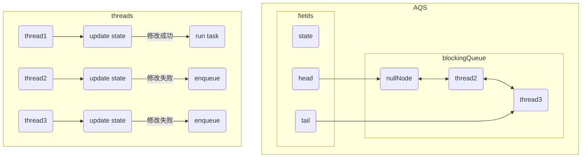

# JUC

## Thread API

### interrupt

> [详细代码](https://github.com/follow1123/java-basics/blob/main/src/main/java/cn/y/java/juc/thread_api/InterruptTest.java)

* `interrupt()` - 打断指定线程
* `isInterrupted()` - 判断指定线程是否被打断
* `static interrupted()` - 判断指定线程是否被打断，并清除打断标记
* 打断阻塞的线程

```java
Thread thread = new Thread(() -> {
    log.info("sleep");
    try {
        Thread.sleep(4000);
    } catch (InterruptedException e) {
        log.info("interrupt after exception: {}", Thread.currentThread().isInterrupted());
        e.printStackTrace();
    }
    log.info("done");
});
thread.start();

try{Thread.sleep(1000);}catch(InterruptedException e){e.printStackTrace();}
log.info("interrupt");
thread.interrupt();
log.info("isInterrupted: {}", thread.isInterrupted());
```

* 打断正在运行的线程

```java
Thread thread = new Thread(() -> {
    while (true) {
        log.info("running");
        if (Thread.currentThread().isInterrupted()){
            log.info("break");
            break;
        }
    }
});
thread.start();

try{Thread.sleep(1000);}catch(InterruptedException e){e.printStackTrace();}
log.info("interrupt");
thread.interrupt();
log.info("isInterrupted: {}", thread.isInterrupted());
```

* 打断使用park()方法阻塞的线程

```java
Thread thread = new Thread(() -> {
    log.info("step 1");
    LockSupport.park();
    // System.out.println(Thread.currentThread().isInterrupted());
    System.out.println(Thread.interrupted());
    log.info("step 2");

    /*
        只是线程不会阻塞，因为park方法判断如果打断标记为true时就不会执行
        上面可以使用Thread.interrupted()输出后清除打断标记
     */
    LockSupport.park();
    log.info("step 3");
});
thread.start();

try{Thread.sleep(1000);}catch(InterruptedException e){e.printStackTrace();}
log.info("interrupt");
thread.interrupt();
```


### 守护线程

> [详细代码](https://github.com/follow1123/java-basics/blob/main/src/main/java/cn/y/java/juc/thread_api/DaemonTest.java)

* 非守护线程

```java
Thread thread = new Thread(() -> {
    while (true) {
        try{Thread.sleep(100);}catch(InterruptedException e){e.printStackTrace();}
        log.info("execute");
    }
});

thread.start();
try{Thread.sleep(1000);}catch(InterruptedException e){e.printStackTrace();}
log.info("done");
```

* 守护线程

```java
Thread thread = new Thread(() -> {
    while (true) {
        try{Thread.sleep(100);}catch(InterruptedException e){e.printStackTrace();}
        log.info("execute");
    }
});

thread.setDaemon(true);
thread.start();

try{Thread.sleep(1000);}catch(InterruptedException e){e.printStackTrace();}
log.info("done");
```

---

## CAS

* 结合CAS和volatile可以实现无锁并发，适用于线程数少、多核CPU的场景下
* CAS是基于乐观锁的思想：最乐观的估计，不怕别的线程来修改共享变量，就算改了也没关系，我吃亏点再重试呗
* synchromzed是基于悲观锁的思想：最悲观的估计，得防着其它线程来修改共享变量，我上了锁你们都别想改，我改完了解开锁，你们才有机会
* CAS体现的是无锁并发、无阻塞并发
    * 因为没有使用synchronized, 所以线程不会陷入阻塞
    * 如果竟争激烈，可以想到重试必然频繁发生，反而效率会受影响


### 使用加锁的方式实现线程安全

> [详细代码](https://github.com/follow1123/java-basics/blob/main/src/main/java/cn/y/java/juc/cas/WithLockTest.java)

```java
@Slf4j(topic = "WithLockTest")
public class WithLockTest {

    private int num = 1000;

    public int getNum() {return num;}

    public void subNum() {
        // log.info("before: {}", num);
        synchronized (this) {num = num - 1;}
    }

    public static void main(String[] args) {
        for (int i = 0; i < 10; i++) test();
    }

    private static void test() {
        WithLockTest withLockTest = new WithLockTest();
        Thread[] threads = new Thread[1000];

        for (int i = 0; i < threads.length; i++) {
            threads[i] = new Thread(withLockTest::subNum);
        }
        long start = System.currentTimeMillis();
        for (Thread thread : threads) thread.start();
        for (Thread thread : threads) {
            try {thread.join();} catch (InterruptedException e) {throw new RuntimeException(e);}
        }
        log.info("result: {}, time: {}ms", withLockTest.getNum(), System.currentTimeMillis() - start);
    }
}
```

### 使用CAS方式实现线程安全

> [详细代码](https://github.com/follow1123/java-basics/blob/main/src/main/java/cn/y/java/juc/cas/WithoutLockTest.java)

```java
@Slf4j(topic = "WithoutLockTest")
public class WithoutLockTest {

    private final AtomicInteger num = new AtomicInteger(1000);

    public int getNum() {return num.get();}

    public void subNum() {
        while (true){
            int prev = num.get();
            int next = prev - 1;
            if (num.compareAndSet(prev, next)) {
                break;
            }
        }
    }

    public static void main(String[] args) {
        for (int i = 0; i < 10; i++) test();
    }

    private static void test() {
        WithoutLockTest withLockTest = new WithoutLockTest();
        Thread[] threads = new Thread[1000];

        for (int i = 0; i < threads.length; i++) {
            threads[i] = new Thread(withLockTest::subNum);
        }
        long start = System.currentTimeMillis();
        for (Thread thread : threads) thread.start();
        for (Thread thread : threads) {
            try {thread.join();} catch (InterruptedException e) {throw new RuntimeException(e);}
        }
        log.info("result: {}, time: {}ms", withLockTest.getNum(), System.currentTimeMillis() - start);
    }
}
```

### ABA问题

> [详细代码](https://github.com/follow1123/java-basics/blob/main/src/main/java/cn/y/java/juc/cas/aba/ABATest.java)


```java
public static void before(){
    AtomicReference<String> str = new AtomicReference<>("A");

    String prev = str.get();
    beforeMidOperate(str);
    try{Thread.sleep(1000);}catch(InterruptedException e){e.printStackTrace();}
    log.info("set to C - {}", str.compareAndSet(prev, "C"));
}

public static void beforeMidOperate(AtomicReference<String> str){
    Thread t1 = new Thread(() -> {
        log.info("set to B - {}", str.compareAndSet(str.get(), "B"));
    });

    Thread t2 = new Thread(() -> {
        log.info("set to A - {}", str.compareAndSet(str.get(), "A"));
    });

    t1.start();
    try{Thread.sleep(100);}catch(InterruptedException e){e.printStackTrace();}
    t2.start();
}
```

* 上面的操作在修改数据前不知道数据已经被修改过几次，但是数据最后被还原成了原来的数据，所以修改还是成功了
* 添加版本号解决ABA问题，使用`AtomicStampedReference`


```java
public static void after(){
    AtomicStampedReference<String> str = new AtomicStampedReference<>("A", 1);
    afterMidOperate(str);

    String prev = str.getReference();
    int stamp = str.getStamp();
    try{Thread.sleep(1000);}catch(InterruptedException e){e.printStackTrace();}
    log.info("set to C - {}", str.compareAndSet(prev, "C", stamp, stamp + 1));
    log.info("reference: {}, stamp: {}", str.getReference(), str.getStamp());
}

public static void afterMidOperate(AtomicStampedReference<String> str){
    Thread t1 = new Thread(() -> {
        String prev = str.getReference();
        int stamp = str.getStamp();
        log.info("set to B - {}", str.compareAndSet(prev, "B", stamp, stamp + 1));
        log.info("reference: {}, stamp: {}", str.getReference(), str.getStamp());
    });

    Thread t2 = new Thread(() -> {
        String prev = str.getReference();
        int stamp = str.getStamp();
        log.info("set to A - {}", str.compareAndSet(prev, "A", stamp, stamp + 1));
        log.info("reference: {}, stamp: {}", str.getReference(), str.getStamp());
    });

    t1.start();
    try{Thread.sleep(100);}catch(InterruptedException e){e.printStackTrace();}
    t2.start();
}
```

---

## AQS

* **AbstractQueuedSynchronizer**，是阻塞式锁和相关的同步器工具的框架
* 用`state`属性来表示资源的状态（分独占模式和共享模式），子类需要定义如何维护这个状态，控制如何获取锁和释放锁
    * `getState` - 获取state状态
    * `setState` - 设置state状态
    * `compareAndSetState` - 使用CAS机制设置state状态
    * 独占模式是只有一个线程能够访问资源，而共享模式可以允许多个线程访问资源
* 是供了基于FIFO的等待队列，类似于Monitor的EntryList
* 条件变量来实现等待、唤醒机制，支持多个条件变量，类似于Monitor的WaitSet
* 子类主要实现这样一些方法
    * `tryAcquire` - 尝试使用**独占模式**获取同步资源
    * `tryRelease` - 尝试释放**独占模式**下的同步资源
    * `tryAcquireShared` - 尝试使用**共享模式**获取同步资源
    * `tryReleaseShared` - 尝试释放**共享模式**下的同步资源
    * `isHeldExclusively` - 判断当前的同步资源是否处理**独占模式**



### 自定义锁

> [详细代码](https://github.com/follow1123/java-basics/blob/main/src/main/java/cn/y/java/juc/aqs/MLock.java)

* 实现一个不可重入的锁

```java
@Slf4j(topic = "MLock")
public class MLock implements Lock {

    private final MSync sync;

    public MLock() {this.sync = new MSync();}
    @Override
    public void lock() {sync.lock();}
    @Override
    public void lockInterruptibly() throws InterruptedException {sync.lockInterruptibly();}
    @Override
    public boolean tryLock() {return sync.tryLock();}
    @Override
    public boolean tryLock(long time, TimeUnit unit) throws InterruptedException {return sync.tryLock(time, unit);}
    @Override
    public void unlock() {sync.unlock();}
    @Override
    public Condition newCondition() {return sync.newCondition();}

    // 状态0为没加锁，状态1为加锁
    class MSync extends AbstractQueuedSynchronizer{
        /*
            由于状态只有两种，具体逻辑在tryAcquire和tryRelease方法内已经实现了
            所以传递参数时给一个固定值，这个值没意义，就是占个位置
         */
        private final int ignoreArg = 1;

        // 加锁，会阻塞
        void lock(){
            /*
                底层调用自己实现的tryAcquire方法
                无法加锁则直接进阻塞队列，并使用LockSupport.park阻塞
             */
            acquire(ignoreArg);
        }

        // 可打断的锁，会阻塞
        void lockInterruptibly() throws InterruptedException {
            // 底层调用acquire方法
            acquireInterruptibly(ignoreArg);
        }

        // 加锁，只试一次，不会阻塞
        boolean tryLock() {
            // 直角调用自己实现的方法
            return tryAcquire(ignoreArg);
        }

        // 加锁，阻塞指定时间
        boolean tryLock(long time, TimeUnit unit) throws InterruptedException {
            // 底层调用acquire方法
            return tryAcquireNanos(ignoreArg, unit.toNanos(time));
        }

        // 解锁
        void unlock() {
            /*
                底层调用自己实现的tryRelease方法
                解锁成功后会唤醒下一个线程
             */
            release(ignoreArg);
        }

        // 条件变量
        Condition newCondition() {
            return new ConditionObject();
        }

        // 主要重写的方法
        // 尝试加锁，试一次，不阻塞线程
        @Override
        protected boolean tryAcquire(int acquires) {
            if (getState() == 0 && compareAndSetState(0, 1)) {
                setExclusiveOwnerThread(Thread.currentThread());
                return true;
            }
            return false;
        }

        // 尝试解锁，试一次，不阻塞线程
        @Override
        protected boolean tryRelease(int arg) {
            if (getExclusiveOwnerThread() != Thread.currentThread())
                throw new IllegalMonitorStateException();
            setExclusiveOwnerThread(null);
            setState(0);
            return true;
        }

        // 判断当前是否处于独占模式
        @Override
        protected boolean isHeldExclusively() {
            return Thread.currentThread() == getExclusiveOwnerThread();
        }
    }
}
```

---

## JUC锁

### ReentrantLock

> [详细代码](https://github.com/follow1123/java-basics/blob/main/src/main/java/cn/y/java/juc/locks/ReentrantLockTest.java)

* 可中断
* 可以设置超时时间
* 可以设置为公平锁
* 支持多个条件变量
* 可重入
    * 可重入是指同一个线程如果首次获得了这把锁，那么因为它是这把锁的拥有者，因此有权利再次获取这把锁
    * 如果是不可重入锁，那么第二次获得锁时，自己也会被锁挡住

```java
// 获取锁
lock.lock();
try {
    // 代码
    System.out.println(Thread.currentThread());
}finally {
    // 释放锁
    lock.unlock();
}
```

#### 可重入

```java
private static void execute(int i) {
    // 获取锁
    lock.lock();
    try {
        if (i == 0) return;
        execute(i - 1);
        // 代码
        System.out.println(Thread.currentThread());
    } finally {
        // 释放锁
        lock.unlock();
    }
}

public static void testReentrant() {
    execute(5);
}
```

#### 可打断

```java
Thread thread = new Thread(() -> {
    log.info("enter");
    try {
        lock.lockInterruptibly();
        log.info("get lock");
    } catch (InterruptedException e) {
        log.info("interrupted");
        e.printStackTrace();
        return;
    }
    try {
        log.info("execute");
    } finally {
        log.info("release lock");
        lock.unlock();
    }
});

// 主线程先获取锁
log.info("get lock");
lock.lock();
thread.start();
try{Thread.sleep(1000);}catch(InterruptedException e){e.printStackTrace();}
log.info("interrupt");
thread.interrupt();
```

#### 可以设置超时时间

```java
Thread thread = new Thread(() -> {
    log.info("enter");
    try {
        // 立即获取结果
        // boolean succeed = lock.tryLock();
        // 等待1秒，并获取最终的结果
        boolean succeed = lock.tryLock(1, TimeUnit.SECONDS);
        if (!succeed) {
            System.out.println("get lock failed");
            return;
        }
        log.info("get lock");
    } catch (InterruptedException e) {
        e.printStackTrace();
    }
    try {
        log.info("execute");
    } finally {
        log.info("release lock");
        lock.unlock();
    }
});

// 主线程先获取锁
log.info("get lock");
lock.lock();
thread.start();
try{Thread.sleep(2000);}catch(InterruptedException e){e.printStackTrace();}
```

#### 可以设置为公平锁

```java
final ReentrantLock fairLock = new ReentrantLock(true);
for (int i = 0; i < 10; i++) {
    Thread thread = new Thread(() -> {
        log.info("enter");
        fairLock.lock();
        try {
            if ("thread 0".equals(Thread.currentThread().getName())) {
                try{Thread.sleep(1000);}catch(InterruptedException e){e.printStackTrace();}
            }
            log.info("execute");
        } finally {
            fairLock.unlock();
        }
    });

    thread.setName("thread " + i);
    thread.start();
    if (i == 0) {
        try{Thread.sleep(100);}catch(InterruptedException e){e.printStackTrace();}
    }
}
```

#### 支持多个条件变量

```java
Condition c1 = lock.newCondition();
Condition c2 = lock.newCondition();

for (int i = 0; i < 10; i++) {
    boolean flag = i % 2 == 0;
    Thread thread = new Thread(() -> {
        lock.lock();
        log.info("enter");
        try {
            if (flag) {
                try {c1.await();} catch (InterruptedException e) {throw new RuntimeException(e);}
            } else {
                try {c2.await();} catch (InterruptedException e) {throw new RuntimeException(e);}
            }
            log.info("done");
        } finally {
            lock.unlock();
        }
    });
    thread.setName(String.format("thread %d %s", i, flag ? "c1" : "c2"));
    thread.start();
}

// 两秒后唤醒第一批线程
try{Thread.sleep(2000);}catch(InterruptedException e){e.printStackTrace();}
log.info("notify c2");
lock.lock();
c2.signalAll();
lock.unlock();

// 4秒后唤醒第二批线程
try{Thread.sleep(2000);}catch(InterruptedException e){e.printStackTrace();}
log.info("notify c1");
lock.lock();
c1.signalAll();
lock.unlock();
```

### ReentrantReadWriteLock

* 读写锁
* 当读操作远远高于写操作时，这时候使用卖写锁让**读-读**可以并发，提高性能
* 读锁不支持条件变量，读锁的`newCondition`未实现，使用会抛出异常
* 重入时升级不支持：即持有读锁的情况下去获取写锁，会导致获取写锁永久等待
* 重入时降级支持：即持有写锁的情况下去获取读锁

```java
int count = 10;
for (int i = 0; i < count; i++) {
    boolean flag = i % 2 == 0;
    new Thread(() -> {
        if (flag){
            lock.readLock().lock();
            try {
                log.info("num: {}", num);
            }finally {
                lock.readLock().unlock();
            }
        }else {
            lock.writeLock().lock();
            try {
                num = num - 1;
                log.info("update num");
            }finally {
                lock.writeLock().unlock();
            }
        }
    }).start();
}
try{Thread.sleep(1000);}catch(InterruptedException e){e.printStackTrace();}
log.info("num: {}", num);
```

* 测试锁升级，无法升级

```java
new Thread(() -> {
    lock.readLock().lock();
    try {
        log.info("num: {}", num);
        lock.writeLock().lock();
    }finally {
        lock.readLock().unlock();
    }
    try {
        log.info("get write lock");
    }finally {
        lock.writeLock().unlock();
    }
}).start();
```

* 测试锁降级，可以降级

```java
new Thread(() -> {
    lock.writeLock().lock();
    try {
        num = num - 1;
        log.info("update num");
        lock.readLock().lock();
    }finally {
        lock.writeLock().unlock();
    }
    try {
        log.info("get readlock");
    }finally {
        lock.readLock().unlock();
    }
}).start();
```

### StampedLock

* 该类自JDK8加入，是为了进一步优化读性能，它的特点是在使用读锁、写锁时都必须配合**戳**使用
* 加解读锁

```java
long stamp = lock.readLock();
lock.unlockRead(stamp);
```

* 加解写锁

```java
long stamp = lock.writeLock();
lock.unlockWrite(stamp);
```

* 乐观读，StampedLock支持`tryOptimisticRead()`方法（乐观读）读取完毕后需要做一次戳校验如果校验通过，表示这期间确实没有写操作，数据可以安全使用，如果校验没通过，需要重新获取读锁，保证数据安全。

```java
long stamp = lock.tryOptimisticRead();
// 验戳
if(lock.validate(stamp)){
    // 成功，读取数据
}
// 失败，升级为读锁
```

* 使用

```java
private static final StampedLock lock = new StampedLock();

private static int num = 50;

public static void main(String[] args) {
    int count = 100;
    for (int i = 0; i < count; i++) {
        boolean flag = i % 2 == 0;
        new Thread(() -> {
            if (flag){
                try{Thread.sleep(10);}catch(InterruptedException e){e.printStackTrace();}
                long stamp = lock.writeLock();
                log.info("write stamp: {}", stamp);
                try {
                    // try{Thread.sleep(300);}catch(InterruptedException e){e.printStackTrace();}
                    num = num - 1;
                    log.info("update num");
                }finally {
                    lock.unlockWrite(stamp);
                }
            }else {
                long stamp = lock.tryOptimisticRead();
                log.info("optimistic read stamp: {}", stamp);
                if (lock.validate(stamp)){
                    // try{Thread.sleep(100);}catch(InterruptedException e){e.printStackTrace();}
                    log.info("first time num: {}", num);
                    return;
                }
                log.info("update to read lock");
                stamp = lock.readLock();
                try{
                    // try{Thread.sleep(100);}catch(InterruptedException e){e.printStackTrace();}
                    log.info("num: {}", num);
                }finally {
                    lock.unlockRead(stamp);
                }
            }
        }).start();
    }

    try{Thread.sleep(4000);}catch(InterruptedException e){e.printStackTrace();}
    log.info("num: {}", num);
}
```

## 原子类

* 原子类底层使用CAS这种操作保证线程安全
* 原子类会保证内部每个方法的原子性，也就是说原子类的每**单个方法**都是线程安全的

### 原子整型

> [详细代码](https://github.com/follow1123/java-basics/blob/main/src/main/java/cn/y/java/juc/atomic/AtomicIntegerTest.java)

* 原子整型包含**AtomicInteger** **AtomicLong** **AtomicBoolean**
* 常用方法，其中AtomicInteger和AtomicLong的方法类似，AtomicBoolean没有增加、减少相关方法，其他差不多
    * `get()` - 获取当前值
    * `set(long newValue)` - 设置新值
    * `getAndSet(long newValue)` - 获取当前值并设置为新值
    * `compareAndSet(long expect, long update)` - 如果当前值等于 expect，则将当前值设置为 update，返回 true；否则，返回 false
    * `compareAndExchange(long expectedValue, long newValue)` - 类似于 compareAndSet，但是此方法的返回值是交换前的旧值
    * `getAndIncrement()` - 获取当前值，并将其递增 1
    * `incrementAndGet()` - 将当前值递增 1，并返回更新后的值
    * `getAndDecrement()` - 获取当前值，并将其递减 1
    * `decrementAndGet()` - 将当前值递减 1，并返回更新后的值
    * `addAndGet(long delta)` - 将当前值增加 delta，并返回更新后的值
    * `getAndAdd(long delta)` - 获取当前值，并将其增加 delta
    * `getAndUpdate(LongUnaryOperator updateFunction)` - 获取当前值，并使用提供的函数更新值
    * `updateAndGet(LongUnaryOperator updateFunction)` - 使用提供的函数更新值，并返回更新后的值

```java
AtomicInteger i = new AtomicInteger();
System.out.println(i.get()); // 0
i.set(2);
System.out.println(i.getAndSet(4)); // 2
int prev = i.get();
int next = prev - 1;
System.out.println(i.compareAndSet(prev, next)); // true
prev = i.get();
next = prev + 1;
System.out.println(i.compareAndExchange(prev, next)); // 3
System.out.println(i.getAndIncrement()); // 4
System.out.println(i.incrementAndGet()); // 6
System.out.println(i.getAndDecrement()); // 6
System.out.println(i.decrementAndGet()); // 4
System.out.println(i.addAndGet(6)); // 10
System.out.println(i.getAndAdd(-6)); // 10
System.out.println(i.getAndUpdate(v -> v * 10)); // 4
System.out.println(i.updateAndGet(v -> v * 10)); // 400
```

### 原子引用

#### AtomicReference

> [详细代码](https://github.com/follow1123/java-basics/blob/main/src/main/java/cn/y/java/juc/atomic/reference/AtomicReferenceTest.java)

* AtomicReference的使用和[原子整型](#原子整型)类似
* 常用方法
    * `get()` - 获取当前值
    * `set(V newValue)` - 设置新值
    * `getAndSet(V newValue)` - 获取当前值并设置为新值
    * `getAndUpdate(UnaryOperator<V> updateFunction)` - 获取当前值，并使用提供的函数更新值
    * `updateAndGet(UnaryOperator<V> updateFunction)` - 使用提供的函数更新值，并返回更新后的值
    * `compareAndSet(V expect, V update)` - 如果当前值等于 expect，则将当前值设置为 update，返回 true；否则，返回 false
    * `compareAndExchange(V expectedValue, V newValue)` - 类似于 compareAndSet，但是此方法的返回值是交换前的旧值

```java
final AtomicReference<BigInteger> bi = new AtomicReference<>(BigInteger.valueOf(1000));
int count = bi.get().intValue();
Thread[] threads = new Thread[count];
for (int i = 0; i <count; i++) {
    threads[i] = new Thread(() -> {
        bi.getAndUpdate(v -> v.subtract(BigInteger.ONE));
    });
}

for (Thread thread : threads) thread.start();
for (Thread thread : threads) {
    try {thread.join();} catch (InterruptedException e) {throw new RuntimeException(e);}
}

System.out.println(bi.get());
```

#### AtomicStampedReference

* 可以用于解决[ABA问题](#aba问题)
* 常用方法
    * `getReference()` - 获取当前值
    * `getStamp()` - 获取当前戳
    * `get(int[] stampHolder)` - 获取当值和戳，参数传递一个数组，调用后第一个元素就是当前戳
    * `compareAndSet(V expectedReference, V newReference, int expectedStamp, int newStamp)` - 如果expectedReference等于当前数据，expectedStamp等于当前戳，则修过成功，返回true，否则，返回false
    * `attemptStamp(V expectedReference, int newStamp)` - 值修改戳不修改值

```java
AtomicStampedReference<String> str = new AtomicStampedReference<String>("a", 1);
System.out.println(str.getReference()); // a
System.out.println(str.getStamp()); // 1
int[] stamp = new int[1];
String val = str.get(stamp);
System.out.println(val); // a
System.out.println(stamp[0]); // 1
// 只修改戳，不修改值
System.out.println(str.attemptStamp(str.getReference(), str.getStamp() + 1)); // true
str.set("b", 3);
System.out.println(str.compareAndSet("b", "c", 3, 5)); // true
```

#### AtomicMarkableReference

* 和[AtomicStampedReference](#atomicstampedreference)类似，只不过是戳变成了boolean值
* 实现生产者消费者模型

```java
@Slf4j(topic = "AtomicMarkableReferenceTest")
public class AtomicMarkableReferenceTest {

    private static final AtomicMarkableReference<Integer> products = new AtomicMarkableReference<>(0, false);
    private static final Integer MAX_PRODUCT = 3;

    public static void main(String[] args) {
        Thread[] threads = new Thread[MAX_PRODUCT * 2];
        for (int i = 0; i < threads.length; i++) {
            threads[i] = new Thread(i % 2 == 0 ? AtomicMarkableReferenceTest::consume : AtomicMarkableReferenceTest::produce);
        }
        for (Thread thread : threads) thread.start();
    }

    public static void consume(){
        Integer count;
        int c;
        boolean marker;
        while (true){
            // try{Thread.sleep(1000);}catch(InterruptedException e){e.printStackTrace();}
            count = products.getReference();
            marker = count > 0;
            c = count - (marker ? 1 : 0);
            if(products.compareAndSet(count, c, true, marker)){
                if (count != c){
                    log.info("consume product: {}", products.getReference());
                }
            }
        }
    }

    public static void produce(){
        Integer count;
        int c;
        boolean marker;
        while (true){
            // try{Thread.sleep(500);}catch(InterruptedException e){e.printStackTrace();}
            count = products.getReference();
            marker = count < MAX_PRODUCT;
            c = count + (marker ? 1 : 0);
            if(products.compareAndSet(count, c, false, marker)){
                if (count != c){
                    log.info("produce product: {}", products.getReference());
                }
            }
        }
    }
}
```

### 原子数组

> [详细代码](https://github.com/follow1123/java-basics/blob/main/src/main/java/cn/y/java/juc/atomic/AtomicArrayTest.java)

* 原子数组包含**AtomicIntegerArray** **AtomicLongArray** **AtomicReferenceArray**
* 常用方法和**AtomicInteger**类似，方法的第一个参数是下标
* 测试普通数组多线程累加

```java
int len = 10;
int max = 10000;
int[] ints = new int[len];
Thread[] threads = new Thread[len];
for (int i = 0; i < threads.length; i++) {
    threads[i] = new Thread(() -> {
        for (int j = 0; j < max; j++) {
            ints[j % len]++;
        }
    });
}
for (Thread thread : threads) thread.start();
for (Thread thread : threads) {
    try {thread.join();} catch (InterruptedException e) {throw new RuntimeException(e);}
}
System.out.println(Arrays.toString(ints));
```

* 测试原子数组多线程累加

```java
int len = 10;
int max = 10000;
AtomicIntegerArray ints = new AtomicIntegerArray(len);
Thread[] threads = new Thread[len];
for (int i = 0; i < threads.length; i++) {
    threads[i] = new Thread(() -> {
        for (int j = 0; j < max; j++) {
            ints.incrementAndGet(j % len);
        }
    });
}
for (Thread thread : threads) thread.start();
for (Thread thread : threads) {
    try {thread.join();} catch (InterruptedException e) {throw new RuntimeException(e);}
}
System.out.println(ints);
```

### 字段更新器

> [详细代码](https://github.com/follow1123/java-basics/blob/main/src/main/java/cn/y/java/juc/atomic/AtomicFieldUpdaterTest.java)

* 字段更新器包含**AtomicIntegerFieldUpdater** **AtomicLongFieldUpdater** **AtomicReferenceFieldUpdater**

```java
public static void main(String[] args) {
    A zs = new A("zs", 18);
    // int属性
    AtomicIntegerFieldUpdater<A> age = AtomicIntegerFieldUpdater.newUpdater(A.class, "age");
    System.out.println(age.get(zs)); // 18
    System.out.println(age.incrementAndGet(zs)); // 19

    // 引用属性
    AtomicReferenceFieldUpdater<A, String> name = AtomicReferenceFieldUpdater.newUpdater(A.class, String.class, "name");
    System.out.println(name.get(zs)); // zs
    System.out.println(name.updateAndGet(zs, n -> "ls")); // ls
}

private static class A{
    private volatile String name;
    private volatile int age;

    public A(String name, int age) {this.name = name;this.age = age;}
}
```

### 原子累加器

> [详细代码](https://github.com/follow1123/java-basics/blob/main/src/main/java/cn/y/java/juc/atomic/LongAdderTest.java)

* 原子累加器包含**LongAdder** **DoubleAdder**
* LongAdder多线程累加

```java
LongAdder longAdder = new LongAdder();
int len = 10;
Thread[] threads = new Thread[len];
for (int i = 0; i < threads.length; i++) {
    threads[i] = new Thread(() -> {
        for (int j = 0; j < len * 10; j++) longAdder.increment();
    });
}

for (Thread thread : threads) thread.start();
for (Thread thread : threads) {
    try {thread.join();} catch (InterruptedException e) {throw new RuntimeException(e);}
}
System.out.println(longAdder.intValue());
```

* DoubleAdder多线程累加

```java
DoubleAdder doubleAdder = new DoubleAdder();
int len = 10;
Thread[] threads = new Thread[len];
for (int i = 0; i < threads.length; i++) {
    threads[i] = new Thread(() -> {
        for (int j = 0; j < len * 10; j++) doubleAdder.add(1.1);
    });
}
for (Thread thread : threads) thread.start();
for (Thread thread : threads) {
    try {thread.join();} catch (InterruptedException e) {throw new RuntimeException(e);}
}
System.out.println(doubleAdder.doubleValue());
```

---

## 并发工具类

### Semaphore

* 信号量，用来限制能同时访问共享资源的线程上限
    * 类似理发店，同时只有固定的位置的人数可以理发
* 使用Semaphore限流，在访问高峰期时，让请求线程阻塞，高峰期过去再释放许可，当然它只适合限制单机线程数量，并且仅是限制线程数，而不是限制资源数（例如连接数，请对比Tomcat LimitLatch的实现）
```java
Semaphore semaphore = new Semaphore(5);
for (int i = 0; i < 50; i++) {
    int idx = i;
    new Thread(() -> {
        try {
            semaphore.acquire();
            log.info("acquire resource {}", idx);
            try{Thread.sleep(1000);}catch(InterruptedException e){e.printStackTrace();}
        } catch (InterruptedException e) {
            throw new RuntimeException(e);
        }finally {
            semaphore.release();
        }
    }).start();
}
```

### CountDownLatch

* 用来进行线程同步协作，等待所有线程完成倒计时
* 其中构造参数用来初始化等待计数值，`awalt()`用来等待计数归零，`countDown()`用来让计数减一

```java
int count = 10;
CountDownLatch countDownLatch = new CountDownLatch(count);
Random random = new Random();
for (int i = 0; i < count; i++) {
    new Thread(() -> {
        try{Thread.sleep(random.nextInt(0, 10) * 100);}catch(InterruptedException e){e.printStackTrace();}
        log.info("execute");
        countDownLatch.countDown();
    }).start();
}
try {countDownLatch.await();} catch (InterruptedException e) {throw new RuntimeException(e);}
log.info("other thing");
```

* 所有提交的任务完成后关闭线程池

```java
ExecutorService pool = Executors.newFixedThreadPool(3);
int count = 10;
CountDownLatch countDownLatch = new CountDownLatch(count);
for (int i = 0; i < count; i++) {
    pool.submit(() -> {
        log.info("run task");
        countDownLatch.countDown();
        log.info("task done");
    });
}

// 等待所有任务执行完成后关闭线程池
try {countDownLatch.await();} catch (InterruptedException e) {throw new RuntimeException(e);}
pool.shutdown();
```

### CyclicBarrier

* 循环栅栏，用来进行线程协作，等待线程满足某个计数。构造时设置**计数个数**，每个线程执行到某个需要**同步**的时刻调用`await()`方法进行等待，当等待的线程数满足了**计数个数**时，继续执行
* 如果需要严格限制同一批线程一起执行，需要将栅栏的参数和线程池的个数设置成一样，如果线程池的个数大于栅栏的参数时，由于每个任务执行耗时可能不一样，多出来的线程可能挤占上一批的线程运行

```java
int count = 5;
CyclicBarrier cyclicBarrier = new CyclicBarrier(count, () -> log.info("发车"));
ExecutorService pool = Executors.newFixedThreadPool(count);

int person = 20;
for (int i = 0; i < person; i++) {
    int personNo = i;
    pool.submit(() -> {
        log.info("person {} 上车", personNo);
        try {cyclicBarrier.await();} catch (InterruptedException | BrokenBarrierException e) {throw new RuntimeException(e);}
        log.info("person {} 睡觉", personNo);
    });
}
```

### CompletableFuture

* 并发编程工具，用于组合异步任务

> [详细代码](https://github.com/follow1123/java-basics/blob/main/src/main/java/cn/y/java/juc/concurrent_utils/CompletableFutureTest.java)

* 创建方式

```java
ExecutorService pool = Executors.newFixedThreadPool(5);
CompletableFuture.runAsync(() -> log.info("runnable task 1"));
CompletableFuture.runAsync(() -> log.info("runnable task 2 use custom pool"), pool);
CompletableFuture.supplyAsync(() -> {
    log.info("supplier task 3");
    return 1;
});
CompletableFuture.supplyAsync(() -> {
    log.info("supplier task 4 use custom pool");
    return 1;
}, pool);
try {
    Thread.sleep(1000);
} catch (InterruptedException e) {
    e.printStackTrace();
}
```

* 基础使用

```java
ExecutorService pool = Executors.newFixedThreadPool(5);
// 提交任务
CompletableFuture.supplyAsync(() -> {
            log.info("step 1");
            try {Thread.sleep(1000);} catch (InterruptedException e) {e.printStackTrace();}
            return "100";
        }, pool)
        // 处理上一步任务的结果
        .thenApply(v -> {
            log.info("step 2");
            return Integer.parseInt(v);
        })
        // 处理上一步任务的结果
        .thenApply(v -> {
            log.info("step 3");
            // return v / 0;
            return v / 10;
        })
        // 处理上面所有步骤的异常
        .exceptionally(e -> {
            log.error("error", e);
            return 1;
        })
        // 接收结果并使用
        .thenAccept(v -> log.info("step 4 get value: {}", v));
```

* 获取结果

```java
CompletableFuture<Integer> cf = CompletableFuture.supplyAsync(() -> {
    log.info("run task");
    try{Thread.sleep(1000);}catch(InterruptedException e){e.printStackTrace();}
    return 1;
});
Integer v = null;
// 阻塞获取结果，和Future一样
// try {v = cf.get();} catch (InterruptedException | ExecutionException e) {throw new RuntimeException(e);}

// 指定时间阻塞获取结果，超时就抛出异常，和Future一样
// try {v = cf.get(500, TimeUnit.MICROSECONDS);} catch (InterruptedException | TimeoutException | ExecutionException e) {throw new RuntimeException(e);}

// 等待获取结果，阻塞
// v = cf.join();

// 立即获取值，没有就返回默认值
// v = cf.getNow(0);

// log.info("result: {}", v);

try{Thread.sleep(1000);}catch(InterruptedException e){e.printStackTrace();}
/*
    直接打断运行的任务给一个指定的返回值
    这个方法的返回值为true说明打断成功，使用时会获取指定的值
    如果返回false，说明任务已经完成，使用时会获取任务返回的值
 */
boolean complete = cf.complete(0);
v = cf.join();
log.info("is complete early: {}, value: {}", complete, v);
```

* 处理结果

```java
String result = CompletableFuture.supplyAsync(() -> {
            log.info("run task");
            int i = 1/0;
            return 1;
        })
        // 将结果转换为字符串，无法处理异常
        // .thenApply(v -> {
        //     log.info("apply result: {}", v);
        //     return v + "";
        // })
        // 可以处理异常
        .handle((v, e) -> {
            if (e != null) return "error str";
            return v + "";
        })
        .join();
log.info("get result: {}", result);
```

* 消费结果

```java
CompletableFuture.supplyAsync(() -> {
            log.info("run task");
            return 1;
        })
        // 将结果转换为字符串
        .thenApply(v -> {
            log.info("apply result: {}", v);
            return v + "";
        })
        // 消费结果
        // .thenAccept(v -> log.info("accept result: {}", v));
        // 消费结果并处理异常
        .whenComplete((v, e) -> {
            if (e != null){
                log.error("error", e);
            }else {
                log.info("accept result: {}", v);
            }
        });
try{Thread.sleep(1000);}catch(InterruptedException e){e.printStackTrace();}
```

* 忽略结果

```java
System.out.println(CompletableFuture.supplyAsync(() -> {
            int person = 20;
            for (int i = 0; i < person; i++) {
                log.info("上车{}人", i + 1);
            }
            return person;
        })
        // 消费结果
        .thenRun(() -> log.info("发车")).join());
```

* 使用两个任务中执行最快的一个

```java
CompletableFuture.supplyAsync(() -> {
            log.info("run task 1");
            try{Thread.sleep(100);}catch(InterruptedException e){e.printStackTrace();}
            return 1;
        }).applyToEither(CompletableFuture.supplyAsync(() -> {
            log.info("run task 2");
            try{Thread.sleep(11);}catch(InterruptedException e){e.printStackTrace();}
            return 2;
        }), v -> v)
        .thenAccept(v -> log.info("get result: {}", v));
try{Thread.sleep(1000);}catch(InterruptedException e){e.printStackTrace();}
```

* 组合两个任务的结果

```java
CompletableFuture.supplyAsync(() -> {
            log.info("run task 1");
            try {Thread.sleep(100);} catch (InterruptedException e) {e.printStackTrace();}
            return 1;
        }).thenCombine(CompletableFuture.supplyAsync(() -> {
            log.info("run task 2");
            try {Thread.sleep(100);} catch (InterruptedException e) {e.printStackTrace();}
            return 2;
        }), (result1, result2) -> result1 + "-" + result2)
        .thenAccept(v -> log.info("get result: {}", v));
try{Thread.sleep(1000);}catch(InterruptedException e){e.printStackTrace();}
```

* 串联两个任务

```java
CompletableFuture.supplyAsync(() -> {
            log.info("run task 1");
            return 1;
        }).thenCompose(r -> CompletableFuture.supplyAsync(() -> r + 1))
        .thenAccept(v -> log.info("get result: {}", v));
try{Thread.sleep(1000);}catch(InterruptedException e){e.printStackTrace();}
```

* 等待所有任务运行完成

```java
CompletableFuture.allOf(
        CompletableFuture.runAsync(() -> log.info("task 1")),
        CompletableFuture.runAsync(() -> log.info("task 2")),
        CompletableFuture.runAsync(() -> log.info("task 3")),
        CompletableFuture.runAsync(() -> log.info("task 4"))
).thenRun(() -> log.info("done"));
try{Thread.sleep(1000);}catch(InterruptedException e){e.printStackTrace();}
```

* 等待任意一个任务运行完成

```java
CompletableFuture.anyOf(
        CompletableFuture.runAsync(() -> {
            try{Thread.sleep(10);}catch(InterruptedException e){e.printStackTrace();}
            log.info("task 1");
        }),
        CompletableFuture.runAsync(() -> {
            try{Thread.sleep(100);}catch(InterruptedException e){e.printStackTrace();}
            log.info("task 2");
        }),
        CompletableFuture.runAsync(() -> {
            try{Thread.sleep(1000);}catch(InterruptedException e){e.printStackTrace();}
            log.info("task 3");
        }),
        CompletableFuture.runAsync(() -> log.info("task 4"))
).thenRun(() -> log.info("done"));
try{Thread.sleep(1000);}catch(InterruptedException e){e.printStackTrace();}
```

#### 使用指定线程池规则

* 使用以`Async`结尾的方法，如果不指定线程池，后面执行不带`Async`操作的任务都会使用默认的ForkJoinPool
* 使用以`Async`结尾的方法，指定自己的线程池，后面执行不带`Async`操作的任务都会使用指定的线程池
* 如果提交的任务执行过快，后面的操作可能直接让主线程运行

```java
ExecutorService pool = Executors.newFixedThreadPool(5);
// 启动时指定了线程池，当前任务包括后续不带Async的方法都会使用指定的线程池
CompletableFuture.supplyAsync(() -> {
            log.info("task 1");
            return 1;
        }, pool)
        // 如果提交的任务执行过快，后面的操作可能直接让主线程运行
        .thenRun(() -> {
            log.info("task 2");
        })
        /*
            使用带Async的方法没指定线程池的情况下
            当前任务及后续使用不带Async的方法都在默认的ForkJoinPool内运行
         */
        .thenRunAsync(() -> {
            log.info("task 3");
        }).thenRun(() -> {
            log.info("task 4");
        });
```

### LockSupport

> [详细代码](https://github.com/follow1123/java-basics/blob/main/src/main/java/cn/y/java/juc/concurrent_utils/LockSupportTest.java)

* 和Object的`wait()/notify()`、Condition的`await()/signal()`类似，都是用来挂起和唤醒线程，用于线程协作
* LockSupport不需要在同步代码块中使用
* LockSupport不需要遵循先等待后唤醒的步骤
    * LockSupport的唤醒操作是给指定的线程颁发一个**凭证**，在挂起时判断有没有凭证，如果有就不用挂起，所以没有顺序
    * **凭证**只有一个，无法多次唤醒挂起多次的线程
* 使用 

```java
Thread thread = new Thread(() -> {
    log.info("enter");
    LockSupport.park();
    log.info("wake");
});

thread.start();

new Thread(() -> {
    log.info("start");
    try{Thread.sleep(1000);}catch(InterruptedException e){e.printStackTrace();}
    LockSupport.unpark(thread);
    log.info("done");
}).start();
```

* 测试先唤醒后挂起

```java
Thread thread = new Thread(() -> {
    try{Thread.sleep(1000);}catch(InterruptedException e){e.printStackTrace();}
    log.info("enter");
    LockSupport.park();
    // 发放的凭证只能使用一次
    // LockSupport.park();
    log.info("wake");
});

thread.start();

new Thread(() -> {
    log.info("start");
    LockSupport.unpark(thread);
    // 凭证只有一个，无法多次发放
    // LockSupport.unpark(thread);
    log.info("done");
}).start();
```

* 实现交替打印数字

```java
private static int num = 0;
private static void testPrint() {
    Thread[] threads = new Thread[2];
    threads[0] = new Thread(() -> {
        while (true){
            if (num % 2 == 0){
                try{Thread.sleep(500);}catch(InterruptedException e){e.printStackTrace();}
                log.info("num: {}", num++);
                LockSupport.unpark(threads[1]);
            }else {
                LockSupport.park();
            }
        }
    });

    threads[1] = new Thread(() -> {
        while (true){
            if (num % 2 != 0){
                try{Thread.sleep(500);}catch(InterruptedException e){e.printStackTrace();}
                log.info("num: {}", num++);
                LockSupport.unpark(threads[0]);
            }else {
                LockSupport.park();
            }
        }
    });
    threads[0].start();
    threads[1].start();
}
```


---

## 线程池

### 自定义线程池

> [详细代码](https://github.com/follow1123/java-basics/blob/main/src/main/java/cn/y/java/juc/thread_pool/custom_thread_pool)

### ThreadPoolExecutor

> [详细代码](https://github.com/follow1123/java-basics/blob/main/src/main/java/cn/y/java/juc/thread_pool/ThreadPoolExecutorTest.java)

#### 线程池状态

* **ThreadPoolExecutor**使用`int`的高3位来表示线程池状态，低29位表示线程数量
* 使用一个`int`来表示这两种状态的原因：是可以用一次CAS操作修改这两个状态

| 状态    | 高3位    | 接收新任务    | 处理阻塞队列任务    | 说明    |
|---------------- | --------------- | --------------- | --------------- | --------------- |
| `RUNNING`    | 111    | Y    | N    |    |
| `SHUTDOWN`   | 000   | N   | Y   | 不会接收新任务，但会处理阻塞队列剩余任务   |
| `STOP`   | 001   | N   | N   | 会中断正在执行的任务，并抛弃阻塞队列任务   |
| `TIDYING`   | 010   | -   | -   | 任务全执行完成，活动线程为0，即将进入终结   |
| `TERMINATED` | 011 | - | - | 终结 |

#### 构造方法

* `corePoolSize` - 核心线程数目（最多保留的线程数）
* `maximumPoolSize` - 最大线程数目
* `keepAliveTime` - 生存时间-针对救急线程
* `unit` - 时间单位-针对救急线程
* `workQueue` - 阻塞队列
* `threadFactory` - 线程工厂-可以为线程创建时起个好名字
* `handler` - 拒绝策略

#### 核心线程

* 使用`corePoolSize`参数定义最大数量
* 核心线程默认会一直存在
* 可以使用`allowCoreThreadTimeOut(true)`方法将核心线程设置为可超时，超时时间默认和救急线程的超时时间一样

#### 救急线程

* **最大线程数(maximumPoolSize)减核心线程数(corePoolSize)** 就是救急线程的数量
* 救急线程不会一直存在，任务执行完成后，等待`keepAliveTime`和`unit`定义的时间后停止
* 救急线程只有在[阻塞队列](#阻塞队列)满了之后才会开始创建并运行，如果**阻塞队列**是无界队列，那救急线程永远不会运行

#### 阻塞队列

* 用于在核心线程忙不过来的时候保存提交的任务

| 实现 | 说明 |
| --- | --- |
| ArrayBlockingQueue | 如果你有固定数量的任务且需要限制队列的容量，可以使用这个**有界队列** |
| LinkedBlockingQueue | 当任务量不确定或可能变得非常大，如果不需要限制队列大小，可以当**无界队列**队列使用 |
| SynchronousQueue | 如果你希望每个提交的任务都被立即处理，可以使用 SynchronousQueue |
| DelayQueue | 适用于任务的执行有延迟要求的场景，比如定时任务或者某些任务的延迟执行 |

#### 拒绝策略

* 当核心线程正在运行，**有界**阻塞队列也已经满了，并且救急线程也正在运行的时候，再提交新的任务就会执行拒绝策略

| 实现 | 说明 |
| --- | --- |
| AbortPolicy | 直接抛出异常 |
| CallerRunsPolicy | 在调用者的线程执行这个任务 |
| DiscardPolicy | 丢弃这个任务 |
| DiscardOldestPolicy | 丢弃最早提交的任务 |

#### 线程工厂

* 一般用来给线程起名，实现`ThreadFactory`接口进行自定义

#### 使用

##### 救急线程的执行时机

* 当核心线程正在运行，并且**有界**任务队列已满时，救急线程才会执行


```java
ThreadPoolExecutor pool = new ThreadPoolExecutor(2, 3, 5,
        TimeUnit.SECONDS, new ArrayBlockingQueue<>(2));
for (int i = 0; i < 5; i++) {
    long[] valRef = new long[]{i, 1000};
    if (i == 0 || i == 1){
        valRef[1] = 1000000;
    }
    pool.submit(() -> {
        log.info("start {} task", valRef[0]);
        try{Thread.sleep(valRef[1]);}catch(InterruptedException e){e.printStackTrace();}
        log.info("end {} task", valRef[0]);
    });
}

try{Thread.sleep(5000);}catch(InterruptedException e){e.printStackTrace();}
log.info("core size: {}, largest size: {}", pool.getCorePoolSize(), pool.getLargestPoolSize());
log.info("all task: {}, complete task: {}", pool.getTaskCount(), pool.getCompletedTaskCount());
```

##### newFixedThreadPool

* 创建：`ExecutorService pool = Executors.newFixedThreadPool(5);`
* 没有救急线程，阻塞队列是无界的，可以放任意数量的任务
* 用于执行任务量已知，相对耗时的任务

##### newCachedThreadPool

* 创建：`ExecutorService pool = Executors.newCachedThreadPool();`
* 核心线程数是0，最大线程数是`Integer.MAX_VALUE`，救急线程的空闲生存时间是60s
    * 全部都是救急线程（ 60S 后可以回收）
    * 救急线程可以无限创建
* 队列采用了`SynchronousQueue`实现特点是，它没有容量，没有线程来取是放不进去的（一手交钱、一手交货）
* 适合任务数比较密集，但每个任务执行时间较短的情况
* 测试SynchronousQueue

```java
SynchronousQueue<Integer> queue = new SynchronousQueue<>();
new Thread(() -> {
    log.info("putting 1");
    try {queue.put(1);} catch (InterruptedException e) {throw new RuntimeException(e);}
    log.info("1 putted");

    log.info("putting 2");
    try {queue.put(2);} catch (InterruptedException e) {throw new RuntimeException(e);}
    log.info("2 putted");
}).start();

// 一秒后取1时才能添加1
try{Thread.sleep(1000);}catch(InterruptedException e){e.printStackTrace();}
new Thread(() -> {
    log.info("take 1");
    try {queue.take();} catch (InterruptedException e) {throw new RuntimeException(e);}
}).start();

// 再一秒后取2时才能添加2
try{Thread.sleep(1000);}catch(InterruptedException e){e.printStackTrace();}
new Thread(() -> {
    log.info("take 2");
    try {queue.take();} catch (InterruptedException e) {throw new RuntimeException(e);}
}).start();
```

* 测试使用缓存线程池

```java
ThreadPoolExecutor pool = (ThreadPoolExecutor) Executors.newCachedThreadPool();
for (int i = 0; i < 10; i++) {
    int num = i;
    pool.submit(() -> {
        log.info("start {}", num);
        try{Thread.sleep(10000000);}catch(InterruptedException e){e.printStackTrace();}
    });
}
try{Thread.sleep(1000);}catch(InterruptedException e){e.printStackTrace();}
log.info("core size: {}, largest size: {}", pool.getCorePoolSize(), pool.getLargestPoolSize());
log.info("all task: {}, complete task: {}", pool.getTaskCount(), pool.getCompletedTaskCount());
```

##### newSingleThreadExecutor

* 创建：`ExecutorService pool = Executors.newSingleThreadExecutor();`
* 希望多个任务排队执行。线程数固定为1，任务数多于1时，会放入无界队列排队。任务执行完毕，这唯一的线程也不会被释放
* 某一个任务执行抛出异常也不会影响后续的任务
* 无法通过获取具体实现类修改线程池大小，创建的是`FinalizableDelegatedExecutorService`，无法定义，而且没有修改线程池大小的方法

```java
ExecutorService pool = Executors.newSingleThreadExecutor();
for (int i = 0; i < 5; i++) {
    int num = i;
    pool.submit(() -> {
        log.info("execute {}", num);
        // 出现异常后也会执行后续的任务
        if (num == 2) throw new RuntimeException("err");
        try{Thread.sleep(1000);}catch(InterruptedException e){e.printStackTrace();}
    });
}
```

##### 提交任务相关方法

* 提交单个任务

```java
ExecutorService pool = Executors.newFixedThreadPool(3);
pool.execute(() -> log.info("execute runnable task"));
pool.submit(() -> log.info("submit runnable task"));
Future<Integer> t1 = pool.submit(() -> {
    log.info("submit callable task");
    return 1;
});
try {System.out.println(t1.get());} catch (InterruptedException | ExecutionException e) {throw new RuntimeException(e);}
// 指定一个返回值，用于确认线程是否完成
Future<String> t2 = pool.submit(() -> {
    int i = 1/0;
    log.info("submit runnable task with result");
}, "done");
try {System.out.println(t2.get());} catch (InterruptedException | ExecutionException e) {throw new RuntimeException(e);}
```

* 提交全部任务，并获取所有任务的返回值

```java
ExecutorService pool = Executors.newFixedThreadPool(3);
ArrayList<Callable<String>> tasks = new ArrayList<>();
for (int i = 0; i < 5; i++) {
    int num = i;
    tasks.add(() -> num + "");
}
try {
    List<Future<String>> futures = pool.invokeAll(tasks);
    for (Future<String> future : futures) {
        log.info(future.get());
    }
} catch (InterruptedException | ExecutionException e) {
    throw new RuntimeException(e);
}
```

* 提交全部任务，并获取最快执行完成的任务的返回值
    * 其他任务，如果正在执行的就打断，没执行的就放弃

```java
ThreadPoolExecutor pool = (ThreadPoolExecutor) Executors.newFixedThreadPool(3);
ArrayList<Callable<String>> tasks = new ArrayList<>();
Random random = new Random();
for (int i = 0; i < 5; i++) {
    int mills = random.nextInt(0, 10) * 100;
    int num = i;
    tasks.add(() -> {
        try{Thread.sleep(mills);}catch(InterruptedException e){e.printStackTrace();}
        return num + "";
    });
}
/*
    只会获取最快执行完成的一个任务的结果
    其他任务，如果正在执行的就打断，没执行的就放弃
 */
try {log.info(pool.invokeAny(tasks));} catch (Exception e) {throw new RuntimeException(e);}
log.info("core size: {}, largest size: {}", pool.getCorePoolSize(), pool.getLargestPoolSize());
log.info("all task: {}, complete task: {}", pool.getTaskCount(), pool.getCompletedTaskCount());
```

##### 关闭线程

* `shutdown()`

```java
// ThreadPoolExecutor pool = (ThreadPoolExecutor) Executors.newFixedThreadPool(3);
ThreadPoolExecutor pool = new ThreadPoolExecutor(3, 3, 3, TimeUnit.SECONDS,
        new LinkedBlockingQueue<>(), new ThreadPoolExecutor.CallerRunsPolicy());

for (int i = 0; i < 5; i++) {
    int num = i;
    pool.submit(() -> {
        log.info("execute {}", num);
        try{Thread.sleep(2000);}catch(InterruptedException e){e.printStackTrace();}
    });
}
log.info("before shutdown");
// 不会阻塞当前线程，所有已经提交的任务都会执行完成
pool.shutdown();
log.info("other");

// 线程关闭后再提交任务就会执行默认或指定的拒绝策略
pool.submit(() -> log.info("execute after shutdown"));
```

* `shutdownNow()`

```java
ThreadPoolExecutor pool = (ThreadPoolExecutor) Executors.newFixedThreadPool(3);
// ThreadPoolExecutor pool = new ThreadPoolExecutor(3, 3, 3, TimeUnit.SECONDS,
//         new LinkedBlockingQueue<>(), new ThreadPoolExecutor.CallerRunsPolicy());

for (int i = 0; i < 5; i++) {
    int num = i;
    pool.submit(() -> {
        log.info("execute {}", num);
        try{Thread.sleep(2000);}catch(InterruptedException e){e.printStackTrace();}
    });
}
log.info("before shutdown");
/*
 不会阻塞当前线程
 正在运行的任务直接打断
 阻塞队列中的任务不会执行，会返回
 */
List<Runnable> tasks = pool.shutdownNow();
log.info("runnable tasks myself");
tasks.forEach(Runnable::run);

// 线程关闭后再提交任务，就会执行默认或指定的拒绝策略
pool.submit(() -> log.info("execute after shutdown"));
```

* `isShutdown()` - 不在RUNNING状态的线程池，此方法就返回true
* `isTerminated()` - 线程池状态是否是TERMINATED
* `awaitTermination(long timeout, TimeUnit unit)` - 调用shutdown后，由于调用线程并不会等待所有任务运行结束，因此如果它想在线程池TERMINATED后做些事情，可以利用此方法等待

### 线程池异常处理

* 使用`execute()`方法执行的任务，出现异常后，如果不在任务内处理就会导致执行的线程崩溃，会直接打印异常信息
* 使用`submit()`方法执行的任务，出现异常后，如果没有使用`future.get()`方法获取，则不会打印任何异常信息
    * 使用`future.get()`方法时，会抛出任务内的异常，可以在此时处理异常

```java
ThreadPoolExecutor pool = (ThreadPoolExecutor) Executors.newFixedThreadPool(3);
log.info("submit task start");
Future<Integer> t1 = pool.submit(() -> {
    log.info("run task1");
    return 1 / 0;
});
log.info("submit task end");

try {
    // 使用Future.get方法时，如果任务执行时出现了异常，在get时会抛出
    Integer result = t1.get();

    log.info("result: {}", result);
} catch (InterruptedException | ExecutionException e) {
    log.error("handle task exception: ", e);
}
```

### 线程池创建多少线程合适

* 过小会导致程序不能充分地利用系统资源、容易导致饥饿
* 过大会导致更多的线程上下文切换，占用更多内存

#### CPU密集型运算

* 通常采用**CPU核数+1**能够实现最优的CPU利用率， +1是保证当线程由于页缺失故障（操作系统）或其它原因导致暂停时，额外的这个线程就能顶上去，保证CPU时钟周期不被浪费

#### I/O密集型运算

* CPU不总是处于繁忙状态，例如，当你执行业务计算时，这时候会使用CPU资源，但当你执行操作时、远程RPC调用时，包括进行数据库操作时，这时候就闲下来了，你可以利用多线程提高它的利用率
* 公式：`线程数 = 核数 * 期望CPU利用率 * 总时间(CPU计算时间 + 等待时间) / CPU计算时间`
* 例如4核计算时间是50％，其它等待时间是50％，期望CPU被100％利用，套用公式：`4 * 100% * 100% / 50％ = 8`
* 例如4核计算时间是10％，其它等待时间是90％，期望CPU被100％利用，套用公式：`4 * 100% * 100% / 10％ = 40`
* CPU计算时间越短，线程数应该越多

### 任务调度线程池

#### Timer

* 旧版任务调度实现
* 所有任务使用同一个线程执行，一个任务执行耗时操作会影响到另一个线程

```java
Timer timer = new Timer();
TimerTask t1 = new TimerTask() {
    @Override
    public void run() {
        // int i = 1/0;
        // 由于任务使用同一个线程执行，一个任务执行耗时会影响后面的任务执行时机
        try{Thread.sleep(2000);}catch(InterruptedException e){e.printStackTrace();}
        log.info("execute t1");
    }
};
TimerTask t2 = new TimerTask() {
    @Override
    public void run() {
        log.info("execute t2");
    }
};

timer.schedule(t1, 1000);
timer.schedule(t2, 1000);
```

#### ScheduledThreadPool

* 创建：`ScheduledExecutorService pool = Executors.newScheduledThreadPool(3)`
* 每秒执行一次任务

```java
ScheduledExecutorService pool = Executors.newScheduledThreadPool(3);
// 两秒后每隔1秒执行一次这个任务
pool.scheduleAtFixedRate(() -> log.info("execute"), 2, 1, TimeUnit.SECONDS);
```

* 每天晚上23点执行任务

```java
ScheduledExecutorService pool = Executors.newScheduledThreadPool(3);

// 默认间隔时间，24小时
long delay = 24 * 60 * 60;
LocalTime localTime = LocalTime.now();
LocalTime scheduleTime = LocalTime.of(23, 0, 0);
Duration between = Duration.between(localTime, scheduleTime);
/*
    计算出当前时间距离晚上11点还剩多少秒
    果是负数，说明已经超过了晚上11点了，直接减去多余的秒数
 */
long seconds = between.toSeconds();
long initDelay = seconds >= 0 ? seconds : delay + seconds;
LocalDate localDate = LocalDate.now();
LocalDateTime localDateTime = localDate.atTime(localTime.plusSeconds(initDelay));
log.info("execute time: {}", localDateTime);
log.info("next execute time: {}", localDateTime.plusSeconds(delay));
pool.scheduleWithFixedDelay(() -> log.info("execute"), initDelay, delay, TimeUnit.SECONDS);
```

### Fork/Join

* Fork/Join是JDK1.7加入的新的线程池实现，它体现的是一种分治思想，适用于能够进行任务拆分的cpu密集型运算
* 任务拆分就是将一个大任务拆分为算法去上相同的小任务，直至不能拆分可以直接求解。跟递归相关的一些计算，如归并排序、斐波那契数列、都可以用分治思想进行求解
* Fork/Join在分治的基础上加入了多线程，可以把每个任务的分解和合并交给不同的线程来完成，进一步提升了运算效率
* Fork/Join默认会创建与cpu核心数大小相同的线程池

```java
public static void main(String[] args) {
    ForkJoinPool pool = new ForkJoinPool();
    log.info("result: {}", pool.invoke(new Add(10)));
}

@Slf4j(topic = "Add")
public static class Add extends RecursiveTask<Integer>{

    private final int num;
    public Add(int num) {this.num = num;}

    @Override
    protected Integer compute() {
        if (num == 1){
            log.info("end");
            return 1;
        }
        log.info("fork: {}", num);
        // 分解任务
        Add add = new Add(num - 1);
        add.fork();

        // 等待分解的任务执行完成
        Integer result = add.join();
        log.info("join: {}, result: {}", result, result + num);
        return result + num;
    }
}
```

---

## 并发数据结构

* 线程安全集合类，里面包含三类关键词：`Blocking`、`CopyOnWrite`、`Concurrent`
    * `Blocking` - 大部分实现基于锁，并提供用来阻塞的方法
    * `CopyOnWrite` - 修改开销相对较重
    * `Concurrent`
        * 内部很多操作使用CAS优化，一般可以提供较高吞吐量
        * 弱一致性
            * 遍历时弱一致性，例如，当利用迭代器遍历时，如果容器发生修改，迭代器仍然可以继续进行遍历，这时内容是旧的
            * 求大小弱一致性，`size()`操作未必是100％准确
            * 读取弱一致性
        * 遍历时如果发生了修改，对于非安全容器来讲，使用`fail-fast`机制也就是让遍历立刻失败，抛出ConcurrentModificationException，不再继续遍历

### ConcurrentHashMap

* 统计多个文件内的字母个数

> [详细代码](https://github.com/follow1123/java-basics/blob/main/src/main/java/cn/y/java/juc/data_structure/ConcurrentHashMapTest.java)

* 使用HashMap统计，无法正确统计

```java
ExecutorService pool = Executors.newFixedThreadPool(5);
HashMap<Character, Integer> map = new HashMap<>();
CountDownLatch countDownLatch = new CountDownLatch(FILE_COUNT);
for (int i = 0; i < FILE_COUNT; i++) {
    int fileSuffix = i;
    pool.submit(() -> {
        try (FileInputStream fis = new FileInputStream(new File(FILE_DIR, FILE_PREFIX + fileSuffix))) {
            int data;
            while ((data = fis.read()) != -1){
                // synchronized (map){
                    char letter = (char) data;
                    map.compute(letter, (k, v) -> v == null ? 1 : v + 1);
                // }
            }
        } catch (IOException e) {
            throw new RuntimeException(e);
        }finally {
            countDownLatch.countDown();
        }
    });
}
try {countDownLatch.await();} catch (InterruptedException e) {throw new RuntimeException(e);}
pool.shutdown();
System.out.println(map);
```

* 使用`ConcurrentHashMap`统计

```java
ExecutorService pool = Executors.newFixedThreadPool(5);
ConcurrentHashMap<Character, Integer> map = new ConcurrentHashMap<>();
// ConcurrentHashMap<Character, LongAdder> map = new ConcurrentHashMap<>();
CountDownLatch countDownLatch = new CountDownLatch(FILE_COUNT);
for (int i = 0; i < FILE_COUNT; i++) {
    int fileSuffix = i;
    pool.submit(() -> {
        try (FileInputStream fis = new FileInputStream(new File(FILE_DIR, FILE_PREFIX + fileSuffix))) {
            int data;
            while ((data = fis.read()) != -1){
                char letter = (char) data;
                map.compute(letter, (k, v) -> v == null ? 1 : v + 1);
                // 使用LongAdder累加器方式
                // LongAdder longAdder = map.computeIfAbsent(letter, k -> new LongAdder());
                // longAdder.increment();
            }
        } catch (IOException e) {
            throw new RuntimeException(e);
        }finally {
            countDownLatch.countDown();
        }
    });
}
try {countDownLatch.await();} catch (InterruptedException e) {throw new RuntimeException(e);}
pool.shutdown();
System.out.println(map);
```

### LinkedBlockingQueue

* 阻塞队列，采用锁机制实现阻塞
* 常用方法
    * `take()` - 获取并**删除**队列头的元素，如果没有则会阻塞
    * `put(E e)` - 向队列尾部添加元素，如果队列已满则会阻塞
    * `poll()` - 获取并**删除**队列头的元素，不会阻塞，可以指定等待时间参数
    * `offer(E e)` - 向队列尾部添加元素，不会阻塞，可以指定等待时间参数
    * `peek()` - 获取队列头的元素，不会阻塞，不会删除元素
* 测试阻塞方法

```java
ExecutorService pool = Executors.newFixedThreadPool(10);
LinkedBlockingQueue<Integer> queue = new LinkedBlockingQueue<>(1);

pool.submit(() -> {
    try {
        log.info("start take");
        Integer val = queue.take();
        log.info("take value: {}", val);
    } catch (InterruptedException e) {
        throw new RuntimeException(e);
    }
});
try{Thread.sleep(1000);}catch(InterruptedException e){e.printStackTrace();}
pool.submit(() -> {
    try {
        log.info("start put");
        queue.put(1);
        log.info("put value: {}", 1);
    } catch (InterruptedException e) {
        throw new RuntimeException(e);
    }
});
```

* 测试非阻塞方法

```java
ExecutorService pool = Executors.newFixedThreadPool(10);
LinkedBlockingQueue<Integer> queue = new LinkedBlockingQueue<>(1);

pool.submit(() -> {
    log.info("start take");
    Integer val = queue.poll();
    // 也可以指定等待的时间
    // queue.poll(1, TimeUnit.SECONDS)
    log.info("take value: {}", val);
});
try{Thread.sleep(1000);}catch(InterruptedException e){e.printStackTrace();}
pool.submit(() -> {
    log.info("start put");
    queue.offer(1);
    // 也可以指定等待的时间
    // queue.offer(1, 1, TimeUnit.SECONDS);
    log.info("put value: {}", 1);
});
```

### ConcurrentLinkedQueue

* 非阻塞队列，没有容量限制，使用CAS实现线程安全
* 常用方法
    * `poll()` - 获取并**删除**队列头的元素
    * `offer(E e)` - 向队列尾部添加元素
    * `peek()` - 获取队列头的元素，不会删除元素
    * `add(E E)` - 底层调用的`offer(E e)`方法
    * 其他方法和集合类似

### CopyOnWriteArrayList

* 底层实现采用了**写入时拷贝**的思想，增删改操作会将底层数组拷贝一份，更改操作在新数组上执行，这时不影响其它线程的并发读，**读写分离**
* 获取和迭代器弱一致性，获取的数据可能不是最新的
* CopyOnWriteArraySet基于CopyOnWriteArrayList实现
* 常用方法就和List类似

---

## 命令行工具

* `jps` - 查看所有java进程信息
* `jps -l` - 显示main方法
* `jps -v` - 显示详细信息
* `jstack <pid>` - 查看指定java进程的所有线程信息
* `jconsole` - 图形化界面，查看jvm信息

---

## 设计模式

### 两阶段终止模式

> [详细代码](https://github.com/follow1123/java-basics/blob/main/src/main/java/cn/y/java/juc/design_pattern/TwoPhaseTerminationTest.java)


```java
Thread thread = new Thread(() -> {
    while (true) {
        Thread cur = Thread.currentThread();
        if (cur.isInterrupted()) {
            // 清理工作
            log.info("clean up");
            break;
        }
        try {
            // 睡眠后执行任务
            Thread.sleep(500);
            log.info("execute");
        } catch (InterruptedException e) {
            log.info("re interrupt");
            // 重新设置打断标记
            cur.interrupt();
            e.printStackTrace();
        }
    }
});
thread.start();

try{Thread.sleep(2200);}catch(InterruptedException e){e.printStackTrace();}
log.info("interrupt");
// 执行打断，停止另一个线程
thread.interrupt();
```

---

## synchronized

> 保证被包裹的代码块的原子性

* 底层实现（大致）：
  * JDK早期直接就是重量级锁（向操作系统申请锁）
  * 后来改进为锁升级的过程
    * 偏向锁：当一段加锁了的代码第一次被一个线程访问时，会在这个锁上标记这个线程的id号，下次如果还是这个线程访问就直接通行，没有进行其他操作，提高了效率。
    * 自旋锁：接着上面的过程，如果有多个线程访问时，当一个线程持有这个锁未释放时，其他线程就会在外面执行自选操作，类似while循环。
    * 重量级锁：当自旋次数达到10此后就会向操作系统申请重量级锁。
  * 理解：偏向锁和自旋锁都是用户态的操作效率会提高，重量级锁是用户态内核态频繁切换，降低了效率，但是自旋锁也有缺点，就是如果当自旋的线程多了起来也会降低效率，因为自旋操作时这个线程没有被挂起，当自旋的线程多了之后就会有一大堆线程在执行自旋操作，而操作算是一种无意义的操作，所以当一段加锁的代码执行时间很长而且会有很多个线程访问时不建议使用自旋锁
* 在synchronized代码块内出异常默认锁会被释放
* synchronized不能锁字符串常量和基础的数值包装类型
  * 字符串常量在字符串常量池内始终是一个对象
  * 数组包装类型由于内部结构跟改一下就会变成不同的对象

### 共享模型

#### 共享问题

* **临界区**
  一段代码块内会对一个资源进行读写操作，会有多个线程执行这段代码块，这段代码块就叫临界区
* **竞态条件**
  多个线程在临界区内执行，由于代码的执行序列不同而导致结果无法预测，称之为发生了竞态条件

### synchronized锁升级原理


* 无锁到偏向锁
  * 对象的markword倒数第三位为1的话则可以使用偏向锁，否则竞争时直接升级为轻量级锁。
  * 无锁到偏向锁的过程：
    * 一个线程需要加锁时会将线程的id写入锁对象的markword头上面，

### 线程安全分析

### Monitor

使用synchronized(obj) 锁定一个对象时将这个对象和操作系统提供的monitor对象关联，


一个monitor对象包含这几个属性，

* entitySet
  * 当一个线程获取对象锁时如果owner已经指向一个线程则进入这个队列等待
* Owner
  * 当一个对象获取该对象锁时，如果owner没有指向任何线程，则owner指向这个线程，代表这个对象锁被该线程拥有

当对象锁和monitor关联后，这个对象的markword位置则会存放指向monitor的指针，而markword里面的相关属性会被存放到monitor对象内

## volatile

> 保证被修饰的对象不被指令重排

* 保证线程的可见性
  * jvm虚拟机分为heap、stack等空间，heap空间是共享的而开启线程就是创建一个stack，这两个线程在不同的stack里面访问heap里面的同一个数据时都需要copy一份数据到自己stack空间里面的数据存储区域内，再在自己的区域内对这个数据进行修改，修改完才写回到heap空间，而另一个线程也需要获取这个数据，而不知道这个数据被没被修改，所以需要保证线程的可见性这里需要使用到cpu的缓存一直循协议。
* 禁止指令重排
  * 编译器会将程序编译完的指令进行重写排序以提高效率。
  * 我自己的理解：在一段代码内上半部分的代码执行耗时上，下半部分的代码执行耗时端，而这两部分代码执行时也没有太多关联，编译器就会将下半部分的代码编译完的指令安排到上半部分代码前面执行。
  * 在单例模式的双重检测锁实现方式下也需要使用volatile关键字修饰实例对象
    * 因为jvm在创建对象时会分为三步：申请空间、初始化成员变量、赋值到实例，在这几个部分内：
      * 如果第一个线程在锁内初始化这个对象，初始化时发生了指令重排，把第二和第三个步骤换了一下，那么第二个线程就会拿到一个默认值全部为空的对象。

## 参考

* [黑马](https://www.bilibili.com/video/BV16J411h7Rd/?spm_id_from=333.788.videopod.episodes&vd_source=c8dac761c9fcb8220ee9059d06ac692e)
* [尚硅谷](https://www.bilibili.com/video/BV1ar4y1x727/) 
