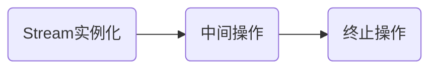

# Java各版本新特性

## Java 8

### Lambda表达式

* 基础使用

> [详细代码](https://github.com/follow1123/java-version-features/blob/main/java8/src/main/java/cn/y/java/lambda/LambdaTest.java)

```java
// 原生方式
Runnable runnable = new Runnable() {
    @Override
    public void run() {
        System.out.println("run");
    }
};
runnable.run();

// 使用lambda
Runnable r = () -> System.out.println("run");
r.run();
```

* 无参数方式

```java
Runnable runnable = () -> {
    System.out.println("run");
};

// 只有一行语句时可以省略大括号
Runnable runnable1 = () -> System.out.println("run");
```

* 一个参数方式

```java
Consumer<String> consumer = (s) -> System.out.println(s);

// 只有一个参数时可以省略括号
Consumer<String> consumer1 = s -> System.out.println(s);
```

#### 函数式接口

> [详细代码](https://github.com/follow1123/java-version-features/blob/main/java8/src/main/java/cn/y/java/lambda/FunctionInterfaceTest.java)

* 接口内只有一个抽象方法
* java在`java.util.function`包下提供部分函数式接口

| 函数式接口    | 称谓    | 参数类型    | 用途    |
|---------------- | --------------- | --------------- | --------------- |
| `Consumer<T>`    | 消费型    | T    | 对T进行操作，使用`void accept(T t)`方法    |
| `Supplier<T>`    | 供给型    | 无    | 返回T对象，使用`T get()`方法    |
| `Function<T, R>`    | 函数型    | T    | 对T进行操作，返回R，使用`R apply(T t)`方法    |
| `Predicate<T>`    | 判断型    | T    | 对T进行判断，返回true或false，使用`boolean test(T t)`方法    |

* 消费型

```java
Consumer<String> consumer = s -> System.out.println(s);
consumer.accept("123412");
```

* 供给型

```java
Supplier<Integer> supplier = () -> 1;
System.out.println(supplier.get());
```

* 函数型

```java
Function<String, Integer> function = s -> Integer.parseInt(s);
System.out.println(function.apply("100"));
```

* 判断型

```java
Predicate<Integer> predicate = i -> i > 100;
System.out.println(predicate.test(30));
```

### 方法引用

* 方法引用是基于Lambda表达式的，是对Lambda表达式的进一步简化
* 如果一个对象的方法或静态方法与某个函数式接口的抽象方法的参数和返回值相同，则可以使用`对象::方法`或`类::静态方法`替换

#### 使用

> [详细代码](https://github.com/follow1123/java-version-features/blob/main/java8/src/main/java/cn/y/java/reference/MethodRefTest.java)

* 实例方法引用

```java
Consumer<String> consumer = s -> System.out.println(s);
System.out.println(consumer);

// 使用PrintStream的实例方法println代替
Consumer<String> consumer1 = System.out::println;
System.out.println(consumer1);
```

* 静态方法引用

```java
Comparator<Integer> comparator = (o1, o2) -> Integer.compare(o1, o2);
System.out.println(comparator.compare(1, 2));

// 使用Integer的静态方法compare代替
Comparator<Integer> comparator1 = Integer::compare;
System.out.println(comparator1.compare(3, 4));
```

* 类::实例方法

```java
Comparator<String> comparator = (s1, s2) -> s1.compareTo(s2);
System.out.println(comparator.compare("aaa", "bbb"));

/*
    在方法参数不同，返回值相同的话
    如果具体逻辑是第一个参数调用方法并传递第二个参数
    那么就可以使用第一个参数的'类::实例方法'代替
 */
Comparator<String> comparator1 = String::compareTo;
System.out.println(comparator1);
```

#### 构造器引用

> [详细代码](https://github.com/follow1123/java-version-features/blob/main/java8/src/main/java/cn/y/java/reference/ConstructorRefTest.java)

```java
// 无参数构造器
Supplier<String> supplier = String::new;
// 相当于调用new String()
String s = supplier.get();

// 有参数构造器
Function<Long, Date> function = Date::new;
// 相当于调用new Date(1000L)
Date date = function.apply(1000L);
```

* 数组引用

```java
Function<Integer, String[]> function = String[]::new;

// 相当于调用new String[10]
String[] strArr = function.apply(10);
System.out.println(strArr.length);
```

### Stream API

* **Stream API**主要是对多个数据的计算（排序、查找、过滤、映射、遍历等）
* Stream自己不会存储元素
* Stream不会改变源对象，会返回一个持有结果的新Stream
* stream一旦执行了终止操作，就不能再调用其它中间操作或终止操作了

#### Stream执行流程



#### 实例化

> [详细代码](https://github.com/follow1123/java-version-features/blob/main/java8/src/main/java/cn/y/java/stream/InitTest.java)

* 通过集合初始化

```java
ArrayList<String> list = new ArrayList<>();
// 顺序流
Stream<String> stream = list.stream();

// 并行流
Stream<String> stringStream = list.parallelStream();
```

* 通过数组初始化

```java
Integer[] integers = {23, 324, 1234, 234};
Stream<Integer> stream = Arrays.stream(integers);
```

* 通过自己的静态方法初始化

```java
Stream<Integer> integerStream = Stream.of(324, 324, 8790, 4543);
```

#### 中间操作

> [详细代码](https://github.com/follow1123/java-version-features/blob/main/java8/src/main/java/cn/y/java/stream/OperateTest.java)

##### 筛选和切片

```java
List<User> users = User.listUser();

// 过滤，查询用户年龄小于20岁的用户
users.stream().filter(user -> user.getAge() < 20).forEach(System.out::println);

// 截断，只显示前2个元素
users.stream().limit(2).forEach(System.out::println);

// 跳过，跳过前4条数据
users.stream().skip(4).forEach(System.out::println);

// 去重，需要对象重写equals()和hashCode()方法
users.stream().distinct().forEach(System.out::println);
```

##### 映射

```java
List<String> list = Arrays.asList("a", "b", "c", "d");

// 小写转大写
list.stream().map(String::toUpperCase).forEach(System.out::println);

List<User> users = User.listUser();

// 过滤，查询用户年龄小于20岁的用户，只显示名称
users.stream().filter(user -> user.getAge() < 20).map(User::getName).forEach(System.out::println);
// 只显示用户的id
users.stream().mapToInt(User::getAge).forEach(System.out::println);

Role admin = new Role("001", "admin");
Role test = new Role("002", "test");
Role dba = new Role("003", "dba");
Role userRole = new Role("004", "user");
users.get(0).setRoles(Arrays.asList(admin, test, dba, userRole));
users.get(3).setRoles(Arrays.asList(test, dba));
users.get(5).setRoles(Arrays.asList(userRole));

/*
    获取用户的角色，并判断角色是否为空
    将角色列表转换为流后去重
    只获取角色名
 */
users.stream().filter(u -> u.getRoles() != null)
        .flatMap(u -> u.getRoles().stream())
        .distinct().map(Role::getName).forEach(System.out::println);
```

##### 排序

## Java 9

### 模块机制

* 在项目目录下新建module-info.java文件

```java
module com.demo{
  requires java.se;
}
```

* `requires` 依赖模块
    
    * `requires transitive 模块名` 将依赖模块依赖的模块传递到当前模块，不用重复依赖

* `exports` 导出模块
    
    * `exports 包名 to 模块名` 到处模块到指定的模块

* 开放反射权限，标记`open`关键字

```java
// 开放整个模块的反射权限
open module com.demo{
  requires java.se;
}

// 开放部分包的反射权限
open module com.demo{
    opens 包名;
}

```

* 定义接口给其他模块实现

```java
// 模块a内有一个Test接口
module module.a{
    uses com.Test
}

// 模块b内实现了Test接口

module module.a{
    requires module.a;
    provides com.Test whit com.TestImpl;
}

```

### 接口内可以定义private方法

> 定义接口的的公共方法

### 集合类的工厂方法

> 快速创建集合，这种方法创建的集合都是只读的

```java
// Map
Map.of("key1", "value1", "key2", "value2")

// List
List.of("value1", "value2");

// Set
Set.of("value1", "value2");
```
### Stream增强

```java
// 创建Stream空指针判断方法
Stream.ofNullable(null);

// iterate创建Stream时添加limit条件，添加截断操作
Stream.iterate(0, i -> i < 10, i -> i = i + 1)
  .takeWhile(i -> i < 6) // i < 6 时截断
  .forEach(System.out::println);

// 丢弃

Stream.iterate(0, i -> i < 10, i -> i = i + 1)
  .dropWhile(i -> i < 6) // i < 6 时丢弃
  .forEach(System.out::println);
```

### 其他

* try-with-resource语法优化

```java
// try-with-resource语法不需要在括号内申明完整的语句
FileInputStream fileInputStream = new FileInputStream(new File("/path/to/aaa"));
try(fileInputStream){
    fileInputStream.read();
}
```

* Optional添加部分方法

```java
// 如果数据为空则提供另一个Optional
Optional.ofNullable(null)
  .or(() -> Optional.of(1));

// ifPresent添加为空分支
Optional.ofNullable(null)
  .ifPresentOrElse(v -> {
    System.out.println("value is: " + v);
  }, () -> {
    System.out.println("value is null");
  });
```

## Java 10 

* 添加`var`关键字用于类型推断，只适用与局部变量

## Java 11

* var 关键字可以用于lambda参数内

```java
// var 关键字可以用于lambda参数内
Consumer<String> consumer = (var s) -> {
    System.out.println(s);
};
consumer.accept("123");
```

* String增强

```java
// 非空判断
String s = "";
String s1 = " ";

System.out.println(s.isEmpty()); // true
System.out.println(s.isBlank()); // true

System.out.println(s1.isEmpty()); // false
System.out.println(s1.isBlank()); // true

// 字符串重复

String s2 = "a";
System.out.println(s2.repeat(3)); // aaa


// 获取字符串内的每行组成一个Stream
String s3 = "a\nb\nc";
s3.lines().forEach(System.out::println);

// 去除字符串首位空格

String s4 = " a b c d ";
System.out.println(s4.strip().length()); // 7
System.out.println(s4.stripLeading().length()); // 8
System.out.println(s4.stripTrailing().length()); // 8
```

* HttpClient 全新Http客户端

## Java 12-16

* switch表达式

```java
int i = 0;
String a = switch (i){
  case 1, 2 -> "case 1";
  case 3, 4 -> "case 2";
  default -> {
    System.out.println("123");
    yield "case default";
  }
};
```

* 文本快

```java
String s = """
12321
123123ad
qweqwe
""";
System.out.println(s);
```

* instanceof增强

```java
Object s = "123";

if (s instanceof String str){
System.out.println(str);
}
```

* 空指针报错优化，异常信息更准确

* Record类，替换Lombok(jave16)

## Java 17

### 密封类型

* 使用final关键字表示A类无法被其他类继承

```java
public final class A {

}
```

* 使用sealed关键字修饰并使用permits指定某些类，表示只允许指定的某些类继承

* 想要继承使用sealed修饰的类当前类必须使用`final` `sealed` `no-sealed`修饰
    * `final` 无法被其他类继承
    * `sealed` 当前类也变成密封类
    * `no-sealed` 当前类恢复为默认类，可以被其他任何类继承
    

```java
public sealed class A permits B {

}

public [final/sealed/no-sealed] class B extends A {

}
```

## Java 18

* 默认使用UTF-8编码

* `jwebserver`命令简单web服务器

* `@snippet` 文档内的代码预览，使用`javadoc`命令生成文档

```java
public class Text {
    /**
     * {@snippet
     * int c = a + b;
     * }
     */
    public int add(int a, int b) {
        int c = a + b;
        return c;
    }
}
```

## Java 19

### 虚拟线程

* 使用线程池方式

```java
public void ThreadTest() {
    ExecutorService executor = Executors.newCachedThreadPool();
    try(executor){
        IntStream.range(1, 10000).forEach(i -> executor.submit(() -> {
            try {
                Thread.sleep(1000);
                System.out.println("execute: " + i );
            } catch (InterruptedException e) {
                throw new RuntimeException(e);
            }

        }));
    }catch (Exception e){
        e.printStackTrace();
    }
}
```

* 使用虚拟线程方式，只需要将`newCachedThreadPool`修改为`newVirtualThreadPerTaskExecutor`，速度就会明显提升

* 需要同步代码块时尽量使用`ReentrantLock`替代`synchronized`

* 虚拟线程时守护线程，无法修改为未守护线程

* 虚拟线程默认优先级是5，无法修改

* 虚拟线程不支持`stop()`, `suspend()`, `resume()`方法

### 创建虚拟线程的方式

* 方式1

```java
Runnable task = () -> {
    System.out.println("run task");
};
Thread.startVirtualThread(task);
try {
    Thread.sleep(100);
} catch (InterruptedException e) {
    throw new RuntimeException(e);
}
```
* 方式2

```java
Runnable task = () -> {
    System.out.println("run task");
};
// Thread virtualThread = Thread.ofVirtual().name("virtualThreadName").start(task);
Thread virtualThread = Thread.ofVirtual().name("virtualThreadName").unstarted(task);
virtualThread.start();
try {
    Thread.sleep(100);
} catch (InterruptedException e) {
    throw new RuntimeException(e);
}
```
* 方式3 就是使用创建线程池

* 使用`Thread`对象内的`isVirtual()`方法判断是否为虚拟线程

## Java 21

* 虚拟线程成为正式版

* 字符串模板（预览）

```java
String zs = "zs";
String str = STR."my name is \{zs}";
System.out.println(str);
```

### scoped values 隐藏的方法参数（预览）

    * 一般用于代替ThreadLocal


```java
public class ScopedValuesTest {

    public static void main(String[] args) {
         new ScopedValuesTest().set();
    }
    
    private ScopedValue<String> value = ScopedValue.newInstance();

    public void set(){
        ScopedValue.where(value, "111").run(() -> get());
    }

    public void get(){
        System.out.println(value.get());
    }
}
```
* 多线程方式

```java
public class ScopedValuesMultithreadTest {

    public static void main(String[] args) {
        ExecutorService pool = Executors.newCachedThreadPool();
        ScopedValuesMultithreadTest test = new ScopedValuesMultithreadTest();
        for (int i = 0; i < 10; i++) {
            pool.submit(() -> test.set());
        }
        pool.shutdown();

    }

    private ScopedValue<String> value = ScopedValue.newInstance();

    public void set(){
        ScopedValue.where(value, Thread.currentThread().getName()).run(() -> get());
    }

    public void get(){
        System.out.println(value.get());
    }
}
```

### Record Pattern（预览）

```java
public class RecordPatternTest {
    public static void main(String[] args) {
        Object o = new Person("zs", 18);
        printObj(o);
    }

    public static void printObj(Object o){
        if (o instanceof Person(String name, int age)){
            System.out.println("name = " + name);
            System.out.println("age = " + age);
        }
    }

}

record Person(String name, int age){}
```

### switch表达式

* 临时变量

```java
public class SwitchTest1 {

    public static void main(String[] args) {
        int i = 100;
        System.out.println(getValue(i));
    }

    public static String getValue(Object o){
       return switch (o){
           case null -> "null object";
           case Integer i -> "integer: " + i;
           case String str -> "string: " + str;
           default -> o.toString();
       };
    }
}
```

* `when`关键字

```java
public class SwitchTest2 {

    public static void main(String[] args) {
        int score = 10;
        test(score);
    }

    public static void test(Object o){
       switch (o){
           case Integer i when i <= 60 -> {
               System.out.println("not great");
           }
           case Integer i when i <= 100 -> {
               System.out.println("great");
           }
           default -> {
               System.out.println("error");
           }
       };

    }
}
```

### 简化版main方法（预览）

```java
void main(){
    System.out.println("Hello world!");
}
```

### 结构化并发，`StructuredTaskScope`类的使用
