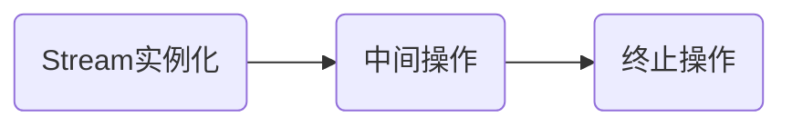

# Java各版本新特性

## Java 8

### Lambda表达式

* 基础使用

> [详细代码](https://github.com/follow1123/java-version-features/blob/main/java8/src/main/java/cn/y/java/lambda/LambdaTest.java)

```java
// 原生方式
Runnable runnable = new Runnable() {
    @Override
    public void run() {
        System.out.println("run");
    }
};
runnable.run();

// 使用lambda
Runnable r = () -> System.out.println("run");
r.run();
```

* 无参数方式

```java
Runnable runnable = () -> {
    System.out.println("run");
};

// 只有一行语句时可以省略大括号
Runnable runnable1 = () -> System.out.println("run");
```

* 一个参数方式

```java
Consumer<String> consumer = (s) -> System.out.println(s);

// 只有一个参数时可以省略括号
Consumer<String> consumer1 = s -> System.out.println(s);
```

#### 函数式接口

> [详细代码](https://github.com/follow1123/java-version-features/blob/main/java8/src/main/java/cn/y/java/lambda/FunctionInterfaceTest.java)

* 接口内只有一个抽象方法
* java在`java.util.function`包下提供部分函数式接口

| 函数式接口    | 称谓    | 参数类型    | 用途    |
|---------------- | --------------- | --------------- | --------------- |
| `Consumer<T>`    | 消费型    | T    | 对T进行操作，使用`void accept(T t)`方法    |
| `Supplier<T>`    | 供给型    | 无    | 返回T对象，使用`T get()`方法    |
| `Function<T, R>`    | 函数型    | T    | 对T进行操作，返回R，使用`R apply(T t)`方法    |
| `Predicate<T>`    | 判断型    | T    | 对T进行判断，返回true或false，使用`boolean test(T t)`方法    |

* 消费型

```java
Consumer<String> consumer = s -> System.out.println(s);
consumer.accept("123412");
```

* 供给型

```java
Supplier<Integer> supplier = () -> 1;
System.out.println(supplier.get());
```

* 函数型

```java
Function<String, Integer> function = s -> Integer.parseInt(s);
System.out.println(function.apply("100"));
```

* 判断型

```java
Predicate<Integer> predicate = i -> i > 100;
System.out.println(predicate.test(30));
```

### 方法引用

* 方法引用是基于Lambda表达式的，是对Lambda表达式的进一步简化
* 如果一个对象的方法或静态方法与某个函数式接口的抽象方法的参数和返回值相同，则可以使用`对象::方法`或`类::静态方法`替换

#### 使用

> [详细代码](https://github.com/follow1123/java-version-features/blob/main/java8/src/main/java/cn/y/java/reference/MethodRefTest.java)

* 实例方法引用

```java
Consumer<String> consumer = s -> System.out.println(s);
System.out.println(consumer);

// 使用PrintStream的实例方法println代替
Consumer<String> consumer1 = System.out::println;
System.out.println(consumer1);
```

* 静态方法引用

```java
Comparator<Integer> comparator = (o1, o2) -> Integer.compare(o1, o2);
System.out.println(comparator.compare(1, 2));

// 使用Integer的静态方法compare代替
Comparator<Integer> comparator1 = Integer::compare;
System.out.println(comparator1.compare(3, 4));
```

* 类::实例方法

```java
Comparator<String> comparator = (s1, s2) -> s1.compareTo(s2);
System.out.println(comparator.compare("aaa", "bbb"));

/*
    在方法参数不同，返回值相同的话
    如果具体逻辑是第一个参数调用方法并传递第二个参数
    那么就可以使用第一个参数的'类::实例方法'代替
 */
Comparator<String> comparator1 = String::compareTo;
System.out.println(comparator1);
```

#### 构造器引用

> [详细代码](https://github.com/follow1123/java-version-features/blob/main/java8/src/main/java/cn/y/java/reference/ConstructorRefTest.java)

```java
// 无参数构造器
Supplier<String> supplier = String::new;
// 相当于调用new String()
String s = supplier.get();

// 有参数构造器
Function<Long, Date> function = Date::new;
// 相当于调用new Date(1000L)
Date date = function.apply(1000L);
```

* 数组引用

```java
Function<Integer, String[]> function = String[]::new;

// 相当于调用new String[10]
String[] strArr = function.apply(10);
System.out.println(strArr.length);
```

### Stream API

* **Stream API**主要是对多个数据的计算（排序、查找、过滤、映射、遍历等）
* Stream自己不会存储元素
* Stream不会改变源对象，会返回一个持有结果的新Stream
* stream一旦执行了终止操作，就不能再调用其它中间操作或终止操作了

#### Stream执行流程



#### 实例化

> [详细代码](https://github.com/follow1123/java-version-features/blob/main/java8/src/main/java/cn/y/java/stream/InitTest.java)

* 通过集合初始化

```java
ArrayList<String> list = new ArrayList<>();
// 顺序流
Stream<String> stream = list.stream();

// 并行流
Stream<String> stringStream = list.parallelStream();
```

* 通过数组初始化

```java
Integer[] integers = {23, 324, 1234, 234};
Stream<Integer> stream = Arrays.stream(integers);
```

* 通过自己的静态方法初始化

```java
Stream<Integer> integerStream = Stream.of(324, 324, 8790, 4543);
```

#### 中间操作

> [详细代码](https://github.com/follow1123/java-version-features/blob/main/java8/src/main/java/cn/y/java/stream/OperateTest.java)

##### 筛选和切片

```java
List<User> users = User.listUser();

// 过滤，查询用户年龄小于20岁的用户
users.stream().filter(user -> user.getAge() < 20).forEach(System.out::println);

// 截断，只显示前2个元素
users.stream().limit(2).forEach(System.out::println);

// 跳过，跳过前4条数据
users.stream().skip(4).forEach(System.out::println);

// 去重，需要对象重写equals()和hashCode()方法
users.stream().distinct().forEach(System.out::println);
```

##### 映射

```java
List<String> list = Arrays.asList("a", "b", "c", "d");

// 小写转大写
list.stream().map(String::toUpperCase).forEach(System.out::println);

List<User> users = User.listUser();

// 过滤，查询用户年龄小于20岁的用户，只显示名称
users.stream().filter(user -> user.getAge() < 20).map(User::getName).forEach(System.out::println);
// 只显示用户的id
users.stream().mapToInt(User::getAge).forEach(System.out::println);

Role admin = new Role("001", "admin");
Role test = new Role("002", "test");
Role dba = new Role("003", "dba");
Role userRole = new Role("004", "user");
users.get(0).setRoles(Arrays.asList(admin, test, dba, userRole));
users.get(3).setRoles(Arrays.asList(test, dba));
users.get(5).setRoles(Arrays.asList(userRole));

/*
    获取用户的角色，并判断角色是否为空
    将角色列表转换为流后去重
    只获取角色名
 */
users.stream().filter(u -> u.getRoles() != null)
        .flatMap(u -> u.getRoles().stream())
        .distinct().map(Role::getName).forEach(System.out::println);
```

##### 排序

```java
Integer[] integers = {3, 34, 234, 423, 23};
// 默认升序排序
Arrays.stream(integers).sorted().forEach(System.out::println);
Arrays.stream(integers).sorted(Integer::compareTo).forEach(System.out::println);
// 数组内的元素还是原来的顺序，stream操作不会修改原容器内的元素
System.out.println(Arrays.toString(integers));

List<User> users = User.listUser();
// 定制排序
users.stream().sorted((u1, u2) -> u1.getName().compareTo(u2.getName())).forEach(System.out::println);
```

#### 终止操作

> [详细代码](https://github.com/follow1123/java-version-features/blob/main/java8/src/main/java/cn/y/java/stream/TerminateTest.java)

##### 匹配和查找

```java
List<User> users = User.listUser();
// 匹配所有用户的年龄是否都大于20岁
System.out.println(users.stream().allMatch(u -> u.getAge() > 20));
// 匹配是否有一个用户的年龄大于20岁
System.out.println(users.stream().anyMatch(u -> u.getAge() > 20));
// 匹配是否没有大于50岁的用户
System.out.println(users.stream().noneMatch(u -> u.getAge() > 50));

// 获取流内的第一个元素
System.out.println(users.stream().findFirst().get());
// 随机获取流内的一个元素
System.out.println(users.stream().findAny().get());

// 获取年龄大于40岁的用户的个数
System.out.println(users.stream().filter(u -> u.getAge() > 30).count());

// 获取年龄最大或最小的用户
System.out.println(users.stream().max((u1, u2) -> Integer.compare(u1.getAge(), u2.getAge())).get());
System.out.println(users.stream().min((u1, u2) -> Integer.compare(u1.getAge(), u2.getAge())).get());
// users.stream().max(Comparator.comparing(User::getAge))

// 遍历集合
users.stream().forEach(System.out::println);
```

##### 归并

```java
List<Integer> ints = Arrays.asList(1, 2, 3, 4, 5, 6, 7, 8, 9, 10);
/*
 累计集合内的元素
 第一个参数是初始值
 */
System.out.println(ints.stream().reduce(0, (i1, i2) -> i1 + i2));
System.out.println(ints.stream().reduce(10, (i1, i2) -> i1 + i2));
// 使用方法引用代替
System.out.println(ints.stream().reduce(10, Integer::sum));

List<User> users = User.listUser();

// 计算年龄总和
Optional<Integer> reduce = users.stream().map(User::getAge).reduce(Integer::sum);
System.out.println(reduce);
```

##### 收集

```java
List<User> users = User.listUser();
// 获取用户的年龄都大于20岁的，并存入另一个集合内
List<User> youngerUsers = users.stream().filter(u -> u.getAge() < 20).collect(Collectors.toList());
System.out.println(youngerUsers);

// 根据id转换为Map
Map<Integer, User> userMap = users.stream().collect(Collectors.toMap(User::getId, u -> u));
Set<Map.Entry<Integer, User>> entries = userMap.entrySet();
for (Map.Entry<Integer, User> entry : entries) {
    System.out.printf("%s=%s\n", entry.getKey(), entry.getValue());
}

// 求平均年龄
Double avgAge = users.stream().collect(Collectors.averagingInt(User::getAge));
System.out.println(avgAge);

// 根据性别分组
Map<Boolean, List<User>> usersGroupByGender = users.stream().collect(Collectors.groupingBy(User::getGender));
Set<Map.Entry<Boolean, List<User>>> entries1 = usersGroupByGender.entrySet();
for (Map.Entry<Boolean, List<User>> entry : entries1) {
    System.out.printf("%s=%s\n", entry.getKey(), entry.getValue());
}
```
### Optional类

> [详细代码](https://github.com/follow1123/java-version-features/blob/main/java8/src/main/java/cn/y/java/stream/OptionalTest.java)

* 创建

```java
String s1 = "aaa";
String s2 = null;
Optional<String> optional1 = Optional.of(s1);
// 传入null值会报错，空指针异常
// Optional<String> optional2 = Optional.of(s2);

Optional<Object> emptyOptional = Optional.empty();

// 可以为空
Optional<String> optional3 = Optional.ofNullable(s1);
Optional<String> optional4 = Optional.ofNullable(s2);
```

* 使用

```java
Optional<String> optional = Optional.of("100");
optional
        // 映射
        .map(Integer::parseInt)
        // 过滤
        .filter(i -> i > 50)
        // 获取，如果存在才执行指定的逻辑
        .ifPresent(System.out::println);

// 判断值是否存在
boolean present = optional.isPresent();
// 直接获取值
String s = optional.get();
// 获取值，不存在则返回提供的默认值
String s1 = optional.orElse("aa");
// 获取值，不存在则指定指定逻辑返回对应值
String s2 = optional.orElseGet(() -> 10 + "");
// 获取值，不存在直接抛出异常
String s3 = optional.orElseThrow(RuntimeException::new);
```

### 其他

#### 新时间日期API

* [参考](./apis.md#jdk8的日期时间相关类) 

#### 接口默认方法

* [参考](./index.md#接口新特性) 

#### 新方法

* `java.lang.Iterate`
    * `forEach()` - 用于使用Lambda表达式方式遍历集合
* `java.util.Collection`
    * `removeIf()` - 如果存在就移除
    * `stream()` - 返回流对象
* `java.util.Map`
    * `getOrDefault(key, defaultValue)` - 根据key获取value，如果不存在则返回提供的默认值
    * `forEach()` - 遍历
    * `replaceAll()` - 根据参数的key和value，判断，并返回新的value
    * `putIfAbsent(key, value)` - 如果不存在就加入
    * `remove(key, value)` - 根据key和value删除元素
    * `replace(key, value)` - 根据key替换value
    * `replace(key, value, newValue)` - 根据key和value查询指定的元素并替换里面的value

## Java 9

### 模块

> 模块系统（Java Platform Module System，JPMS）

* 在项目目录下新建`module-info.java`文件
* 项目默认导入`java.base`模块
* 如果项目没有`module-info.java`文件则不使用模块机制

```java
module <module.name>{
    exports <package.name>;
    requires <module.name>;
    opens <package.name>;
}
```

#### 关键字

* `requires <module.name>` - 依赖模块
    * `requires transitive <module.name>` - 将引入模块所依赖的模块传递到当前模块，不用重复引入
* `exports <package.name>` - 导出模块
    * `exports <package.name> to <module.name>` - 导出模块到指定的模块
* `opens <package.name>` -  开放反射权限
    * `open module <module.name> {}` - 将open关键字直接标记到`module`定义前，表示开放整个模块的反射权限

#### 使用

> [参考](https://github.com/follow1123/java-version-features/blob/main/java9)`module-a` `module-b` `module-c` `module-d`

* 暴露包和引入模块

```java
// 模块a
module module.a {
    // 暴露包
    exports cn.a;
    // 暴露包给指定的模块
    exports cn.b to module.c;
}

// 模块b，可以使用模块a下cn.a包下的类，无法使用cn.b包下的类
module module.b {
    // 引入模块a
    requires module.a;
}

/*
    模块c，transitive关键字表示将模块b引入的依赖传递到当前模块
    所以模块c，可以使用模块a导出的所有包
*/
module module.c {
    // 引入模块b
    requires transitive module.b;
}
```

* 声明接口和提供实现类

```java
// 模块a
module module.a {
    exports cn.a;
    // 声明接口，给其他模块实现
    uses cn.a.AService
}

// 模块b，提供实现类
module module.b {
    requires module.a;
    // 实现其他模块声明的接口
    provides cn.a.AService with cn.b.AServiceImpl;
}
```

* 开放反射权限

```java
// 模块a
module module.a{
    // 开放cn.a包下所有类的反射权限
    opens cn.a;
}

// 模块b，开放整个模块的反射权限
open module module.b {
    requires module.a;
}
```

### 其他

#### 新方法

> [详细代码](https://github.com/follow1123/java-version-features/blob/main/java9/other-features/src/main/java/cn/y/java/ApisTest.java)

* `java.util.Optional`
    * `stream()` - 返回单个值的流
    * `ifPresentOrElse()` - 存在执行一个操作，不存在执行另一个操作
    * `or()` - 指定默认的Optional
* `java.util.List`
    * `of()` - 创建不可变List，不能新增修改或删除
* `java.util.Set`
    * `of()` - 创建不可变Set
* `java.util.Map`
    * `of()` - 根据key-value创建不可变Map
    * `ofEntries()` - 根据Entry创建不可变Map
* `java.util.Stream`
    * `ofNullable()` - 创建可空Stream，对参数进行null判断
    * `iterate()` - 添加限制参数
    * `takeWhile()` - 从第一个元素还是判断，满足条件的元素会保留，当遇到一个不满足条件的元素时，后面的元素都丢弃
    * `dropWhile()` - 从第一个元素还是判断，满足条件的元素会丢弃，当遇到一个不满足条件的元素时，后面的元素都保留

#### 接口内可以定义private方法

```java
public interface PrivateMethodInInterface {

    /**
     * 私有方法定义默认方法的内部通用逻辑
     */
    private void b(){
        System.out.println("b");
    }

    default void a(){
        System.out.println("a");
        b();
    }
}
```

#### try-with-resource语法优化

```java
File resDir = new File(System.getProperty("user.dir"), "src/main/resources");
FileInputStream fis = new FileInputStream(new File(resDir, "1.txt"));
FileOutputStream fos = new FileOutputStream(new File(resDir, "2.txt"));
try(fis;fos){
    byte[] data = new byte[1024];
    int len;
    while((len = fis.read(data)) != -1){
        fos.write(data, 0, len);
    }
} catch (IOException e) {
    throw new RuntimeException(e);
}
```

#### 响应式流

* `java.util.concurrent.Flow`

#### 命令行工具

* `jshell` - java命令行工具

## Java 10-11

### HTTP Client

> [详细代码](https://github.com/follow1123/java-version-features/blob/main/java10-11/src/main/java/cn/y/java/HttpClientTest.java)

* 发送GET请求

```java
HttpRequest req = HttpRequest.newBuilder()
        .uri(URI.create("http://localhost:8989/test"))
        .GET()
        .build();
HttpClient client = HttpClient.newHttpClient();
HttpResponse<String> respData = client.send(req, HttpResponse.BodyHandlers.ofString());
System.out.println(respData.body());
```

* 发送GET请求，异步接收

```java
HttpRequest req = HttpRequest.newBuilder()
        .uri(URI.create("http://localhost:8989/test"))
        .GET()
        .build();
HttpClient.newHttpClient().sendAsync(req, HttpResponse.BodyHandlers.ofString())
        .thenApply(HttpResponse::body)
        .thenAccept(System.out::println)
        .exceptionally(e ->{
            System.out.println(e.getMessage());
            return null;
        });

// 添加睡眠以防主线程过早退出
try {
    Thread.sleep(1000);
} catch (InterruptedException e) {
    e.printStackTrace();
}
```

* 发送POST请求

```java
HttpRequest req = HttpRequest.newBuilder()
        .uri(URI.create("http://localhost:8989/test"))
        .POST(HttpRequest.BodyPublishers.ofString("this is post body"))
        .build();
HttpClient client = HttpClient.newHttpClient();
HttpResponse<String> respData = client.send(req, HttpResponse.BodyHandlers.ofString());
System.out.println(respData.body());
```

### 其他

#### 新方法

> [详细代码](https://github.com/follow1123/java-version-features/blob/main/java10-11/src/main/java/cn/y/java/ApisTest.java)

* `java.util.Optional`
    * `isEmpty()` - 判断Optional内的值是否为空
* `java.lang.String`
    * `isBlank()` - 判断字符串是否为空串，会判断空格
    * `repeat(num)` - 返回当前字符串重复拼接多少次后的字符串
    * `lines()` - 返回由当前字符串每行组成的流
    * `strip()` - 去除字符串前后空格
    * `stripLeading()` - 去除字符串前面的空格
    * `stripTrailing()` - 去除字符串后面的空格

#### var关键字（Java 10）

* 添加`var`关键字用于类型推断，只适用与局部变量

```java
public class VarTest {

    // 无法定义成员变量
    // var a = 10;

    // 无法定义静态变量
    // static var b = "abc";

    @Test
    public void test() {
        // 类型推断
        var list = new ArrayList<>();

        // 无法推断lambda表达式对应的函数式接口
        // var runnable = () -> System.out.println("runnable");
    }
}
```

## Java 12-17

### 密封类型

> [详细代码](https://github.com/follow1123/java-version-features/blob/main/java12-17/src/main/java/cn/y/java/sealed_class)

* 使用sealed关键字修饰并使用permits指定某些类，表示只允许指定的某些类继承
* 想要继承使用sealed修饰的类当前类必须使用`final` `sealed` `no-sealed`修饰
    * `final` 无法被其他类继承
    * `sealed` 当前类也变成密封类
    * `no-sealed` 当前类恢复为默认类，可以被其他任何类继承

```java
public sealed class A permits B {

}

public [final/sealed/no-sealed] class B extends A {

}
```

### Record类

> [详细代码](https://github.com/follow1123/java-version-features/blob/main/java12-17/src/main/java/cn/y/java/record/RecordTest.java)

```java
User user = new User("zs", 28);
// 获取属性方法
System.out.println(user.name());
System.out.println(user.age());

// 自动重写equals和hashCode方法
HashSet<User> users = new HashSet<>();
users.add(user);
users.add(new User("zs", 28));
System.out.println(users);
```

### switch表达式

```java
int i = 0;
String a = switch (i){
    case 1, 2 -> "case 1";
    case 3, 4 -> "case 2";
    default -> {
        System.out.println("123");
        // yield表示在代码块中的返回值，相当于方法里面的return
        yield "case default";
    }
};
System.out.println(a);
```

### 文本快

```java
String s = """
        12321
        123123ad
        qweqwe
        """;
System.out.println(s);

// 文本块内使用'\'取消换行
String s2 = """
        1 2 \
        3
        a b \
        c""";
System.out.println(s2);
```

### 其他

#### 新方法

> [详细代码](https://github.com/follow1123/java-version-features/blob/main/java12-17/src/main/java/cn/y/java/ApisTest.java)

* `java.lang.String`
    * `indent(num)` - 添加缩进，正数添加，负数减少
    * `transform()` - 使用函数式接口转换字符串

#### instanceof增强

```java
Object o = "aaa";
if (o instanceof String str){
    System.out.println(str);
}
```

#### 空指针报错优化，异常信息更准确

```java
String a = null;

/*
Exception in thread "main" java.lang.NullPointerException: Cannot invoke "String.length()" because "a" is null
    at cn.y.java.NullPointerExceptionTest.main(NullPointerExceptionTest.java:7)
 */
System.out.println(a.length());
```

#### `jpackage`打包工具

#### 弃用 Applet API 以进行删除

## Java 18-21

### 虚拟线程

* 使用线程池方式

```java
public void ThreadTest() {
    ExecutorService executor = Executors.newCachedThreadPool();
    try(executor){
        IntStream.range(1, 10000).forEach(i -> executor.submit(() -> {
            try {
                Thread.sleep(1000);
                System.out.println("execute: " + i );
            } catch (InterruptedException e) {
                throw new RuntimeException(e);
            }

        }));
    }catch (Exception e){
        e.printStackTrace();
    }
}
```

* 使用虚拟线程方式，只需要将`newCachedThreadPool`修改为`newVirtualThreadPerTaskExecutor`，速度就会明显提升

* 需要同步代码块时尽量使用`ReentrantLock`替代`synchronized`

* 虚拟线程时守护线程，无法修改为未守护线程

* 虚拟线程默认优先级是5，无法修改

* 虚拟线程不支持`stop()`, `suspend()`, `resume()`方法

#### 创建虚拟线程的方式

* 方式1

```java
Runnable task = () -> {
    System.out.println("run task");
};
Thread.startVirtualThread(task);
try {
    Thread.sleep(100);
} catch (InterruptedException e) {
    throw new RuntimeException(e);
}
```
* 方式2

```java
Runnable task = () -> {
    System.out.println("run task");
};
// Thread virtualThread = Thread.ofVirtual().name("virtualThreadName").start(task);
Thread virtualThread = Thread.ofVirtual().name("virtualThreadName").unstarted(task);
virtualThread.start();
try {
    Thread.sleep(100);
} catch (InterruptedException e) {
    throw new RuntimeException(e);
}
```
* 方式3 就是使用创建线程池

* 使用`Thread`对象内的`isVirtual()`方法判断是否为虚拟线程


### scoped values 隐藏的方法参数（预览）

* 一般用于代替ThreadLocal

```java
public class ScopedValuesTest {

    public static void main(String[] args) {
         new ScopedValuesTest().set();
    }
    
    private ScopedValue<String> value = ScopedValue.newInstance();

    public void set(){
        ScopedValue.where(value, "111").run(() -> get());
    }

    public void get(){
        System.out.println(value.get());
    }
}
```
* 多线程方式

```java
public class ScopedValuesMultithreadTest {

    public static void main(String[] args) {
        ExecutorService pool = Executors.newCachedThreadPool();
        ScopedValuesMultithreadTest test = new ScopedValuesMultithreadTest();
        for (int i = 0; i < 10; i++) {
            pool.submit(() -> test.set());
        }
        pool.shutdown();

    }

    private ScopedValue<String> value = ScopedValue.newInstance();

    public void set(){
        ScopedValue.where(value, Thread.currentThread().getName()).run(() -> get());
    }

    public void get(){
        System.out.println(value.get());
    }
}
```

### switch表达式增强

* 临时变量

```java
public class SwitchTest1 {

    public static void main(String[] args) {
        int i = 100;
        System.out.println(getValue(i));
    }

    public static String getValue(Object o){
       return switch (o){
           case null -> "null object";
           case Integer i -> "integer: " + i;
           case String str -> "string: " + str;
           default -> o.toString();
       };
    }
}
```

* `when`关键字

```java
public class SwitchTest2 {

    public static void main(String[] args) {
        int score = 10;
        test(score);
    }

    public static void test(Object o){
       switch (o){
           case Integer i when i <= 60 -> {
               System.out.println("not great");
           }
           case Integer i when i <= 100 -> {
               System.out.println("great");
           }
           default -> {
               System.out.println("error");
           }
       };

    }
}
```

### 其他

#### 结构化并发，`StructuredTaskScope`类的使用

#### Record Pattern（预览）

```java
public class RecordPatternTest {
    public static void main(String[] args) {
        Object o = new Person("zs", 18);
        printObj(o);
    }

    public static void printObj(Object o){
        if (o instanceof Person(String name, int age)){
            System.out.println("name = " + name);
            System.out.println("age = " + age);
        }
    }

}

record Person(String name, int age){}
```

#### 默认使用UTF-8编码

#### `jwebserver`命令简单web服务器

#### `@snippet` 文档内的代码预览，使用`javadoc`命令生成文档

```java
public class Text {
    /**
     * {@snippet
     * int c = a + b;
     * }
     */
    public int add(int a, int b) {
        int c = a + b;
        return c;
    }
}
```

#### 简化版main方法（预览）

```java
void main(){
    System.out.println("Hello world!");
}
```

#### 字符串模板（预览）

```java
String zs = "zs";
String str = STR."my name is \{zs}";
System.out.println(str);
```

