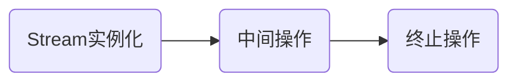

# Java 8

## Lambda表达式

> [详细代码](https://github.com/follow1123/java-version-features/blob/main/java8/src/main/java/cn/y/java/lambda/LambdaTest.java)

* 基础使用

```java
// 原生方式
Runnable runnable = new Runnable() {
    @Override
    public void run() {
        System.out.println("run");
    }
};
runnable.run();

// 使用lambda
Runnable r = () -> System.out.println("run");
r.run();
```

* 无参数方式

```java
Runnable runnable = () -> {
    System.out.println("run");
};

// 只有一行语句时可以省略大括号
Runnable runnable1 = () -> System.out.println("run");
```

* 一个参数方式

```java
Consumer<String> consumer = (s) -> System.out.println(s);

// 只有一个参数时可以省略括号
Consumer<String> consumer1 = s -> System.out.println(s);
```

### 函数式接口

> [详细代码](https://github.com/follow1123/java-version-features/blob/main/java8/src/main/java/cn/y/java/lambda/FunctionInterfaceTest.java)

* 接口内只有一个抽象方法
* java在`java.util.function`包下提供部分函数式接口

| 函数式接口    | 称谓    | 参数类型    | 用途    |
|---------------- | --------------- | --------------- | --------------- |
| `Consumer<T>`    | 消费型    | T    | 对T进行操作，使用`void accept(T t)`方法    |
| `Supplier<T>`    | 供给型    | 无    | 返回T对象，使用`T get()`方法    |
| `Function<T, R>`    | 函数型    | T    | 对T进行操作，返回R，使用`R apply(T t)`方法    |
| `Predicate<T>`    | 判断型    | T    | 对T进行判断，返回true或false，使用`boolean test(T t)`方法    |

* 消费型

```java
Consumer<String> consumer = s -> System.out.println(s);
consumer.accept("123412");
```

* 供给型

```java
Supplier<Integer> supplier = () -> 1;
System.out.println(supplier.get());
```

* 函数型

```java
Function<String, Integer> function = s -> Integer.parseInt(s);
System.out.println(function.apply("100"));
```

* 判断型

```java
Predicate<Integer> predicate = i -> i > 100;
System.out.println(predicate.test(30));
```

## 方法引用

* 方法引用是基于Lambda表达式的，是对Lambda表达式的进一步简化
* 如果一个对象的方法或静态方法与某个函数式接口的抽象方法的参数和返回值相同，则可以使用`对象::方法`或`类::静态方法`替换

### 使用

> [详细代码](https://github.com/follow1123/java-version-features/blob/main/java8/src/main/java/cn/y/java/reference/MethodRefTest.java)

* 实例方法引用

```java
Consumer<String> consumer = s -> System.out.println(s);
System.out.println(consumer);

// 使用PrintStream的实例方法println代替
Consumer<String> consumer1 = System.out::println;
System.out.println(consumer1);
```

* 静态方法引用

```java
Comparator<Integer> comparator = (o1, o2) -> Integer.compare(o1, o2);
System.out.println(comparator.compare(1, 2));

// 使用Integer的静态方法compare代替
Comparator<Integer> comparator1 = Integer::compare;
System.out.println(comparator1.compare(3, 4));
```

* 类::实例方法

```java
Comparator<String> comparator = (s1, s2) -> s1.compareTo(s2);
System.out.println(comparator.compare("aaa", "bbb"));

/*
    在方法参数不同，返回值相同的话
    如果具体逻辑是第一个参数调用方法并传递第二个参数
    那么就可以使用第一个参数的'类::实例方法'代替
 */
Comparator<String> comparator1 = String::compareTo;
System.out.println(comparator1);
```

### 构造器引用

> [详细代码](https://github.com/follow1123/java-version-features/blob/main/java8/src/main/java/cn/y/java/reference/ConstructorRefTest.java)

```java
// 无参数构造器
Supplier<String> supplier = String::new;
// 相当于调用new String()
String s = supplier.get();

// 有参数构造器
Function<Long, Date> function = Date::new;
// 相当于调用new Date(1000L)
Date date = function.apply(1000L);
```

* 数组引用

```java
Function<Integer, String[]> function = String[]::new;

// 相当于调用new String[10]
String[] strArr = function.apply(10);
System.out.println(strArr.length);
```

## Stream API

* **Stream API**主要是对多个数据的计算（排序、查找、过滤、映射、遍历等）
* Stream自己不会存储元素
* Stream不会改变源对象，会返回一个持有结果的新Stream
* stream一旦执行了终止操作，就不能再调用其它中间操作或终止操作了

### Stream执行流程



### 实例化

> [详细代码](https://github.com/follow1123/java-version-features/blob/main/java8/src/main/java/cn/y/java/stream/InitTest.java)

* 通过集合初始化

```java
ArrayList<String> list = new ArrayList<>();
// 顺序流
Stream<String> stream = list.stream();

// 并行流
Stream<String> stringStream = list.parallelStream();
```

* 通过数组初始化

```java
Integer[] integers = {23, 324, 1234, 234};
Stream<Integer> stream = Arrays.stream(integers);
```

* 通过自己的静态方法初始化

```java
Stream<Integer> integerStream = Stream.of(324, 324, 8790, 4543);
```

### 中间操作

> [详细代码](https://github.com/follow1123/java-version-features/blob/main/java8/src/main/java/cn/y/java/stream/OperateTest.java)

#### 筛选和切片

```java
List<User> users = User.listUser();

// 过滤，查询用户年龄小于20岁的用户
users.stream().filter(user -> user.getAge() < 20).forEach(System.out::println);

// 截断，只显示前2个元素
users.stream().limit(2).forEach(System.out::println);

// 跳过，跳过前4条数据
users.stream().skip(4).forEach(System.out::println);

// 去重，需要对象重写equals()和hashCode()方法
users.stream().distinct().forEach(System.out::println);
```

#### 映射

```java
List<String> list = Arrays.asList("a", "b", "c", "d");

// 小写转大写
list.stream().map(String::toUpperCase).forEach(System.out::println);

List<User> users = User.listUser();

// 过滤，查询用户年龄小于20岁的用户，只显示名称
users.stream().filter(user -> user.getAge() < 20).map(User::getName).forEach(System.out::println);
// 只显示用户的id
users.stream().mapToInt(User::getAge).forEach(System.out::println);

Role admin = new Role("001", "admin");
Role test = new Role("002", "test");
Role dba = new Role("003", "dba");
Role userRole = new Role("004", "user");
users.get(0).setRoles(Arrays.asList(admin, test, dba, userRole));
users.get(3).setRoles(Arrays.asList(test, dba));
users.get(5).setRoles(Arrays.asList(userRole));

/*
    获取用户的角色，并判断角色是否为空
    将角色列表转换为流后去重
    只获取角色名
 */
users.stream().filter(u -> u.getRoles() != null)
        .flatMap(u -> u.getRoles().stream())
        .distinct().map(Role::getName).forEach(System.out::println);
```

#### 排序

```java
Integer[] integers = {3, 34, 234, 423, 23};
// 默认升序排序
Arrays.stream(integers).sorted().forEach(System.out::println);
Arrays.stream(integers).sorted(Integer::compareTo).forEach(System.out::println);
// 数组内的元素还是原来的顺序，stream操作不会修改原容器内的元素
System.out.println(Arrays.toString(integers));

List<User> users = User.listUser();
// 定制排序
users.stream().sorted((u1, u2) -> u1.getName().compareTo(u2.getName())).forEach(System.out::println);
```

### 终止操作

> [详细代码](https://github.com/follow1123/java-version-features/blob/main/java8/src/main/java/cn/y/java/stream/TerminateTest.java)

#### 匹配和查找

```java
List<User> users = User.listUser();
// 匹配所有用户的年龄是否都大于20岁
System.out.println(users.stream().allMatch(u -> u.getAge() > 20));
// 匹配是否有一个用户的年龄大于20岁
System.out.println(users.stream().anyMatch(u -> u.getAge() > 20));
// 匹配是否没有大于50岁的用户
System.out.println(users.stream().noneMatch(u -> u.getAge() > 50));

// 获取流内的第一个元素
System.out.println(users.stream().findFirst().get());
// 随机获取流内的一个元素
System.out.println(users.stream().findAny().get());

// 获取年龄大于40岁的用户的个数
System.out.println(users.stream().filter(u -> u.getAge() > 30).count());

// 获取年龄最大或最小的用户
System.out.println(users.stream().max((u1, u2) -> Integer.compare(u1.getAge(), u2.getAge())).get());
System.out.println(users.stream().min((u1, u2) -> Integer.compare(u1.getAge(), u2.getAge())).get());
// users.stream().max(Comparator.comparing(User::getAge))

// 遍历集合
users.stream().forEach(System.out::println);
```

#### 归并

```java
List<Integer> ints = Arrays.asList(1, 2, 3, 4, 5, 6, 7, 8, 9, 10);
/*
 累计集合内的元素
 第一个参数是初始值
 */
System.out.println(ints.stream().reduce(0, (i1, i2) -> i1 + i2));
System.out.println(ints.stream().reduce(10, (i1, i2) -> i1 + i2));
// 使用方法引用代替
System.out.println(ints.stream().reduce(10, Integer::sum));

List<User> users = User.listUser();

// 计算年龄总和
Optional<Integer> reduce = users.stream().map(User::getAge).reduce(Integer::sum);
System.out.println(reduce);
```

#### 收集

```java
List<User> users = User.listUser();
// 获取用户的年龄都大于20岁的，并存入另一个集合内
List<User> youngerUsers = users.stream().filter(u -> u.getAge() < 20).collect(Collectors.toList());
System.out.println(youngerUsers);

// 根据id转换为Map
Map<Integer, User> userMap = users.stream().collect(Collectors.toMap(User::getId, u -> u));
Set<Map.Entry<Integer, User>> entries = userMap.entrySet();
for (Map.Entry<Integer, User> entry : entries) {
    System.out.printf("%s=%s\n", entry.getKey(), entry.getValue());
}

// 求平均年龄
Double avgAge = users.stream().collect(Collectors.averagingInt(User::getAge));
System.out.println(avgAge);

// 根据性别分组
Map<Boolean, List<User>> usersGroupByGender = users.stream().collect(Collectors.groupingBy(User::getGender));
Set<Map.Entry<Boolean, List<User>>> entries1 = usersGroupByGender.entrySet();
for (Map.Entry<Boolean, List<User>> entry : entries1) {
    System.out.printf("%s=%s\n", entry.getKey(), entry.getValue());
}
```
## Optional类

> [详细代码](https://github.com/follow1123/java-version-features/blob/main/java8/src/main/java/cn/y/java/optional/OptionalTest.java)

* 创建

```java
String s1 = "aaa";
String s2 = null;
Optional<String> optional1 = Optional.of(s1);
// 传入null值会报错，空指针异常
// Optional<String> optional2 = Optional.of(s2);

Optional<Object> emptyOptional = Optional.empty();

// 可以为空
Optional<String> optional3 = Optional.ofNullable(s1);
Optional<String> optional4 = Optional.ofNullable(s2);
```

* 使用

```java
Optional<String> optional = Optional.of("100");
optional
        // 映射
        .map(Integer::parseInt)
        // 过滤
        .filter(i -> i > 50)
        // 获取，如果存在才执行指定的逻辑
        .ifPresent(System.out::println);

// 判断值是否存在
boolean present = optional.isPresent();
// 直接获取值
String s = optional.get();
// 获取值，不存在则返回提供的默认值
String s1 = optional.orElse("aa");
// 获取值，不存在则指定指定逻辑返回对应值
String s2 = optional.orElseGet(() -> 10 + "");
// 获取值，不存在直接抛出异常
String s3 = optional.orElseThrow(RuntimeException::new);
```

## 其他

### 新时间日期API

* [参考](../basics/apis.md#jdk8的日期时间相关类) 

### 接口默认方法

* [参考](../advanced/object-oriented/other-keyword-structure#接口新特性) 

### 新方法

* `java.lang.Iterate`
    * `forEach()` - 用于使用Lambda表达式方式遍历集合
* `java.util.Collection`
    * `removeIf()` - 如果存在就移除
    * `stream()` - 返回流对象
* `java.util.Map`
    * `getOrDefault(key, defaultValue)` - 根据key获取value，如果不存在则返回提供的默认值
    * `forEach()` - 遍历
    * `replaceAll()` - 根据参数的key和value，判断，并返回新的value
    * `putIfAbsent(key, value)` - 如果不存在就加入
    * `remove(key, value)` - 根据key和value删除元素
    * `replace(key, value)` - 根据key替换value
    * `replace(key, value, newValue)` - 根据key和value查询指定的元素并替换里面的value
