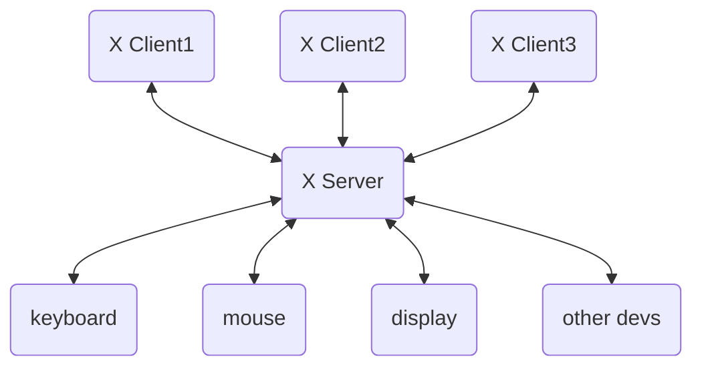

# 桌面环境

## 图形显示服务器

### X Window System

* 架构



#### X Client

* **X Client**就是应用程序

#### X Server

##### Xorg

> [官网](https://www.x.org/wiki/)

* 一个基于**X11（X Window System version 11）**实现的**X server**
* 说明：
    * **X11**：**X Window System**的第11个版本，也是**X Server**和**X Client**通信的一种协议
    * **X**：就是**X Window System**

* 详细参考[ArchWiki](https://wiki.archlinux.org/title/Xorg)

### Wayland

> [官网](https://wayland.freedesktop.org/)

* 现代的显示服务器协议，取代传统的 X Window System（X11）
* 详细参考[ArchWiki](https://wiki.archlinux.org/title/Wayland)

## freedesktop.org

> [官网](https://www.freedesktop.org/wiki/)

* 也叫XDG，专注于开源图形和桌面系统的互操作性和共享技术
* 用于统一不同桌面环境下桌面图标格式，软件配置存放位置等
* 部分规范详细参考[官方规范文档](https://www.freedesktop.org/wiki/Specifications/)或[ArchWiki](https://wiki.archlinux.org/title/Category:Freedesktop.org)：
    * 桌面图标：[Desktop entries](https://wiki.archlinux.org/title/Desktop_entries)
    * 基本目录：[XDG Base Directory](https://wiki.archlinux.org/title/XDG_Base_Directory)
    * 用户目录：[XDG user directories](https://wiki.archlinux.org/title/XDG_user_directories)

## 显示管理器（Display Manager）

* 用于启动图形显示服务器
* 部分显示管理器：
    * [GDM (GNOME Display Manager)](https://help.gnome.org/admin/gdm/stable/gdm.html)：GNOME自带
    * [SDDM (Simple Desktop Display Manager)](https://github.com/sddm/sddm/)：KDE自带
    * [LightDM](https://wiki.archlinux.org/title/LightDM)：轻量
    * [Ly](https://github.com/fairyglade/ly)：终端显示管理器

## 窗口管理器/合成器（Window Manager/Compositors）

* **窗口管理器**：基于Xorg下对软件窗口控制的系统软件
* **窗口合成器**：和上面类似，由于Wayland特性所以叫合成器
* 详细窗口管理器或合成列表参考：
    * [窗口管理器](https://wiki.archlinux.org/title/Window_manager)
    * [窗口合成器](https://wiki.archlinux.org/title/Wayland#Compositors)

## 电源管理

* 管理开机、关机、休眠相关操作
* 详细参考：
    * [Power management](https://wiki.archlinux.org/title/Power_management#)
    * [logind.conf](https://man.archlinux.org/man/logind.conf.5)

## 桌面环境

* 集成以上所以部分的环境
* 常见桌面环境：
    * [GNOME](https://www.gnome.org/)
    * [KDE](https://kde.org/)

## 其他

### 字体

* 设置字体大小 `dpkg-reconfigure console-setup`
* 设置字体`dpkg-reconfigure locales`
* 没有`ifconfig`命令时用`ip addr show`查看ip

### 网络

* 查看网卡信息：`ifconfig -a`
* 启动网卡： `ifconfig wlan0 up`
* 生成wifi信息文件： `wpa_passphrase {SSID} {PASSWORD} > /etc/wpa_supplicant/{SSID}.conf`
* 连接wifi： `wpa_supplicant -i wlan0 -c /etc/wpa_supplicant/{SSID}.conf -B`
* 启动动态分配ip服务：`dhclient wlan0`

### 输入法

* fcitx5输入法

```bash
sudo apt install fcitx5 fcitx5-frontend-qt5 fcitx5-frontend-gtk3 fcitx5-frontend-gtk2 fcitx5-chinese-addons
```


### 音频

* **alsa**：音频底层
* **pulseaudio**：音频服务
* **pipewire**：新版音频服务
    * **wireplumber**：pipewire客户端
    * **qpwgraph**：pipewire的图形界面客户端

### 蓝牙

* **bluez**：蓝牙协议底层
* **bluetooth**：蓝牙服务，自带`bluetoothctl`交互命令

## 安装

> 以下操作基于Debian

### 物理机安装

* 制作一个微pe的u盘
* 设置电脑硬盘启动顺序为u盘启动
* 以我的电脑为例dell笔记本，开机出现图标不停按F12，后续操作百度
* 进入后格式化所有电脑硬盘
* 使用debian制作启动盘
* 由于安装时可能会提示缺少固件，需要下载nofree的固件先放在u盘内的firmware文件夹内，没有就新建一个，
    * [固件官网](https://packages.debian.org/stable)
    * [固件git网站](https://git.kernel.org/pub/scm/linux/kernel/git/firmware/linux-firmware.git)
* 卸载桌面环境`apt autoremove  --purge kde*`

### 安装dwm窗口管理器

* 基础桌面环境：`apt install libx11-dev libxft-dev libxinerama-dev xorg`
* 系统托盘：`apt install trayer`
* 壁纸软件：`apt install feh`
* 复制配置文件`cp /etc/X11/xinit/xinitrc ~/.xinitrc`
* 基础命令：
  * killall：`psmisc`
* 使用git clone dwm源码官网https://tools.suckless.org/
* 进入dwm目录`make clean instal`编译安装dwm
  * 安装编译依赖`sudo apt install make gcc`
  * 编译xinitrc文件 `nvim ~/.xinitrc`
  * 文件最后加上`exec dwm`
* 文件上面有些目录可能需要注释才能启动
* 安装输入法`apt install fcitx fcitx-pinyin`
* 用dmenu打开`fcitx-config-gtk3`应用，配置双拼
* 安装nerd fonts图标字体
  * nerd fonts 字体下载页面：https://www.nerdfonts.com/font-downloads
  * 选择一个字体下载，我这里选择一个只有图标的字体
  * 解压字体压缩包到系统字体目录下：`sudo unzip 压缩包名称 -d /usr/share/fonts/压缩包名称`
  * 进入到解压的字体目录下：`cd /usr/share/fonts/压缩包名称`
    * 生成核心字体信息：`sudo mkfontscale`
    * 生成字体文件夹：`sudo mkfontdir`
    * 刷新系统字体缓存：`sudo fc-cache -fv`
  * 打开dwm配置文件
    * 查找字体名称：`fc-list | grep 安装的字体名称`
    * 复制出对应的字体名称，在grep出结果里面，一般在 `:style=xxx`前面，`xxx.ttf：`后面
    * 找到`*fonts[]`常量，将上一步复制的字体名称粘贴在这里，后面加上`pixelsize=图标大小:type=上一步style后面的值:antialise=true:autohint=true`后面两个是抗锯齿之类的属性
    * 保存退出后`sudo make clean install` 重新编译安装dwm
    * 重启后就可以设置nerd fonts的字体了，字体网址：https://www.nerdfonts.com/cheat-sheet

## 常见问题

### windows远程dwm桌面环境

```bash
# 在用户家目录下添加.xsession文件
touch ~/.xsession
echo "exec dwm" >> ~/.xsession

# 安装xrdp并启动
apt install xrdp
sudo /etc/init.d/xrdp start
```

### 笔记本电源管理相关

* 笔记本合盖休眠配置文件：`/etc/systemd/logind.conf`
* linux 引导页面配置文件：`/etc/default/grub`
* 将`GRUB_TIMEOUT`设置为`0`则可以跳过引导页面


### Linux设置键盘速率

```bash
# 250毫秒后开始重复，每60毫秒重复一次
xset r rate 250 60
```

## 参考

* [X Window System介绍](https://www.cnblogs.com/nuoforever/p/13928856.html)
* [X-Window介绍与使用](https://blog.csdn.net/weixin_56291477/article/details/130431953)
* [了解自己机器上的 X Window](https://cnblogs.com/youxia/p/linux003.html)
