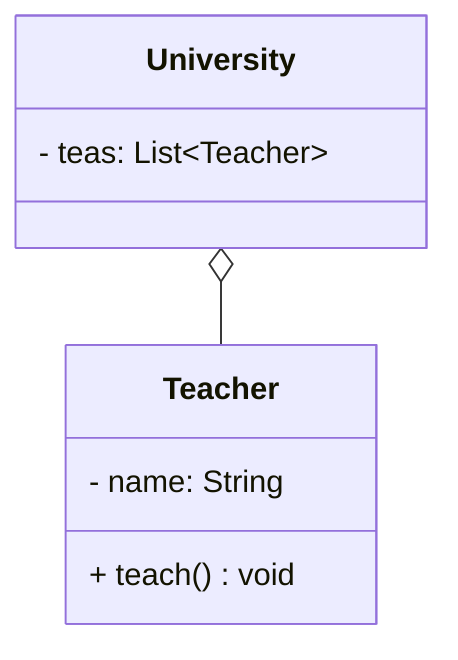
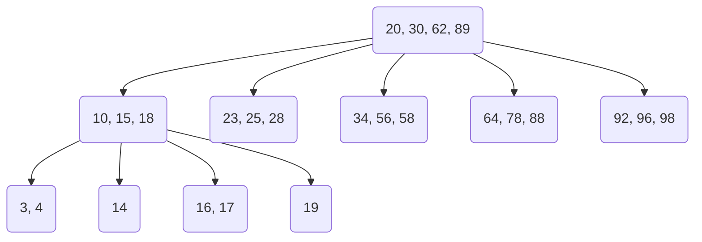
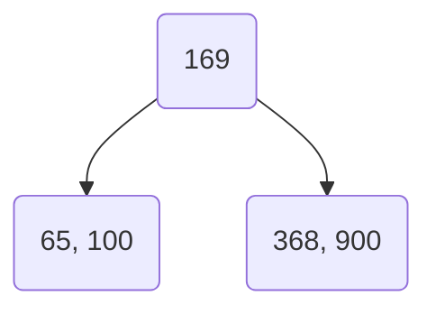
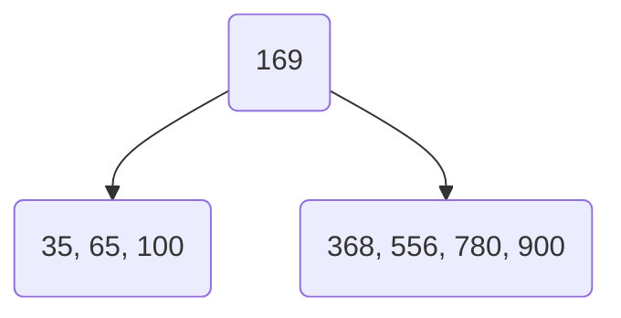
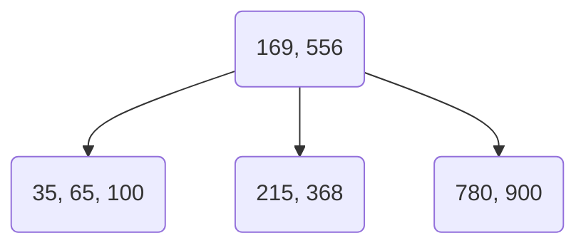
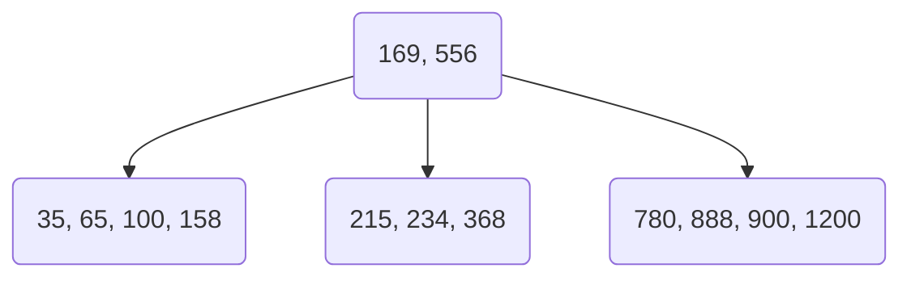
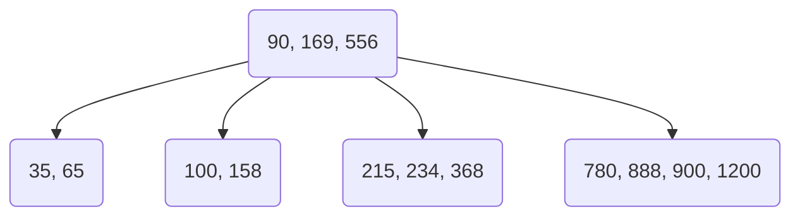
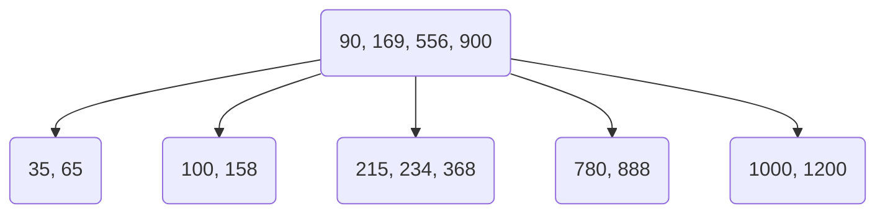
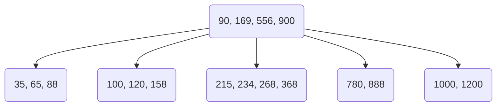
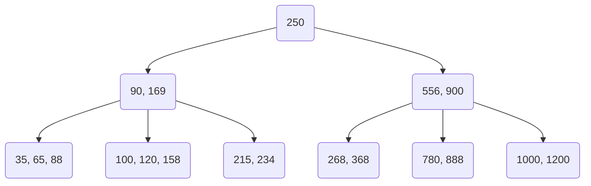

# MySQL

* [官网](https://www.mysql.com/)


## 简介

* MySQL是一个**数据库管理系统**
* MySQL是一个**关系型数据库**

## 数据库相关概念

| 名称    | 全称    | 简称    |
|---------------- | --------------- | --------------- |
| 数据库    | 存储数据的仓库，对数据进行有组织的存储    | DataBase(DB)    |
| 数据库管理系统    | 操作和管理数据库的大型软件    | DataBase Management System(DBMS)    |
| SQL   | 操作关系型数据库的编程语言，定义了一套操作关系型数据库的统一标准  | Structured Query Language(SQL)   |

* 主流的关系型数据库管理系统：`Oracle`、`MySQL`、`Microsoft SQL Server`、`PostgreSQL`

### 关系型数据库（RDBMS）

* 建立在关系模型基础上，由多张相互连接的二维表组成的数据库
* 特点：
    * 使用表存储数据，格式统一，方便维护
    * 使用SQL语言操作，标准统一，使用方便

## 安装

> 以Windows下安装压缩包版MySQL为例

1. 解压zip文件
2. 配置MySQL环境变量
3. 在MySQL文件夹里面新建一个my.ini文件

```ini
[mysqlId]
basedir=mysql安装目录\
datadir=mysql安装目录\data\
port=3306
skip-grant-tables
```

4. 在MySQL目录下新建data文件夹
5. 以管理员权限进入`cmd`并执行以下命令
```cmd
REM 初始化mysql
mysqld --initialize --console

REM 安装mysql
mysqld -install

REM 启动mysql服务
net start mysql

REM 进入MySQL命令行
mysql -uroot -p

REM 修改密码
SET PASSWORD = PASSWORD('密码');`
ALTER USER 'root'@'localhost' PASSWORD EXPIRE NEVER;`

REM 刷新权限
flush privileges;`
```

6. 修改`my.ini`文件，删除里面的`skip-grant-tables`即可

7. 重启mysql

```cmd
net stop mysql
net start mysql
```

## SQL

### 通用语法

* SQL语句可以单行或多行书写，以分号结尾
* MySQL数据库的SQL语句不区分大小写
* SQL语句注释：
    * 单行注释：`--`或`#` (**MySQL特有**)
    * 多行注释：`/* 内容 */`
* 如果数据库名、表名或字段名与SQL关键字重名，可以使用<code>&#96;</code>包裹

### SQL分类

| 分类    | 全称    | 说明    |
|---------------- | --------------- | --------------- |
| DDL    | Data Definition Language    | 数据库定义语言，用来定义数据库对象（数据库、表、字段）    |
| DML    | Data Manipulation Language    | 数据库操作语言，用来对数据库表中的数据进行增删该    |
| DQL   | Data Query Language   | 数据库查询语言，用来查询数据库中表的记录   |
| DCL   | Data Control Language   | 数据库控制语言，用来创建数据库中的用户，控制数据库访问权限 |

### DDL

#### 操作数据库

```sql
-- 查看所有数据库
SHOW DATABASES;

-- 查看当前数据库
SELECT DATABASE();

-- 创建数据库
CREATE DATABASE [IF NOT EXISTS] 数据库名 [DEFAULT CHARSET 字符集][COLLATE 排序规则];

-- 删除数据库
DROP DATABASE [IF EXISTS] 数据库名;

-- 使用数据库
USE 数据库名;

-- 查看数据库创建的语句 
SHOW CREATE DATABASE 数据库名; 
```

#### 操作表结构

```sql
-- 查询数据库内的所有表，需要先使用USE 数据库;使用某个数据库
SHOW TABLES;

-- 查询表结构
DESC 表名;

-- 查询某个表的建表语句
SHOW CREATE TABLE 表名;
```

##### 创建表

* 数据库的字段属性
    * `unsigned`：无符号整型，声明该列不能为负数
    * `zerofill`：0填充，不足的位数用零填充
* 创建表时还需要配合[约束](#约束)

```sql
CREATE TABLE [IF NOT EXISTS] 表名(
    字段1 字段1类型 [COMMENT '字段1注释'],
    字段2 字段2类型 [COMMENT '字段2注释'],
    字段3 字段3类型 [COMMENT '字段3注释'],
    ...
    字段N 字段N类型 [COMMENT '字段N注释']
) [COMMENT '表注释'];
```

#### 数据类型

##### 数值类型

| 类型    | 大小    | 有符号（SIGNED）范围    | 无符号（UNSIGNED）范围    | 描述    |
|---------------- | --------------- | --------------- | --------------- | --------------- |
| TINYINT    | 1 byte    | -128~127    | 0~255    | 小整型数值   |
| SMALLINT   | 2 byte   | -32768~32767   | 0~65535   | 中整型数值   |
| MEDIUMINT   | 3 byte   | -8388608~8388607   | 0~16777215   | 中整型数值   |
| INT/INTEGER   | 4 byte   | -2147483648~2147483647   | 0~4294967295   | 大整型数值   |
| BIGINT  | 8 byte   | -2^63~2^63-1   | 0~2^64-1   | 极大整型数值   |
| FLOAT   | 4 byte   | |   | 单精度浮点数值   |
| DOUBLE   | 8 byte   |    |    | 双精度浮点数值   |
| DECIMAL   |   | M(精度)和D(标度)   | M(精度)和D(标度)   | 小数值(精确定点数)   |

* 示例

```sql
CREATE TABLE IF NOT EXISTS DATA_TYPE_TABLE(
    age UNSIGNED TINYINT COMMENT '年龄' -- 年龄字段，无符号
    score DOUBLE(4,1) COMMENT '分数' -- 分数字段，可以为小数，保留一位小数
) COMMENT '数据类型演示';
```
##### 字符串类型

| 类型    | 大小    | 描述    |
|---------------- | --------------- | --------------- |
| CHAR    | 0~255    | 定长字符串（性能好）    |
| VARCHAR    | 0~2^16-1 | 变长字符串（性能差）    |
| TINYBLOB   | 0~255   | 小二进制数据   |
| TINYTEXT   | 0~255   | 小文本字符串   |
| BLOB | 0~2^16-1 | 中二进制数据 | 
| TEXT | 0~2^16-1 | 中文本字符串 | 
| MEDIUMBLOB | 0~2^24-1 | 大二进制数据 | 
| MEDIUMTEXT | 0~2^24-1 | 大文本字符串 | 
| LONGBLOB | 0~2^32-1 | 极大二进制数据 | 
| LONGTEXT | 0~2^32-1 | 极大文本字符串 | 
    

##### 时间日期类型

| 类型    | 大小    | 范围    | 格式    | 描述    |
|---------------- | --------------- | --------------- | --------------- | --------------- |
| DATE    | 3    | 1000-01-01至9999-12-31    | YYYY-MM-DD    | 日期   |
| TIME   | 3   | -838:59:59至838:59:59   | HH:MM:SS   | 时间值或持续时间   |
| YEAR   | 1   | 1901至2155   | YYYY   | 年份   |
| DATETIME   | 8 | 1000-01-01 00:00:00至9999-12-31 23:59:59   | YYYY-MM-DD HH:MM:SS   | 日期和时间   |
| TIMESTAMP   | 4 | 1970-01-01 00:00:01至2038-01-19 23:14:07   | YYYY-MM-DD HH:MM:SS   | 日期和时间，时间戳   |

##### 空类型（null）

##### 修改表

* 修改表时也可以修改[约束](#约束)

```sql
-- 添加字段
ALTER TABLE 表名 ADD 字段名 类型(长度) [COMMENT '注释'] [约束];

-- 修改字段类型
ALTER TABLE 表名 MODIFY 字段名 新类型(长度);

-- 修改字段名和类型
ALTER TABLE 表名 CHANGE 字段名 新字段名 新类型(长度) [COMMENT '注释'] [约束];

-- 删除字段
ALTER TABLE 表名 DROP 字段名;

-- 重命名
ALTER TABLE 表名 RENAME TO 新表名;

-- 删除表（如果存在）
DROP TABLE [IF EXISTS] 表名;

-- 删除表，并重新创建该表
TRUNCATE TABLE 表名;
```

---

### DML

#### 添加数据

* 插入数据时，字段的顺序与值的顺序是一一对应的

```SQL
-- 给指定字段添加数据
INSERT INTO 表名 (字段1, 字段2, 字段3 ...) VALUES (值1, 值2, ...);

-- 给全部字段添加数据
INSERT INTO 表名 VALUES (值1, 值2, 值3, ...);

-- 批量添加数据
INSERT INTO 表名 (字段1, 字段2, 字段3 ...) VALUES
(值1, 值2, ...), (值1, 值2, ...), (值1, 值2, ...), (值1, 值2, ...);

INSERT INTO VALUES
(值1, 值2, ...), (值1, 值2, ...), (值1, 值2, ...), (值1, 值2, ...);

```

#### 修改数据

* 修改语句没有`WHERE`条件则会修改整张表的数据
* `WHERE 条件`参考[DQL的条件查询](#条件查询)

```SQL
UPDATE 表名 SET  字段名1=值1, [字段名2=值2, ...] [WHERE 条件];

-- 相当于删除字段
UPDATE 表名 SET  字段名=NULL [WHERE 条件];
```

#### 删除数据

* 删除语句没有`WHERE`条件则会删除整张表的数据

```sql
DELETE FORM 表名 [WHERE 条件];
```

---

### DQL

* 语法

```sql
SELECT [All | DISTINCT | * | 表名.* | [表名1.字段1 as 别名1, 表名2.字段2 as 别名2] -- 查询格式
FROM 表名 [AS 表名的别名]
[LEFT | RIGHT | INNER JOIN 表名2]   -- 连表查询
[WHERE]                             -- 指定结果徐满足的条件
[GROUP BY]                          -- 指定结果按那几个字段进行分组
[HAVING]                            --过滤分组记录必须满足的次要条件
[ORDER BY]                          -- 指定查询记录按一个或多个条件进行分组
[LIMIT {[offset,]row_count row_countOFFSET offset}]; --指定查询的记录从那条至哪条
```

#### 基本查询

```SQL
-- 查询多个字段
SELECT 字段1, 字段2, 字段3, ... FROM 表名;
SELECT * FROM 表名;

-- 设置别名
SELECT 字段1 [AS 别名1], 字段2 [AS 别名2], 字段3 [AS 别名3], ... FROM 表名;

-- 去除重复记录
SELECT DISTINCT 字段列表 FROM 表名;
```

#### 条件查询

* 语法

```sql
SELECT 字段列表 FROM 表名 WHERE 条件列表;
```

* 条件

| 比较运算符   | 功能    |
|--------------- | --------------- |
| >   | 大于   |
| >= | 大于等于 |
| &lt; | 小于 |
| *lt= | 小于等于 |
| = | 等于 |
| &lt;&gt;或!= | 不等于 |
| BETWEEN ... AND ... | 在某个范围内（包含最小值和最大值） |
| IN(...) | 在IN后面的列表中的值 |
| LIKE 占位符 | 模糊匹配（`_`匹配单个字符，`%`匹配多个字符） |
| IS NULL | 是NULL |


| 逻辑运算符   | 功能    |
|--------------- | --------------- |
| AND 或 &&   | 且   |
| OR 或 &#124;&#124; | 或 |
| NOT 或 ! | 非 |

#### 聚合函数

* 将一列数据作为一个整体，进行纵向计算
* null值不参与聚合函数运算
* 常见聚合函数

| 函数   | 功能    |
|--------------- | --------------- |
| COUNT   | 统计数量   |
| MAX | 最大值 |
| MIN | 最小值 |
| AVG | 平均值 |
| SUM | 求和 |

* 语法

```sql
SELECT 聚合函数(字段列表) FROM 表名;
```

#### 分组查询

* 语法

```sql
SELECT 字段列表 FROM 表名 [WHERE 条件列表] GROUP BY 分组字段名 [HAVING 分组后过滤条件];
```

* 分组后查询条件可以使用聚合函数列的别名

```sql
SELECT FIELD1, COUNT(FIELD2) COUNT_FILED2 FROM TABLE1 GROUP BY FIELD3 HAVING COUNT_FILED2 > 3;
```

* 分组后查询的字段只能是聚合函数和分组的字段

#### where和having的区别

* where是分组前进行过滤，不满足where条件，不参与分组；而having是分组之后对结果进行过滤
* where不能使用聚合函数作为条件，而having可以

#### 排序查询

* 语法

```sql
SELECT 字段列表 FROM 表名 ORDER BY 字段1 排序方式1, 字段2 排序方式2;
```

* 排序方式：
    * `ASC`：升序（从小到大，默认）
    * `DESC`：降序（从大到小）
* 如果是多个字段排序，当第**前面的字段**有**多个相同的值**时才会根据**后面的字段**进行排序


#### 分页查询

* 语法

```sql
SELECT 字段列表 FROM 表名 LIMIT 起始索引, 查询记录数;
```

* 起始索引从0开始，**起始索引=(查询页码 - 1) * 每页显示记录数**
* **分页查询是数据库的方言，不同的数据库有不同的实现，MySQL中是LIMIT**
* 如果查询的是第一页的数据，可以直接使用`LIMIT 10`;

#### DQL语句执行顺序


### DCL

* 管理数据库用户，控制数据库访问权限

#### 用户管理

```sql
-- 显示所有用户
USE MYSQL;
SELECT * FROM USER;

-- 创建用户，主机名使用%表示可以在任意主机上访问该数据库
CREATE USER '用户名'@'主机名' IDENTIFIED BY '密码';

-- 重命名
RENAME USER '用户名' TO '新用户名';

-- 修改用户密码
ALTER USER '用户名'@'主机名' IDENTIFIED WITH MYSQL_NATIVE_PASSWORD BY '新密码';

-- 删除用户
DROP USER '用户名'@'主机名';
```

#### 权限控制

* 常用权限

| 权限   | 说明    |
|--------------- | --------------- |
| ALL, ALL PRIVILEGES   | 所有权限   |
| SELECT | 查询数据 |
| INSERT | 插入数据 |
| UPDATE | 修改数据 |
| DELETE | 删除数据 |
| ALTER | 修改表 |
| DROP | 删除数据库、表、视图 |
| CREATTE | 创建数据库、表 |

```SQL
-- 查询权限
SHOW GRANTS FOR '用户名'@'主机名';

-- 授予权限，授予所有数据库的所有权限可以使用*.*
GRANT 权限列表 ON 数据库名.表名 TO '用户名'@'主机名';

-- 撤销权限
REVOKE 权限列表 ON 数据库名.表名 FROM '用户名'@'主机名';
```

---

## 函数

### 字符串函数

| 函数   | 功能    |
|--------------- | --------------- |
| CONCAT(s1, s2, ...sn)   | 字符串拼接   |
| LOWER(str) | 将字符串内容转换为小写 |
| UPPER(str) | 将字符串内容转换为大写 |
| LPAD(str, n, pad) | 左填充，用字符串pad对str的左边进行填充，达到n个字符串长度 |
| RPAD(str, n, pad) | 右填充，用字符串pad对str的右边进行填充，达到n个字符串长度 |
| TRIM(str) | 去除字符串左右空格 |
| SUBSTRING(str, start, len) | 返回字符串str从start位置开始（包含start位置的字符）的len长度的字符串 |


### 数值函数

| 函数   | 功能    |
|--------------- | --------------- |
| CEIL(x)   | 向上取整   |
| FLOOR(x) | 向下取整 |
| MOD(x, y) | 返回x除y的模 |
| RAND() | 返回0~1内的随机数 |
| ROUND(x, y) | 求参数x的四舍五入的值，保留y位小数 |

### 日期函数

| 函数   | 功能    |
|--------------- | --------------- |
| CURDATE() | 返回当前日期 |
| CURTIME() | 返回当前时间 |
| NOW() | 返回当前日期和时间 |
| YEAR(date) | 获取指定date的年份 |
| MONTH(date) | 获取指定date的月份 |
| DAY(date) | 获取指定date的日期 |
| HOUR(date) | 获取指定date的小时 |
| MINUTE(date) | 获取指定date的分钟 |
| SECOND(date) | 获取指定date的秒数 |
| [DATE_ADD(date, interval expr type)](#date_add) | 返回一个日期或时间值加上一个时间间隔expr后的时间值 |
| [DATEDIFF(date1, date2)](#datediff) | 返回起始时间date1和结束时间date2之间的天数 |

#### 函数示例

##### DATE_ADD()

```SQL
-- 当前日期加1天
SELECT DATE_ADD(NOW(), INTERVAL 1 DAY);

-- 当前日期减2天
SELECT DATE_ADD(NOW(), INTERVAL -2 DAY);

-- 当前时间加5个小时
SELECT DATE_ADD(NOW(), INTERVAL 5 HOUR);

-- 当前时间加30分钟
SELECT DATE_ADD(NOW(), INTERVAL 30 MINUTE);

-- 当前时间减15分钟
SELECT DATE_ADD(NOW(), INTERVAL -15 MINUTE);
```

##### DATEDIFF()

```sql
-- 获取当前时间和5天后的天数差
SELECT DATEDIFF(NOW(), DATE_ADD(NOW(), INTERVAL 5 DAY)) -- 结果为-5
```

### 流程控制函数

| 函数   | 功能    |
|--------------- | --------------- |
| IF(value, t, f) | 如果value为true，则返回t，否则返回f |
| IFNULL(value1, value2) | 如果value1不为空则返回value1，否则返回value2 |
| CASE WHEN [val1] THEN [res1] ...ELSE [defaultVal] END | 如果val1为true，返回res1，...否则返回defaultVal默认值 |
| CASE [expr] WHEN [val1] THEN [res1] ...ELSE [defaultVal] END | 如果expr的值等于val1，返回res1，...否则返回defaultVal默认值  |

#### 函数示例

##### CASE-WHEN-THEN-ELSE-END

```sql
-- 根据城市进行分类
SELECT name, 
(CASE address WHEN '北京' THEN '一线城市' WHEN '上海' THEN '一线城市' ELSE '二线城市' END) AS home_city 
FROM employee
```

### 其他函数

| 函数   | 功能    |
|--------------- | --------------- |
| USER() | 查看当前用户 |
| VERSION() | 查询MySQL版本 |
| MD5(str) | 返回str进行md5后的字符串 |
| UUID() | 获取uuid字符串 |


```sql
-- 查询自增的步长
select @@auto_increment_increment;
```
---

## 约束

* 约束是作用于表中字段上的规则，用于限制存储在表中的数据
* 保证数据库中数据的正确、有效性和完整性
* 可以在创建或修改表的时候添加约束

| 约束    | 描述    | 关键字    |
|---------------- | --------------- | --------------- |
| 非空约束    | 限制该字段的数据不能为NULL    | NOT NULL    |
| 唯一约束    | 保证该字段的所有数据都是唯一、不重复的    | UNIQUE    |
| 主键约束 | 主键是一行数据中为唯一表示，要求非空切唯一 | PRIMARY KEY |
| 默认约束 | 保存数据时，如果未指定该字段的值，则采用默认值 | DEFAULT |
| 检查约束（8.0.16版本后） | 保证字段满足某个条件 | CHECK |
| 外键约束 | 用来让两张表之间的数据建立连接，保证数据的一致性和完整性 | FOREIGN KEY |

```sql
CREATE TABLE IF NOT EXISTS user_table(
    id INT PRIMARY KEY AUTO_INCREMENT,                      -- 主键约束，自动递增
    name VARCHAR(10) NOT NULL UNIQUE COMMENT '姓名',        -- 非空约束，唯一约束
    age INT CHECK (age > 0 && age <= 120) COMMENT '年龄',   -- 检查约束
    status CHAR(1) DEFAULT 1 COMMENT '状态',                -- 默认约束
    gender CHAR(1) COMMENT '性别'
);
```


### 外键约束

* 语法

```sql
-- 创建表时添加外键
CREATE TABLE 表名(
    字段名 数据类型,
    ...
    CONSTRAINT 外键名称 FOREIGN KEY(外键字段名) REFERENCES 主表(主表列名)
)

-- 修改表时添加外键
ALTER TABLE 表名 ADD CONSTRAINT 外键名称 FOREIGN KEY(外键字段名) REFERENCES 主表(主表列明);

-- 删除外键
ALTER TABLE 表名 DROP FOREIGN KEY 外键名;
```

#### 示例

* 准备员工表和部门表，员工表内的`dept_id`外键关联部门表的`id`字段

```sql
-- 部门表
CREATE TABLE IF NOT EXISTS dept(
    id INT AUTO_INCREMENT COMMENT 'id' PRIMARY KEY,
    name VARCHAR(50) NOT NULL COMMENT '部门名'
)COMMENT '部门表';

INSERT INTO dept (id, name) VALUES
(1, '研发部'),(2, '市场部'), (3, '财务部'), (4, '销售部'), (5, '总经办');

CREATE TABLE IF NOT EXISTS emp(
    id INT AUTO_INCREMENT COMMENT 'id' PRIMARY KEY,
    name VARCHAR(50) NOT NULL COMMENT '姓名',
    age INT COMMENT '年龄',
    job VARCHAR(20) COMMENT '职位',
    dept_id INT COMMENT '部门id',
)COMMENT '员工表';

INSERT INTO emp(id, name, age, job, dept_id) VALUES
(1, '1', 66, '1', 5), (2, '2', 20, '2', 1), (3, '3', 33, '3', 1),
(4, '4', 48, '4', 1), (5, '5', 43, '5', 1), (6, '6', 19, '6', 1);

-- 添加外键关联
ALTER TABLE EMP ADD CONSTRAINT fk_emp_dept_id FOREIGN KEY(dept_id) REFERENCES dept(id);

-- 此时就无法删除部门表和员工表关联的数据
DELETE FROM dept WHERE id = 1; -- 无法删除
```

#### 外键约束的删除/更新行为

| 行为   | 说明    |
|--------------- | --------------- |
| NO ACTION   | 当在父表删除/更新对应记录时，首先检查该记录是否右对应的外键，如果有则不允许删除/更新。（与RESTRICT一致，默认）   |
| RESTRICT   | 当在父表删除/更新对应记录时，首先检查该记录是否右对应的外键，如果有则不允许删除/更新。（与NO ACTION一致）   |
| CASCADE | 当在父表删除/更新对应记录时，首先检查该记录是否右对应的外键，如果有，则也删除/更新外键在子表中的记录 |
| SET NULL | 当在父表删除对应记录时，首先检查该记录是否右对应的外键，如果有，则设置子表中该外键值为NULL（这就要求该外键允许取NULL） |
| SET DEFAULT | 父表有变更时，子表将外键设置成一个默认的值（innodb不支持） |

* 语法

```sql
-- 在添加外键时设置更新行为，指定更新时的行为或删除时的行为
ALTER TABLE 表名 ADD CONSTRAINT 外键名称 FOREIGN KEY(外键字段名) REFERENCES 主表(主表列明) ON UPDATE CASCADE ON DELETE CASCADE;
```

---

## 多表查询

* 项目开发中，在进行数据库表结构设计时，会根据业务需求及业务模块之间的关系，
分析并设计表结构，由于业务之间的相互关系，所有各个表结构之间也存在着各种关系，
基本上分为三种：
    * 一对多（多对一）
        * 部门与员工的关系：一个部门对应多个员工，一个员工对应一个部门
        * 在**多**的一方建立外键，关联**一**的一方的主键
    * 多对多
        * 学生与课程的关系：一个学生可以选修多门课程，一门课程也可以供多个学生选择
        * 建立中间表，中间表包含两个外键，分别关联两方的主键
    * 一对一
        * 用户可用户详细：用于单表拆分，将一张表的基础字段放在一张表中，其他详情字段放在另一种表中，提升效率
        * 在任意一方加入外键，关联另一方的主键，并且设置外键为唯一的（UNIQUE）

### 笛卡尔积

* 笛卡尔积是指在数学中，两个集合A集合和B集合的所有组合情况（在多表查询时，需要消除无效的笛卡尔积）

#### 示例

* 准备SQL

```sql
DROP TABLE IF EXISTS DEPT;
CREATE TABLE DEPT(
    ID INT AUTO_INCREMENT COMMENT 'ID' PRIMARY KEY,
    NAME VARCHAR(50) NOT NULL COMMENT '部门名'
)COMMENT '部门表';

INSERT INTO DEPT (ID, NAME) VALUES
(1, '研发部'),(2, '市场部'), (3, '财务部'), (4, '销售部'), (5, '总经办');

DROP TABLE IF EXISTS EMP;
CREATE TABLE EMP(
    ID INT AUTO_INCREMENT COMMENT 'ID' PRIMARY KEY,
    NAME VARCHAR(50) NOT NULL COMMENT '姓名',
    AGE INT COMMENT '年龄',
    JOB VARCHAR(20) COMMENT '职位',
    DEPT_ID INT COMMENT '部门ID',
)COMMENT '员工表';

INSERT INTO EMP(ID, NAME, AGE, JOB, DEPT_ID) VALUES
(1, '1', 66, '1', 5), (2, '2', 20, '2', 1), (3, '3', 33, '3', 1),
(4, '4', 48, '4', 1), (5, '5', 43, '5', 1), (6, '6', 19, '6', 1);

ALTER TABLE EMP ADD CONSTRAINT FK_EMP_DEPT_ID FOREIGN KEY(DEPT_ID) REFERENCES DEPT(ID);
```

* 使用`SELECT * FROM EMP, DEPT;`语句查询两个表就会出现笛卡尔积
* 只需要添加`WHERE`条件关联两个表的就可以消除笛卡尔积
* 如果不满足`WHERE`关联条件的数据就不会被查询到

```java
SELECT * FROM EMP, DEPT
WHERE EMP.DEPT_ID = DEPT.ID;
```

### 内连接

* 内连接查询的是两张表**交集**部分

```sql
-- 隐式内连接
SELECT 字段列表 FROM 表1, 表2 WHERE 条件;

-- 显示内连接
SELECT 字段列表 FROM 表1 [INNER] JOIN 表2 ON 连接条件;
```

### 外连接

* 外连接有分**左外连接**和**右外连接**，查询**左表或右表的全部数据**和两张表的**交集**部分

```sql
-- 左外连接，查询表1的全部数据和表1和表2的交集部分数据
SELECT 字段列表 FROM 表1 LEFT [OUTER] JOIN 表2 ON 连接条件;

-- 右外连接，查询表2的全部数据和表1和表2的交集部分数据
SELECT 字段列表 FROM 表1 RIGHT [OUTER] JOIN 表2 ON 连接条件;
```

### 自连接

* 自连接就是**自己连接自己**，连接可以是内连接也可以是外连接

```sql
SELECT 字段列表 FROM 表A 别名A JOIN 表A 别名B ON 连接条件;
```

### 联合查询

* 把多次查询的结果合并起来，形成一个新的查询结果集，使用`union [all]`实现
* 联合查询中多个表的列数必须保持一致，列的字段类型也必须一致
* `union all`会将全部的数据直接合并在一起，`union`会对合并之后的数据去重

```sql
SELECT 字段列表 FROM 表1 ...;
UNION [ALL]
SELECT 字段列表 FROM 表2 ...;
```

### 子查询

* SQL语句中嵌套SELECT语句，称为**嵌套查询**，又称为**子查询**

```sql
SELECT * FROM T1 WHERE COLUMN1 = (SELECT COLUMN1 FROM T2)
```

* 子查询的外部语句可以是`INSERT`、`UPDATE`、`DELETE`、`SELECT`中的任意一个
* 子查询的位置可以在下面几个位置：
    * **WHERE**后：`SELECT * FROM T1 WHERE COLUMN1 = (SELECT COLUMN1 FROM T2)`
    * **FROM**后：`SELECT * FROM (SELECT 字段1, 字段2, ... FROM 表1) 别名 WHERE 查询条件`
    * **SELECT**后：`SELECT 字段1, (SELECT count(*) FORM 表2 WHERE 表2.字段2 = 表1.字段1) 求和字段 FROM 表1 WHERE 查询条件`

#### 标量子查询

* 子查询返回的结果为单个值（数字、字符串、日期等）
* 常用操作符：`=` `<>` `>` `>=` `<` `<=` 

#### 列子查询

* 子查询返回的结果是一列（可以是多行）
* 列子查询常用操作符：

| 操作符   | 描述    |
|--------------- | --------------- |
| IN   | 在指定集合范围之内，多选一   |
| NOT IN | 不在指定的集合范围之内 |
| ANY | 子查询返回的列表中，有任意一个满足即可 |
| SOME | 和ANY等同 |
| ALL | 子查询返回列表的所有值都必须满足 |


```sql
-- 字段1必须大于表2内所有的字段2
SELECT 字段列表 FROM 表1 WHERE 字段1 > ALL(SELECT 字段2 FROM 表2);

-- 字段1可以比表2内任意一个字段2大
SELECT 字段列表 FROM 表1 WHERE 字段1 > ANY(SELECT 字段2 FROM 表2);
```

#### 行子查询

* 子查询返回的结果是一行（可以是多列）
* 常用操作符：`=` `<>` `IN` `NOT IN`

```sql
-- 多个条件查询
SELECT 字段列表 FORM 表1 WHERE 字段1 = 值1 AND 字段2 = 值2;

-- 以上条件可以写成这种方式
SELECT 字段列表 FORM 表1 WHERE (字段1, 字段2) = (值1, 值2);

-- 如果子查询的返回结果刚好是一行两列，则直接可以使用以下写法
SELECT 字段列表 FORM 表1 WHERE (字段1, 字段2) = (SELECT 字段3, 字段4 FROM 表2 WHERE 查询条件);
```

#### 表子查询

* 子查询返回的结果是多行多列
* 常用操作符：`IN`

```sql
/* 
和行子查询类似
如果此时字段1，和字段2都需要匹配多个值，
那么可以使用IN接表子查询返回的多行两列的表结果
*/
SELECT 字段列表 FORM 表1 WHERE (字段1, 字段2) IN (SELECT 字段3, 字段4 FROM 表2 WHERE 查询条件);
```

---

## 事务

* **事务**是一组操作的集合，它是一个不可分割的工作单位，事务会把所有的操作作为一个整体一起向系统提交或撤销操作请求，
即这些操作**要么同时成功，要么同时失败**
* **MySQL的事务默认是自动提交的**，也就是当执行一条DML语句，MySQL会立即隐式提交事务

### 事务操作


```sql
-- 查看默认事务提交方式
SELECT @@autocommit;

-- 修改默认事务提交方式
SET @@autocommit = 0;

-- 开启事务，或者使用BEGIN;
START TRANSACTION;

-- 提交事务
COMMIT;

-- 回滚事务
ROLLBACK;

-- 其他事务操作

-- 保存存档点
SAVEPOINT 存档点名称;

-- 回滚到指定的存档点，此时事务还未完成
ROLLBACK TO 存档点名称;

-- 删除存档点
RELEASE SAVEPOINT 存档点名称;
```

#### 示例

* 准备SQL

```sql
CREATE TABLE account(
    id INT AUTO_INCREMENT PRIMARY KEY COMMENT '主键',
    name VARCHAR(10) COMMENT '姓名',
    money INT COMMENT '余额'
) COMMENT '账户表';

INSERT INTO account VALUES (NULL, '张三', 2000), (NULL, '李四', 2000);
```

* 转账逻辑，张三向李四转账1000元

```sql
-- 开启事务
START TRANSACTION;

-- 张三扣除1000元
update account set money = money - 1000 where name = '张三';

-- 李四新增1000元
update account set money = money + 1000 where name = '李四';

-- 提交事务，如果SQL正常执行则提交事务
COMMIT;

-- 回滚，如果SQL执行过程出现异常，则回滚事务
ROLLBACK;
```


### 事务四大特性

* **原子性（Atomicity）**：事务是不可分割的最小单元，要么全部成功，要么全部失败
* **一致性（Consistency）**：事务完成时，必须使所有的数据都保持一致的状态
* **隔离性（Isolation）**：数据库提供的隔离机制，保证事务在不受外部并发操作影响的独立环境下运行
* **持久性（Durability）**：事务一旦提交或回滚，它对数据库中的数据的改变就是永久的

### 并发事务问题

| 问题   | 描述    |
|--------------- | --------------- |
| **脏读**   | 一个事务读取到另一个事务还没有提交的数据   |
| **不可重复读** | 一个事务先后读取同一条数据，但两次读取的数据不同，称为不可重复读 |
| **幻读** | 一个事务按照条件查询数据时，没有对应的数据，但是在插入数据时，又发现这行数据已经存在了，好像出现了“幻影” |

### 事务隔离级别

* MySQL数据库的默认隔离级别是**Repeatable Read**
* Oracle数据库的默认隔离级别是**Read Committed**

| 隔离级别    | 脏读    | 不可重复读    | 幻读    |
|---------------- | --------------- | --------------- | --------------- |
| **Read Uncommitted**    | √    | √    | √    |
| **Read Committed**    | ×   | √   | √   |
| **Repeatable Read(默认)**  | ×   | ×   | √   |
| **Serializable** | ×   | ×   | ×   |

```sql
-- 查看事务隔离级别
SELECT @@TRANSACTION_ISOLATION;

-- 设置事务隔离级别，SESSION当前会话内有效，GLOBAL全局有效
SET [SESSION|GLOBAL] TRANSACTION ISOLATION LEVEL { READ UNCOMMITTED | READ COMMITTED | REPEATABLE READ | SERIALIZABLE };
```

#### 示例

* 准备SQL

```sql
CREATE TABLE account(
    id INT AUTO_INCREMENT PRIMARY KEY COMMENT '主键',
    name VARCHAR(10) COMMENT '姓名',
    money INT COMMENT '余额'
) COMMENT '账户表';

INSERT INTO account VALUES (NULL, '张三', 2000), (NULL, '李四', 2000);
```

##### 脏读问题

* 准备[SQL](#示例-3)或重置数据：`UPDATE account SET money = 2000 WHERE name = '张三' OR name = '李四';`
* 将事务隔离级别设置为`READ UNCOMMITTED`
* 打开两个命令行窗口，使用`mysql -u 用户名 -p`登录两个session
* 以下左边为**session1**，右边为**session2**

<div style={{display: 'flex'}}>
    <pre style={{flex: 1, margin: '0 2px 0 0'}}>
        <code>
-- 使用指定的数据库
USE db_name;<br></br>
-- 设置事务隔离级别为READ UNCOMMITTED
SET SESSION TRANSACTION ISOLATION LEVEL READ UNCOMMITTED;<br></br>
-- 以下操作按左右框内的序号执行<br></br>
-- 1.开启事务
START TRANSACTION;<br></br>
-- 3.查询账户表，此时张三的余额是2000
SELECT * FROM account;<br></br>
-- 5.此时再查询账户表，张三的余额为1000，这就出现了脏读
SELECT * FROM account;<br></br>
-- 提交事务
COMMIT;
        </code>
    </pre>
    <pre style={{flex: 1,margin: '0 0 0 2px'}}>
        <code>
-- 使用指定的数据库
USE db_name;<br></br>
-- 以下操作按左右框内的序号执行<br></br>
-- 2.开启事务
START TRANSACTION;<br></br>
-- 4.张三余额扣除1000元
UPDATE account SET money = money - 1000 WHERE name = '张三';<br></br>
-- 提交事务
COMMIT;
        </code>
    </pre>
</div>

* 以上问题可以将事务隔离级别设置为`READ COMMITTED`及以上级别解决
    * `SET SESSION TRANSACTION ISOLATION LEVEL READ COMMITTED;`

##### 不可重复读问题

* 准备[SQL](#示例-3)或重置数据：`UPDATE account SET money = 2000 WHERE name = '张三' OR name = '李四';`
* 将事务隔离级别设置为`READ COMMITTED`
* 打开两个命令行窗口，使用`mysql -u 用户名 -p`登录两个session
* 以下左边为**session1**，右边为**session2**

<div style={{display: 'flex'}}>
    <pre style={{flex: 1, margin: '0 2px 0 0'}}>
        <code>
-- 使用指定的数据库
USE db_name;<br></br>
-- 设置事务隔离级别为READ COMMITTED
SET SESSION TRANSACTION ISOLATION LEVEL READ COMMITTED;<br></br>
-- 以下操作按左右框内的序号执行<br></br>
-- 1.开启事务
START TRANSACTION;<br></br>
-- 3.查询账户表，此时张三的余额是2000
SELECT * FROM account;<br></br>
-- 6.此时再查询账户表，张三的余额为1000，这就出现了不可重复读
SELECT * FROM account;<br></br>
-- 提交事务
COMMIT;
        </code>
    </pre>
    <pre style={{flex: 1,margin: '0 0 0 2px'}}>
        <code>
-- 使用指定的数据库
USE db_name;<br></br>
-- 以下操作按左右框内的序号执行<br></br>
-- 2.开启事务
START TRANSACTION;<br></br>
-- 4.张三余额扣除1000元
UPDATE account SET money = money - 1000 WHERE name = '张三';<br></br>
-- 5.提交事务
COMMIT;
        </code>
    </pre>
</div>

* 以上问题可以将事务隔离级别设置为`REPEATABLE READ`及以上级别解决
    * `SET SESSION TRANSACTION ISOLATION LEVEL REPEATABLE READ;`

##### 幻读问题

* 准备[SQL](#示例-3)或重置数据：`DELETE FROM account WHERE id <> 1 AND id <> 2;`
* 将事务隔离级别设置为`REPEATABLE READ`
* 打开两个命令行窗口，使用`mysql -u 用户名 -p`登录两个session
* 以下左边为**session1**，右边为**session2**

<div style={{display: 'flex'}}>
    <pre style={{flex: 1, margin: '0 2px 0 0'}}>
        <code>
-- 使用指定的数据库
use db_name;<br></br>
-- 设置事务隔离级别为REPEATABLE READ
SET SESSION TRANSACTION ISOLATION LEVEL REPEATABLE READ;<br></br>
-- 以下操作按左右框内的序号执行<br></br>
-- 1.开启事务
START TRANSACTION;<br></br>
-- 3.查询账户表，此时表内没有id为3的账户
SELECT * FROM account WHERE id = 3;<br></br>
-- 6.此时新增一个id为3的账户就会出现id重复的错误
INSERT INTO account (id, name, money) VALUES (3, '王五1', 2000);<br></br>
-- 7.但是根据id为3的条件还是无法查询到数据，这就是幻读
SELECT * FROM account WHERE id = 3;<br></br>
-- 提交事务
COMMIT;
        </code>
    </pre>
    <pre style={{flex: 1,margin: '0 0 0 2px'}}>
        <code>
-- 使用指定的数据库
USE db_name;<br></br>
-- 以下操作按左右框内的序号执行<br></br>
-- 2.开启事务
START TRANSACTION;<br></br>
-- 4.新增一条id为3的账户
INSERT INTO account (id, name, money) VALUES (3, '王五', 1000);<br></br>
-- 5.提交事务
COMMIT;
        </code>
    </pre>
</div>

* 以上问题可以将事务隔离级别设置为`SERIALIZABLE`及以上级别解决
    * `SET SESSION TRANSACTION ISOLATION LEVEL SERIALIZABLE;`
* `SERIALIZABLE`隔离级别下，**后开启的事务**会等**先开启的事务**执行完成后才能执行，
会出现执行SQL卡住的问题

---

## 存储引擎

* MySQL体系结构


* **连接层**：最上层是一些客户端和链接服务，主要完成一些类似于连接处理、授权认证、及相关安全方案
* **服务层**：第二层主要完成大多数的核心服务功能，如SQL接口，并完成缓存的查询，
SQL的分析和优化，部分内置函数的执行。所有跨存储引擎的功能也在这一层实现，过程、函数等
* **引擎层**：存储引擎负责MySQL中数据的存储和提取，服务器通过API和存储引擎进行通信。
不同的存储引擎具有不同的功能，可以选择合适的存储引擎或自定义存储引擎
* **存储层**：主要将数据存储在文件系统上，并完成与存储引擎的交互

### 存储引擎简介

* 存储引擎就是存储数据、建立索引、更新/查询数据等技术的实现方式。存储引擎是基于表的，
而不是基于库的，所以存储引擎也可以称为表类型

```sql
-- 建表时指定存储引擎
CREATE TABLE 表名(
    字段1 字段1类型 [COMMENT '字段1注释'],
    字段2 字段2类型 [COMMENT '字段2注释'],
    字段3 字段3类型 [COMMENT '字段3注释'],
    ...
    字段N 字段N类型 [COMMENT '字段N注释']
) ENGINE=INNODB [COMMENT '表注释'];

-- 查看数据库支持的存储引擎
SHOW ENGINES;
```

### InnoDB存储引擎

* InnoDB是一种兼顾高可靠和高性能的通用存储引擎，在MySQL5.5之后，InnoDB是默认的存储引擎
* InnoDB的[DML](#dml)操作遵循[ACID](#事务四大特性)模型，支持**事务**。
InnoDB支持**外键**FOREIGN KEY约束，保证数据的完整性和正确性。支持**行级锁**，提高并发访问性能
* **table_name.ibd**文件：InnoDB引擎的每张表都会对应这样一张表空间文件，存储该表的表结构（frm、sdi）、
    数据和索引，使用`SHOW VARIABLES LIKE 'innodb_file_per_table';`查看**每张表是否有单独的表空间文件**配置是否打开

#### InnoDB逻辑存储结构

* 一个区（Extent）的大小是1M，一个页（Page）的大小是16K，一个区中可以包含64个页


### MyISAM存储引擎

* MyISAM是早期的默认存储引擎
* 不支持事务，不支持外键。支持表锁，不支持行锁。访问速度快
* 相关文件
    * **table_name.sdi**：存储表结构信息，就是json文件
    * **table_name.MYD**：存储数据
    * **table_name.MYI**：储存索引

### Memory存储引擎

* Memory引擎的表数据是存储在内存中的，由于受到硬件问题、或断电问题的影响，
只能将这些表作为作为临时表或缓存使用
* 内存存放，hash索引（默认）
* 只有**table_name.sdi**文件来存储表结构信息

### 存储引擎对比

| 特点    | InnoDB    | MyISAM    | Memory    |
|---------------- | --------------- | --------------- | --------------- |
| **存储限制**    | 64TB    | 有    | 有    |
| **事务安全**    | 支持   | -   | -   |
| **锁机制**   | 行锁   | 表锁   | 表锁   |
| **B+Tree索引** | 支持 | 支持 | 支持 |
| **Hash索引** | - | - | 支持 |
| **全文索引** | 支持（5.6版本后） | 支持 | - |
| **空间使用** | 高 | 低 | N/A |
| **内存使用** | 高 | 低 | 中等 |
| **批量插入速度** | 低 | 高 | 高 |
| **支持外键** | 支持 | - | - |

---

## 索引

* 索引（index）是帮助MySQL**高校获取数据**的**数据结构（有序）**。在数据之外，
数据库系统还维护着满足特点查找算法的数据结构，这些数据结构以某种方式引用（指向）数据，
这样就可以在这些数据结构上实现高级查找算法，这种数据结构就是索引
* 假如有一张用户表，需要查询出这张表内所有年龄等于30岁的用户
    * 在没有索引的情况下，需要将整张表遍历一遍才能找到所有年龄等于30岁的用户，
    这种方式也叫**全表扫描**
    * 在有索引的情况下，会根据年龄这一列数据构建一颗二叉树，再搜索时就会提高效率。
    这种方式类似二分搜索和遍历的对比
* 优缺点

| 优势   | 劣势    |
|--------------- | --------------- |
| 提高数据检索效率，降低数据库IO成本   | 索引列也需要占用空间   |
| 通过索引列对数据进行排序，降低数据排序的成本，降低CPU的消耗 | 索引大大提高了查询效率，同时也降低了更新表的速度，如对表进行INSERT、UPDATE、DELETE时，效率降低 |

## 索引结构

### 二叉树和红黑树的问题

* 二叉搜索树



* 如果按顺序插入，就会出现以下情况


* 此时二叉树就会形成一个链表，查询性能大大降低。大数据量情况下，层级较深，检索速度慢
* 使用**红黑树**则可以避免树形成链表的情况，但是在大数据量的情况下，层级还是较深

### B Tree(多路平衡查找树)

* 以一颗最大**度数**（max-degree）为5阶的b tree为例（每个节点最多储存4个key，5个指针）
* **度数**：指每个节点最大的子节点数量
* b tree的数据和key存放在一起



#### B Tree构建过程

> [数据结构在线构建动画](https://www.cs.usfca.edu/~galles/visualization/Algorithms.html)

* 以在度数为5的B Tree内插入100 65 169 368 900 556 780 35 215 1200 234 888 158 90 1000 88 120 268 250数据为例
* 首先插入100 65 169 368，构成一个(65, 100, 169, 268)的节点
* 此时再插入900，由于度数为5，此时树会发生裂变，中间元素向上裂变。(65, 100, 169, 268, 900)内中间元素是169，裂变后如下：



* 依次插入556 780 35


* 此时插入215后再次裂变



* 依次插入1200 234 888 158



* 插入90后再次裂变



* 插入1000后再次裂变



* 依次插入88 120 268



* 插入250后裂变后由于根节点的子节点也满了，所以进行了两次裂变，最终结构如下



### B+Tree

* B+Tree结构
* B+Tree所有的数据都保存在叶子节点
* 所有的叶子节点会形成一个单项链表


#### B+Tree构建过程

> [数据结构在线构建动画](https://www.cs.usfca.edu/~galles/visualization/Algorithms.html)

* 以在度数为5的B+Tree内插入100 65 169 368 900 556 780 35 215 1200 234 888 158 90 1000 88 120 268 250数据为例
* 构建过程和`B Tree`类似，只不过裂变的时候中间的数据会在子节点内保存一份
* TODO

### MySQL内的B+Tree

* MySQL索引数据结构对经典的B+Tree进行了优化。在原B+Tree的基础上，
增加一个指向相邻叶子节点的链表指针，就形成了带有顺序指针的B+Tree，提高了区间访问的性能


### Hash

* 哈希索引就是采用一定的hash算法，将键值换算成新的hash值，映射到对应的槽位上，然后存储在hash表中
* 过程类似Java内的HashMap
    * 将添加索引的这一列的每个数据进行hash算法，再将hash值和对应这一列的数据地址存入对应的槽位中
    * 如果出现两个hash值一样的数据（hash冲突），则将新的数据以链表的方式连接到上一个值后面
* hash索引的特点
    * hash索引只能用于对等比较（=，in），不支持范围查询（between，&lt;，>）
    * 无法利用索引完成排序操作
    * 查询效率高，通常只需要一次检索就可以了，效率通常要高于B+Tree索引
* 存储引擎支持
    * 在MySQL中，支持hash索引的是Memory引擎，而InnoDB中具有自适应hash功能，
    hash索引是存储引擎根据B+Tree索引在指定条件下自动构建的

### InnoDB选择B+Tree作为默认索引的原因

* 相对于二叉树，层级更少，搜索效率高
* 对于B Tree，无论是叶子节点还是非叶子节点，都会保存数据，这样导致一页中存储的键值减少，
指针跟着减少，要同样白村大数据量，只能增加树的高度，导致性能降低
* 相对于Hash索引，B+Tree支持方位匹配及排序操作

## 索引分类

| 分类    | 含义    | 特点    | 关键字    |
|---------------- | --------------- | --------------- | --------------- |
| 主键索引    | 针对表中主键创建的索引    | 默认自动创建，只能有一个    | PRIMARY    |
| 唯一索引    | 避免同一个表中某数据列中的值重复   | 可以有多个   | UNIQUE   |
| 常规索引   | 快速定位特定的数据   | 可以有多个   |    |
| 全文索引 | 全文索引查找的是文本中的关键字，而不是比较索引中的值| 可以有多个 | FULLTEXT |

* 在InnoDB存储引擎中，根据索引的存储形式，又可以分为以下两种

| 分类    | 含义    | 特点    |
|---------------- | --------------- | --------------- |
| 聚集索引（Clustered Index）    | 将数据存储与索引放在一块，索引结构的叶子节点保存了行数据    | 必须又，而且只有一个    |
| 二级索引（Secondary Index）    | 将数据与索引分开存储，索引结构的叶子节点关联的是对应的主键    | 可以存在多个    |

* 聚集索引选取规则：
    * 如果存在主键，主键索引就是聚集索引
    * 如果不存在主键，将使用第一个唯一（UNIQUE）索引作为聚集索引
    * 如果既没有主键，也没有唯一索引，则InnoDB会自动生成一个rowid作为隐藏的聚集索引

### 回表查询

* 有一张用户表`user`，表内有`id`、`name`两个字段
    * 其中`id`字段是主键，也就是聚集索引
    * `name`字段创建了索引，也就是二级索引
* `SELECT * FROM user WHERE name = 'zs';`
    * 这样一条sql会先走二级索引，找到`name`对应的`id`
    * 再根据`id`走聚集索引，找到这行的数据
    * 这个过程就叫**回表查询**

### InnoDB主键索引的B+Tree高度和数据量直接的关系

* 假设一行数据为1k，一页（默认大小为16k）可以存储16行这样的数据。InnoDB的指针占用6个字节，
主键为bigint，占用8个字节
* 如果树的高度为2
    * 设一页可以存放的主键个数为n
    * n * 8 + (n + 1) * 6 = 16 * 1024
    * 可以得出n约为1170，所以一页（默认16k）可以存储1170个主键，和1171个指针
    * 1171指针又指向1171个页
    * 所以高度为2的B+Tree大约可以存储1171 * 16 = 18736条数据

## 索引语法

```sql
-- 创建索引，如果同时填写多个字段，则创建的索引为联合索引
CREATE [UNIQUE | FULLTEXT] INDEX index_name ON table_name(col_name1, col_name2, ...);

-- 查看索引
SHOW INDEX FROM table_name;

-- 删除索引
DROP INDEX index_name ON table_name;
```

## SQL性能分析

### SQL执行频率

* MYSQL客户端连接成功后，通过`SHOW [SESSION | GLOBAL] STATUS`命令可以查询服务器状态信息
* `SHOW GLOBAL STATUS LIKE 'Com_______';`查询全局所有INSERT、UPDATE、DELETE、SELECT的访问次数

### 慢查询日志

* 慢查询日志记录了所有执行时间超过指定参数（long_query_time，单位：秒，默认10秒）的所有SQL语句的日志
* MySQL的慢查询日志默认没有开启，需要在MySQL的配置文件（/etc/my.cnf）中配置，
使用`SHOW VARIABLES LIKE 'slow_query_log%';`查询慢查询日志相关配置

```bash
# 需要在这个标签下添加
[mysqld]

# 开启MySQL慢查询
slow_query_log=1

# 设置满日志的时间为2秒，SQL语句执行时间超过2秒，就会视为慢查询，记录慢查询日志
long_query_time=2
```

* 配置完成后，重启MySQL服务
* 使用`tail -f /var/lib/mysql/日志文件.log`监控日志文件
* 使用`SELECT sleep(3);`测试

### profile详情

* show profile能够在做SQL优化时帮助我们了解时间都耗费在哪了

```sql
-- 查看当前MySQL是否支持profile操作
SELECT @@have_profiling;

-- 查看profile功能是否开启
SELECT @@profiling;

-- 开启profiling
SET [SESSION | GLOBAL] profiling = 1;

-- 查看每一条SQL的耗时基本情况
SHOW PROFILES;

-- 查看指定query_id的SQL语句各个阶段的耗时情况
SHOW PROFILE FOR QUERY query_id;

-- 查看指定query_id的SQL语句CPU的使用情况
SHOW PROFILE CPU FOR QUERY query_id;
```

### explain执行计划

* EXPLAIN或DESC命令获取MYSQL如何执行SELECT语句的信息，包括在SELECT语句执行过程中表如何连接的顺序

```sql
-- 直接在SELECT语句之间加上关键字EXLPAIN或DESC
EXPLAIN SELECT 字段列表 FROM 表名 WHERE 条件
```
### explain执行计划各字段含义

| 字段   | 含义    |
|--------------- | --------------- |
| [id](#id)   | select查询的序号，   |
| [select_type](#select_type) | 表示SELECT的类型，常见取值有SIMPLE、PRIMARY、UNION、SUBQUERY |
| [type](#type) | 连接类型 |
| possible_key | 显示可能应用在这张表上的索引，一个或多个 |
| key | 实际使用的索引，如果为NULL，则没有使用索引 |
| [key_len](#key_len) | 表示索引中使用的字节数 |
| rows | MySQL认为必须要执行查询的行数，在InnoDB的表中，是一个估计值 |
| filtered | 表示返回结果的行数占需读取行数的百分比，filtered的值越大越好 |
| [extra](#extra) | 表示是否用到了索引，查询的列是否被索引覆盖 |

#### id

*  表示查询中执行的select子句或是操作表的顺序
    * id相同，执行顺序从上到下
    * id不同，值越大，越先执行

#### select_type
* **SIMPLE**：简单表，即不使用表连接或子查询
* **PRIMARY**：主查询，即外层的查询
* **UNION**：UNION中的第二个或者后面的查询语句
* **SUBQUERY**：SELECT/WHERE之后包含了子查询

#### type

* 性能由好到差的连接类型为`NULL` `system` `const` `eq_ref` `ref` `range` `index` `all`

#### key_len

* 该值为索引字段最大可能长度，并非实际使用长度，在不损失精确性的前提下，长度越短越好

#### extra

* **null**：使用了索引，但是查询的列未被索引覆盖
* **using index**：使用了索引，查询的列都被索引覆盖，不需要回表查询，或order by时直接按索引顺序返回排序后的数据
* **using where;using index**：查询条件不是联合索引的最左列，但是查询的列被联合索引覆盖到了，用到了联合索引
* **using where**：用到的索引不是联合索引最左边的字段
* **using index condition**：使用了索引，但是需要[回表查询](#回表查询)数据
* **using filesort**：通过表的索引或全表扫描，读取满足条件的数据行，然后再排序缓冲区sort buffer中完成排序操作,
所以不是通过所以直接返回排序结果的排序都叫FileSort排序

## 索引使用

### 最左前缀法则

* 如果索引了多列（联合索引），要遵守最左前缀法则，最左前缀法则指的是查询从索引的最左列开始，
并且不跳过索引中的列，如果跳跃某一列，索引将部分失效（后面的字段索引失效）

#### 测试

```sql
-- 创建表
CREATE TABLE `app_user`(
    `id` INT  NOT NULL AUTO_INCREMENT COMMENT '主键',
    `name` VARCHAR(50) DEFAULT '' COMMENT '用户名称',
    `email` VARCHAR(50) NOT NULL COMMENT '邮箱',
    `phone` VARCHAR(20) DEFAULT '' COMMENT '手机号',
    `gender` TINYINT DEFAULT '0' COMMENT '性别（0-男  ： 1-女）',
    `password` VARCHAR(100) NOT NULL COMMENT '密码',
    `age` TINYINT DEFAULT '0' COMMENT '年龄',
    `create_time` DATETIME DEFAULT NOW(),
    `update_time` DATETIME DEFAULT NOW(),
    PRIMARY KEY (`id`) 
)COMMENT='用户表';

INSERT INTO app_user (name,email,phone,gender,password,age,create_time,update_time) VALUES
     ('用户0','2737973569qq.com','1839405813',1,'0f1a1342-7b3f-11ef-a986-0242ac110002',63,'2024-09-25 13:07:03','2024-09-25 13:07:03'),
     ('用户1','2637298275qq.com','181494517358',1,'0f1a16df-7b3f-11ef-a986-0242ac110002',27,'2024-09-25 13:07:03','2024-09-25 13:07:03'),
     ('用户2','21117464564qq.com','18227598531',1,'0f1a18c5-7b3f-11ef-a986-0242ac110002',81,'2024-09-25 13:07:03','2024-09-25 13:07:03');

-- 添加联合索引
CREATE index idx_name_age_email on app_user(name, age, email);

-- 添加单列索引
CREATE INDEX idx_phone ON app_user(phone);
```

* 此时`app_user`表内的`name`，`age`，`email`这三个字段组成了联合索引

```sql
-- 下面这三条SQL索引最左边的字段都在，都走了索引，索引长度在递减
EXPLAIN SELECT * FROM app_user WHERE name = '用户1' AND age = 27 AND email = '2637298275qq.com';
EXPLAIN SELECT * FROM app_user WHERE name = '用户1' AND age = 27;
EXPLAIN SELECT * FROM app_user WHERE name = '用户1';

-- 下面这两条SQL索引最左边的字段不在，没走索引，索引失效
EXPLAIN SELECT * FROM app_user WHERE age = 27 AND email = '2637298275qq.com';
EXPLAIN SELECT * FROM app_user WHERE age = 27;

-- 下面这条SQL索引最左边的字段在，但跳过了一个字段，相当于只有name走了索引，email字段没走索引
EXPLAIN SELECT * FROM app_user WHERE name = '用户1' AND email = '2637298275qq.com';

-- 下面这条SQL的name条件在中间也走了索引，因为最左前缀法则和条件的位置没关系，只看索引最左边的字段是否存在
EXPLAIN SELECT * FROM app_user WHERE age = 27 AND name = '用户1' AND email = '2637298275qq.com';
```

### 范围查询

* 联合索引中，出现范围查询（>，&lt;），范围查询右侧的索引列失效

#### 测试

```sql
-- 使用范围查询的索引其后面的列的索引会失效，相当于只走了name和age的索引
EXPLAIN SELECT * FROM app_user WHERE name = '用户1' AND age > 27 AND email = '2637298275qq.com';

-- 在业务允许的情况下，范围的条件添加一个=可以避免这种情况
EXPLAIN SELECT * FROM app_user WHERE name = '用户1' AND age >= 27 AND email = '2637298275qq.com';
```

### 索引失效的情况

#### 索引列运算操作

* 在索引列上进行运算操作，索引会失效

```sql
EXPLAIN select * FROM app_user WHERE phone = '181494517358';
EXPLAIN SELECT * FROM app_user WHERE SUBSTR(phone, 9, 2) = '58';
```

#### 字符串不加引号

* 字符串字段使用时，不加引号，索引会失效

```sql
EXPLAIN SELECT * FROM app_user WHERE phone = '181494517358';
EXPLAIN SELECT * FROM app_user WHERE phone = 181494517358;
```

#### 模糊查询

* 如果只是尾部模糊匹配，索引不会失效。如果是头部模糊匹配，索引失效

```sql
-- 索引不失效
EXPLAIN SELECT * FROM app_user WHERE phone LIKE '18149451%';

-- 索引失效
EXPLAIN SELECT * FROM app_user WHERE phone LIKE '%94517358';
```

#### or连接的条件

* 用or分割开的条件，如果or两边条件中的如果一侧有索引，另一侧没有索引，
那么涉及到的索引都不会被用到

```sql
-- 因为age字段没有索引，以下SQL都不会用到索引
EXPLAIN SELECT * FROM app_user WHERE id = 1 OR age = 63;
EXPLAIN SELECT * FROM app_user WHERE id = 1 OR age = 63 ;
EXPLAIN SELECT * FROM app_user WHERE phone = '1839405813' OR age = 63;
```

#### 数据分布影响

* 如果MySQL评估使用索引比全表更慢，则不使用索引

```sql
-- 给age字段添加索引后，查询年龄大于20岁的用户，因为数据库内大部分数据年龄都大于20岁，所以没有走索引
explain SELECT * from app_user where age > 20;

-- 年龄大于90岁的很少，所以需要走索引
explain SELECT * from app_user where age > 90;
```

### SQL提示

* SQL提示，是优化数据库的一个重要的手段，就是在SQL语句中加入一些人为的提示来达到优化操作的目的

```sql
-- 给name字段单独添加一个索引，此时name字段有一个单列索引，还有一个联合索引
CREATE INDEX idx_name ON app_user(name);

-- 在使用name单独查询时，分析中possible_key有联合索引和单列索引，但实际用的是联合索引
EXPLAIN SELECT * FROM app_user WHERE name = '用户1';

-- 建议MySQL使用name字段的单列索引
EXPLAIN SELECT * FROM app_user USE INDEX(idx_name) WHERE name = '用户1';

-- 建议MySQL忽略name字段的联合索引，此时possible_key就只有单列索引
EXPLAIN SELECT * FROM app_user IGNORE INDEX(idx_name_age_email) WHERE name = '用户1';

-- 强制MySQL使用指定的索引
EXPLAIN SELECT * FROM app_user FORCE INDEX(idx_name_age_email) WHERE name = '用户1';
```

### 覆盖索引

* 尽量使用覆盖索引（查询使用了索引，并且需要返回的列，在该索引中已经全部能找到），减少`select *`
* explain时，[extra字段出现的内容](#explain执行计划各字段含义)

```sql
-- 删除多余的索引，只保留name,age,email的联合索引

-- name email age 为联合索引，而id是联合索引的叶子节点，所以不需要回表查询
EXPLAIN SELECT id, name, age, email FROM app_user WHERE name = '用户0' AND email = '2737973569qq.com' AND age = 63;

-- phone字段在联合索引内查不到，所以需要根据叶子节点的id字段在聚合索引内查询
EXPLAIN SELECT id, name, age, email, phone FROM app_user WHERE name = '用户0' AND email = '2737973569qq.com' AND age = 63;
```

### 前缀索引

* 当前字段类型为字符串（varchar, text等）时，有时候需要索引很长的字符串，
这会让索引变得很大，浪费大量的磁盘IO，影响查询效率。此时可以只将字符串的一部分前缀建立索引，
这样可以大大节约索引空间，从而提高索引效率
* 语法：`CREATE INDEX index_name ON table_name(column(n)); `
* 前缀长度：可以根据索引的**选择性**来决定，**选择性**是指**不重复的索引值（基数）**和**数据表的记录总数**的比值，
索引选择性越高则查询效率越高，选择性越接近1，性能越好

```sql
-- 查询用户表内有多少数据
SELECT COUNT(*) FROM app_user;

-- 查询用户表内不重复的email字段有多少数据
SELECT COUNT(DISTINCT email) FROM app_user;

-- 查询email字段的选择性
SELECT COUNT(DISTINCT email) / count(*) FROM app_user;

-- 截取email字段前几个字符查询选择性，发现前8个字符的选择性和email字段的选择性差不多
SELECT COUNT(DISTINCT SUBSTR(email, 1, 8)) / COUNT(*) FROM app_user;

-- 根据email前8个字符创建索引
CREATE INDEX idx_email_8 ON app_user(email(8));

-- 使用了索引
EXPLAIN SELECT * FROM app_user WHERE email = '2737973569qq.com';
```

* 前缀索引查询过程，以`SELECT * FROM app_user WHERE email = '2737973569qq.com';`为例
    1. 根据查询条件的前8位走索引查询
    2. 查询到27379735的叶子节点对应的id再走聚合索引
    3. 根据id在聚合索引内查到对应的字段后，再比较email字段后面的字段是否对的上
    4. 如果对的上则返回数据，继续查询
    5. 如果对不上则返回到前缀索引上继续查询

### 单列索引和联合索引

* 单列索引：即一个索引只包含单个列
* 联合索引：一个索引包含多列
* 在业务场景中，如果存在多个查询条件，在对于查询字段建立索引时，建议建立联合索引，而非单列索引

```sql
-- app_user表中email和phone都有单独的索引

-- 此时使用email和phone字段查询时，只会使用一个索引，并会进行回表查询
EXPLAIN SELECT id, email, phone FROM app_user WHERE email = '2737973569qq.com' AND phone = '1839405813';

-- 创建email和phone的联合索引
CREATE INDEX idx_email_phone ON app_user(email, phone);

-- 查询时指定使用联合索引，此时就避免了回表查询
EXPLAIN SELECT id, email, phone FROM app_user USE INDEX(idx_email_phone) WHERE email = '2737973569qq.com' AND phone = '1839405813';
```

## 索引设计原则

* 针对数据量大（100w条以上），且查询比较频繁的表建立索引。
* 针对于常用作为查询条件（where）、排序（order by）、分组（group by）操作的字段建立索引
* 尽量选择区分度高的列作为索引，尽量建立唯一索引，区分度越高，使用索引的效率就越高
* 如果是字符串类型的字段，字段的长度较长，可以针对于字段的特点，建立前缀索引
* 尽量使用联合索引，减少单列索引，查询时，联合索引很多时候可与覆盖索引，节省存储空间，
避免回表，提高查询效率
* 要控制索引的数量，索引并不是越多越好，索引越多，维护索引结构的代价也就越大，会影响增删改的效率
* 果索引列不能存储NULL值，在创建表时使用NOT NULL约束它。当优化器知道每列是否包含NULL值时，
它可以更好地确定哪个索引最有效地用于查询

---

## SQL优化

### 插入优化

#### insert优化

* 批量插入

```sql
-- 一次批量插入的数据不建议超过1000条
INSERT INTO table_name VALUES
(value1, value2, ...), (value1, value2, ...),
(value1, value2, ...), (value1, value2, ...);
```

* 手动提交事务

```sql
START TRANSACTION

-- 插入1000条
INSERT INTO table_name VALUES
(value1, value2, ...), (value1, value2, ...),
(value1, value2, ...), (value1, value2, ...);

-- 插入1000条
INSERT INTO table_name VALUES
(value1, value2, ...), (value1, value2, ...),
(value1, value2, ...), (value1, value2, ...);

-- 插入1000条
INSERT INTO table_name VALUES
(value1, value2, ...), (value1, value2, ...),
(value1, value2, ...), (value1, value2, ...);

COMMIT;
```
* 主键顺序插入

```sql
INSERT INTO table_name (id, column1, column2, ...) VALUES
(1, value1, value2, ...),
(2, value1, value2, ...),
(3, value1, value2, ...),
(4, value1, value2, ...);
```

#### 大批量插入数据

> 测试表[app_user](#测试)

* 准备测试文件`app_user.txt`

```txt
3253452,zs,5872673547@qq.com,29743974574349,1,hgufswqer[ujiwjerj,28
3253453,zs1,582673547@qq.com,2743974574349,0,hgufsujiwjerewrqqewj,30
3253454,ls,587267357@qq.com,29743974349,1,hgufsuwreeqwjiwjerj,43
3253455,ww,587267547@qq.com,9743974574349,0,hgufsujiwsdjfhjerj,20
```

* 使用`mysql --local-infile -u 用户名 -p`进入

```sql
-- 开启从本地加载文件导入数据的开关
set global local_infile = 1;

-- 使用指定数据库
use datebase_name;

-- 执行load指令将准备好的数据，加载到表结构中
load data local infile '文件存放路径/app_user.txt' into table `app_user` fields terminated by ',' lines terminated by '\n';
```

### 主键优化

* 在InnoDB存储引擎中，表数据都是根据主键顺序组织存放的，这种存储方式的表称为**索引组织表**（index organized table/IOT)

#### 页分裂

* 页可以为空，页可以填充一半，页可以填充1000%。每个页包含2-N行数据（如果一行数据过大，会行溢出），根据之间排列
* 在B+Tree的特殊结构下，我们插入的数据都是根据主键顺序存放在叶子节点上的，
而叶子节点具体是存放在Page上的，一个Page具体大小是固定的，在主键乱序插入的情况下，
可能出现Page上的数据满了，需要往里面插入一条新数据，但Page没空间了，此时就会出现**页分裂**

##### 主键顺序插入的情况

* 假设每行数据的大小是一样的，每页只能保存3行数据
* 依次插入主键为1、2、3的数据，在插入主键为4的数据时，页已经满了，
需要新申请一页存放数据并建立两个页之间的双向指针，如下：


* 依次插入主键为5、6、7、8的数据的操作和上面类似


##### 主键乱序插入的情况

* 假设和上面一样，但是依次插入1、5、9、23、47、50的数据后，结构如下


* 当再插入id为11的数据时，由于第一页（包含1的是第一页，包含23的是第二页）已经满了，需要进行页分裂
    * 将第一页后50%的数据取出， 和新插入的数据放入新分配的页内（第三页）
    * 再修改第一页的指针指向第三页，第三页的指针指向第二页，如下


#### 页合并

* 当删除一行记录是，实际上记录并没有物理删除，只是被标记（flaged）为删除并且它的空间变得允许被其他记录声明使用
* 当页删除的记录达到`MERGE_THRESHOLD`（默认为页的50%），InnoDB会开始寻找最靠近的页（前或后）
看看是否可以将两个页合并以优化空间使用
     * **MERGE_THRESHOLD**：合并页阈值，可以自己设置，在创建表或创建索引时指定

##### 页合并情况

* 假设每行数据的大小是一样的，每页只能保存3行数据
* 依次插入1、2、3、4、5、6、7、8


* 删除5、6，此时数据不会被物理删除，而是标记删除这里我使用`x`代表


* 由于第二页的空间小于50%，开始进行页合并
    * 查找到后面的页（第三页）刚好可以合并，将第三页的数据合并进来，覆盖之前标记删除的数据
    * 此时第三页不会被释放，只是数据为空，等待后续数据插入


#### 主键设计原则

* 满足业务需求情况下，尽量降低主键长度
* 插入数据时，尽量选择顺序插入，选择使用**AUTO_INCREMENT**自增主键
* 尽量不要使用UUID做主键或者是其他自然主键，如身份证号
* 业务操作时，避免对主键进行修改

### order by优化

> 测试表[app_user](#测试)，只保留主键索引

* 使用explain分析SQL查看[extra](#explain执行计划各字段含义)的属性
    * **using filesort**：表示需要额外的排序
    * **using inext**：表示直接根据索引顺序完成排序

```sql
-- 根据gender,phone升序排序时，出现了using filesort
EXPLAIN SELECT id, gender, phone FROM app_user ORDER BY gender, phone;

-- 创建gender,phone的联合索引
CREATE INDEX idx_gender_phone ON app_user(gender, phone);

-- 此时再查则是using index
EXPLAIN SELECT id, gender, phone FROM app_user ORDER BY gender, phone;

-- 如果根据gender倒序和phone倒叙查询会出现：Backward index scan; Using index表示反向使用索引查找
EXPLAIN SELECT id, gender, phone FROM app_user ORDER BY gender DESC, phone DESC;

-- 如果排序时调换phone和gender的顺序会出现：Using index; Using filesort，排序也遵循最左前缀法则
EXPLAIN SELECT id, gender, phone FROM app_user ORDER BY phone, gender;

-- 如果根据gender升序排序根据phone降序排序会出现：Using index; Using filesort 
EXPLAIN SELECT id, gender, phone FROM app_user ORDER BY gender ASC, phone DESC;

-- 上面的情况需要创建根据升序的gender和降序的phone创建一个联合索引
CREATE INDEX idx_gender_phone_ad ON app_user(gender ASC, phone DESC);
```

### group by优化

> 测试表[app_user](#测试)，只保留主键索引

* 使用explain分析SQL查看[extra](#explain执行计划各字段含义)的属性
    * **using temporary**：使用临时表进行分组
    * **using inext**：使用到了索引
* 分组操作时添加索引也可以提高效率
* 分组操作时，索引的使用也要满足最左前缀法则

```sql
-- 在没有索引的情况下根据email分组查询时，出现了using temporary
EXPLAIN SELECT email, COUNT(*) same_email FROM app_user GROUP BY email;

-- 创建一个email和phone的联合索引
CREATE INDEX idx_email_phone ON app_user(email, phone);

-- 此时再根据email进行分组查询出现using index，使用到了联合索引的最左前缀
EXPLAIN SELECT email, COUNT(*) same_email FROM app_user GROUP BY email;

-- 使用email和phone分组查询也一样
EXPLAIN SELECT email, phone, COUNT(*) FROM app_user GROUP BY email, phone;

-- 将email作为where条件，再根据phone进行分组查询，也是using index，group by和where可以同时使用，只要遵守最左前缀法则
EXPLAIN SELECT email, phone, COUNT(*) FROM app_user WHERE email = '2548928007qq.com' GROUP BY phone;
```

### limit优化

* 一个常见的问题是`limit 1000000000,10`，此时需要MySQL排序前1000000010记录，
仅仅返回1000000000 - 1000000010的记录，其他记录丢弃，查询排序的代价非常大
* 优化思路：一般分页查询时，通过创建覆盖所有能够比较好的提高性能，
可以通过覆盖索引加子查询的形式进行优化

```sql
-- 分页查询100万条后面的数据时非常卡
SELECT * FROM app_user au LIMIT 1000000, 10;

-- 根据id索引排序后只查询id的情况下，大概优化了40%
SELECT id FROM app_user ORDER BY id LIMIT 1000000,10;

-- 配合子查询查询每行数据
SELECT a.* FROM app_user a, (SELECT id FROM app_user ORDER BY id LIMIT 1000000,10) b
WHERE a.id = b.id
```

### count优化

* MyISAM引擎把一个表的总行数存在磁盘上，因此执行`COUNT(*)`的时候会直接返回这个个数，效率很高
* InnoDB引擎它执行`COUNT(*)`的时候，需要把数据一行一行地从引擎里面读取出来，然后累计计数
* 所以count的优化思路就是使用其他方式自己维护一个累加值

#### count的用法

* `COUNT()`是一个聚合函数，对于返回的结果集，一行行地判断，如果count函数的参数不是NULL，
累计值就加一，否则不加，最后返回累计值
* 四种用法：
    * **COUNT(主键)**：InnoDB引擎会遍历整张表，把每一行的主键值都取出来，返回给服务层。
    服务层拿到主键后，直接按行进行累加（主键不可能为null）
    * **COUNT(字段)**：
        * **没有not null约束**：InnoDB引擎会遍历整张表把每一行的字段值都取出来，
        返回给服务层，服务层判断是否为null，不为null，计数累加
        * **有not null约束**：InnoDB引擎会遍历整张表把每一行的字段值都取出来吗，
        返回给服务层，直接按行进行累加
    * **COUNT(1)**：InnoDB引擎会遍历整张表，但不取值。服务层对于返回的每一行，放一个数字1进去，
    直接按行进行累加
    * **COUNT(*)**：InnoDB引擎不会把全部字段取出来，而是专门做了优化，不取值，服务层直接按行进行累加
* 按照效率排序
    * **COUNT(*)** 约等于 **COUNT(1)** > **COUNT(主键)** > **COUNT(字段)**
    * 所以尽量使用**COUNT(*)**

### update优化

* 准备SQL

```sql
CREATE TABLE account(
    id INT AUTO_INCREMENT PRIMARY KEY COMMENT '主键',
    name VARCHAR(10) COMMENT '姓名',
    money INT COMMENT '余额'
) COMMENT '账户表';

INSERT INTO account VALUES (NULL, 'zhangsan', 2000), (NULL, 'lisi', 2000);
```
#### 使用主键更新数据

* 打开两个命令行窗口，使用`mysql -u 用户名 -p`登录两个session
* 以下左边为**session1**，右边为**session2**

<div style={{display: 'flex'}}>
    <pre style={{flex: 1, margin: '0 2px 0 0'}}>
        <code>
-- 使用指定的数据库
use db_name;<br></br>
-- 以下操作按左右框内的序号执行<br></br>
-- 1.开启事务
START TRANSACTION;<br></br>
-- 3.更新id为1的数据
UPDATE account SET money = 1000 WHERE id = 1;<br></br>
-- 提交事务
COMMIT;
        </code>
    </pre>
    <pre style={{flex: 1,margin: '0 0 0 2px'}}>
        <code>
-- 使用指定的数据库
USE db_name;<br></br>
-- 以下操作按左右框内的序号执行<br></br>
-- 2.开启事务
START TRANSACTION;<br></br>
-- 4.更新id为2的数据，此时正常更新
UPDATE account SET money = 2000 WHERE id = 2;<br></br>
-- 提交事务
COMMIT;
        </code>
    </pre>
</div>

#### 使用其他字段更新数据（未加索引的字段）

* 打开两个命令行窗口，使用`mysql -u 用户名 -p`登录两个session
* 以下左边为**session1**，右边为**session2**

<div style={{display: 'flex'}}>
    <pre style={{flex: 1, margin: '0 2px 0 0'}}>
        <code>
-- 使用指定的数据库
use db_name;<br></br>
-- 以下操作按左右框内的序号执行<br></br>
-- 1.开启事务
START TRANSACTION;<br></br>
-- 3.更新name为zhangsan的数据
UPDATE account SET money = 1000 WHERE name = 'zhangsan';<br></br>
-- 提交事务
COMMIT;
        </code>
    </pre>
    <pre style={{flex: 1,margin: '0 0 0 2px'}}>
        <code>
-- 使用指定的数据库
USE db_name;<br></br>
-- 以下操作按左右框内的序号执行<br></br>
-- 2.开启事务
START TRANSACTION;<br></br>
-- 4.更新id为2的数据，此时会卡住，由于上一个事务更新时使用了未加索引的字段进行作为条件
-- 导致这张表被锁了，无法更新，需要上一个事务提交后才能继续执行
UPDATE account SET money = 2000 WHERE id = 2;<br></br>
-- 提交事务
COMMIT;
        </code>
    </pre>
</div>

* 从上面的例子可以看出，InnoDB的行锁是针对索引加的锁，不是针对记录加的锁，
并且该索引不能失效，否则会从行锁升级为表锁
* update时尽量使用主键更新，或者使用带索引的字段更新

---

## 视图/存储过程/触发器

### 视图

* 视图（View）是一种虚拟存在的表。视图中的数据并不在数据库中实际存在，
行和列数据来自**定义视图的查询语句中使用的表**，并且是在使用视图时动态生成的
* 视图只保存了查询的SQL逻辑，不保存查询结果。所以我们在创建视图的时候，
主要编写的是SQL查询语句
* 语法

```sql
-- 创建
CREATE [OR REPLACE] VIEW 视图名称[(列名列表)] AS SELECT 语句 [WITH[CASCADED | LOCAL] CHECK OPTION];

-- 查看创建视图语句
SHOW CREATE VIEW 视图名称;
-- 查看视图数据
SELECT * FROM 视图名称 ...;

-- 修改
CREATE [OR REPLACE] VIEW 视图名称[(列名列表)] AS SELECT 语句 [WITH[CASCADED | LOCAL] CHECK OPTION];
ALTER VIEW 视图名称[(列名列表)] AS SELECT语句 [WITH[CASCADED | LOCAL] CHECK OPTION];

-- 删除
DROP VIEW [IF EXISTS] 视图名称 [,视图名称] ...;
```

#### 测试

> 测试表[app_user](#测试)

```sql
-- 创建视图，查询app_user表内前20条数据，只需要id,name,age这几个字段
CREATE OR REPLACE VIEW user_v_1 AS SELECT id, name, age FROM app_user WHERE id <= 20;

-- 查看创建视图语句
SHOW CREATE VIEW user_v_1;

-- 查询视图内数据
SELECT * FROM user_v_1;

-- 修改视图，添加email字段
ALTER VIEW user_v_1 AS SELECT id, name, age, email FROM app_user WHERE id <= 20;

-- 删除视图
DROP VIEW user_v_1;
```

#### 视图检查选项

* 当使用**WITH CHECK OPTION**子句创建视图时，MySQL会通过视图检查正在更改的每个行，
例如插入，更新，删除，以使其符合视图的定义
* MySQL允许基于另一个视图创建视图，它还会检查依赖视图中的规则以保持一致性。
为了确定检查的范围，MySQL提供了两个选项：**CASCADED**（默认）和**LOCAL**

##### CASCADED

* 级联，如果当前视图依赖了其他视图，不管依赖的视图有没有检查选项，递归进行检查，
一直查到没有依赖的视图处

```sql
-- 创建视图v1
CREATE OR REPLACE VIEW v1 AS SELECT id, name from table where id <= 20;

-- 插入成功
INSERT INTO v1 VALUES(5, 'a');

-- 插入成功，因为创建视图时没有指定检查选项，但当前视图无法查询到这个数据
INSERT INTO v1 VALUES(25, 'a');

-- 创建视图v2，依赖v1视图，加上级联检查选项
CREATE OR REPLACE VIEW v2 AS SELECT id, name from v1 where id >= 10 WITH CASCADED CHECK OPTION;

-- 插入失败，因为不满足当前视图v2的WHERE条件
INSERT INTO v2 VALUES(7, 'a');

-- 插入失败，由于添加了级联检查选项，即便v1视图没加检查选项，也会检查v1视图的WHERE条件，所以插入失败
INSERT INTO v2 VALUES(26, 'a');

-- 插入成功，既满足v2视图的WHERE条件也满足v1视图的WHERE条件
INSERT INTO v2 VALUES(15, 'a');

-- 创建视图v3，依赖v2视图，不加检查选项
CREATE OR REPLACE VIEW v3 AS SELECT id, name from v2 where id <= 15;

-- 插入成功
INSERT INTO v3 VALUES(11, 'a');

-- 插入成功，由于当前视图没加检查选项，所以不检查当前视图的WHERE条件
-- 但是当前视图依赖了v2视图，v2视图添加了级联检查条件，所以需要检查
-- 满足v1、v2视图的WHERE条件，所以插入成功
INSERT INTO v3 VALUES(17, 'a');

-- 插入失败，不满足视图v1的检查条件
INSERT INTO v3 VALUES(28, 'a');
```

##### LOCAL

* 只检查当前视图的WHERE条件，如果当前视图依赖了其他视图，则根据依赖视图的检查选项操作
    * 如果依赖的视图检查选项是CASCADED，则按级联的操作递归检查
    * 如果也是LOCAL，重读这块说明
    * 如果没加检查选项，则不检查

```sql
-- 创建视图v1，不加检查选项
CREATE OR REPLACE VIEW v1 AS SELECT id, name from table where id <= 15;

-- 插入成功
INSERT INTO v1 VALUES(5, 'a');

-- 插入成功，因为创建视图时没有指定检查选项，但当前视图无法查询到这个数据
INSERT INTO v1 VALUES(16, 'a');

-- 创建视图v2，依赖v1视图，加上LOCAL检查选项
CREATE OR REPLACE VIEW v2 AS SELECT id, name from v1 where id >= 10 WITH LOCAL CHECK OPTION;

-- 插入成功
INSERT INTO v2 VALUES(13, 'a');

-- 插入成功，满足当前视图的WHERE条件，由于依赖的视图v1没加检查选项，所以不检查
INSERT INTO v2 VALUES(17, 'a');

-- 创建视图v3，依赖v2视图，不加检查选项
CREATE OR REPLACE VIEW v3 AS SELECT id, name from v2 where id < 20;

-- 插入成功，按照规则，我们发现这次插入只在v2视图处进行了WHERE条件检查
INSERT INTO v3 VALUES(14, 'a');
```

#### 视图的更新

* 要使视图可更新，视图中的行与基础表中的行之间必须是一对一的关系。如果视图包含以下任何一项，
则视图不可更新：
    * 聚合函数或窗口函数（SUM()、MIN()、MAX()、COUNT()等）
    * DISTINCT
    * GROUP BY
    * HAVING
    * UNION或UNION ALL

#### 视图的作用

* **简单**：视图不仅可以简化用户对数据的理解，也可以简化操作。那些被经常使用的查询可以被定义为视图，
从而使用户不必为以后的操作每次指定全部的条件
* **安全**：数据库可以授权，但不能授权到数据库特定行和特定的列上。
通过视图用户只能查询和修改他们所能见到的数据
* **数据独立**：视图可以帮助用户屏蔽真实表结构变化带来的影响


### 存储过程
### 储存函数
### 触发器


---

### 备份

* 命令行操作

```bash 
# 导出 表名可不填 不填会到处该数据库的全部表
mysqldump -h主机 -u用户名 -p密码 数据库名 [表名1[表名2[表名3...]]] > 目标路径+文件名
# 导入 先登录
source 目标sql路径
```

### 数据库设计规范

* **当数据库比较复杂的时候需要设计数据库了**
* 糟糕的数据库设计：
    * 数据冗余、浪费控件
    * 数据库删除和插入都会麻烦、异常（屏蔽物理外键）
    * 程序性能差
* 良好的数据库设计：
    * 节省内存空间
    * 保证数据库的完整性
    * 方便我们开发
* **软件开发中，关于数据库的设计**
    * 分析需求：分析业务和需要处理的数据库需求
    * 概要设计：设计关系ER图

### 三大范式

* **为什么需要数据规范化**
* 信息重复
* 更新异常
* 插入异常
    * 无法正常显示信息
* 删除异常
    * 丢失有效信息

#### 第一范式

* 原子性：保证每一列不可再分

#### 第二范式

* 前提：满足第一范式
* 每张表只描述一件事情

#### 第三范式

* 前提：满足第一范式、第二范式
* 要确保数据表中的每一列数据都和主键唯一相关，而不能简介相关

#### 规范数据库设计

* **规范性和性能问题**
* 关联查询的表不能超过三张表
* 考虑商业化的需求和目标，（成本、用户体验）数据库的性能更加重要
* 在规范性能问题的时候，需要适当考虑下规范性
* 故意给某些表增加一些冗余字段（从多表查询变为单表查询）
* 故意增加一些计算列（从大数据量变为小数据量的查询：索引）

### mysql data文件迁移

* mysql整个文件夹直接复制到迁移的目录，mysql data目录只保留所有文件夹和ibdata1文件，其它文件全删了
* 修改my.ini文件里面对应的路径
* 打开注册表输入`HKEY_LOCAL_MACHINE\SYSTEM\CurrentControlSet\Services\MySQL`最后的目录是自己的mysql服务名称，修改ImagePath为新的目录地址
* 已管理员启动cmd 输入`net start mysql` 启动成功
* 可以遇到`发生系统错误 2。找不到指定文件`报错，运行`mysqld --remove`和`mysqld --install`命令后再次重启

## 参考

* [黑马MySQL](https://www.bilibili.com/video/BV1Kr4y1i7ru/?spm_id_from=333.999.0.0&vd_source=c8dac761c9fcb8220ee9059d06ac692e)
