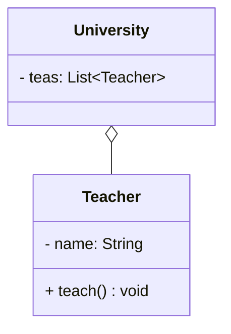
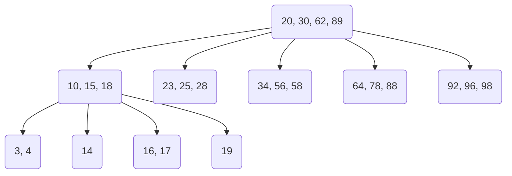
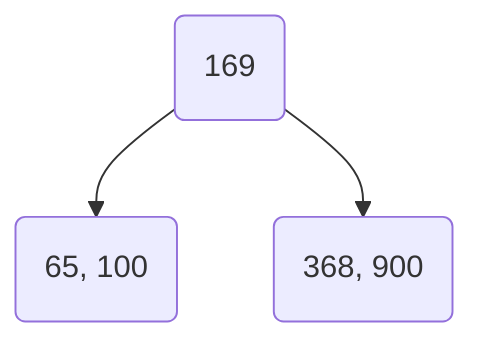
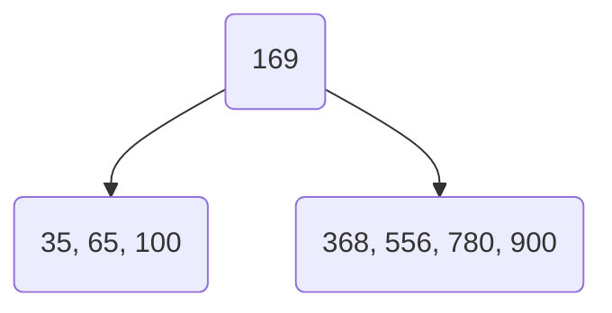
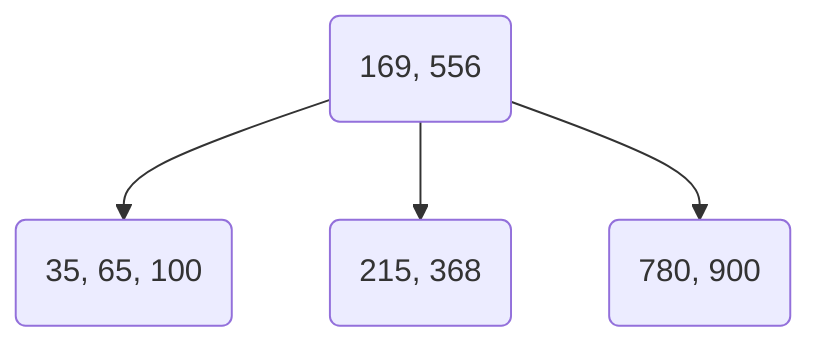
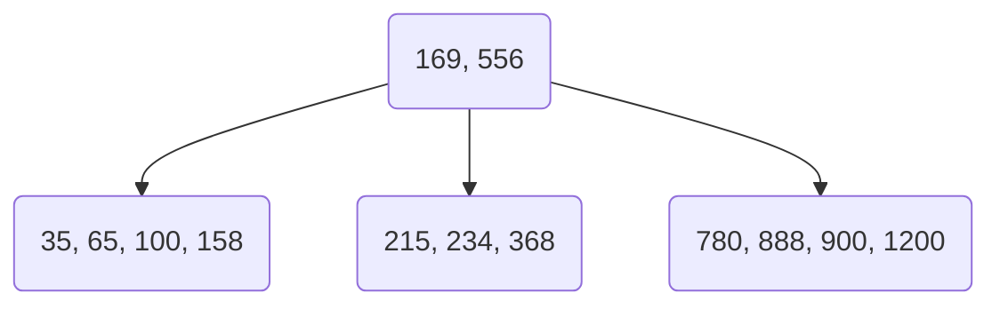
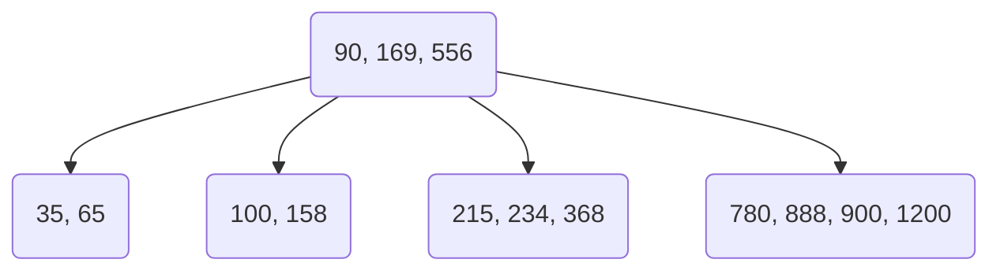
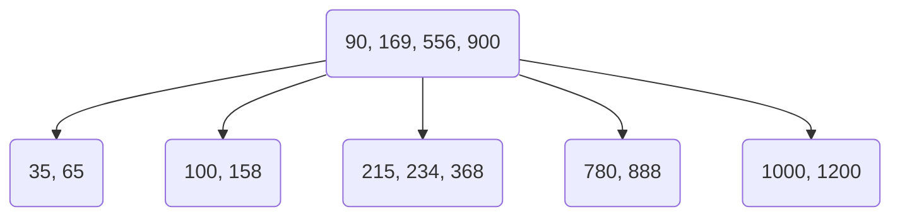
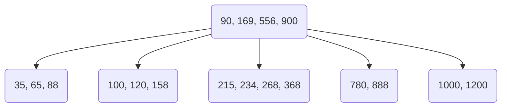
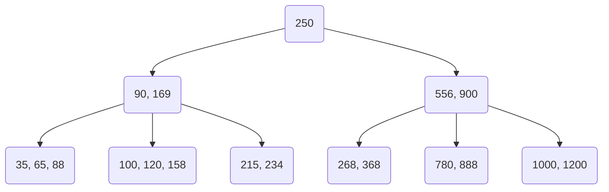

import CodeBlock from '@theme/CodeBlock';

# 索引

* 索引（index）是帮助MySQL**高校获取数据**的**数据结构（有序）**。在数据之外，
数据库系统还维护着满足特点查找算法的数据结构，这些数据结构以某种方式引用（指向）数据，
这样就可以在这些数据结构上实现高级查找算法，这种数据结构就是索引
* 假如有一张用户表，需要查询出这张表内所有年龄等于30岁的用户
    * 在没有索引的情况下，需要将整张表遍历一遍才能找到所有年龄等于30岁的用户，
    这种方式也叫**全表扫描**
    * 在有索引的情况下，会根据年龄这一列数据构建一颗二叉树，再搜索时就会提高效率。
    这种方式类似二分搜索和遍历的对比
* 优缺点

| 优势   | 劣势    |
|--------------- | --------------- |
| 提高数据检索效率，降低数据库IO成本   | 索引列也需要占用空间   |
| 通过索引列对数据进行排序，降低数据排序的成本，降低CPU的消耗 | 索引大大提高了查询效率，同时也降低了更新表的速度，如对表进行INSERT、UPDATE、DELETE时，效率降低 |

## 索引结构

### 二叉树和红黑树的问题

* 二叉搜索树



* 如果按顺序插入，就会出现以下情况


* 此时二叉树就会形成一个链表，查询性能大大降低。大数据量情况下，层级较深，检索速度慢
* 使用**红黑树**则可以避免树形成链表的情况，但是在大数据量的情况下，层级还是较深

### B Tree(多路平衡查找树)

* 以一颗最大**度数**（max-degree）为5阶的b tree为例（每个节点最多储存4个key，5个指针）
* **度数**：指每个节点最大的子节点数量
* b tree的数据和key存放在一起



#### B Tree构建过程

> [数据结构在线构建动画](https://www.cs.usfca.edu/~galles/visualization/Algorithms.html)

* 以在度数为5的B Tree内插入100 65 169 368 900 556 780 35 215 1200 234 888 158 90 1000 88 120 268 250数据为例
* 首先插入100 65 169 368，构成一个(65, 100, 169, 268)的节点
* 此时再插入900，由于度数为5，此时树会发生裂变，中间元素向上裂变。(65, 100, 169, 268, 900)内中间元素是169，裂变后如下：



* 依次插入556 780 35


* 此时插入215后再次裂变



* 依次插入1200 234 888 158



* 插入90后再次裂变



* 插入1000后再次裂变



* 依次插入88 120 268



* 插入250后裂变后由于根节点的子节点也满了，所以进行了两次裂变，最终结构如下



### B+Tree

* B+Tree结构
* B+Tree所有的数据都保存在叶子节点
* 所有的叶子节点会形成一个单项链表


#### B+Tree构建过程

> [数据结构在线构建动画](https://www.cs.usfca.edu/~galles/visualization/Algorithms.html)

* 以在度数为5的B+Tree内插入100 65 169 368 900 556 780 35 215 1200 234 888 158 90 1000 88 120 268 250数据为例
* 构建过程和`B Tree`类似，只不过裂变的时候中间的数据会在子节点内保存一份
* TODO

### MySQL内的B+Tree

* MySQL索引数据结构对经典的B+Tree进行了优化。在原B+Tree的基础上，
增加一个指向相邻叶子节点的链表指针，就形成了带有顺序指针的B+Tree，提高了区间访问的性能


### Hash

* 哈希索引就是采用一定的hash算法，将键值换算成新的hash值，映射到对应的槽位上，然后存储在hash表中
* 过程类似Java内的HashMap
    * 将添加索引的这一列的每个数据进行hash算法，再将hash值和对应这一列的数据地址存入对应的槽位中
    * 如果出现两个hash值一样的数据（hash冲突），则将新的数据以链表的方式连接到上一个值后面
* hash索引的特点
    * hash索引只能用于对等比较（=，in），不支持范围查询（between，&lt;，>）
    * 无法利用索引完成排序操作
    * 查询效率高，通常只需要一次检索就可以了，效率通常要高于B+Tree索引
* 存储引擎支持
    * 在MySQL中，支持hash索引的是Memory引擎，而InnoDB中具有自适应hash功能，
    hash索引是存储引擎根据B+Tree索引在指定条件下自动构建的

### InnoDB选择B+Tree作为默认索引的原因

* 相对于二叉树，层级更少，搜索效率高
* 对于B Tree，无论是叶子节点还是非叶子节点，都会保存数据，这样导致一页中存储的键值减少，
指针跟着减少，要同样白村大数据量，只能增加树的高度，导致性能降低
* 相对于Hash索引，B+Tree支持方位匹配及排序操作

## 索引分类

| 分类    | 含义    | 特点    | 关键字    |
|---------------- | --------------- | --------------- | --------------- |
| 主键索引    | 针对表中主键创建的索引    | 默认自动创建，只能有一个    | PRIMARY    |
| 唯一索引    | 避免同一个表中某数据列中的值重复   | 可以有多个   | UNIQUE   |
| 常规索引   | 快速定位特定的数据   | 可以有多个   |    |
| 全文索引 | 全文索引查找的是文本中的关键字，而不是比较索引中的值| 可以有多个 | FULLTEXT |

* 在InnoDB存储引擎中，根据索引的存储形式，又可以分为以下两种

| 分类    | 含义    | 特点    |
|---------------- | --------------- | --------------- |
| 聚集索引（Clustered Index）    | 将数据存储与索引放在一块，索引结构的叶子节点保存了行数据    | 必须又，而且只有一个    |
| 二级索引（Secondary Index）    | 将数据与索引分开存储，索引结构的叶子节点关联的是对应的主键    | 可以存在多个    |

* 聚集索引选取规则：
    * 如果存在主键，主键索引就是聚集索引
    * 如果不存在主键，将使用第一个唯一（UNIQUE）索引作为聚集索引
    * 如果既没有主键，也没有唯一索引，则InnoDB会自动生成一个rowid作为隐藏的聚集索引

### 回表查询

* 有一张用户表`user`，表内有`id`、`name`两个字段
    * 其中`id`字段是主键，也就是聚集索引
    * `name`字段创建了索引，也就是二级索引
* `SELECT * FROM user WHERE name = 'zs';`
    * 这样一条sql会先走二级索引，找到`name`对应的`id`
    * 再根据`id`走聚集索引，找到这行的数据
    * 这个过程就叫**回表查询**

### InnoDB主键索引的B+Tree高度和数据量直接的关系

* 假设一行数据为1k，一页（默认大小为16k）可以存储16行这样的数据。InnoDB的指针占用6个字节，
主键为bigint，占用8个字节
* 如果树的高度为2
    * 设一页可以存放的主键个数为n
    * n * 8 + (n + 1) * 6 = 16 * 1024
    * 可以得出n约为1170，所以一页（默认16k）可以存储1170个主键，和1171个指针
    * 1171指针又指向1171个页
    * 所以高度为2的B+Tree大约可以存储1171 * 16 = 18736条数据

## 索引语法

```sql
-- 创建索引，如果同时填写多个字段，则创建的索引为联合索引
CREATE [UNIQUE | FULLTEXT] INDEX index_name ON table_name(col_name1, col_name2, ...);

-- 查看索引
SHOW INDEX FROM table_name;

-- 删除索引
DROP INDEX index_name ON table_name;
```

## SQL性能分析

### SQL执行频率

* MYSQL客户端连接成功后，通过`SHOW [SESSION | GLOBAL] STATUS`命令可以查询服务器状态信息
* `SHOW GLOBAL STATUS LIKE 'Com_______';`查询全局所有INSERT、UPDATE、DELETE、SELECT的访问次数

### 慢查询日志

* 慢查询日志记录了所有执行时间超过指定参数（long_query_time，单位：秒，默认10秒）的所有SQL语句的日志
* MySQL的慢查询日志默认没有开启，需要在MySQL的配置文件（/etc/my.cnf）中配置，
使用`SHOW VARIABLES LIKE 'slow_query_log%';`查询慢查询日志相关配置

```bash
# 需要在这个标签下添加
[mysqld]

# 开启MySQL慢查询
slow_query_log=1

# 设置满日志的时间为2秒，SQL语句执行时间超过2秒，就会视为慢查询，记录慢查询日志
long_query_time=2
```

* 配置完成后，重启MySQL服务
* 使用`tail -f /var/lib/mysql/日志文件.log`监控日志文件
* 使用`SELECT sleep(3);`测试

### profile详情

* show profile能够在做SQL优化时帮助我们了解时间都耗费在哪了

```sql
-- 查看当前MySQL是否支持profile操作
SELECT @@have_profiling;

-- 查看profile功能是否开启
SELECT @@profiling;

-- 开启profiling
SET [SESSION | GLOBAL] profiling = 1;

-- 查看每一条SQL的耗时基本情况
SHOW PROFILES;

-- 查看指定query_id的SQL语句各个阶段的耗时情况
SHOW PROFILE FOR QUERY query_id;

-- 查看指定query_id的SQL语句CPU的使用情况
SHOW PROFILE CPU FOR QUERY query_id;
```

### explain执行计划

* EXPLAIN或DESC命令获取MYSQL如何执行SELECT语句的信息，包括在SELECT语句执行过程中表如何连接的顺序

```sql
-- 直接在SELECT语句之间加上关键字EXLPAIN或DESC
EXPLAIN SELECT 字段列表 FROM 表名 WHERE 条件
```
### explain执行计划各字段含义

| 字段   | 含义    |
|--------------- | --------------- |
| [id](#id)   | select查询的序号，   |
| [select_type](#select_type) | 表示SELECT的类型，常见取值有SIMPLE、PRIMARY、UNION、SUBQUERY |
| [type](#type) | 连接类型 |
| possible_key | 显示可能应用在这张表上的索引，一个或多个 |
| key | 实际使用的索引，如果为NULL，则没有使用索引 |
| [key_len](#key_len) | 表示索引中使用的字节数 |
| rows | MySQL认为必须要执行查询的行数，在InnoDB的表中，是一个估计值 |
| filtered | 表示返回结果的行数占需读取行数的百分比，filtered的值越大越好 |
| [extra](#extra) | 表示是否用到了索引，查询的列是否被索引覆盖 |

#### id

*  表示查询中执行的select子句或是操作表的顺序
    * id相同，执行顺序从上到下
    * id不同，值越大，越先执行

#### select_type
* **SIMPLE**：简单表，即不使用表连接或子查询
* **PRIMARY**：主查询，即外层的查询
* **UNION**：UNION中的第二个或者后面的查询语句
* **SUBQUERY**：SELECT/WHERE之后包含了子查询

#### type

* 性能由好到差的连接类型为`NULL` `system` `const` `eq_ref` `ref` `range` `index` `all`

#### key_len

* 该值为索引字段最大可能长度，并非实际使用长度，在不损失精确性的前提下，长度越短越好

#### extra

* **null**：使用了索引，但是查询的列未被索引覆盖
* **using index**：使用了索引，查询的列都被索引覆盖，不需要回表查询，或order by时直接按索引顺序返回排序后的数据
* **using where;using index**：查询条件不是联合索引的最左列，但是查询的列被联合索引覆盖到了，用到了联合索引
* **using where**：用到的索引不是联合索引最左边的字段
* **using index condition**：使用了索引，但是需要[回表查询](#回表查询)数据
* **using filesort**：通过表的索引或全表扫描，读取满足条件的数据行，然后再排序缓冲区sort buffer中完成排序操作,
所以不是通过所以直接返回排序结果的排序都叫FileSort排序

## 索引使用

### 最左前缀法则

* 如果索引了多列（联合索引），要遵守最左前缀法则，最左前缀法则指的是查询从索引的最左列开始，
并且不跳过索引中的列，如果跳跃某一列，索引将部分失效（后面的字段索引失效）

#### 测试

```sql
-- 创建表
CREATE TABLE `app_user`(
    `id` INT  NOT NULL AUTO_INCREMENT COMMENT '主键',
    `name` VARCHAR(50) DEFAULT '' COMMENT '用户名称',
    `email` VARCHAR(50) NOT NULL COMMENT '邮箱',
    `phone` VARCHAR(20) DEFAULT '' COMMENT '手机号',
    `gender` TINYINT DEFAULT '0' COMMENT '性别（0-男  ： 1-女）',
    `password` VARCHAR(100) NOT NULL COMMENT '密码',
    `age` TINYINT DEFAULT '0' COMMENT '年龄',
    `create_time` DATETIME DEFAULT NOW(),
    `update_time` DATETIME DEFAULT NOW(),
    PRIMARY KEY (`id`) 
)COMMENT='用户表';

INSERT INTO app_user (name,email,phone,gender,password,age,create_time,update_time) VALUES
     ('用户0','2737973569qq.com','1839405813',1,'0f1a1342-7b3f-11ef-a986-0242ac110002',63,'2024-09-25 13:07:03','2024-09-25 13:07:03'),
     ('用户1','2637298275qq.com','181494517358',1,'0f1a16df-7b3f-11ef-a986-0242ac110002',27,'2024-09-25 13:07:03','2024-09-25 13:07:03'),
     ('用户2','21117464564qq.com','18227598531',1,'0f1a18c5-7b3f-11ef-a986-0242ac110002',81,'2024-09-25 13:07:03','2024-09-25 13:07:03');

-- 添加联合索引
CREATE index idx_name_age_email on app_user(name, age, email);

-- 添加单列索引
CREATE INDEX idx_phone ON app_user(phone);
```

* 此时`app_user`表内的`name`，`age`，`email`这三个字段组成了联合索引

```sql
-- 下面这三条SQL索引最左边的字段都在，都走了索引，索引长度在递减
EXPLAIN SELECT * FROM app_user WHERE name = '用户1' AND age = 27 AND email = '2637298275qq.com';
EXPLAIN SELECT * FROM app_user WHERE name = '用户1' AND age = 27;
EXPLAIN SELECT * FROM app_user WHERE name = '用户1';

-- 下面这两条SQL索引最左边的字段不在，没走索引，索引失效
EXPLAIN SELECT * FROM app_user WHERE age = 27 AND email = '2637298275qq.com';
EXPLAIN SELECT * FROM app_user WHERE age = 27;

-- 下面这条SQL索引最左边的字段在，但跳过了一个字段，相当于只有name走了索引，email字段没走索引
EXPLAIN SELECT * FROM app_user WHERE name = '用户1' AND email = '2637298275qq.com';

-- 下面这条SQL的name条件在中间也走了索引，因为最左前缀法则和条件的位置没关系，只看索引最左边的字段是否存在
EXPLAIN SELECT * FROM app_user WHERE age = 27 AND name = '用户1' AND email = '2637298275qq.com';
```

### 范围查询

* 联合索引中，出现范围查询（>，&lt;），范围查询右侧的索引列失效

#### 测试

```sql
-- 使用范围查询的索引其后面的列的索引会失效，相当于只走了name和age的索引
EXPLAIN SELECT * FROM app_user WHERE name = '用户1' AND age > 27 AND email = '2637298275qq.com';

-- 在业务允许的情况下，范围的条件添加一个=可以避免这种情况
EXPLAIN SELECT * FROM app_user WHERE name = '用户1' AND age >= 27 AND email = '2637298275qq.com';
```

### 索引失效的情况

#### 索引列运算操作

* 在索引列上进行运算操作，索引会失效

```sql
EXPLAIN select * FROM app_user WHERE phone = '181494517358';
EXPLAIN SELECT * FROM app_user WHERE SUBSTR(phone, 9, 2) = '58';
```

#### 字符串不加引号

* 字符串字段使用时，不加引号，索引会失效

```sql
EXPLAIN SELECT * FROM app_user WHERE phone = '181494517358';
EXPLAIN SELECT * FROM app_user WHERE phone = 181494517358;
```

#### 模糊查询

* 如果只是尾部模糊匹配，索引不会失效。如果是头部模糊匹配，索引失效

```sql
-- 索引不失效
EXPLAIN SELECT * FROM app_user WHERE phone LIKE '18149451%';

-- 索引失效
EXPLAIN SELECT * FROM app_user WHERE phone LIKE '%94517358';
```

#### or连接的条件

* 用or分割开的条件，如果or两边条件中的如果一侧有索引，另一侧没有索引，
那么涉及到的索引都不会被用到

```sql
-- 因为age字段没有索引，以下SQL都不会用到索引
EXPLAIN SELECT * FROM app_user WHERE id = 1 OR age = 63;
EXPLAIN SELECT * FROM app_user WHERE id = 1 OR age = 63 ;
EXPLAIN SELECT * FROM app_user WHERE phone = '1839405813' OR age = 63;
```

#### 数据分布影响

* 如果MySQL评估使用索引比全表更慢，则不使用索引

```sql
-- 给age字段添加索引后，查询年龄大于20岁的用户，因为数据库内大部分数据年龄都大于20岁，所以没有走索引
explain SELECT * from app_user where age > 20;

-- 年龄大于90岁的很少，所以需要走索引
explain SELECT * from app_user where age > 90;
```

### SQL提示

* SQL提示，是优化数据库的一个重要的手段，就是在SQL语句中加入一些人为的提示来达到优化操作的目的

```sql
-- 给name字段单独添加一个索引，此时name字段有一个单列索引，还有一个联合索引
CREATE INDEX idx_name ON app_user(name);

-- 在使用name单独查询时，分析中possible_key有联合索引和单列索引，但实际用的是联合索引
EXPLAIN SELECT * FROM app_user WHERE name = '用户1';

-- 建议MySQL使用name字段的单列索引
EXPLAIN SELECT * FROM app_user USE INDEX(idx_name) WHERE name = '用户1';

-- 建议MySQL忽略name字段的联合索引，此时possible_key就只有单列索引
EXPLAIN SELECT * FROM app_user IGNORE INDEX(idx_name_age_email) WHERE name = '用户1';

-- 强制MySQL使用指定的索引
EXPLAIN SELECT * FROM app_user FORCE INDEX(idx_name_age_email) WHERE name = '用户1';
```

### 覆盖索引

* 尽量使用覆盖索引（查询使用了索引，并且需要返回的列，在该索引中已经全部能找到），减少`select *`
* explain时，[extra字段出现的内容](#explain执行计划各字段含义)

```sql
-- 删除多余的索引，只保留name,age,email的联合索引

-- name email age 为联合索引，而id是联合索引的叶子节点，所以不需要回表查询
EXPLAIN SELECT id, name, age, email FROM app_user WHERE name = '用户0' AND email = '2737973569qq.com' AND age = 63;

-- phone字段在联合索引内查不到，所以需要根据叶子节点的id字段在聚合索引内查询
EXPLAIN SELECT id, name, age, email, phone FROM app_user WHERE name = '用户0' AND email = '2737973569qq.com' AND age = 63;
```

### 前缀索引

* 当前字段类型为字符串（varchar, text等）时，有时候需要索引很长的字符串，
这会让索引变得很大，浪费大量的磁盘IO，影响查询效率。此时可以只将字符串的一部分前缀建立索引，
这样可以大大节约索引空间，从而提高索引效率
* 语法：`CREATE INDEX index_name ON table_name(column(n)); `
* 前缀长度：可以根据索引的**选择性**来决定，**选择性**是指**不重复的索引值（基数）**和**数据表的记录总数**的比值，
索引选择性越高则查询效率越高，选择性越接近1，性能越好

```sql
-- 查询用户表内有多少数据
SELECT COUNT(*) FROM app_user;

-- 查询用户表内不重复的email字段有多少数据
SELECT COUNT(DISTINCT email) FROM app_user;

-- 查询email字段的选择性
SELECT COUNT(DISTINCT email) / count(*) FROM app_user;

-- 截取email字段前几个字符查询选择性，发现前8个字符的选择性和email字段的选择性差不多
SELECT COUNT(DISTINCT SUBSTR(email, 1, 8)) / COUNT(*) FROM app_user;

-- 根据email前8个字符创建索引
CREATE INDEX idx_email_8 ON app_user(email(8));

-- 使用了索引
EXPLAIN SELECT * FROM app_user WHERE email = '2737973569qq.com';
```

* 前缀索引查询过程，以`SELECT * FROM app_user WHERE email = '2737973569qq.com';`为例
    1. 根据查询条件的前8位走索引查询
    2. 查询到27379735的叶子节点对应的id再走聚合索引
    3. 根据id在聚合索引内查到对应的字段后，再比较email字段后面的字段是否对的上
    4. 如果对的上则返回数据，继续查询
    5. 如果对不上则返回到前缀索引上继续查询

### 单列索引和联合索引

* 单列索引：即一个索引只包含单个列
* 联合索引：一个索引包含多列
* 在业务场景中，如果存在多个查询条件，在对于查询字段建立索引时，建议建立联合索引，而非单列索引

```sql
-- app_user表中email和phone都有单独的索引

-- 此时使用email和phone字段查询时，只会使用一个索引，并会进行回表查询
EXPLAIN SELECT id, email, phone FROM app_user WHERE email = '2737973569qq.com' AND phone = '1839405813';

-- 创建email和phone的联合索引
CREATE INDEX idx_email_phone ON app_user(email, phone);

-- 查询时指定使用联合索引，此时就避免了回表查询
EXPLAIN SELECT id, email, phone FROM app_user USE INDEX(idx_email_phone) WHERE email = '2737973569qq.com' AND phone = '1839405813';
```

## 索引设计原则

* 针对数据量大（100w条以上），且查询比较频繁的表建立索引。
* 针对于常用作为查询条件（where）、排序（order by）、分组（group by）操作的字段建立索引
* 尽量选择区分度高的列作为索引，尽量建立唯一索引，区分度越高，使用索引的效率就越高
* 如果是字符串类型的字段，字段的长度较长，可以针对于字段的特点，建立前缀索引
* 尽量使用联合索引，减少单列索引，查询时，联合索引很多时候可与覆盖索引，节省存储空间，
避免回表，提高查询效率
* 要控制索引的数量，索引并不是越多越好，索引越多，维护索引结构的代价也就越大，会影响增删改的效率
* 果索引列不能存储NULL值，在创建表时使用NOT NULL约束它。当优化器知道每列是否包含NULL值时，
它可以更好地确定哪个索引最有效地用于查询

---

## SQL优化

### 插入优化

#### insert优化

* 批量插入

```sql
-- 一次批量插入的数据不建议超过1000条
INSERT INTO table_name VALUES
(value1, value2, ...), (value1, value2, ...),
(value1, value2, ...), (value1, value2, ...);
```

* 手动提交事务

```sql
START TRANSACTION

-- 插入1000条
INSERT INTO table_name VALUES
(value1, value2, ...), (value1, value2, ...),
(value1, value2, ...), (value1, value2, ...);

-- 插入1000条
INSERT INTO table_name VALUES
(value1, value2, ...), (value1, value2, ...),
(value1, value2, ...), (value1, value2, ...);

-- 插入1000条
INSERT INTO table_name VALUES
(value1, value2, ...), (value1, value2, ...),
(value1, value2, ...), (value1, value2, ...);

COMMIT;
```
* 主键顺序插入

```sql
INSERT INTO table_name (id, column1, column2, ...) VALUES
(1, value1, value2, ...),
(2, value1, value2, ...),
(3, value1, value2, ...),
(4, value1, value2, ...);
```

#### 大批量插入数据

> 测试表[app_user](#测试)

* 准备测试文件`app_user.txt`

```txt
3253452,zs,5872673547@qq.com,29743974574349,1,hgufswqer[ujiwjerj,28
3253453,zs1,582673547@qq.com,2743974574349,0,hgufsujiwjerewrqqewj,30
3253454,ls,587267357@qq.com,29743974349,1,hgufsuwreeqwjiwjerj,43
3253455,ww,587267547@qq.com,9743974574349,0,hgufsujiwsdjfhjerj,20
```

* 使用`mysql --local-infile -u 用户名 -p`进入

```sql
-- 开启从本地加载文件导入数据的开关
set global local_infile = 1;

-- 使用指定数据库
use datebase_name;

-- 执行load指令将准备好的数据，加载到表结构中
load data local infile '文件存放路径/app_user.txt' into table `app_user` fields terminated by ',' lines terminated by '\n';
```

### 主键优化

* 在InnoDB存储引擎中，表数据都是根据主键顺序组织存放的，这种存储方式的表称为**索引组织表**（index organized table/IOT)

#### 页分裂

* 页可以为空，页可以填充一半，页可以填充1000%。每个页包含2-N行数据（如果一行数据过大，会行溢出），根据之间排列
* 在B+Tree的特殊结构下，我们插入的数据都是根据主键顺序存放在叶子节点上的，
而叶子节点具体是存放在Page上的，一个Page具体大小是固定的，在主键乱序插入的情况下，
可能出现Page上的数据满了，需要往里面插入一条新数据，但Page没空间了，此时就会出现**页分裂**

##### 主键顺序插入的情况

* 假设每行数据的大小是一样的，每页只能保存3行数据
* 依次插入主键为1、2、3的数据，在插入主键为4的数据时，页已经满了，
需要新申请一页存放数据并建立两个页之间的双向指针，如下：


* 依次插入主键为5、6、7、8的数据的操作和上面类似


##### 主键乱序插入的情况

* 假设和上面一样，但是依次插入1、5、9、23、47、50的数据后，结构如下


* 当再插入id为11的数据时，由于第一页（包含1的是第一页，包含23的是第二页）已经满了，需要进行页分裂
    * 将第一页后50%的数据取出， 和新插入的数据放入新分配的页内（第三页）
    * 再修改第一页的指针指向第三页，第三页的指针指向第二页，如下


#### 页合并

* 当删除一行记录是，实际上记录并没有物理删除，只是被标记（flaged）为删除并且它的空间变得允许被其他记录声明使用
* 当页删除的记录达到`MERGE_THRESHOLD`（默认为页的50%），InnoDB会开始寻找最靠近的页（前或后）
看看是否可以将两个页合并以优化空间使用
     * **MERGE_THRESHOLD**：合并页阈值，可以自己设置，在创建表或创建索引时指定

##### 页合并情况

* 假设每行数据的大小是一样的，每页只能保存3行数据
* 依次插入1、2、3、4、5、6、7、8


* 删除5、6，此时数据不会被物理删除，而是标记删除这里我使用`x`代表


* 由于第二页的空间小于50%，开始进行页合并
    * 查找到后面的页（第三页）刚好可以合并，将第三页的数据合并进来，覆盖之前标记删除的数据
    * 此时第三页不会被释放，只是数据为空，等待后续数据插入


#### 主键设计原则

* 满足业务需求情况下，尽量降低主键长度
* 插入数据时，尽量选择顺序插入，选择使用**AUTO_INCREMENT**自增主键
* 尽量不要使用UUID做主键或者是其他自然主键，如身份证号
* 业务操作时，避免对主键进行修改

### order by优化

> 测试表[app_user](#测试)，只保留主键索引

* 使用explain分析SQL查看[extra](#explain执行计划各字段含义)的属性
    * **using filesort**：表示需要额外的排序
    * **using inext**：表示直接根据索引顺序完成排序

```sql
-- 根据gender,phone升序排序时，出现了using filesort
EXPLAIN SELECT id, gender, phone FROM app_user ORDER BY gender, phone;

-- 创建gender,phone的联合索引
CREATE INDEX idx_gender_phone ON app_user(gender, phone);

-- 此时再查则是using index
EXPLAIN SELECT id, gender, phone FROM app_user ORDER BY gender, phone;

-- 如果根据gender倒序和phone倒叙查询会出现：Backward index scan; Using index表示反向使用索引查找
EXPLAIN SELECT id, gender, phone FROM app_user ORDER BY gender DESC, phone DESC;

-- 如果排序时调换phone和gender的顺序会出现：Using index; Using filesort，排序也遵循最左前缀法则
EXPLAIN SELECT id, gender, phone FROM app_user ORDER BY phone, gender;

-- 如果根据gender升序排序根据phone降序排序会出现：Using index; Using filesort 
EXPLAIN SELECT id, gender, phone FROM app_user ORDER BY gender ASC, phone DESC;

-- 上面的情况需要创建根据升序的gender和降序的phone创建一个联合索引
CREATE INDEX idx_gender_phone_ad ON app_user(gender ASC, phone DESC);
```

### group by优化

> 测试表[app_user](#测试)，只保留主键索引

* 使用explain分析SQL查看[extra](#explain执行计划各字段含义)的属性
    * **using temporary**：使用临时表进行分组
    * **using inext**：使用到了索引
* 分组操作时添加索引也可以提高效率
* 分组操作时，索引的使用也要满足最左前缀法则

```sql
-- 在没有索引的情况下根据email分组查询时，出现了using temporary
EXPLAIN SELECT email, COUNT(*) same_email FROM app_user GROUP BY email;

-- 创建一个email和phone的联合索引
CREATE INDEX idx_email_phone ON app_user(email, phone);

-- 此时再根据email进行分组查询出现using index，使用到了联合索引的最左前缀
EXPLAIN SELECT email, COUNT(*) same_email FROM app_user GROUP BY email;

-- 使用email和phone分组查询也一样
EXPLAIN SELECT email, phone, COUNT(*) FROM app_user GROUP BY email, phone;

-- 将email作为where条件，再根据phone进行分组查询，也是using index，group by和where可以同时使用，只要遵守最左前缀法则
EXPLAIN SELECT email, phone, COUNT(*) FROM app_user WHERE email = '2548928007qq.com' GROUP BY phone;
```

### limit优化

* 一个常见的问题是`limit 1000000000,10`，此时需要MySQL排序前1000000010记录，
仅仅返回1000000000 - 1000000010的记录，其他记录丢弃，查询排序的代价非常大
* 优化思路：一般分页查询时，通过创建覆盖所有能够比较好的提高性能，
可以通过覆盖索引加子查询的形式进行优化

```sql
-- 分页查询100万条后面的数据时非常卡
SELECT * FROM app_user au LIMIT 1000000, 10;

-- 根据id索引排序后只查询id的情况下，大概优化了40%
SELECT id FROM app_user ORDER BY id LIMIT 1000000,10;

-- 配合子查询查询每行数据
SELECT a.* FROM app_user a, (SELECT id FROM app_user ORDER BY id LIMIT 1000000,10) b
WHERE a.id = b.id
```

### count优化

* MyISAM引擎把一个表的总行数存在磁盘上，因此执行`COUNT(*)`的时候会直接返回这个个数，效率很高
* InnoDB引擎它执行`COUNT(*)`的时候，需要把数据一行一行地从引擎里面读取出来，然后累计计数
* 所以count的优化思路就是使用其他方式自己维护一个累加值

#### count的用法

* `COUNT()`是一个聚合函数，对于返回的结果集，一行行地判断，如果count函数的参数不是NULL，
累计值就加一，否则不加，最后返回累计值
* 四种用法：
    * **COUNT(主键)**：InnoDB引擎会遍历整张表，把每一行的主键值都取出来，返回给服务层。
    服务层拿到主键后，直接按行进行累加（主键不可能为null）
    * **COUNT(字段)**：
        * **没有not null约束**：InnoDB引擎会遍历整张表把每一行的字段值都取出来，
        返回给服务层，服务层判断是否为null，不为null，计数累加
        * **有not null约束**：InnoDB引擎会遍历整张表把每一行的字段值都取出来吗，
        返回给服务层，直接按行进行累加
    * **COUNT(1)**：InnoDB引擎会遍历整张表，但不取值。服务层对于返回的每一行，放一个数字1进去，
    直接按行进行累加
    * **COUNT(*)**：InnoDB引擎不会把全部字段取出来，而是专门做了优化，不取值，服务层直接按行进行累加
* 按照效率排序
    * **COUNT(*)** 约等于 **COUNT(1)** > **COUNT(主键)** > **COUNT(字段)**
    * 所以尽量使用**COUNT(*)**

### update优化

* 准备SQL

```sql
CREATE TABLE account(
    id INT AUTO_INCREMENT PRIMARY KEY COMMENT '主键',
    name VARCHAR(10) COMMENT '姓名',
    money INT COMMENT '余额'
) COMMENT '账户表';

INSERT INTO account VALUES (NULL, 'zhangsan', 2000), (NULL, 'lisi', 2000);
```
#### 使用主键更新数据

* 打开两个命令行窗口，使用`mysql -u 用户名 -p`登录两个session
* 以下左边为**session1**，右边为**session2**
<div class="v-codeblock-root">
    <CodeBlock className="v-codeblock-left" language="sql">{
`-- 使用指定的数据库
USE db_name;

-- 以下操作按左右框内的序号执行

-- 1. 开启事务
START TRANSACTION;

-- 3. 更新id为1的数据
UPDATE account SET money = 1000 WHERE id = 1;

-- 提交事务
COMMIT;`
        }</CodeBlock>
    <CodeBlock className="v-codeblock-right" language="sql">{
`-- 使用指定的数据库
USE db_name;

-- 以下操作按左右框内的序号执行

-- 2. 开启事务
START TRANSACTION;

-- 4. 更新id为2的数据，此时正常更新
UPDATE account SET money = 2000 WHERE id = 2;

-- 提交事务
COMMIT;`
        }</CodeBlock>
</div>

#### 使用其他字段更新数据（未加索引的字段）

* 打开两个命令行窗口，使用`mysql -u 用户名 -p`登录两个session
* 以下左边为**session1**，右边为**session2**
<div class="v-codeblock-root">
    <CodeBlock className="v-codeblock-left" language="sql">{
`-- 使用指定的数据库
USE db_name;

-- 以下操作按左右框内的序号执行

-- 1. 开启事务
START TRANSACTION;

-- 3. 更新name为zhangsan的数据
UPDATE account SET money = 1000 WHERE name = 'zhangsan';

-- 提交事务
COMMIT;`
        }</CodeBlock>
    <CodeBlock className="v-codeblock-right" language="sql">{
`-- 使用指定的数据库
USE db_name;

-- 以下操作按左右框内的序号执行

-- 2. 开启事务
START TRANSACTION;

/* 
4. 更新id为2的数据，此时会卡住
由于上一个事务更新时使用了未加索引的字段进行作为条件 导致这张表被锁了，无法更新
需要上一个事务提交后才能继续执行
*/
UPDATE account SET money = 2000 WHERE id = 2;

-- 提交事务
COMMIT;`
        }</CodeBlock>
</div>

* 从上面的例子可以看出，InnoDB的行锁是针对索引加的锁，不是针对记录加的锁，
并且该索引不能失效，否则会从行锁升级为表锁
* update时尽量使用主键更新，或者使用带索引的字段更新
