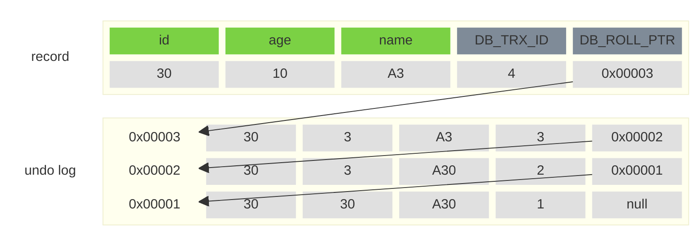
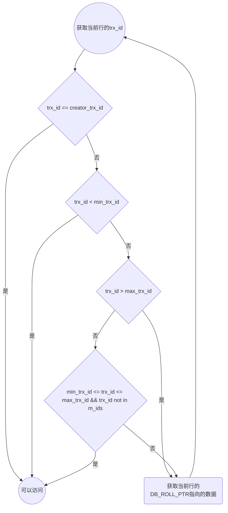

import CodeBlock from '@theme/CodeBlock';

# InnoDB引擎

## 存储引擎说明

* MySQL体系结构


* **连接层**：最上层是一些客户端和链接服务，主要完成一些类似于连接处理、授权认证、及相关安全方案
* **服务层**：第二层主要完成大多数的核心服务功能，如SQL接口，并完成缓存的查询，
SQL的分析和优化，部分内置函数的执行。所有跨存储引擎的功能也在这一层实现，过程、函数等
* **引擎层**：存储引擎负责MySQL中数据的存储和提取，服务器通过API和存储引擎进行通信。
不同的存储引擎具有不同的功能，可以选择合适的存储引擎或自定义存储引擎
* **存储层**：主要将数据存储在文件系统上，并完成与存储引擎的交互

### 存储引擎简介

* 存储引擎就是存储数据、建立索引、更新/查询数据等技术的实现方式。存储引擎是基于表的，
而不是基于库的，所以存储引擎也可以称为表类型

```sql
-- 建表时指定存储引擎
CREATE TABLE 表名(
    字段1 字段1类型 [COMMENT '字段1注释'],
    字段2 字段2类型 [COMMENT '字段2注释'],
    字段3 字段3类型 [COMMENT '字段3注释'],
    ...
    字段N 字段N类型 [COMMENT '字段N注释']
) ENGINE=INNODB [COMMENT '表注释'];

-- 查看数据库支持的存储引擎
SHOW ENGINES;
```

### MyISAM存储引擎

* MyISAM是早期的默认存储引擎
* 不支持事务，不支持外键。支持表锁，不支持行锁。访问速度快
* 相关文件
    * **table_name.sdi**：存储表结构信息，就是json文件
    * **table_name.MYD**：存储数据
    * **table_name.MYI**：储存索引

### Memory存储引擎

* Memory引擎的表数据是存储在内存中的，由于受到硬件问题、或断电问题的影响，
只能将这些表作为作为临时表或缓存使用
* 内存存放，hash索引（默认）
* 只有**table_name.sdi**文件来存储表结构信息

### 存储引擎对比

| 特点    | InnoDB    | MyISAM    | Memory    |
|---------------- | --------------- | --------------- | --------------- |
| **存储限制**    | 64TB    | 有    | 有    |
| **事务安全**    | 支持   | -   | -   |
| **锁机制**   | 行锁   | 表锁   | 表锁   |
| **B+Tree索引** | 支持 | 支持 | 支持 |
| **Hash索引** | - | - | 支持 |
| **全文索引** | 支持（5.6版本后） | 支持 | - |
| **空间使用** | 高 | 低 | N/A |
| **内存使用** | 高 | 低 | 中等 |
| **批量插入速度** | 低 | 高 | 高 |
| **支持外键** | 支持 | - | - |

---

## InnoDB存储引擎

* InnoDB是一种兼顾高可靠和高性能的通用存储引擎，在MySQL5.5之后，InnoDB是默认的存储引擎
* InnoDB的**DML**操作遵循**ACID**模型，支持**事务**。
InnoDB支持**外键**FOREIGN KEY约束，保证数据的完整性和正确性。支持**行级锁**，提高并发访问性能
* **table_name.ibd**文件：InnoDB引擎的每张表都会对应这样一张表空间文件，存储该表的表结构（frm、sdi）、
    数据和索引，使用`SHOW VARIABLES LIKE 'innodb_file_per_table';`查看**每张表是否有单独的表空间文件**配置是否打开

## 逻辑存储结构


### 表空间（TableSpace）

* 表空间（ibd文件），一个MySQL实例可以对应多个表空间，用于存储记录、索引等数据

### 段（Segment）

* 段，分为数据段（Leaf node segment）、索引段（Non-leaf node segment）、回滚段（Rollback segment）
* InnoDB是索引组织表，数据段就是B+树的叶子节点，索引段即为B+树的非叶子节点。段用来管理多个Extent（区）

### 区（Extent）

* 区，表空间的单元结构，每个区的大小为1M。默认情况下InnoDB存储引擎页大小为16K，即一个区中一共有64个连续的页

### 页（Page）

* 页是InnoDB存储引擎磁盘管理的最小单元，每个页的大小默认为16KB，为了保证页的连续性，InnoDB存储引擎每次从磁盘申请4-5个区

#### 行（Row）

* 行，InnoDB存储引擎数据是按行进行存放的
    * `Trx_id` - 每次对某条记录进行改动时，都会把对应的事务id赋值给`trx_id`隐藏列
    * `Roll_pointer` - 每次对某条引记录进行改动时，都把旧的版本写入到undo日志中，然后个隐藏列就相当于一个指针，可以通过它来找到该记录修改前的信息

## 架构

* 左侧为内存结构，右侧为磁盘结构


### 内存结构

#### Buffer Pool

* 缓冲池是主内存中的一个区域，里面可以缓存磁盘上经常操作的真实数据，在执行增删改查操作时，先操作缓冲池中的数据（若缓冲池没有数据，则从磁盘加载并缓存），然后再以一定频率刷新到磁盘，从而减少磁盘IO，加快处理速度
* 缓冲池以页（Page）为单位，底层采用链表数据结构管理Page。根据状态，将Page分为三种类型：
    * `free page` - 空闲page，未被使用
    * `clean page`- 被使用page，数据没有被修改过
    * `dirty page` - 脏页，被使用page，数据被修改过，池中数据与磁盘的数据产生了不一致

#### Change Buffer

* 更改缓冲区（针对于非唯一二级索引页）在执行DML语句时，如果这些数据Page没有在**Buffer Pool**中，不会直接操作磁盘，而会将数据变更存在更改缓冲区**Change Buffer**中，在未来数据被读取时再将数据合并恢复到**Buffer Pool**中，再将合并后的数据刷新到磁盘中
* 与聚集索引不同，二级索引通常是非唯一的，并且以相对随机的顺序插入二级索引。同样，删除和更新可能会影响索引树中不相邻的二级索引页，如果每一次都操作磁盘，会造成大量的磁盘IO，有了**Change Buffer**之后，我们可以在缓冲池中进行合并处理，减少磁盘

#### Adaptive Hash Index

* 自适应hash索引，用于优化对**Buffer Pool**数据的查询。InnoDB存储引擎会监控对表上各索引页的查询，如果观察到hash索引可以提升速度，则建立hash索引，称之为自适应hash索引
* 自适应哈希索引，无需人工干预，是系统根据情况自动完成
* 参数：`show variables like '%adaptive_hash_index%';`

#### Log Buffer

* 日志缓冲区，用来保存要写入到磁盘中的log日志数据（redo log、undo log），默认大小为16M，日志缓冲区的日志会定期刷新到磁盘中。如果需要更新、插入或删除许多行的事务，增加日志缓冲区的大小可以节省磁盘I/O
* 参数：
    * `innodb_log_buffer_size` - 缓存区大小
    * `innodb_flush_log_at_trx_commit` - 日志刷新到磁盘的时机
        * `0` - 每秒将日志写入并刷新到磁盘一次
        * `1` - 日志在每次事务提交时写入并刷新到磁盘
        * `2` - 日志在每次事务提交后写入，并每秒刷新到磁盘

### 磁盘结构

* MySQL默认文件存放在`/var/lib/mysql`目录下

#### System Tablespace

* 系统表空间是更改缓冲区的存储区域。如果表是在系统表空间而不是每个表文件或通用表空间中创建的，它也可能包含表和索引数据。（在MySQL5.x版本中还包含InnoDB数据字典、undolog等）
* 参数：`innodb_data_file_path`

#### File-Per-Table Tablespaces

* 每个表的文件表空间包含单个InnoDB表的数据和索引，并存储在文件系统上的单个数据文件中
* 参数：`innodb_file_per_table`

#### General Tablespaces

* 通用表空间，需要通过`CREATE TABLESPACE`语法创建通用表空间，在创建表时，可以指定该表空间

```sql
-- 创建表空间
create tablespace <ts_name> add datafile '<filename>.ibd' engine=innodb;

-- 创建表时指定存放在哪个表空间
create table ... tablespace <ts_name>;
```

#### Undo Tablespaces

* 撤销表空间，MySQL实例在初始化时会自动创建两个默认的undo表空间（初始大小16M ），用于存储undo log日志

#### Temporary Tablespaces

* InnoDB使用会话临时表空间和全局临时表空间。存储用户创建的临时表等数据

#### Doublewrite Buffer Files

* 双写缓冲区，InnoDB引擎将数据页从**Buffer Pool**刷新到磁盘前，先将数据页写入双写缓冲区文件中，便于系统异常时恢复数据
* 相关文件：`#ib_16384_0.dblwr`，`#ib_16384_1.dblwr`

#### Redo Log

* 重做日志，是用来实现事务的持久性。该日志文件由两部分组成：重做日志缓冲（redo log buffer）以及重做日志文件（redo log），前者是在内存中，后者在磁盘中。当事务提交之后会把所有修改信息都会存到该日志中，用于在刷新脏页到磁盘时，发生错误时，进行数据恢复使用
* 以循环方式写入重做日志文件

### 后台线程

#### Master Thread

* 核心后台线程，负责调度其他线程，还负责将缓冲池中的数据异步刷新到磁盘中，保持数据的一致性，还包括脏页的刷新、合并插入缓存、undo页的回收


#### IO Thread

* 在InnoDB存储引擎中大量使用了AIO来处理IO请求，这样可以极大地提高数据库的性能，而**IO Thread**主要负责这些IO请求的回调
* 查看InnoDB状态：`show engine innodb status;`

| 线程类型    | 默认个数    | 职责    |
|---------------- | --------------- | --------------- |
| Read thread    | 4    | 负责读操作    |
| Write thread    | 4    | 负责写操作    |
| Log thread | 1 | 负责将日志缓冲区刷新到磁盘 |
| Insert buffer thread | 1 | 负责将写缓冲区内容刷新到磁盘 |

#### Purge Thread

* 主要用于回收事务已经提交了的undo log，在事务提交之后，undo log可能不用了，就用它来回收

#### Page Cleaner Thread

* 协助**Master Thread**刷新脏页到磁盘的线程，它可以减轻**Master Thread**的工作压力，减少阻塞

## 事务原理

* [事务](./index.md#事务)
* 事务的**原子性**、**一致性**、**持久性**是使用**redo log**和**undo log**实现的
* 事务的**隔离性**是使用**锁**和**MVCC**实现的

### redo log

* 重做日志，记录的是事务提交时数据页的物理修改，是用来实现事务的**持久性**
* 该日志文件由两部分组成：<strong>重做日志缓冲（redo log buffer）</strong>以及<strong>重做日志文件（redo log file）</strong>，前者是在内存中，后者在磁盘中
* 当事务提交之后会把所有修改信息都存到该日志文件中，用于在刷新脏页到磁盘，发生错误时，进行数据恢复使用
* 由于Redolog Buffer在写入日志时是直接追加信息到redo log文件内，这种机制也叫**WAL(Write-Ahead-Logging)**先写日志

### undo log

* 事务的**原子性**是通过undo log实现的
* 回滚日志，用于记录数据被修改前的信息，作用包含两个：提供回滚和MVCC（多版本并发控制）
* undo log和redo log记录物理日志不一样，它是逻辑日志。可以认为当delete一条记录时，undo log中会记录一条对应的insert记录，反之亦然，当update一条记录时，它记录一条对应相反的update记录。当执行rollback时，就可以从undo log中的逻辑记录读取到相应的内容并进行回滚
* **Undo log销毁** - undo log在事务执行时产生，事务提交时，并不会立即删除undo log，因为这些日志可能还用于MVCC
* **Undo log存储** - undo log采用段的方式进行管和记录，存放在前面介绍的rollback segment回滚段中，内部包含1024个 undo log segment

## MVCC

### 当前读和快照读

* **当前读** - 读取的是记录的最新版本，读取时还要保证其他并发事务不能修改当前记录，会对读取的记录进行加锁。对于我们日常的操作，如：`select … lock in share mode`（共享锁）， `select … for update`、`update`、`insert`、`delete`（排他锁）都是一种当前读
* **快照读** - 简单的`select`（不加锁）就是快照读，读取的是记录数据的可见版本，有可能是历史数据，不加锁，是非阻塞读
    * **Read Committed** - 每次select，都生成一个快照读
    * **Repeatable Read** - 开启事务后第一个select语句才是快照读的地方
    * **Serializable** - 快照读会退化为当前读
* **MVCC** - 全称**Multi-Version Concurrency Control，多版本并发控制**。指维护一个数据的多个版本，使得读写操作没有冲突，快照读为MySQL实现MVCC提供了一个非阻塞读功能。 MVCC的具体实现，还需要依赖于数据库记录中的三个隐式字段、undo log日志、readView

<div className="v-codeblock-root">
    <CodeBlock className="v-codeblock-left" language="sql">{
`-- 使用指定的数据库
use db_name;

-- 以下操作按左右框内的序号执行

-- 1. 开启事务
begin;


/* 
 2. 读取account表的数据，
 由于MySQL数据库默认隔离级别是Repeatable Read，此时会创建一个快照
*/
select * from account;

/*
 6. 由于默认隔离级别会避免不可重复读的问题
 所以此时无法读取到其他事务提交的数据，只会读取到上一个SQL生成的快照数据
*/
select * from account;

-- 7. 如果加上lock in share mode（共享锁）就可以读取到其他事务提交的数据了，这就是当前读
select * from account lock in share mode;

-- 提交事务
commit;`
        }</CodeBlock>
    <CodeBlock className="v-codeblock-right" language="sql">{
`-- 使用指定的数据库
use db_name;

-- 3. 开启事务
begin;

-- 4. 更新id为1的数据
update account set money = 500 where id = 1;

-- 5. 提交事务
commit;`
        }</CodeBlock>
</div>

### 隐藏字段

| 隐藏字段   | 含义    |
|--------------- | --------------- |
| `DB_TRX_ID`   | 最近修改事务ID，记录插入这条记录或最后一次修改该记录的事务ID |
| `DB_ROLL_PTR` | 回滚指针，指向这条记录的上一个版本，用于配合undo log，指向上一个版本 |
| `DB_ROW_ID` | 隐藏主键，如果表结构没有指定主键，将会生成该隐藏字段 |

* 创建两个测试表，一个有主键，一个没有主键

```sql
-- 有主键测试表
create table test_pk(id int primary key auto_increment, name varchar(20));

-- 没有主键的测试表
create table test_npk(id int, name varchar(20));
```

* 使用`ibd2sdi`（这个命令MySQL5的版本没有）命令查看表的隐藏字段信息，Linux下mysql的数据目录默认在`/var/lib/mysql`下


```bash
# 进入指定数据库对应的文件夹
cd /var/lib/mysql/<dbname>

# 查看有主键表的隐藏字段，在column下
ibd2sdi test_pk.ibd

# 查看没有主键表的隐藏字段，在column下
ibd2sdi test_npk.ibd
```

### undo log

* 回滚日志，在insert、update、delete的时候产生的便于数据回滚的日志
* 当insert的时候，产生的undo log日志只在回滚时需要，在事务提交后，可被立即删除
* 而update、delete的时候，产生的undo log日志不仅在回滚时需要，在快照读时也需要，不会立即被删除

#### undo log版本链

```mermaid
gantt
    dateFormat ss
    axisFormat %S
    section 事务2
        begin :a1, 0, 500ms
        修改id为30的数据，age改为3 :a2, after a1, 1500ms
        提交事务 :a3, after a2, 1s
    section 事务3
        begin :b1, 0, 500ms
        修改id为30的数据，name改为A3 :b2, after a3, 1500ms
        提交事务 :b3, after d2, 1s
    section 事务4
        begin :c1, 0, 500ms
        查询id为30的数据 :c2, after c1, 1s
        修改id为30的数据，age改为10 :c3, after b3, 1500ms
        查询id为30的数据 :c4, after c3, 1s
        提交事务 :c5, after d3, 1s
    section 事务5
        begin :d1, 0, 500ms
        查询id为30的数据 :d2, after b2, 1s
        查询id为30的数据 :d3, after c4, 1s
```



* 上面表格安装顺序执行会生成以下undo log



* 不同事务或相同事务对同一条记录进行修改，会导致该记录的undolog生成一条记录版本链表，链表的头部是最新的旧记录，链表尾部是最早的旧记录

### readview

* ReadView（读视图）是**快照读**SQL执行时MVCC提取数据的依据，记录并维护系统当前活跃的事务（未提交的）id
* ReadView中包含了四个核心字段：

| 字段   | 含义    |
|--------------- | --------------- |
| `m_ids`   | 当前活跃的事务ID集合   |
| `min_trx_id` | 最小活跃事务ID |
| `max_trx_id` | 预分配事务ID，当前最大事务ID+1（因为事务ID是自增的）|
| `creator_trx_id` | ReadView创建者的事务ID |

#### 版本链数据访问规则

* `trx_id（当前事务id）== creator_trx_id` - 可以访问该版本（成立，说明数据是当前这个事务更改的）
* `trx_id < min_trx_id` - 可以访问该版本（成立，说明数据已经提交了）
* `trx_id > max_trx_id` - 不可以访问该版本（成立，说明该事务是在ReadView生成后才开启的）
* `min_trx_id <= trx_id <= max_trx_id && trx_id not in m_ids` - 可以访问该版本（成立，说明数据已经提交）
* 不同的隔离级别，生成ReadView的时机不同：
    * **READ COMMITTED** - 在事务中每一次执行快照读时生成ReadView
    * **REPEATABLE READ** - 仅在事务中第一次执行快照读时生成ReadView，后续复用该ReadView



