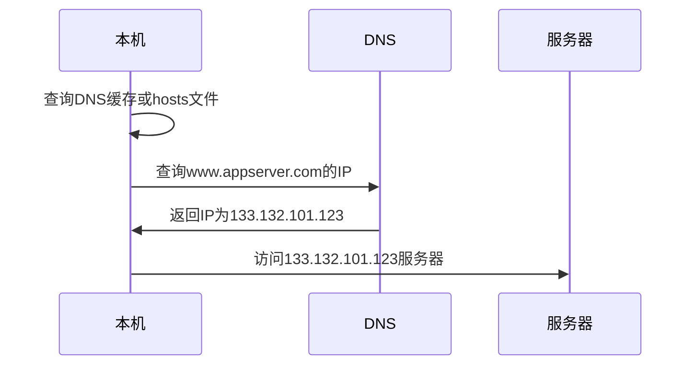
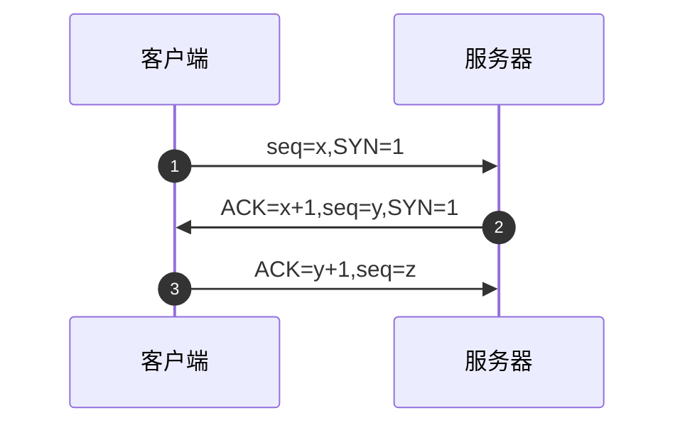
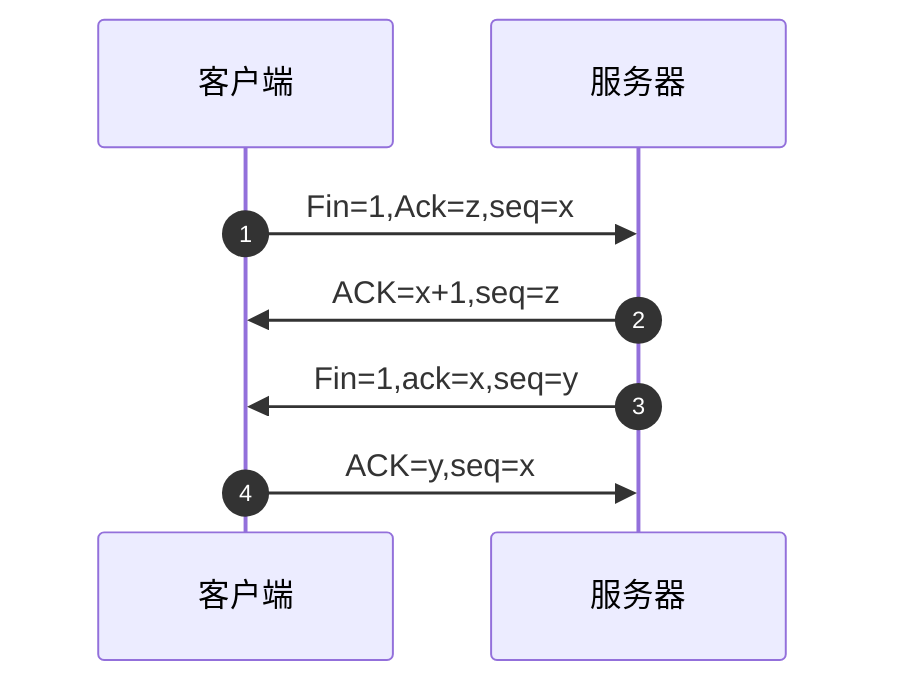
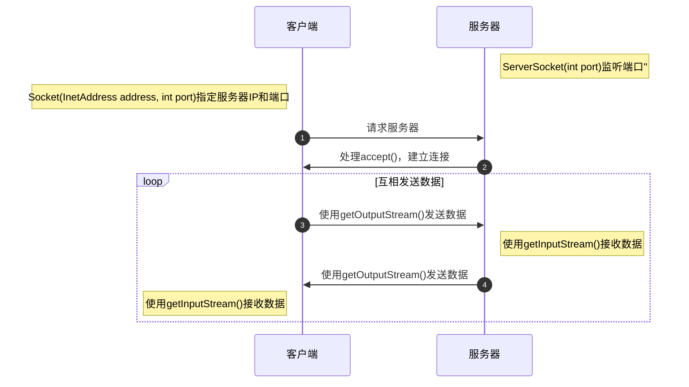

# 网络编程

* 实现网络传输的三个要素：
    * **IP地址** - 准确的定位网络上一台或多台主机
    * **端囗号** - 定位主机上的特定的应用
    * **网络通信协议** - 可靠、高效的进行数据传输

## IP地址

* **IP地址**：指互联网协议地址（Internet Protocol Address），IP地址用来给网络中的一台计算机设备做唯一的编号

### 分类

* **IPv4** - 是一个32位的二进制数，通常被分为4个字节，表示成`a.b.c.d`的形式，以点分**十进制**表示，例如：`192.168.23.22`
* **IPv6** - 采用128位地址长度，共16个字节，写成8个无符号整数，每个整数用4个十六进制位表示，数之间用冒号`:`分开，例如：`ABCD:EF01:2345:6789:ABCD:3412:2345:7891`
* **公网地址（万维网使用）**和**私有地址（局域网使用）**， `192.168`开头的就是私有地址，范围即为`192.168.0.0~192.168.255.255`，专门为组织机构内部使用

### 本地回路地址

* `127.0.0.1` - 用于访问本机的程序

### 域名

* 用于便捷的记录IP地址
* 使用域名访问服务器简化版流程，假如要访问的域名是`www.appserver.com`



## 端口

* **端口号**用于唯一标识设备中的进程（应用程序），不同的进程，设置不同的端口号
* 用两个字节表示的整数，它的取值范围是`0~65535`
* **公认端囗** - `0~1023`，被预先定义的服务通信占用，如： HTTP(80)，FTP(21)，TeInet(23)
* **注册端囗** - `1024~49151`，分配给用户进程或应用程序，如： Tomcat(8080)，MySQL(3306)，Oracle(1521)
* **动态/私有端口** - `49152~65535`
* 如果端囗号被另外一个服务或应用所占用，会导致当前程序启动失败

## 网络通信协议

* **网络涌信协议** - 在计算机网络中，这些连接和通信的规则被称为网络通信协议，它对数据的传输格式、传输速率、传输步骤、出错控制等做了统一规定，通信双方之须同时遵守才能完成数据交换

### 通信协议分层思想

* 在制定协议时，把复杂成份分解成一些简单的成份，再将它们复合起来。最常用的复合方式是层次方式，即**同层间可以通信、上一层可以调用下一层，而与再下一层不发生关系**，各层互不影响，利于系统的开发和扩展

### 参考模型

* **OSI** - 计算机网络理论基础
* **TCP/IP协议** - 简化了层次结构，实现和应用更广泛

<table style={{ textAlign: "center" }}>
    <thead>
        <tr>
            <td style={{ fontWeight: "bold", textAlign: "center" }}>OSI参考模型</td>
            <td style={{ fontWeight: "bold", textAlign: "center" }}>各层作用</td>
            <td style={{ fontWeight: "bold", textAlign: "center" }}>TCP/IP参考模型</td>
            <td style={{ fontWeight: "bold", textAlign: "center" }}>TCP/IP参考模型各层对应协议</td>
            <td style={{ fontWeight: "bold", textAlign: "center" }}>对应结构</td>
        </tr>
    </thead>
    <tbody>
        <tr>
            <td>应用层</td>
            <td>为应用程序提供服务</td>
            <td rowspan="3">应用层</td>
            <td rowspan="3">`HTTP` `FTP` `Telnet` `DNS`</td>
            <td rowspan="3">应用程序</td>
        </tr>
        <tr>
            <td>表示层</td>
            <td>数据格式转化、数据加密</td>
        </tr>
        <tr>
            <td>会话层</td>
            <td>建立、管理和维护会话</td>
        </tr>
        <tr>
            <td>传输层</td>
            <td>建立、管理和维护端对端的连接</td>
            <td>传输层</td>
            <td>`TCP` `UDP`</td>
            <td rowspan="2">操作系统</td>
        </tr>
        <tr>
            <td>网络层</td>
            <td>IP选址及路由选择</td>
            <td>网络层</td>
            <td>`IP` `ICMP` `ARP`</td>
        </tr>
        <tr>
            <td>数据链路层</td>
            <td>提供介质访问和链路管理</td>
            <td rowspan="2">物理+数据链路层</td>
            <td rowspan="2">`Link`</td>
            <td rowspan="2">设备驱动程序、网络接口</td>
        </tr>
        <tr>
            <td>物理层</td>
            <td>物理传输</td>
        </tr>
    </tbody>
</table>

## TCP和UDP协议

* `java.net`包中提供了两种见的网络协议的支持
* **UDP** - 用户数据报协议（User Datagram Protocol）
* **TCP** - 专输控制协议 (Transmission Control Protocol）

### TCP协议

* 使用TCP协议通信的两个应用一般称为：**客户端**和**服务端**
* 使用TCP协议前，须先**建立TCP连接**，形成基于字节流的传输数据通道
* 传输前，采用**三次握手**方式，点对点通信，是可靠的
    * TCP协议使用**重发机制**，当一个通信实体发送一个消息给另一个通信实体后，需要收到另一个通信实体确认信息，如果没有收到另一个通信实体确认信息，则会再次重复刚才发送的消息
* 在连接中可进行**大数据量的传输**
* 传输完毕，需**释放已建立的连接**，效率低

### UDP协议

* 使用UDP协议通信的两个应用一般称为：**发送端**和**接收端**
* 将**数据**、**源**、**目的**封装成数据包（传输的基本单位），**不需要建立接**
* 发送不管对方是否准备好，接收方收到也不确认，不能保证数据的完整性，**不可靠**
* 每个数据报的大小限制在**64K**内
* 发送数据结束时**无需释放资源**，**通信效率高**

### TCP三次握手

* TCP协议中，在发送数据的准备阶段，客户端与服务器之间的三次交互，以保证连接的可靠
* 第一次渥手，客户端向服务器端发起TCP连接的请求
* 第二次握手，服务器端发针对客户TCP连接清求的确认
* 第三次渥手，客户端发送确认的确认



### TCP四次挥手

* TCP协议中，在发送数据结束后，释放连接时需要经过四次挥手
* 第一次挥手：客户端向服务器端提出结束连接，**让服务器做最后的准备工作**。此时，客户端处于半关闭状态，即表示不再向服务器发送数据了，但是还可以接受数据
* 第二次挥手：服务器接收到客户端释放连接的请求后，**会将最后的数据发给客户端**。并告知上层的应用进程不再接收数据
* 第三次挥手：服务器发送完数据后，会给客户端发送一个释放连接的报文。那么客户端接收后就知道可以正式释放连接了
* 第四次挥手：客户端接收到服务器最后的释放连接报文后，**要回复一个彻底断开的报文**。这样服务器收到后才会彻底释放连接。这里客户端，发送完最后的报文后，会等待2MSL，因为有可能服务器没有收到最后的报文，那么服务器迟迟没收到，就会再次给客户端发送释放连接的报文，此时客户端在等待时间范围内接收到，会重新发送最后的报文，并重新计时。如果等待2MSL后，没有收到，那么彻底断开



## Java API

### InetAddress

```java
try {
    // 指定域名或IP获取地址信息
    InetAddress addr1 = InetAddress.getByName("192.168.173.109");
    System.out.println(addr1);
    InetAddress addr2 = InetAddress.getByName("www.baidu.com");
    System.out.println(addr2);
    InetAddress addr3 = InetAddress.getByName("127.0.0.1");
    System.out.println(addr3);

    // 获取本机地址信息
    InetAddress addr4 = InetAddress.getLocalHost();
    System.out.println(addr4);

    // 常用方法
    System.out.println(addr4.getHostName()); // 获取域名
    System.out.println(addr4.getHostAddress()); // 获取域名对应的IP地址
} catch (UnknownHostException e) {
    throw new RuntimeException(e);
}
```

### Socket

* 网络上具有唯一标识的**IP地址**和**端口号**组合在一起构成唯一能识别的标识符套接字（Socket）
* 一般主动发起通信的应用程序属**客户端**，等待通信请求的为**服务端**
* Socket分类：
    * **流套接字（stream socket）**- 使用TCP提供可依赖的字节流服务
        * `ServerSocket` - 实现TCP服务器套接字，服务器套接字等待请求通过网络传入
        * `Socket` - 此类实现客户端套接字，套接字是两台机器间通信的端点
    * **数据报套接字（datagram socket）**- 使用UDP提供尽力而为的数据报服务
        * `DatagramSocket` - 表示用来发送和接收UDP数据报包的套接字

### TCP

> [详细代码](https://github.com/follow1123/java-basics/blob/main/src/main/java/cn/y/java/net/TCPTest.java)

* 通信模型



* 客户端

```java
// 创建Socket
try (Socket socket = new Socket(InetAddress.getLocalHost(), 8989)) {
    System.out.println("连接到服务器：" + socket.getInetAddress().getHostAddress());
    // 接收客户端Socket
    OutputStream os = null;
    InputStream is = null;
    try{
        os = socket.getOutputStream();
        // 发送数据
        os.write("Hello".getBytes());
        // 如果写完数据后不再发送数据必须关闭输出流，否则服务端不知道数据有多少，会阻塞
        socket.shutdownOutput();

        is = socket.getInputStream();
        // 接收回复
        ByteArrayOutputStream baos = new ByteArrayOutputStream();
        byte[] bytes = new byte[5];
        int len;
        while ((len = is.read(bytes)) != -1){
            baos.write(bytes, 0, len);
        }
        System.out.println("接收服务端回复数据：" + baos);
    }catch (IOException e){
        throw new RuntimeException(e);
    }finally {
        if (is != null) is.close();
        if (os != null) os.close();
    }
} catch (IOException e) {
    throw new RuntimeException(e);
}
```

* 服务端

```java
// 创建ServerSocket
try (ServerSocket ss = new ServerSocket(8989)) {
    // 接收客户端Socket
    Socket socket = null;
    InputStream is = null;
    OutputStream os = null;
    try{
        socket = ss.accept();
        System.out.println("连接到客户端：" + socket.getInetAddress().getHostAddress());
        // 接收数据
        is = socket.getInputStream();
        ByteArrayOutputStream baos = new ByteArrayOutputStream();
        byte[] bytes = new byte[5];
        int len;
        while ((len = is.read(bytes)) != -1){
            baos.write(bytes, 0, len);
        }
        System.out.println("接收客户端数据：" + baos);
        System.out.println("回复客户端数据：" + socket.getInetAddress().getHostAddress());

        // 回复数据
        os = socket.getOutputStream();
        os.write("收到".getBytes());
    }catch (IOException e){
        throw new RuntimeException(e);
    }finally {
        if (os != null) os.close();
        if (is != null) is.close();
        if (socket != null) socket.close();
    }
} catch (IOException e) {
    throw new RuntimeException(e);
}
```

### UDP

> [详细代码](https://github.com/follow1123/java-basics/blob/main/src/main/java/cn/y/java/net/UDPTest.java)

* 发送端

```java
int port = 8990;
try (DatagramSocket ds = new DatagramSocket()) {
    // 准备数据
    byte[] bytes = "Hello".getBytes();
    // 包内填写发送的地址
    DatagramPacket dp = new DatagramPacket(bytes, 0, bytes.length, InetAddress.getLocalHost(), port);
    // 发送
    ds.send(dp);
} catch (IOException e) {
    throw new RuntimeException(e);
}
```

* 接收端

```java
// 开启UDP服务
int port = 8990;
try (DatagramSocket ds = new DatagramSocket(port)) {
    // 准备包
    byte[] bytes = new byte[1024];
    DatagramPacket dp = new DatagramPacket(bytes, 0, bytes.length);
    // 接收数据
    ds.receive(dp);
    // 获取数据
    String str = new String(dp.getData(), 0, dp.getLength());
    System.out.println(str);
}catch (IOException e) {
    throw new RuntimeException(e);
}
```

### URL

> [详细代码](https://github.com/follow1123/java-basics/blob/main/src/main/java/cn/y/java/net/URLTest.java)

* **URL(Uniform Resource Locator)** - 统一资源定位符
* URL对象

```java
String str = "https://127.0.0.1:8080/examples/a.txt?type=1";
try {
    URL url = new URL(str);
    System.out.println(url.getProtocol()); // 协议名
    System.out.println(url.getHost()); // 主机号
    System.out.println(url.getPort()); // 端口号
    System.out.println(url.getPath()); // 文件路径
    System.out.println(url.getFile()); // 文件名
    System.out.println(url.getQuery()); // 查询参数
} catch (IOException e) {
    throw new RuntimeException(e);
}
```

* 使用URL从互联网下载资源

```java
try {
    String projectPath = System.getProperty("user.dir");
    File file = new File(projectPath, "src/main/resources/test.png");
    URL url = new URL("");
    HttpURLConnection connection = (HttpURLConnection) url.openConnection();

    try (InputStream is = connection.getInputStream();
         FileOutputStream fos = new FileOutputStream(file)) {
        byte[] bytes = new byte[1024];
        int len;
        while ((len = is.read(bytes)) != -1){
            fos.write(bytes, 0, len);
        }
    } catch (IOException e) {
        throw new RuntimeException(e);
    }
    connection.disconnect();
} catch (IOException e) {
    throw new RuntimeException(e);
}
```

## 常见问题

### socket相关状态方法说明

* `isBound()/isConnected()` - 判断是否绑定端口，是否连接过

```java
// 只有在以下情况才能判断出区别
Socket s = new Socket();
assertFalse(s.isConnected());
assertFalse(s.isBound());
s.connect(new InetSocketAddress(InetAddress.getLocalHost(), port));
assertTrue(s.isConnected());
assertTrue(s.isBound());
```

* `isClosed()/isInputShutdown()/isOutputShutdown()` - 判断是否关闭Socket，是否关闭输入输出流
    * `isInputShutdown()/isOutputShutdown()`这两个方法只有在调用`shutdownInput()/shutdownOutput()`方法后才有效，和Socket调不调用`close()`方法无关
    * `isClosed()`方法只有在调用Socket的`close()`方法后才有效
* 这几个方法都没什么用
