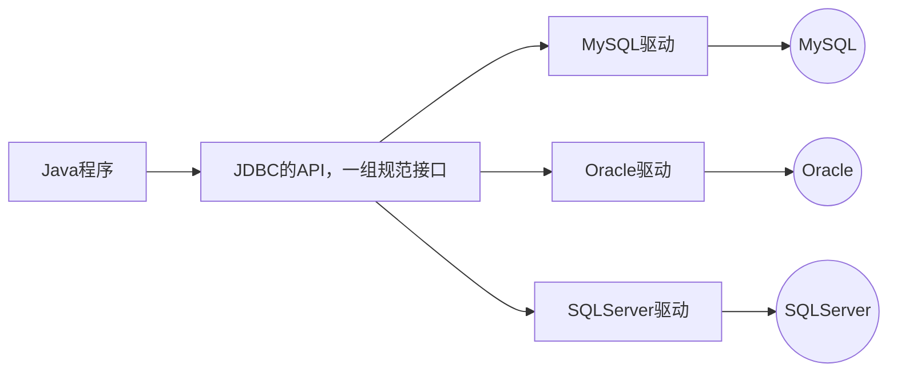

# JDBC

JDBC 提供了一套基本的 API 来实现 Java 程序与关系型数据库之间的连接和数据操作

JDBC 是 Java 提供的一组独立于任何数据库管理系统的 API

Java 提供接囗规范，由各个数据库厂商提供接囗的实现，厂商提供的实现类封装成jar文件，也就是我们俗称的数据库驱动jar 包



:::info[接口规范]
为了项目代码的可移植性，可维护性， SUN 公司从最初就制定了 Java 程序连接各种数据库的统一接囗规范。不管是连接哪一种 DBMS 软件， Java 代码可以保持一致性

接口存储在 `java.sql` 和 `javax.sql` 包下
:::
:::info[实现规范]
因为各个数据库厂商的 DBMS 软件各有不同，那么各自的内部如何通过 SQL 实现增、删、改、查等操作管理数据，只有这个数据库厂商自己更清楚，因此把接口规范的实现交给各个数据库厂商自己实现

厂商将实现内容和过程封装成 jar 文件，我们程序员只需要将 jar 文件引入到项目中集成即可，就可以开发调角实现过程操作数据库了
:::

## 示例

1. 创建数据库`mini_chat`
2. 添加表格数据

```sql
use mini_chat;

create table t_user(
    id bigint auto_increment comment '用户id' primary key,
    name varchar(100) not null comment '姓名',
    age int not null comment '年龄',
    points double(10,5) not null comment '积分'
);

insert into t_user (name, age, points) values
('zhangsan', 32, 777.77),
('lisi', 41, 666.66),
('wangwu', 23, 111),
('jack', 26, 123),
('aaa', 28, 123);
```

3. 引入MySQL驱动，以Maven项目为例

```xml
<dependency>
    <groupId>mysql</groupId>
    <artifactId>mysql-connector-java</artifactId>
    <version>8.0.33</version>
</dependency>
```

4. 编写代码

```java
// 注册驱动
Class.forName("com.mysql.cj.jdbc.Driver");

// 获取连接对象
String url = "jdbc:mysql://localhost:3307/mini_chat";
String username = "root";
String password = "password";
Connection connection = DriverManager.getConnection(url, username, password);

// 获取执行SQL的对象
Statement statement = connection.createStatement();

// 编写SQL语句并执行
String sql = "select id, name, age, points from t_user";
ResultSet resultSet = statement.executeQuery(sql);

while (resultSet.next()) {
    long id = resultSet.getLong("id");
    String name = resultSet.getString("name");
    int age = resultSet.getInt("age");
    double points = resultSet.getDouble("points");
    System.out.println(id + "\t" + name + "\t" + age + "\t" + points);
}

// 释放资源
resultSet.close();
statement.close();
connection.close();
```

[详细项目代码](https://github.com/follow1123/java-basics/blob/main/src/main/java/cn/y/java/jdbc) 

## 核心API

### 注册驱动

在 Java 中，当使用 JDBC (Java Database Connectivity) 连接数据库时，需要加载数据库特定的驱动程序，以便与数据库进行通信

加载驱动程序的目的是为了注册驱动程序，使得 JDBC API 能够识别并与特定的数据库进行交互

:::note
从 JDK6 开始，不再需要显式地调用 `Class.forName()` 来加载驱动程序，只要在类路径中集成了对应的 jar 文件，会自动在初始化时注册驱动程序
:::

### Connection

Connection 接囗是 JDBC API 的重要接口，用于建立与数据库的通信通道。换而言之，Connection 对象不为空，则代表一次数据库连接

在建立连接时，需要指定数据库 URL 、用户名、密码参数

```bash
# jdbc:mysql://IP地址:端口号/数据库名称?参数键值对1&参数键值对2
jdbc:mysql://localhost:3307/mini_chat
```

Connection 接囗还负责管理事务， Connection 接口提供了 `commit` 和 `rollback` 方法，用于提交事务和回滚事务

可以创建 statement 对象，用于执行 SQL 语句并与数据库进行交互

在使用 JDBC 技术时，必须要先获取 Connection 对象，在使用完毕后，要释放资源，避免资源占用浪费及泄漏

```java
// 获取连接对象
String url = "jdbc:mysql://localhost:3307/mini_chat";
String username = "root";
String password = "password";
Connection connection = DriverManager.getConnection(url, username, password);

// 其他操作...

// 释放资源
connection.close();
```

### Statement

Statement 接口用于执行 SQL 语句并与数据库进行交互。它是 JDBC API 中的一个重要接口，通过 Statement 对象，可以向数据库发送 SQL 语句并获取执行结果

结果可以是一个或多个

* 增删该：受影响行数单个结果
* 查询：单行单例、多行多列、单行多列等结果

:::warning
Statement 接口在执行 SQL 语句时，会产生 SQL 注入攻击问题

当使用 Statement 执行**动态构建**的 SQL 询时，往往需要将查询条件与 SQL 语句拼接在一起，直接将参数和 SQL 语句一并生成，可以让 SQL 的查询条件始终为 true 得到结果
:::

```java title="SQL注入演示"
// 获取连接

// String queryName = "zhangsan";
// error line
String queryName = "111' or '1' = '1";

// 编写SQL语句并执行
String sql = "select id, name, age, points from t_user where name = '" + queryName + "'";
ResultSet resultSet = statement.executeQuery(sql);

while (resultSet.next()) {
    long id = resultSet.getLong("id");
    String name = resultSet.getString("name");
    int age = resultSet.getInt("age");
    double points = resultSet.getDouble("points");
    System.out.println(id + "\t" + name + "\t" + age + "\t" + points);
}

// 释放资源
```

上面的代码SQL拼接后为：`select id, name, age, points from t_user where name = '111' or '1' = '1'`，是可以查询到所有数据的

### PreparedStatement

PreparedStatement 是 Statement 接口的子接囗，用于执行预编泽的 SQL 询，有以下作用：

* **预编译 SQL 语句**：在创建 PreparedStatement 时，就会预编译 SQL 语句，也就是 SQL 语句已经固定
* **防止 SQL 注入**： PreparedStatement 支持参数化查询，将数据作为为参数传递到 SQL 语句中，采用 `?` 占位符的方式，将传入的参数用一对单引号包裹起来 `''` ，无论传递什么都作为值。有效防止传入关键字或值导致 SQL 注入问题
* **性能提升**： PreparedStatement 是预编译SQL语句，同一 SQL 语句多次执行的情况下，可以复用，不必每次重新编译和解析

:::note
设置参数时下标从 `1` 开始
:::

```java
// 获取连接

// 获取PreparedStatement
String sql = "select id, name, age, points from t_user where name = ?";
PreparedStatement statement = connection.prepareStatement(sql);

// 设置参数
statement.setString(1, "zhangsan");

// 处理数据...

// 释放资源
```

### ResultSet

Resu1tSet 是 JDBC API 中的一个接口，用于表示从数据库中执行**查询语句**所返回的结果集。它提供了一种用于遍历和访问查询结果的方式

**遍历结果**： ResultSet 可以使用 `next()` 方法将游标移动到结果集的下一行，逐行遍历数据库查询的结果，返回值为 boolean 类型

**获取单列结果**：可以通过 `getXxx()` 的方法获取单列的数据，该方法为重载方法，支持**索引**和**列名**进行获取

```java
// 获取连接

// 准备查询数据

// 获取结果
ResultSet resultSet = statement.executeQuery();

while (resultSet.next()) {
    // 通过列下标获取数据，下标从1开始，不推荐
    long id = resultSet.getLong(1);
    String name = resultSet.getString("name");
    int age = resultSet.getInt("age");
    double points = resultSet.getDouble("points");
    System.out.println(id + "\t" + name + "\t" + age + "\t" + points);
}

// 释放资源
```

## 实现增删改查

```java {1,6,8} title="查询单行单列"
String sql = "select count(*) from t_user";
PreparedStatement statement = connection.prepareStatement(sql);

ResultSet resultSet = statement.executeQuery();
// 只有行，不需要遍历
if (resultSet.next()) {
    // 只有一列，可以直接使用下标获取数据
    long count = resultSet.getLong(1);
    System.out.println(count);
}
// 释放资源
resultSet.close();
statement.close();
```

```java title="查询单行" {1,6-12}
String sql = "select id, name, age, points from t_user where id = ?";
PreparedStatement statement = connection.prepareStatement(sql);
statement.setLong(1, 1);

ResultSet resultSet = statement.executeQuery();
while (resultSet.next()) {
    long id = resultSet.getLong("id");
    String name = resultSet.getString("name");
    int age = resultSet.getInt("age");
    double points = resultSet.getDouble("points");
    System.out.println(id + "\t" + name + "\t" + age + "\t" + points);
}
// 释放资源
resultSet.close();
statement.close();
```

```java title="查询多行多列" {1,6-12}
String sql = "select id, name, age, points from t_user where age < ?";
PreparedStatement statement = connection.prepareStatement(sql);
statement.setInt(1, 30);

ResultSet resultSet = statement.executeQuery();
while (resultSet.next()) {
    long id = resultSet.getLong("id");
    String name = resultSet.getString("name");
    int age = resultSet.getInt("age");
    double points = resultSet.getDouble("points");
    System.out.println(id + "\t" + name + "\t" + age + "\t" + points);
}
// 释放资源
resultSet.close();
statement.close();
```

```java title="插入" {1,3-5,7,12}
String sql = "insert into t_user (name, age, points) values (?, ?, ?)";
PreparedStatement statement = connection.prepareStatement(sql);
statement.setString(1, "bbb");
statement.setInt(2, 38);
statement.setDouble(3, 43.532);

int rows = statement.executeUpdate();
if (rows > 0){
    System.out.println("insert succeed " + rows);
}else {
    System.out.println("insert failed");
}
// 释放资源
statement.close();
```

```java title="修改" {1,3-4,6,11}
String sql = "update t_user set points = ? where id = ?";
PreparedStatement statement = connection.prepareStatement(sql);
statement.setDouble(1, 13.532);
statement.setLong(2, 6);

int rows = statement.executeUpdate();
if (rows > 0){
    System.out.println("update succeed " + rows);
}else {
    System.out.println("update failed");
}
// 释放资源
statement.close();
```

```java title="删除" {1,3,5-10}
String sql = "delete from t_user where id = ?";
PreparedStatement statement = connection.prepareStatement(sql);
statement.setLong(1, 6);

int rows = statement.executeUpdate();
if (rows > 0){
    System.out.println("delete succeed " + rows);
}else {
    System.out.println("delete failed");
}
// 释放资源
statement.close();
```

## ORM

在使用 JDBC 操作数据库时，我们会发现数据都是零散的，明明在数据库中是一行完整的数据，到了 Java 中变成了一个一个的变量，不利于维护和管理，而 Java 是面向对象的，一个表对应的是一个类，一行数据就对应的是 Java 中的一个对象，一个列对应的是对象的属性，所以我们要把数据存储在一个载体里，这个载体就是实体类

**ORM (Object Relational Mapping)** 思想，**对象到关系数据库的映射**，作用是在编程中，把面向对象的念跟数据库中表的概念对应起来，以面向对象的角度操作数据库中的数据，即一张表对应一个类，一行数据对应一个对象，一个列对应一个属性

当下 JDBC 中这种过程我们称其为手动 ORM ，还有其他 ORM 框架：MyBatis、 JPA 等

```java title="实体类"
@Data
@NoArgsConstructor
@AllArgsConstructor
public class User {

    private Long id;

    private String name;

    private Integer age;

    private Double points;
}
```

```java title="单个对象" {6,15-18,22}
String sql = "select id, name, age, points from t_user where id = ?";
PreparedStatement statement = connection.prepareStatement(sql);
statement.setLong(1, 1);

ResultSet resultSet = statement.executeQuery();
User user = null;
// 只有行，不需要遍历
if (resultSet.next()) {
    user = new User();
    // 只有一列，可以直接使用下标获取数据
    long id = resultSet.getLong("id");
    String name = resultSet.getString("name");
    int age = resultSet.getInt("age");
    double points = resultSet.getDouble("points");
    user.setId(id);
    user.setName(name);
    user.setAge(age);
    user.setPoints(points);
}

// 处理数据
System.out.println(user);

// 释放资源
resultSet.close();
statement.close();
```

```java title="对象集合" {6,8,13-17,20}
String sql = "select id, name, age, points from t_user where age < ?";
PreparedStatement statement = connection.prepareStatement(sql);
statement.setInt(1, 30);

ResultSet resultSet = statement.executeQuery();
ArrayList<User> users = new ArrayList<>();
while (resultSet.next()) {
    User user = new User();
    long id = resultSet.getLong("id");
    String name = resultSet.getString("name");
    int age = resultSet.getInt("age");
    double points = resultSet.getDouble("points");
    user.setId(id);
    user.setName(name);
    user.setAge(age);
    user.setPoints(points);
    users.add(user);
}
// 处理数据
users.forEach(System.out::println);

// 释放资源
resultSet.close();
statement.close();
```

## 主键回显

```java {3,16-19,28}
String sql = "insert into t_user (name, age, points) values (?, ?, ?)";
// 指定需要回显主键
PreparedStatement statement = connection.prepareStatement(sql, Statement.RETURN_GENERATED_KEYS);

// 使用对象传递参数
User user = new User(null, "ccc", 28, 345.3);
statement.setString(1, user.getName());
statement.setInt(2, user.getAge());
statement.setDouble(3, user.getPoints());

ResultSet resultSet = null;
int rows = statement.executeUpdate();
if (rows > 0){
    System.out.println("insert succeed " + rows);
    // 获取回显的主键
    resultSet = statement.getGeneratedKeys();
    if (resultSet.next()){
        user.setId(resultSet.getLong(1));
    }
}else {
    System.out.println("insert failed");
}

// 处理数据
System.out.println(user);

// 释放资源
if (resultSet != null) resultSet.close();
statement.close();
```

## 批量操作

```java title="遍历插入10000条数据"
// 连接：jdbc:mysql://localhost:3307/mini_chat

String sql = "insert into t_user (name, age, points) values (?, ?, ?)";
PreparedStatement statement = connection.prepareStatement(sql);

long start = System.currentTimeMillis();
for (int i = 0; i < 10000; i++) {
    statement.setString(1, "bbb" + i);
    statement.setInt(2, 38 + i);
    statement.setDouble(3, 43.532 + i);
    statement.executeUpdate();
}
long end = System.currentTimeMillis();

System.out.println(end - start);
```

```java title="使用批量操作插入10000条数据" {1,3,11,13}
// 连接：jdbc:mysql://localhost:3307/mini_chat?rewriteBatchedStatements=true

String sql = "insert into t_user (name, age, points) values (?, ?, ?)";
PreparedStatement statement = connection.prepareStatement(sql);

long start = System.currentTimeMillis();
for (int i = 0; i < 10000; i++) {
    statement.setString(1, "bbb" + i);
    statement.setInt(2, 38 + i);
    statement.setDouble(3, 43.532 + i);
    statement.addBatch();
}
statement.executeBatch();
long end = System.currentTimeMillis();

System.out.println(end - start);
```

:::note
批量操作时，连接数据库的URL后面必须加上 `rewriteBatchedStatements=true` 参数

传递的 SQL 语句 必须使用 `values` 关键字，并且结尾不能写分号 `;`
:::

## 连接池

每次操作数据库都要获取新连接，使用完毕后就 `close()` 释放，频繁的创建和销毁造成资源浪费，连接的数量无法把控，对服务器来说压力巨大

连接池就是数据库连接对象的缓冲区，通过配置，由连接池负责创建连接、管理连接、释放连接等操作

预先创建数据库连接放入连接池，用户在请求时，通过池直接获取连接，使用完毕后，将连接放回池中，避免了频繁的创建和销毁，同时解决了创建的效率

当池中无连接可用，且未达到上限时，连接池会新建连接

池中连接达到上限，用户请求会等待，可以设置超时时间

:::info[常见连接池]
JDBC 的数据库连接池使用 `javax.sql.DataSource` 接囗进行规范，所有的第三方连接池都实现此接口，自行添加具体实，也就是说，所有连接池获取连接的和回收连接方法都一样，不同的只有性能和扩展功能

* `C3P0` - 是一个开源组织提供的一个数据库连接池，速度相对较慢，稳定性还可以
* `DBCP` - 是 Apache 提供的数据库连接池，速度相对 C3P0 较快，但自身存在一些 BUG
* `Proxool` - 是 sourceforge 下的一个开源项目数据库连接池，有监控连接池状态的功能，稳定性较 C3P0 差一点
* `Druid` - 是阿里提供的数据库连接池，是集 DBCP 、C3P0 、Proxool 优点于一身的数据库连接池，性能、扩展性、易用性都更好，功能丰富
* `Hikari` -  SpringBoot2.x 之后内置的一款连接池，基于 BoneCP（已经放弃维护，推荐该连接池）做了不少的改进和优化，口号是快速、简单、可靠
:::

主流连接池功能对比

| 功能    | DBCP    | Druid    | C3P0    | tomcat-jdbc    | HikariCP |
|---------------- | --------------- | --------------- | --------------- | --------------- | --- |
| 是否支持PSCache    | 是    | 是    | 是    | 否   | 否 |
| 监控   | jmx   | jmx/log/http   | jmx,log   | jmx   | jmx |
| 扩展性   | 弱   | 好   | 弱   | 弱   | 弱 |
| SQl拦截及解析   | 无   | 支持   | 无   | 无   | 无 |
| 代码 | 简单 | 中等 | 复杂 | 简单 | 简单 |
| 特点 | 依赖于common-pool | 阿里开源 | 历史久远 | - | 优化力度大 |
| 连接池管理 | LinkedBlockingDeque | 数组 | - |  FairBlockingQueue | ThreadLocal+ CopyOnWriteArrayList |

### Druid

引入依赖，以Maven项目为例

```xml
<dependency>
    <groupId>com.alibaba</groupId>
    <artifactId>druid</artifactId>
    <version>1.2.18</version>
</dependency>
```

使用在代码内直接配置使用

```java
// 获取连接信息

// 创建Druid连接池对象
DruidDataSource druidDataSource = new DruidDataSource();

// 必填配置
druidDataSource.setDriverClassName("com.mysql.cj.jdbc.Driver");
druidDataSource.setUrl(url);
druidDataSource.setUsername(username);
druidDataSource.setPassword(password);

// 非必填配置
druidDataSource.setInitialSize(5); // 初始连接个数
druidDataSource.setMaxActive(10); // 最大连接个数

Connection connection = druidDataSource.getConnection();

// 使用连接
doQuery(connection);

// 回收连接
connection.close();
```

使用 properties 配置文件配置Druid连接池

<details>
    <summary>配置文件 `db.properties` </summary>
```properties
driverClassName=com.mysql.cj.jdbc.Driver
url=jdbc:mysql://localhost:3307/mini_chat?rewriteBatchedStatements=true
username=root
password=password
initialSize=5
```
</details>

```java {2-4,7}
// 加载配置
InputStream is = DruidTest.class.getClassLoader().getResourceAsStream("db.properties");
Properties props = new Properties();
props.load(is);

// 使用配置获取Druid连接池
DataSource dataSource = DruidDataSourceFactory.createDataSource(props);

// 获取连接
Connection connection = dataSource.getConnection();

// 使用连接
doQuery(connection);

// 回收连接
connection.close();
```

### HikariCP

引入依赖，以Maven项目为例

```xml
<dependency>
    <groupId>com.zaxxer</groupId>
    <artifactId>HikariCP</artifactId>
    <version>5.1.0</version>
</dependency>
```
:::note
这里还需要引入SLF4j日志框架，不然会出现：`SLF4J: Failed to load class "org.slf4j.impl.StaticLoggerBinder".` 等提示

这里引入的实现是log4j，如果项目内已经有其他日志实现可以不用引入

```xml
<dependency>
    <groupId>org.apache.logging.log4j</groupId>
    <artifactId>log4j-slf4j2-impl</artifactId>
    <version>2.23.1</version>
</dependency>
```
:::

使用在代码内直接配置使用

```java
// 创建Hikari连接池对象
HikariDataSource hikariDataSource = new HikariDataSource();

// 必填配置
hikariDataSource.setDriverClassName("com.mysql.cj.jdbc.Driver");
hikariDataSource.setJdbcUrl(url);
hikariDataSource.setUsername(username);
hikariDataSource.setPassword(password);

// 非必填配置
hikariDataSource.setMinimumIdle(5); // 初始连接个数
hikariDataSource.setMaximumPoolSize(10); // 最大连接个数

Connection connection = hikariDataSource.getConnection();

// 使用连接
doQuery(connection);

// 回收连接
connection.close();
```

使用 properties 配置文件配置Hikari连接池

<details>
    <summary>配置文件 `hikari.properties` </summary>
```properties
driverClassName=com.mysql.cj.jdbc.Driver
jdbcUrl=jdbc:mysql://localhost:3307/mini_chat?rewriteBatchedStatements=true
username=root
password=password
minimumIdle=5
maximumPoolSize=10
```
</details>

```java {2-4,7,10}
// 加载配置
InputStream is = HikariCPTest.class.getClassLoader().getResourceAsStream("hikari.properties");
Properties props = new Properties();
props.load(is);

// 创建配置类
HikariConfig hikariConfig = new HikariConfig(props);

// 使用配置类创建Hikari连接池
HikariDataSource hikariDataSource = new HikariDataSource(hikariConfig);

// 获取连接
Connection connection = hikariDataSource.getConnection();

// 使用连接
doQuery(connection);

// 回收连接
connection.close();
```

## JDBCUtil

统一创建连接池，获取连接、释放连接等操作

使用ThreadLocal优化一个线程（用户）在不同操作时多次获取连接并释放问题

```java
public class JDBCUtil {

    private static DataSource dataSource;

    private static ThreadLocal<Connection> threadLocal = new ThreadLocal<>();

    static {
        try {
            InputStream is = DruidTest.class.getClassLoader().getResourceAsStream("db.properties");
            Properties props = new Properties();
            props.load(is);
            // 使用配置获取Druid连接池
            dataSource = DruidDataSourceFactory.createDataSource(props);
        } catch (Exception e) {
            throw new RuntimeException(e);
        }
    }

    /**
     * 获取连接
     */
    @SneakyThrows
    public static Connection getConnection(){
        // ThreadLocal内有直接返回
        Connection connection = threadLocal.get();
        if (connection != null) return connection;
        // 没有就从数据库里面获取，并存入ThreadLocal内
        connection = dataSource.getConnection();
        threadLocal.set(connection);
        return connection;
    }

    /**
     * 释放连接
     */
    @SneakyThrows
    public static void release(){
        // ThreadLocal内没有就直接返回
        Connection connection = threadLocal.get();
        if (connection == null) return;
        // 关闭自动提交的连接在归还连接池时要还原成自动提交
        if (!connection.getAutoCommit()) {
            connection.setAutoCommit(true);
        }
        // 有就关闭连接，并从ThreadLocal里面移除
        connection.close();
        threadLocal.remove();
    }
}
```

## DAO

DAO：Data Access Object, 数据访问对象

Java 是面向对象语言，数据在 Java 中通常以对象的形式存在。一张表对应一个实体类，一张表的操作对应一个 DAO 对象

在 Java 操作数据库时，我们会将对同一张表的增删改查操作统一维护起来，维护的这个类就是 DAO 层

DAO 层只关注对数据库的操作，供业务层 service 调用，将职责划分清楚

:::info[BaseDAO概念]
基本上每一个数据表都应该有一个对应的 DAO 接口及其实现类，发现对所有表的操作（增、删、改、查）代码重复度很高，所以可以抽取公共代码，给这些 DAO 的实现类可以抽取一个公共的父类，复用增删改查的基本操作，我们称为 BaseDAO
:::

DAO目录结构

```bash
dao # dao包名
│
├─BaseDao.java # 通用操作类
│
├─UserDao.java # 用户表操作接口
│
└─impl # 实现类包名
   │
   └─UserDaoImpl.java # 用户表操作实现类
``` 

<details>
    <summary>通用操作类</summary>
```java
public class BaseDao {

    public int executeUpdate(String sql, Object... params) throws SQLException {
        Connection connection = JDBCUtil.getConnection();
        PreparedStatement statement = connection.prepareStatement(sql);
        // 添加sql参数
        addParams(statement, params);

        // 执行sql
        int rows = statement.executeUpdate();

        // 释放资源
        statement.close();
        // 如果是自动提交才放回连接池
        if (connection.getAutoCommit()) {
            JDBCUtil.release();
        }
        return rows;
    }

    public <T> List<T> executeQuery(String sql, Class<T> clazz, Object... params) throws SQLException {
        Connection connection = JDBCUtil.getConnection();
        PreparedStatement statement = connection.prepareStatement(sql);
        // 添加sql参数
        addParams(statement, params);

        ResultSet resultSet = statement.executeQuery();
        // 获取结果元数据，就是列名
        ResultSetMetaData metaData = resultSet.getMetaData();
        // 获取列名个数
        int columnCount = metaData.getColumnCount();
        List<T> beanList = new ArrayList<>();
        while (resultSet.next()){
            try {
                // 使用反射获取对象实例
                T bean = clazz.getDeclaredConstructor().newInstance();
                // 根据列名个数设置对象内的属性
                for (int i = 1; i <= columnCount; i++) {
                    // 获取当列对应的值
                    Object value = resultSet.getObject(i);
                    // 获取当列的label，就是sql内给列取的别名，没有就是列名
                    String columnLabel = metaData.getColumnLabel(i);
                    // 使用反射设置指定的属性
                    Field field = clazz.getDeclaredField(columnLabel);
                    field.setAccessible(true);
                    field.set(bean, value);
                }
                beanList.add(bean);
            } catch (InstantiationException | IllegalAccessException | InvocationTargetException |
                     NoSuchMethodException | NoSuchFieldException e) {
                throw new RuntimeException(e);
            }
        }
        resultSet.close();
        statement.close();
        // 如果是自动提交才放回连接池
        if (connection.getAutoCommit()){
            JDBCUtil.release();
        }
        return beanList;
    }

    public <T> T executeQueryOne(String sql, Class<T> clazz, Object... params) throws SQLException {
        List<T> resultList = executeQuery(sql, clazz, params);
        return resultList.isEmpty() ? null : resultList.get(0);
    }

    private void addParams(PreparedStatement statement, Object[] params) throws SQLException {
        if (params != null && params.length > 0) {
            for (int i = 0; i < params.length; i++) {
                statement.setObject(i + 1, params[i]);
            }
        }
    }
}
```
</details>

<details>
    <summary>用户表操作接口</summary>
```java
public interface UserDao {

    /**
     * 获取所有用户
     */
    List<User> selectAll();

    /**
     * 根据id获取单个用户
     */
    User selectById(Long id);

    /**
     * 添加用户
     */
    int insert(User user);

    /**
     * 删除用户
     */
    int update(User user);

    /**
     * 根据id删除用户
     */
    int delete(Long id);
}
```
</details>

<details>
    <summary>用户表操作实现类</summary>
```java
public class UserDaoImpl extends BaseDao implements UserDao {
    @Override
    public List<User> selectAll() {
        String sql = "select id, name, age, points from t_user";
        try {
            return executeQuery(sql, User.class);
        } catch (SQLException e) {
            throw new RuntimeException(e);
        }
    }

    @Override
    public User selectById(Long id) {
        String sql = "select id, name, age, points from t_user where id = ?";
        User user = null;
        try {
            user = executeQueryOne(sql, User.class, id);
        } catch (SQLException e) {
            throw new RuntimeException(e);
        }
        return user;
    }

    @Override
    public int insert(User user) {
        String sql =  "insert into t_user (name, age, points) values (?, ?, ?)";
        try {
            return executeUpdate(sql, user.getName(), user.getAge(), user.getPoints());
        } catch (SQLException e) {
            throw new RuntimeException(e);
        }
    }

    @Override
    public int update(User user) {
        String sql = "update t_user set points = ? where id = ?";
        try {
            return executeUpdate(sql, user.getPoints(), user.getId());
        } catch (SQLException e) {
            throw new RuntimeException(e);
        }
    }

    @Override
    public int delete(Long id) {
        String sql = "delete from t_user where id = ?";
        try {
            return executeUpdate(sql, id);
        } catch (SQLException e) {
            throw new RuntimeException(e);
        }
    }
}
```
</details>

```java title="查询用户列表"
UserDaoImpl userDao = new UserDaoImpl();
userDao.selectAll().forEach(System.out::println);
```

```java title="根据id查询用户"
UserDaoImpl userDao = new UserDaoImpl();
User user = userDao.selectById(20L);
System.out.println(user);
```

```java title="新增用户"
UserDaoImpl userDao = new UserDaoImpl();
User user = new User(null, "zz", 33, 101.3);
int rows = userDao.insert(user);
if (rows == 1) {
    System.out.println("insert succeed " + rows);
}else {
    System.out.println("insert failed");
}
```

```java title="根据id修改用户信息"
UserDaoImpl userDao = new UserDaoImpl();
User user = new User();
user.setId(6L);
user.setPoints(200.2);
int rows = userDao.update(user);
if (rows == 1) {
    System.out.println("update succeed " + rows);
}else {
    System.out.println("update failed");
}
```

```java title="根据id删除用户"
UserDaoImpl userDao = new UserDaoImpl();
int rows = userDao.delete(6L);
if (rows == 1) {
    System.out.println("delete succeed " + rows);
}else {
    System.out.println("delete failed");
}
```

## 事务

数据库事务就是一种 SQL 语句执行的缓几制，不会单条执行完毕就更新数据库数据，最终根据缓存内的多条语句执行结果统一判定！一个事务内所有语句都成功及事务成功，我们可以触发 `commit` 提交事务来结束事务，更新数据！一个事务内任意一条语句失败，即为事务失败，我们可以触发 `rollback` 回滚结束事务，数据回到事务之前状态

详细参考[MySQL](../../../software-services-tools/mysql#事务)

JDBC内使用事务实现两个用户交换积分功能

<details>
    <summary>添加两个方法并实现</summary>

添加添加、减少积分接口

```java
/**
 * 添加积分
 */
int addPoints(Long id, Double points);

/**
 * 减少积分
 */
int subPoints(Long id, Double points);
```

添加实现

```java
@Override
public int addPoints(Long id, Double points) {
    String sql = "update t_user set points = points + ? where id = ?";
    try {
        return executeUpdate(sql, points, id);
    } catch (SQLException e) {
        throw new RuntimeException(e);
    }
}

@Override
public int subPoints(Long id, Double points) {
    String sql = "update t_user set points = points - ? where id = ?";
    try {
        return executeUpdate(sql, points, id);
    } catch (SQLException e) {
        throw new RuntimeException(e);
    }
}
```
</details>

实现交换积分功能并测试

```java {4,10,14,20}
Connection connection = JDBCUtil.getConnection();
UserDaoImpl userDao = new UserDaoImpl();
try {
    connection.setAutoCommit(false);
    userDao.subPoints(1L, 100.0);
    // 模拟两个操作直接出现错误
    // int i = 1 / 0;
    userDao.addPoints(2L, 100.0);
    connection.commit();
    System.out.println("commit");
}catch (Exception e){
    try {
        connection.rollback();
        System.out.println("rollback");
    } catch (SQLException ex) {
        throw new RuntimeException(ex);
    }
}finally {
    JDBCUtil.release();
}
```


## 参考

* [黑马](https://www.bilibili.com/video/BV1Tx421S7HZ/) 
