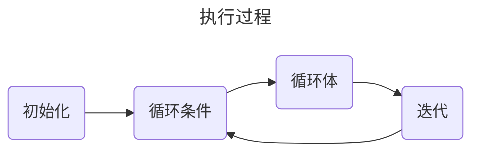
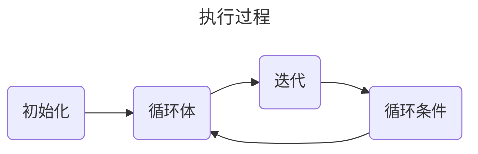

# 流程控制

指程序在执行时控制代码执行顺序的结构

* **顺序结构** - 程序从上到下逐行执行，中间没有任何判断和跳转
* **分支结构** - 根据条件，选择性地执行某段代码
    * `if...else`
    * `switch-case`
* **循环结构** - 根据循环条件，重复性的执行某段代码
    * `for`
    * `while`
    * `do-while`
    * `foreach` - jdk5新增，遍历集合和数组

## 分支结构

### if...else

```java
int i1 = 0;
if (i1 > 0) {
    i1--;
}
System.out.println(i1); // 0
if (i1 > 0) {
    i1--;
}else {
    i1++;
}
System.out.println(i1); // 1
if (i1 > 1) {
    i1--;
} else if (i1 == 1) {
    i1 = 0;
}
System.out.println(i1); // 0
```

### switch-case

:::note
* switch中的表达式只能是特定的类型：byte，short，char，int，枚举（jdk5），String（jdk7）
* switch中必须要有一个default分支用于处理未匹配到的情况
* switch中的每一对case必须对应一个break，如果忘写break则会穿透到下一个分支
:::

```java
int week = 5;
String weekStr;
switch (week) {
    case 1:
        weekStr = "Monday";
        break;
    case 2:
        weekStr = "Tuesday";
        break;
    case 3:
        weekStr = "Wednesday";
        break;
    case 4:
        weekStr = "Thursday";
        break;
    case 5:
        weekStr = "Friday";
        break;
    case 6:
        weekStr = "Saturday";
        break;
    case 7:
        weekStr = "Sunday";
        break;
    default:
        weekStr = "error";
        break;
}
System.out.println(weekStr); // Friday

// case 5 未加上break
switch (week) {
    case 1:
        weekStr = "Monday";
        break;
    case 2:
        weekStr = "Tuesday";
        break;
    case 3:
        weekStr = "Wednesday";
        break;
    case 4:
        weekStr = "Thursday";
        break;
    case 5:
        weekStr = "Friday";
        // break;
    case 6:
        weekStr = "Saturday";
        break;
    case 7:
        weekStr = "Sunday";
        break;
    default:
        weekStr = "error";
        break;
}
System.out.println(weekStr); // Saturday
```

## 循环结构

* 循环结构四要素
    * 初始化部分
    * 循环条件部分
    * 循环体部分
    * 迭代部分

### for循环



```java
/*
 for(初始化; 循环条件; 迭代){
    循环体
 }

 依次输出1到10
 */
for (int i = 1; i <= 10; i++) {
    System.out.println(i);
}
```

### while循环

* 执行过程和for循环一样

```java
/*
 初始化
 while(循环条件){
     循环体
     迭代
 }

 依次输出1到10
 */
int i = 1;
while (i <= 10) {
    System.out.println(i);
    i++;
}
```

### do-while循环



:::info
do-while循环至少执行一次循环
:::

```java
/*
 初始化
 do {
     循环体
     迭代
 }while(循环条件)

 依次输出1到10
 */
int i = 1;
do {
    System.out.println(i);
    i++;
}while (i <= 10);

/*
 初始化
 do {
     循环体
     迭代
 }while(循环条件)

 依次输出1到10
 */
int i1 = 1;
do {
    System.out.println(i1);
    i1++;
    break;
}while (i1 <= 10);
System.out.println(i1); // 2
```

### 无限循环

* for实现：`for(;;) {}`
* while实现：`while(true) {}`

### break和continue关键字

<table>
    <thead>
        <tr>
            <th>关键字</th>
            <th>适用范围</th>
            <th>作用</th>
        </tr>
    </thead>
    <tbody>
        <tr>
            <td rowspan="2" style={{verticalAlign: 'middle'}}>break</td>
            <td>switch-case</td>
            <td>跳出分支</td>
        </tr>
        <tr>
            <td>循环结构</td>
            <td>跳出当前循环</td>
        </tr>
        <tr>
            <td>continue</td>
            <td>循环条件</td>
            <td>提前进入下一次循环</td>
        </tr>
    </tbody>
</table>

```java
// 跳出循环
for (int i = 1; i <= 10; i++) {
    if (i > 4){
        break;
    }
    System.out.println(i);
}

System.out.println("---");

// 跳过偶数
for (int i = 1; i <= 10; i++) {
    if (i % 2 == 0){
        continue;
    }
    System.out.println(i);
}
```
