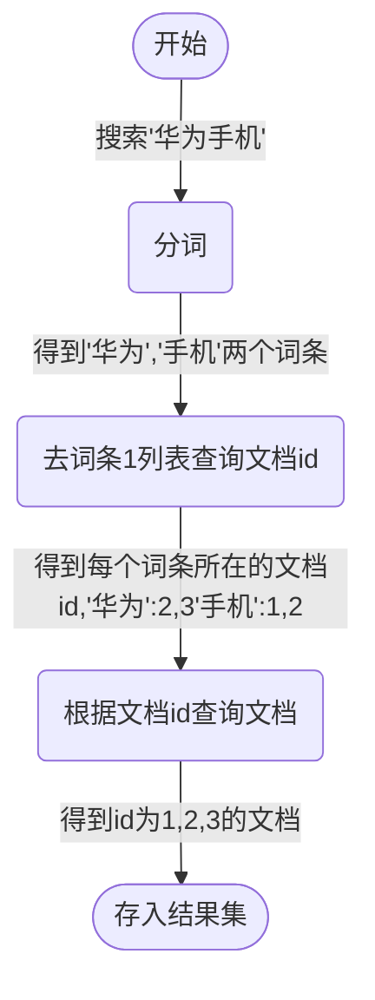

# Elasticsearch

* 强大的开源搜索引擎

* Elastic Stack(ELK) 用于日志数据分析，时实监控
    * Elasticsearc(数据存储、计算、搜索)
    * kibana(数据可视化)
    * Logstash(数据抓取)
    * Beats(数据抓取)

* 有Lucene发展而来
* 支持分布式，可水平扩展，提供Restful接口

## 倒排索引

> 正向索引：mysql数据库表内给id加索引

* 文档(document)：每条数据就是一个文档
* 词条(term)：文档按照语义分成的词语

* 正向索引

| id    | title    | price    |
|---------------- | --------------- | --------------- |
| 1    | 小米手机    | 3499    |
| 2    | 华为手机    | 4999    |
| 3    | 华为小米充电器    | 49    |
| 4    | 小米手环    | 499    |

* 倒排索引

| term   | document_id    |
|--------------- | --------------- |
| 小米   | 1,3,4   |
| 手机   | 1,2   |
| 华为   | 2,3   |
| 充电器   | 3   |
| 手环   | 4   |

* 倒排索引查询流程

### 文档和索引

#### 文档(document)

* Elasticsearch是面向文档存储，文档数据会被序列化为json后存储在Elasticsearch内

#### 索引(index)

* 相同类型的文档集合

* 映射(mapping)：索引中文档的字段约束信息，类似表的结构约束

#### 概念对比

| MySQL    | Elasticsearch    | 说明    |
|---------------- | --------------- | --------------- |
| Table | Index | 索引(index)，就是文档的集合，类似数据库的表(table) |
| Row | Document | 文档(document)，就是一条条数据，类似数据库中的行(Row)，文档都是JSON格式 |
| Column | Field | 字段(Field)，就是JSON文档中的字段，类似数据库中的列(Column) |
| Schema | Mapping | Mapping(映射)是索引中文档的约束，例如字段类型约束。类似数据库中的表结构(Schema) |
| SQL | DSL | DSL是Elasticsearch提供的JSON风格的请求格式，用来操作Elasticsearch，实现CRUD |

* Elasticsearch只适合搜索，事务相关操作用MySQL 

