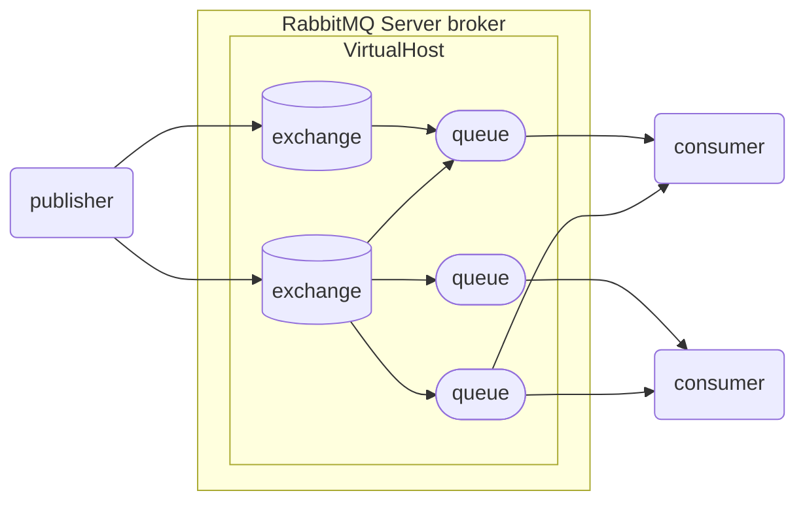

# RabbitMQ

> [demo地址](https://github.com/follow1123/rabbitmq-demo)

* 三个角色
    * 消息发送者：投递消息的人，就是调用方
    * 消息代理：管理、暂存、转发消息
    * 消息接收者：接收和处理消息的人，就是服务提供方

## 核心概念

* publisher: 消息发送者
* consumer: 消息的消费者
* queue: 队列，存储消息
* exchange: 交换机

### 流程

publisher将消息发送到exchange，exchange将消息路由到一个或多个queue，consumer监听queue获取消息

### VirtualHost

RabbitMQ可以有多个虚拟主机，可以支持多种不同的业务




---

## RabbitMQ管理页面

使用docker安装以`-management`结尾的版本会带一个web管理页面<br></br>
默认地址：**localhost:15672**<br></br>
默认用户名密码：**guest**

### Exchanges页面

* 用于管理交换机相关操作
* 在`Add a new exchange`处新建交换机
* 在交换机列表内点击交换机的名称进行详细操作
* 在交换机详细操作页面内的`Bindings`处对queue进行绑定
* 在`Publish message`处测试发送消息
* 在`Delete this exchange`处删除这个交换机

### Queues and Streams页面

* 在`Add a new queue`处新建队列
* 在queue列表内点击queue的名称进行详细操作
* 在queue详细操作页面内的`Bindings`处显示有哪些交换机绑定了当前队列
* 在`Get messages`处可以预览当前队列内的消息
* 在`Delete`处删除当前队列

### Admin页面

* 用于用户管理和虚拟主机的管理

---

## Java客户端

* **AMQP**(Advanced Message Queuing Protocol)
    * 应用之间传递业务消息的开放标准，与语言和平台无关
* Spring **AMQP**
    * 使用Java语言对**AMQP**协议的封装，包含`spring-amqp`抽象和`spring-rabbit`的默认实现

### 基础概念

* 同一条消息只能被一个消费者处理
* 多个consumer绑定在同一个queue上时，这些消息会被所有的消费者共同消费
* 默认情况下RabbitMQ会将消息以轮询的方式投递给绑定队列上的每一个consumer
* 通过在配置文件内设置`spring.rabbitmq.listener.simple.prefetch=1`来控制consumer
获取消息的数量，处理完上一条消息再处理下一条，实现能者多劳

#### 消息发送示例

* publisher

```java
@SpringBootTest
public class SpringAmqpTest {

    @Autowired
    public RabbitTemplate rabbitTemplate;

    @Test
    public void testSendSimpleMessage(){
        String queueName = "simple.queue";
        String message = "Hello rabbitmq!";
        rabbitTemplate.convertAndSend(queueName, message);
    }
}
```

* consumer

```java
@Component
public class AMQPListener {
    @RabbitListener(queues = "simple.queue")
    public void simpleQueueListener(String message){
        System.out.println("message received: " + message);
    }
}
```

---

### 交换机(exchange)

#### Fanout(广播)

* Fanout Exchange会将接收到的消息广播到每一个跟其绑定的queue

##### web管理页面操作

* 新建两个队列
* 新建一个交换机
    * `Type`选择`fanout`
    * 将上面新建的两个队列绑定到当前交换机上

##### 代码

* publisher

```java
@SpringBootTest
public class FanoutTest {
    @Autowired
    public RabbitTemplate rabbitTemplate;

    @Test
    public void testSendSimpleMessage(){
        String exchangeName = "test.fanout";
        String message = "fanout message";
        rabbitTemplate.convertAndSend(exchangeName, null, message);
    }
}
```

* consumer

```java
@Component
public class FanoutListener {

    @RabbitListener(queues = "fanout.queue1")
    public void listenFanout1Exchange(String msg){
        System.out.println("message received: " + msg);
    }

    @RabbitListener(queues = "fanout.queue2")
    public void listenFanout2Exchange(String msg){
        System.out.println("message received: " + msg);
    }
}
```

#### Direct(定向)

* Direct Exchange 会将接收到的消息根据规则路由到指定的queue
* 每一个queue都与exchange设置一个BindingKey
* 发布者发送消息时，指定消息的RoutingKey
* exchange将消息路由到BindingKey与消息RoutingKey一致的队列

##### web管理页面操作

* 新建两个队列`direct.queue1`和`direct.queue2`
* 新建一个交换机
    * `Type`选择`Direct`
    * 将上面新建的两个队列绑定到当前交换机上，绑定时指定对应的`Routing key`
    * `direct.queue1`的`Routing key`指定为red和blue
    * `direct.queue2`的`Routing key`指定为red和yellow

##### 代码

* publisher

```java
@SpringBootTest
public class DirectTest {
    @Autowired
    public RabbitTemplate rabbitTemplate;

    @Test
    public void testSendSimpleMessage() {
        String exchangeName = "test.direct";
        String message = "fanout message";
        rabbitTemplate.convertAndSend(exchangeName, "red", message);
    }
}
```

* consumer

```java
@Component
public class DirectListener {

    @RabbitListener(queues = "direct.queue1")
    public void listenDirect1Exchange(String msg){
        System.out.println("queue1 message received: " + msg);
    }

    @RabbitListener(queues = "direct.queue2")
    public void listenDirect2Exchange(String msg){
        System.out.println("queue2 message received: " + msg);
    }
}
```

#### Topic(话题)

* TopoicExchange与DirectExchange类似，区别在于routingKey可以是多个单词的列表，并且以`.`分割
* Queue与Exchange指定BindingKey时可以使用通配符
    * `#`: 代指0个或多个单词
    * `*`: 代指一个单词

##### web管理页面操作

* 新建两个队列`topic.queue1`和`topic.queue2`
* 新建一个交换机
    * `Type`选择`Topic`
    * 将上面新建的两个队列绑定到当前交换机上，绑定时指定对应的`Routing key`
    * `topic.queue1`的`Routing key`指定为`china.#`
    * `topic.queue2`的`Routing key`指定为`#.news`

##### 代码

* publisher

```java
@SpringBootTest
public class TopicTest {
    @Autowired
    public RabbitTemplate rabbitTemplate;

    @Test
    public void testSendSimpleMessage() {
        String exchangeName = "test.topic";
        String message = "topic message";
        // rabbitTemplate.convertAndSend(exchangeName, "china.weather", message);
        // rabbitTemplate.convertAndSend(exchangeName, "japan.news", message);
        rabbitTemplate.convertAndSend(exchangeName, "china.news", message);
    }
}
```

* consumer

```java
@Component
public class TopicListener {

    @RabbitListener(queues = "topic.queue1")
    public void listenTopic1Exchange(String msg){
        System.out.println("queue1 message received: " + msg);
    }

    @RabbitListener(queues = "topic.queue2")
    public void listenTopic2Exchange(String msg){
        System.out.println("queue2 message received: " + msg);
    }
}
```

---

### 代码声明队列和交换机

* 由于交换机和队列的创建实在web管理页面上操作的，项目发布时需要重新创建一次，
使用代码内声明减少错误

#### 配置类声明

* SpringAMQP提供了几个类，用来声明队列、交换机及其绑定关系：
    * Queue：用于声明队列，可以用工厂类QueueBuilder构建
    * Exchange：用于声明交换机，可以用工厂类ExchangeBuilder构建
    * Binding：用于声明队列和交换机的绑定关系，可以用工厂类BindingBuilder构建

```java
@Configuration
public class RabbitMQConfig {

    @Bean
    public FanoutExchange fanoutExchange(){
        return new FanoutExchange("test.fanout");
    }

    @Bean
    public Queue queue(){
        return new Queue("simple.queue1");
    }

    @Bean
    public Binding binding(FanoutExchange exchange, Queue queue){
        return BindingBuilder.bind(queue).to(exchange);
    }
}
```

#### 注解声明

```java
@Component
public class DirectAnnoListener {

    @RabbitListener(bindings = @QueueBinding(
            value = @Queue(name = "direct.queue1"),
            exchange = @Exchange(name = "test.direct", type = ExchangeTypes.DIRECT),
            key = {"red", "blue"}
    ))
    public void listenDirect1Exchange(String msg){
        System.out.println("queue1 message received: " + msg);
    }

    @RabbitListener(bindings = @QueueBinding(
            value = @Queue(name = "direct.queue2"),
            exchange = @Exchange(name = "test.direct", type = ExchangeTypes.DIRECT),
            key = {"red", "yellow"}
    ))
    public void listenDirect2Exchange(String msg){
        System.out.println("queue2 message received: " + msg);
    }
}
```

---

### 消息转换器

* 用于编解码消息
* consumer和publisher内都需要配置
* 切换消息转换器后，consumer在消费消息时由于新消息和队列内之前的消息格式不同导致报错，这就是消息丢失

```java
@Bean
public MessageConverter messageConverter(){
    return new Jackson2JsonMessageConverter();
}
```
## MQ高级

### 生产者可靠性

#### 生产者重连

* 由于生产者连接RabbitMQ时可能由于网络原因导致无法连接，所以需要配置重连相关操作
* SpringAMQP的重连机制是阻塞式，可能对业务性能有影响

```yaml
spring:
  rebbitmq:
    connection-timeout: 1s # 连接超时时间
    template:
      retry:
        enabled: true # 是否启用默认false
        initial-interval: 1000ms # 首次重连时间
        multiplier: 1 # 下次重连时间=(initial-interval * multiplier)
        max-attempts: 3 # 最大重连次数
```

#### 生产者确认

* RabbitMQ有Publisher Confirm和Publisher Return两种确认机制，开启确认机制后，在MQ成功收到消息后会返回确认消息给生产者。
返回的结果有以下几种情况：
    * 消息投递到了MQ，但是路由失败。此时会通过PublisherReturn返回路由异常原因，然后返回ACK，告知投递成功
    * 临时消息(non durable)投递到了MQ，并且入队成功，返回ACK，告知投递成功
    * 临时消息(durable)投递到了MQ，并且入队完成持久化，返回ACK，告知投递成功
    * 其他情况都会返回NACK，告知投递失败
* PublisherReturn机制是当消息被发布到一个没有匹配队列的交换机时，会触发返回机制
* PublisherConfirm机制是当消息被投递到队列内时触发
* `publisher-confirm-type`配置类型有三种
    * none：关闭confirm机制
    * simple：同步阻塞等待MQ的回执消息
    * correlated：MQ异步回调方式返回回执消息

```yaml
spring:
  rabbitmq:
    publisher-confirm-type: correlated # 异步方式实现消息确
    publisher-returns: true # 开启publisher-returns机制
```

##### PublisherReturn

* 准备一个未和任何队列绑定的交换机
* 由于PublisherReturn机制是全局生效的，所以需要在RabbitTemplate注入成功后就配置

```java
@Configuration
public class CommonConfig implements ApplicationContextAware {
    @Override
    public void setApplicationContext(ApplicationContext applicationContext) throws BeansException {
        RabbitTemplate rabbitTemplate = applicationContext.getBean(RabbitTemplate.class);
        rabbitTemplate.setReturnsCallback(returnedMessage -> {
            System.out.printf("消息发送失败，应答码：%d，原因：%s，交换机：%s，路由链：%s，消息：%s%n",
                    returnedMessage.getReplyCode(), returnedMessage.getReplyText(), returnedMessage.getExchange(),
                    returnedMessage.getRoutingKey(), returnedMessage.getMessage());
        });

    }
}
```

##### PublisherConfirm

```java
@SpringBootTest
public class PublisherConfirmTest {
    @Autowired
    public RabbitTemplate rabbitTemplate;

    @Test
    public void testPublisherConfirm() {
        CorrelationData cd = new CorrelationData();
        cd.getFuture().exceptionally(throwable -> {
                    System.out.println("消息回调失败");
                    return null;
                })
                .thenAccept(confirm -> {
                    if (confirm == null) return;
                    if (confirm.isAck()) {
                        System.out.println("消息发送成功，收到ack");
                    } else {
                        System.out.println("消息发送失败，收到nack，原因：" + confirm.getReason());
                    }
                });
        // rabbitTemplate.convertAndSend("test.direct", "red", "test msg", cd); // 收到ack
        // rabbitTemplate.convertAndSend("test.direct", "red1", "test msg", cd); // 触发publisher-returns机制，收到ack
        rabbitTemplate.convertAndSend("test.direct2", "red", "test msg", cd); // 收到nack
    }
}
```

* 使用PublisherReturn和PublisherConfirm机制需要额外的网络资源开销
* 大部分情况下处理的是nack问题，如果需要消息发送的可靠性，只需要开启PublisherConfirm机制即可

### MQ可靠性

* 在默认情况下，RabbitMQ会将接收到的消息保存在内存中以降低消息收发的延时。这样会导致下面两个问题：
    * 一旦MQ宕机，内存中的消息会丢失
    * 内存空间有限，当消费者故障或处理过慢时，会导致消息积压，引发MQ阻塞
* 当某个队列满了后在投递消息到这个队列上时，MQ会将这个队列中的消息部分写入到硬盘内，这个过程中这个队列是阻塞的，这个过程叫`pageout`

#### 数据持久化

* RabbitMQ实现数据持久化包含3个方面
    * 交换机持久化，创建交换机时的`Durability`属性类型为`Druable`和`Transient`
    * 队列持久化，创建队列时的`Durability`属性类型为`Druable`和`Transient`
    * 消息持久化，配置`Properties`：`delivery_mode=2`

##### 测试pageout

```java
@SpringBootTest
public class PersistentTest {

    @Autowired
    public RabbitTemplate rabbitTemplate;

    @Test
    public void testSendMultiSimpleMessage() {
        String queueName = "simple.queue";
        Message message = MessageBuilder.withBody("hello".getBytes(StandardCharsets.UTF_8))
                .setDeliveryMode(MessageDeliveryMode.NON_PERSISTENT).build();
        for (int i = 1; i <= 10000000; i++) {
            rabbitTemplate.convertAndSend(queueName, message);
        }
    }
}
```
#### Lazy Queue

* 从RabbitMQ3.6.0版本增加了LazyQueue(惰性队列)特性，特征如下
    * 接收到消息后直接存入磁盘而非内存（内存中只保留最近的消息，默认2048条）
    * 消费者要消费消息时才会从磁盘中读取并加载到内存
    * 支持数百万条的消息存储
* 3.12版本后默认都是LazyQueue模式

##### 配置方式（3.12前）

* 新建队列时添加`x-queue-mode=lazy`的`Arguments`
* 代码方式

```java
@Bean
public Queue lazyQueue(){
    return QueueBuilder
            .durable("lazy.queue")
            .lazy() // 开启Lazy模式
            .build();
}
```

* 注解方式

```java
@RabbitListener(queuesToDeclare = @Queue(
        name = "lazy.queue",
        durable = "true",
        arguments = @Argument(name = "x-queue-mode", value = "lazy")
))
public void listenDirect1Exchange(String msg){
    System.out.println("queue1 message received: " + msg);
}
```

### 消费者可靠性

#### 消费者确认机制

* 为了确认消费者是否成功处理消息，RabbitMQ提供了消费者确认机制（Consumer Acknowledgement）。
当消费者处理消息结束后，应该向RabbitMQ发送一个回执，告知RabbitMQ自己消息处理状态。回执有3种可选值：
    * `ack`：成功处理消息，RabbitMQ从队列中删除该消息
    * `nack`：消息处理失败，RabbitMQ需要再次投递消息
    * `reject`：消息处理失败并拒绝该消息，RabbitMQ从队列中删除该消息
* SpringAMQP已经实现了消息确认功能。并允许通过配置文件选择ACK处理方式，有三种方式：
    * `none`：不处理。即消息投递给消费者上立即`ack`，消息会立即从MQ删除。不安全，不建议使用
    * `manual`：手动模式。需要自己在业务代码种调用api，发送`ack`或`reject`，存在业务入侵，灵活
    * `auto`：自动模式。SpringAMQP利用AOP对消息处理逻辑做了环绕增强，当业务正常执行时则自动返回`ack`，
    当业务出现异常时，根据异常判断返回不同结果
        * 如果时业务异常，会自动返回`nack`
        * 如果是消息处理异常或校验异常，自动返回`reject`
```yaml
spring:
  rabbitmq:
    listener:
      simple:
        prefetch: 1
        acknowledge-mode: none/manual/auto
```
* 当业务代码处理异常导致返回nack后，MQ会重新发送该消息，如果业务一直异常会导致无限重试

#### 消费处理失败

##### 失败重试机制

*  当消费者出现异常后，消除会不断requeue（重新入队），再重新发送给消费者，然后再次异常，再次requeue，
无限循环，导致mq的消息处理飙升
*  我们可以利用Spring的retry机制，在消费者出现异常时利用本例重试，而不是无限制的requeue到mq：
```java
spring:
  rabbitmq:
    listener:
      simple:
        retry:
          enabled: true # 是否开启
          initial-interval: 1000ms # 首次重试时间
          multiplier: 1 # 下次重试时间=(initial-interval * multiplier)
          max-attempts: 3 # 最大重试次数
          stateless: true # 是否有状态，类似于事务
```

##### 失败消息处理策略

* 在开启重试模式会，重试次数耗尽，如果消息依然失败，则需要由`MessageRecoverer`接口来处理，三种实现：
    * `RejectAndDontRequeueRecoverer`：重试耗尽后，直接`reject`，丢失消息。默认方式
    * `ImmediateRequeueMessageRecoverer`：重试耗尽后，返回`nack`，消息重新入队
    * `RepublishMessageRecoverer`：重试耗尽后，将失败消息投递到指定的交换机，也称死信队列

###### 死信队列代码配置

```java
@Configuration
@ConditionalOnProperty(prefix = "spring.rabbitmq.listener.simple.retry", name = "enabled", havingValue = "true")
public class RabbitErrorConfig {
    @Bean
    public DirectExchange errorExchange(){
        return new DirectExchange("error.direct");
    }
    @Bean
    public Queue errorQueue(){
        return new Queue("error.queue");
    }
    @Bean
    public Binding errorBinding(DirectExchange exchange, Queue queue){
        return BindingBuilder.bind(queue).to(exchange).with("error");
    }

    @Bean
    public MessageRecoverer messageRecoverer(RabbitTemplate rabbitTemplate){
        return new RepublishMessageRecoverer(rabbitTemplate, "error.direct", "error");
    }

}
```

#### 业务幂等性

* **幂等**在程序开发中，是指同一个业务，执行一次或多次对业务状态的影响是一致的
    * 幂等业务：
        * 查询、删除
    * 非幂等业务：
        * 下单、退款等
* 处理消息重复的方式：

##### 唯一消息id

* 给每个消息都设置一个**唯一id**，利用id区分是否是重复消息：
    * 每一条消息都生成一个唯一的id，与消息一起投递给消费者
    * 消费者接收到消息后处理自己的业务，业务处理成功后将消息id保存到数据库
    * 如果下次又收到相同的消息，去数据库查询判断是否存在，存在测为重复消息放弃处理

```java
@Configuration
public class RabbitMQConfig {

    @Bean public MessageConverter messageConverter(){
        Jackson2JsonMessageConverter jackson2JsonMessageConverter = new Jackson2JsonMessageConverter();
        // 设置自动生成消息id
        jackson2JsonMessageConverter.setCreateMessageIds(true);
        return jackson2JsonMessageConverter;
    }

}
```
##### 业务判断

* 结合业务逻辑，基于业务本身做判断。假如业务是在支付后修改订单状态为已支付，
应该修改订单状态前线查询订单状态，判断状态是否是未支付。只有未支付的订单才需要修改，其他状态不做处理

### 消息可靠性解决流程

* 生产者可靠性
    * 首先保证生产者与RabbitMQ直接网络连接是否可靠，使用生产者重连机制
    * 保证生产者投递的消息是否可以正确的通过交换机抵达队列，使用PublisherReturn机制判断
    * 保证生产者投递的消息是否成功抵达队列，（durable队列存入队列即可，non durable队列还需要保存到磁盘），
    使用PublisherConfirm机制通过mq返回的`ack`、`nack`判断
* MQ可靠性
    * 保证MQ宕机后消息是否丢失，在发送消息时添加`delivery_mode=2`属性使消息变成持久化消息
    * 使用LazyQueue机制在影响性能的情况下保证消息的可靠性
* 消费者可靠性
    * 保证消费者是否收到消息，通过开启消费者确认机制实现`spring.rabbitmq.listener.simple.acknowledge-mode=auto`，通过消费者返回的`ack`、`nack`、`reject`判断
    * 如果业务异常导致消息一致返回`nack`并requeue，首先开启消费者本地重试机制`spring.rabbitmq.listener.simple.retry.enabled=true`，
    * 如果本地重试还是失败则使用`MessageRecoverer`接口配置失败策略，是丢弃消息，还是重新入队，还是放入死信队列
    * 保证消费者业务幂等性可以在发送消息是添加消息id，在生产者配置消除转换器是添加`setCreateMessageIds(true)`，设置消息发送时的id
    * 保证消费者业务幂等性也可以通过业务内的状态判断
* 如果以上方法都无法保证消息的可靠性，则可以使用其他方式
    * 假如支付业务通知消息失败，则可以使用定时任务主动向支付服务获取支付状态

### 延时消息

* 生产者发送消息时指定一个时间，消费者不会立刻收到消息，而是在指定时间之后才收到消息。
    * 购物软件购买商品时，需要在一定时间内支付的逻辑

#### 死信交换机

* 当一个队列中的消息满足下列情况之一时，就会成为*死信（dead letter）*
    * 消费者使用basic.reject或basic.nack声明消费失败，并且消息的requeue参数设置为false
    * 消息是一个过期的消息（达到了队列或消息本身设置的过期时间），超时无人消费
    * 要投递的队列消息堆积满了，最早的消息可能成为死信
如果队列通过dead-letter-exchange属性指定了一个交换机，那么该队列中的死信就会投递到这个交换机中。
这个交换机称为**死信交换机（Dead Letter Exchange，简称DLX）。

##### 使用死信交换机实现延时消息

* 新建`simple.queue2`队列，指定`x-dead-letter-exchange=dlx.direct`属性，属性值是死信交换机的名称
* 新建`simple.direct2`交换机，绑定`simple.queue2`队列，Routing设置为dlx
* 新建`dlx.queue`队列
* 新建`dlx.direct`交换机，绑定`dlx.queue`，Routing设置为dlx

###### 代码

* publisher

```java
@SpringBootTest
public class DeadLetterTest {

    @Autowired
    public RabbitTemplate rabbitTemplate;

    @Test
    public void testSendSimpleMessage() {
        rabbitTemplate.convertAndSend("simple.direct2", "dlx", "test dlx", message -> {
            message.getMessageProperties().setExpiration("10000");
            return message;
        });
    }
}
```

* consumer

```java
@Component
public class DeadLetterListener {

    @RabbitListener(queues = "dlx.queue")
    public void listenDLX(String message){
        System.out.println(LocalDateTime.now().format(DateTimeFormatter.ofPattern("yyyy-MM-dd hh:mm:ss")));
        System.out.println("message received: " + message);
    }
}
```

#### 延时消息插件

* RabbitMQ官方推出了一个插件，原生支持延时消息功能。该插件的原理是设计了一种支持延时消息功能的交换机，
当消息投递到交换机后可以暂存一定时间，到期后再投递到队列。

##### 安装插件

* [插件github地址](https://github.com/rabbitmq/rabbitmq-delayed-message-exchange)，直接下载.ez文件
* 使用`rabbitmq-plugins directories -s`命令查询插件目录，第一个就是，默认`/opt/rabbitmq/plugins`
* 将ez文件放入插件目录后执行`rabbitmq-plugins enable rabbitmq_delayed_message_exchange`，重启rabbitmq即可

##### 代码

* publisher

```java
@SpringBootTest
public class DelayTest {
    @Autowired
    public RabbitTemplate rabbitTemplate;

    @Test
    public void testSendDelayMessage() {
        rabbitTemplate.convertAndSend("delay.direct", "delay", "test delay", message -> {
            message.getMessageProperties().setDelayLong(10000L);
            return message;
        });
    }
}
```

* consumer

```java
@Component
public class DelayListener {

    @RabbitListener(bindings = @QueueBinding(
            value = @Queue(name = "delay.queue", durable = "true"),
            exchange = @Exchange(name = "delay.direct", delayed = "true"),
            key = "delay"
    ))
    public void listenDelayMessage(String message) {
        System.out.println(LocalDateTime.now().format(DateTimeFormatter.ofPattern("yyyy-MM-dd hh:mm:ss")));
        System.out.println("message received: " + message);
    }
}
```
