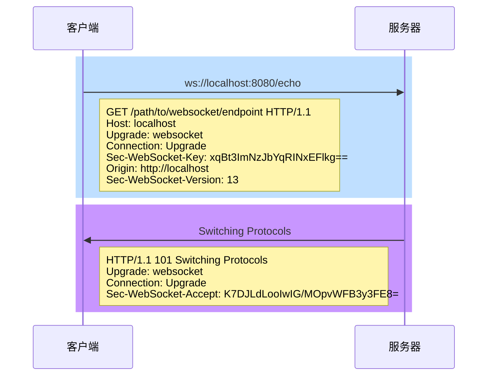

# WebSocket

使用 Tomcat 容器

[详细代码](https://github.com/follow1123/java-frameworks/blob/main/websocket)

## WebSocket 协议

WebSocket 是一种网络通信协议，旨在实现客户端和服务器之间的双向、全双工通信。与传统的 HTTP 协议不同，WebSocket 允许在单一的连接上进行实时数据交换，而无需每次请求时都重新建立连接

```bash title="WebSocket URL"
ws://host:port/path?query   # websocket 协议URL
wss://host:port/path?query  # 使用 SSL/TLS 加密
```



## 编程式 Endpoints

1. 处理消息：实现 `MessageHandler` 类

```java
public class EchoMsgHandlerTxt implements MessageHandler.Whole<String> {

    private final RemoteEndpoint.Basic remoteEndpoint;

    EchoMsgHandlerTxt(RemoteEndpoint.Basic remoteEndpoint) {
        this.remoteEndpoint = remoteEndpoint;
    }

    @Override
    public void onMessage(String message) {
        System.out.printf("programmatic string handle message %s%n", message);
        if (remoteEndpoint != null){
            try {
                remoteEndpoint.sendText(message);
            } catch (IOException e) {
                throw new RuntimeException(e);
            }
        }
    }
}
```

2. 添加消息处理器：继承 `Endpoint` 类

```java
public class ProgrammaticEndpoint extends Endpoint {
    @Override
    public void onOpen(Session session, EndpointConfig endpointConfig) {
        RemoteEndpoint.Basic basicRemote = session.getBasicRemote();
        session.addMessageHandler(new EchoMsgHandlerTxt(basicRemote));
    }
}
```

3. 配置 Endpoint：实现 `ServerApplicationConfig` 接口

```java
public class WsConfig implements ServerApplicationConfig {
    @Override
    public Set<ServerEndpointConfig> getEndpointConfigs(Set<Class<? extends Endpoint>> endpointClasses) {
        HashSet<ServerEndpointConfig> configs = new HashSet<>();
        // 编程方式Endpoint配置方式
        if (endpointClasses.contains(ProgrammaticEndpoint.class)){
            configs.add(ServerEndpointConfig.Builder.create(ProgrammaticEndpoint.class, "/ws/echo").build());
        }
        return configs;
    }

    @Override
    public Set<Class<?>> getAnnotatedEndpointClasses(Set<Class<?>> scanned) {
        return scanned;
    }
}
```

## 注解式 Endpoint

```java
@ServerEndpoint("/ws/anno/echo")
public class AnnotationEndpoint{

    @OnMessage
    public void echoTxtMsg(Session session, String msg){
        if (session.isOpen()) {
            try {
                RemoteEndpoint.Basic basicRemote = session.getBasicRemote();
                session.getBasicRemote().sendText(msg);
            } catch (IOException e) {
                throw new RuntimeException(e);
            }
        }
    }
}
```

:::note
这种方式无需配置，添加注解即可使用
:::

其他注解

| 注解    | 事件    |
|---------------- | --------------- |
| `OnOpen`    | 连接打开    |
| `OnMessage`    | 收到消息    |
| `OnError` | 连接出错 |
| `OnClose` | 连接关闭 |

```java
@OnOpen
public void open(Session session, EndpointConfig conf) { }

@OnMessage
public void message(Session session, String msg) { }

@OnError
public void error(Session session, Throwable error) { }

@OnClose
public void close(Session session, CloseReason reason) { }
```

## 前端

参考：[mdn](https://developer.mozilla.org/zh-CN/docs/Web/API/WebSocket)

```javascript
// 创建 WebSocket
let ws = new WebSocket("ws://localhost:8080/ws/echo");
ws.onopen = function() {
    // 处理打开连接操作
}
ws.onmessage = function (event) {
    // 处理接收消息操作
};
ws.onclose = function (event) {
    // 处理关闭连接操作
};
ws.onerror = function (event) {
    // 处理错误操作
};

// 发送消息
ws.send("hello");
```

## 编码器/解码器

需要实现两对接口

* `Encoder.Text<T>`/`Decoder.Text<T>` 字符串编码解码器
* `Encoder.Binary<T>`/`Decoder.Binary<T>` 二进制编码解码器

<details>
    <summary>Person 对象</summary>
```java
public class Person {

    private String name;
    private int age;

    public String getName() {return name;}
    public void setName(String name) {this.name = name;}
    public int getAge() {return age;}
    public void setAge(int age) {this.age = age;}

    @Override
    public String toString() {
        return "Person{name='" + name + '\'' + ", age=" + age + '}';
    }
}
```
</details>

<details>
    <summary>Person 对象转 json 编码器</summary>
```java
public class PersonJsonEncoder implements Encoder.Text<Person> {

    @Override
    public String encode(Person person) throws EncodeException {
        // 这里使用 jackson 进行 json 转换
        ObjectMapper om = new ObjectMapper();
        try {
            return om.writeValueAsString(person);
        } catch (JsonProcessingException e) {
            throw new RuntimeException(e);
        }
    }

    @Override
    public void init(EndpointConfig config) {}
    @Override
    public void destroy() {}
}
```
</details>

<details>
    <summary>json 转 Person 对象解码器</summary>
```java
public class JsonPersonDecoder implements Decoder.Text<Person> {

    @Override
    public Person decode(String s) throws DecodeException {
        // 这里使用 jackson 进行 json 转换
        ObjectMapper om = new ObjectMapper();
        try {
            return om.readValue(s, Person.class);
        } catch (JsonProcessingException e) {
            throw new RuntimeException(e);
        }
    }

    @Override
    public boolean willDecode(String s) {
        // 这里是判断发送过来的字符串是否可以使用当前解码器
        return true;
    }
    @Override
    public void init(EndpointConfig config) {}
    @Override
    public void destroy() {}
}
```
</details>

```java
@ServerEndpoint(
        value = "/ws/ed/echo",
        encoders = PersonJsonEncoder.class, // 编码器
        decoders = JsonPersonDecoder.class // 解码器
)
public class EncodeDecodeEndpoint {

    @OnMessage
    public void echoJsonMsg(Session session, Person person){
        System.out.printf("encode decode handle message %s%n", person);
        if (session.isOpen()) {
            try {
                session.getBasicRemote().sendObject(person);
            } catch (IOException | EncodeException e) {
                throw new RuntimeException(e);
            }
        }
    }
}
```

## 路径参数

```java
// 使用{}表示参数
@ServerEndpoint("/ws/param/{name}/echo")
public class PathParamEndpoint {

    @OnOpen
    public void open(Session session, EndpointConfig ec, @PathParam("name") String name){
        // 配合 @PathParam 获取路径参数
        System.out.printf("handle path param %s%n", name);
        // 保存到当前会话内
        session.getUserProperties().put("name", name);
    }

    @OnMessage
    public void onHandlePathParam(Session session, String msg){
        if (session.isOpen()) {
            // 获取当前会话指定的数据
            String name = (String) session.getUserProperties().get("name");
            System.out.printf("get path param %s with message %s%n", name, msg);
            try {
                session.getBasicRemote().sendText(msg + name);
            } catch (IOException e) {
                throw new RuntimeException(e);
            }
        }
    }
}
```

## 参考

* [Jakarta EE](https://jakarta.ee/learn/docs/jakartaee-tutorial/9.1/web/websocket/websocket.html)
* [Tomcat](https://tomcat.apache.org/tomcat-9.0-doc/web-socket-howto.html)
