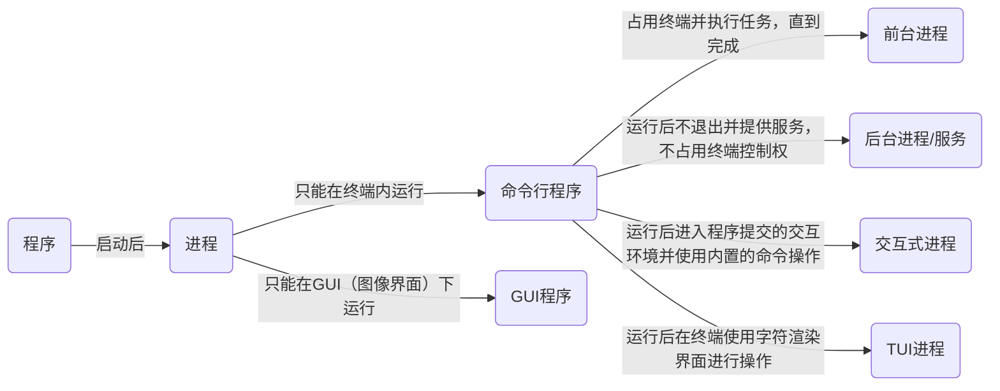

# Linux 基础

## 文件系统

Linux 的文件系统采用 单一根目录（/），所有文件和目录都从根目录开始。所有挂载的磁盘和文件系统都会整合到这个层次结构中

### 文件层次

```bash
/       # C盘，系统文件一般存放在这里
├─bin   # 可执行文件
├─boot  # 启动引导文件，如内核文件
├─dev   # 设备文件（如硬盘、终端、USB 设备等）
├─etc   # 系统配置文件
├─home  # 用户主目录
├─lib   # 系统共享库
├─media # 可移动媒体（如 CD-ROM、U 盘等）
├─mnt   # 临时挂载目录
├─opt   # 可选应用程序软件包
├─proc  # 进程信息虚拟文件系统
├─root  # 根用户的主目录
├─run   # 运行时文件（如进程 PID 文件）
├─sbin  # 系统管理命令文件
├─srv   # 服务数据
├─sys   # 系统信息文件（如硬件信息）
├─tmp   # 临时文件
├─usr   # 用户程序文件
└─var   # 可变数据文件（如日志文件、数据库文件等）
```

:::note
在 Debian 系列系统下 `/bin`，`/sbin`，`/lib` 这几个文件夹是连接到 `/usr` 目录下对应的文件夹
:::

#### 软件数据存放路径

Linux 下有几个存放软件数据的位置，分别对应不同的情况

* `/usr` - 存放包管理安装的软件数据，里面的软件一般给所有用户和管理员使用
* `/usr/local` - 存放手动安装并可以给所有用户使用的软件
* `~/.local` - 根据 [freedesktop](https://specifications.freedesktop.org/basedir-spec/latest/) 规范，存放当前用户自己安装的软件，软件只有当前用户可以使用
* `/opt` - 第三方闭源软件安装路径

`/usr`，`/usr/local`，`~/.local` 这三个路径下的目录格式基本一样

* `bin` - 存放可执行文件
* `include` - 头文件
* `lib` - 库文件
* `share` - 软件数据
    * `share/applications` - 软件对应的 `.desktop` 文件，桌面环境下使用
    * `share/fonts` - 字体
    * `share/icons` - 图标
    * `share/man` - 帮助手册
    * `share/doc` - 文档
* `src` - 源码

#### 配置存放路径

* `/etc` - 系统级别软件配置文件存放路径，（包管理器、防火墙等）
* `~/.config` - 用户级别软件存放路径，以前全放在用户家目录下，根据 [freedesktop](https://specifications.freedesktop.org/basedir-spec/latest/) 规范，调整为这个目录

---

### 文件类型

使用 `ls -l` 命令每行的第一个字符就表示文件的类型

| 文件类型 | 标识符 | 描述 |
| --- | --- | --- |
| 普通文件 | `-` | 存储数据的文件，可以是文本文件、二进制文件、图像等 |
| 目录文件 | `d` | 用于存储文件的容器，包含其他文件和目录的路径 |
| 符号链接文件 | `l` | 指向另一个文件或目录的链接 |
| 硬链接文件 | `-` | 共享相同数据块的文件，没有区别于普通文件，但指向相同的数据块 |
| 字符设备文件 | `c` | 用于与字符设备（如终端、串口）通信的文件 |
| 块设备文件 | `b` | 用于与块设备（如硬盘、USB 驱动器）通信的文件 |
| 管道文件（FIFO） | `p` | /tmp/mypipe 用于进程间通信的特殊文件，允许进程间传递数据 |
| 套接字文件 | `s` | 用于网络通信和进程间通信的特殊文件 |


:::note
使用 `file <filename>` 查看文件的类型名称

使用 `stat <filename>` 查看文件详细信息
:::


---

### 常用命令

[参考](./commands#文件目录)

---

## 权限

### 所有者

文件或目录的创建用户

```bash
# 查看文件所有者
ls -ahl

# 修改文件或目录所有者
chown <user> <file_or_folder>

# 修改所有者同时修改组
chown <user>:<group> <file_or_folder>

chgrp <group> <file_or_folder>
```

---

### 读/写/执行权限

`ls -l` 显示的第一列信息，由 `r`、`w`、`x` 等字符组成

第一位表示[文件类型](#文件类型)，后面所有字符都表示文件权限

* `2~4位` - 所有者权限
* `5~7位` - 组权限
* `8~10位` - 其他用户权限

#### 权限说明

##### 文件

* `r` - read（读），可以读取，查看
* `w` - write（写），可以修改，但是不代表可以删除该文件，删除一个文件的前提条件是对该文件所在的目录有写权限，才能删除该文件
* `x` - execute（执行），可以被执行

##### 目录

* `r` - read（读），可以读取，ls 查看目录内容
* `w` - write（写），可以修改，可以在目录内进行**创建**、**删除**、**重命名**等操作
* `x` - execute（执行），可以进入该目录

使用 <code>[chmod](./commands#chmod)</code> 命令修改文件或目录的权限

---

### 相关文件说明

| 文件 | 说明 | 格式 |
| --------------- | --------------- | --------------- |
| `/etc/passwd` | **用户**文件，记录用户的各种信息 | `用户名` : `口令` : `用户标识号` : `组标识号` : `注释性描述` : `主目录` : `shell` |
| `/etc/shadow` | **口令**文件 | `登录名` : `加密口令` : `最后一次修改时间` : `最小时间间隔` : `最大时间间隔` : `警告时间` : `不活动时间` : `失效时间` : `标志` : `登录名` : `加密口令` : `最后一次修改时间` : `最小时间间隔` : `最大时间间隔` : `警告时间` : `不活动时间` : `失效时间` : `标志` |
| `/etc/group` | **组**文件，记录Linux包含的组的信息 | `组名` : `口令` : `组标识号` : `组内用户列表` |

:::info
在 linux 中的每个用户必须属于一个组，不能独立于组外

在 linux 中每个文件有**所有者**、**所在组**、**其它组**的概念
:::

## 终端

### 终端模拟器

终端模拟器（Terminal Emulator）是一个软件程序，提供了一个图形化的用户界面，用来模拟一个传统的硬件终端（Terminal）。它允许用户输入命令并显示命令的输出

常见的终端模拟器

* [ghostty](https://ghostty.org)
* [alacritty](https://github.com/alacritty/alacritty)
* [wezterm](https://wezfurlong.org/wezterm)

### Shell

[参考](./shell)

---

## 程序

在 Linux 系统中，程序后系统会创建一个运行时实例（进程）

每个进程都会分配一个 pid（进程ID）



常用命令

* <code>[top](./commands#top)</code> - 一个**TUI进程**，用于查看系统所有内进程信息
* <code>[ps](./commands#ps)</code> - 一个**前台进程**，用于在控制台输出系统内所有进程信息
* [其他](./commands#进程服务)

---

### 服务管理

服务（service）本质就是进程，但是运行在后台，通常会监听某个端口，等待其他程序的请求，比如：mysqld、sshd、firewalld等，也可以称为守护进程

#### service 命令（已过时）

推荐使用 [systemctl](#systemctl) 管理

```bash
# 操作服务
# start
# stop 
# restart 
# reload 
# statue
service <service_name> start

# 查看服务自启动状态
chkconfig <service_name> --list

# 指定服务在某个系统运行级别自启动
chkconfig --level <level> <service_name> [on|off]
```
---

#### systemctl

systemd 服务管理命令，参考 [systemctl](./systemd#服务)

---

### 定时任务

#### cron

任务调度：是指系统在某个时间执行的特定的命令或程序

安装：`apt install cron`

使用：[参考](./commands#crontab)

---

#### at

`at` 是一次性定时任务，`at` 的守护进程 `atd` 会以后台模式检查任务队列运行

安装：`apt install at`，确保 `atd` 服务是否运行 `ps -ef | grep atd` 

`atd` 守护进程默认每60秒检查任务队列，有任务时，会检查任务运行时间，如果时间与当前时间匹配，则运行此任务

`at` 命令是一次性定时任务，任务执行完成后不会重复执行

使用：[参考](./commands#at)

---

#### systemd

[参考](./systemd#定时任务)

---

## 网络

### 网络配置

网络一般可以配置静态 ip 或动态获取，参考具体网络工具的配置

#### ifupdown

Debian 系列系统下面默认的网络管理工具

配置文件：`/etc/network/interfaces`

TODO

---

#### NetworkManager

图像界面管理网络工具

TODO

---

#### systemd

参考 [systemd-networkd](./systemd#网络管理)

---

#### WiFi 配置

##### wpa supplicant

安装：`sudo apt install wpasupplicant`

###### 基础配置

查看 wpa 相关服务：`ls /lib/systemd/system | grep wpa`

一般使用 `wpa_supplicant@.service` 这个服务指定特定接口监听

配置文件

这里在创建好这个配置文件后也可以使用 `wpa_passphrase "WiFi名" 密码 >> /etc/wpa_supplicant/wpa_supplicant-<interface>.conf` 命令添加 WiFi 信息到文件内

或者使用 `wpa_cli`、`wpa_gui(需要安装)` 等工具管理


```conf title="/etc/wpa_supplicant/wpa_supplicant-<interface>.conf"
ctrl_interface=DIR=/var/run/wpa_supplicant GROUP=netdev
update_config=1
network={
    ssid="WiFi名"
    psk=密码
}
```


启动

```bash
sudo systemctl enable --now wpa_supplicant@<interface>.service
```

---

### 主机名

```bash
# 查看主机名
# 如果需要修改主机名，在 /etc/hostname 文件内修改，修改后重启系统
hostname
```
---

### DHCP

DHCP（动态主机配置协议，Dynamic Host Configuration Protocol）是一种用于在局域网（LAN）中自动分配 IP 地址和其他网络配置参数的协议。它使得设备（如计算机、打印机、路由器等）能够动态地获得 IP 地址及相关网络配置，而不需要手动配置每台设备

在使用 `ifupdown` 配置网络时，如果需要使用 DHCP 连接开启了 DHCP 服务的网关，则需要配合 `dhclient` 命令连接

在使用 `systemd-networkd` 配置网络时，则只需要添加启用 DHCP 的配置，`systemd-networkd` 内置了一个 DHCP 客户端

---

### DNS

DNS（Domain Name System，域名系统） 互联网的一项基础服务，它的主要功能是将人类可读的域名（例如 `www.example.com`）转换成计算机可识别的 IP 地址（如 192.0.2.1）。这个转换过程称为“域名解析”，它允许我们通过易记的域名访问网站或其他网络资源，而无需记住复杂的 IP 地址

#### hosts 文件

当系统进行域名解析时，它首先会查找 `/etc/hosts` 文件。如果在该文件中找到匹配的条目，则使用该 IP 地址

文件格式

```bash
127.0.0.1   localhost
192.168.1.10 myserver myserver.local
```

#### 本地域名解析服务

在本地启动的DNS服务，用于提高解析速度、添加缓存、加密等功能

* systemd 提供的域名解析服务：[systemd-resolved](./systemd#systemd-resolved)

---

### 防火墙

* `iptables` - 直接的防火墙工具，处理流量过滤
* `nftables` - `iptables` 的替代工具，改进性能和灵活性
* <code>[firewalld](./commands#firewall-cmd)</code> - 基于 `iptables` 或 `nftables` 防火墙管理工具，提供动态规则管理
* `ufw` - 简化防火墙配置工具，基于 `iptables` 或 `nftables`

---

## 磁盘管理

在 Linux 系统中，硬盘、存储设备和分区等通常会以特定的命名格式进行标识。不同类型的存储设备（如 SATA、SCSI 和 NVMe）都有不同的命名规则

SATA/SCSI 硬盘

* `sda` - 第一个 SATA 或 SCSI 设备
    * `sda1` - 第一个 SATA 或 SCSI 设备的第一个分区
    * `sda2` - 第一个 SATA 或 SCSI 设备的第二个分区
* `sdb` - 第二个 SATA 或 SCSI 设备
    * `sdb1` - 第二个 SATA 或 SCSI 设备的第二个分区

NVMe 硬盘

* `nvme0n1` - 第一个 NVMe 设备的第一个命名空间
    * `nvme0n1p1` - 第一个 NVMe 设备的第一个分区
    * `nvme0n1p2` - 第一个 NVMe 设备的第二个分区
* `nvme1n1` - 第二个 NVMe 设备的第一个命名空间
    * `nvme1n1p1` - 第二个 NVMe 设备的第一个分区

---

### 分区

分区是磁盘管理中非常重要的一部分，它涉及将一个物理磁盘分割成多个逻辑单元（分区），每个分区可以用于存储不同的文件系统或操作系统

#### 分区表类型

##### MBR（主引导记录）

MBR 是较旧的分区表格式，它支持最多 4 个主分区，或者 3 个主分区加 1 个扩展分区。MBR 分区表位于磁盘的第一个扇区（通常是磁盘的 512 字节）。MBR 还包含启动加载程序，启动操作系统时会执行该程序

* 最大支持磁盘容量：2TB
* 最多主分区数：4 个主分区，或者 3 个主分区 + 1 个扩展分区
* 局限性：不支持大于 2TB 的磁盘，也不支持更多的分区

##### GPT（GUID 分区表）

GPT 是一种更现代的分区表格式，它克服了 MBR 的许多限制，尤其是支持更大的磁盘和更多的分区。GPT 是基于 GUID（全局唯一标识符）的，具有更强的可扩展性和灵活性。GPT 存储在磁盘的多个地方，因此它具有更好的可靠性

* 最大支持磁盘容量：9.4 ZB（泽字节，极其巨大的存储空间）
* 最多分区数：理论上可以支持 128 个分区（在 Linux 中），不过可以根据需要扩展
* 优势：支持大于 2TB 的磁盘，并且具有冗余保护，增强了数据的安全性

##### 分区命令

* [lsblk](./commands#lsblk) - 查看系统内磁盘分区信息
* [fdisk](./commands#fdisk) - 对磁盘进行分区
* [parted](./commands#fdisk) - 对磁盘进行分区

---

### 格式化

分区格式化 是将存储设备（如硬盘或 SSD）的分区创建成文件系统的过程。这个过程不仅会在硬盘上分配空间，还会创建特定类型的文件系统，以便操作系统能够存储和访问数据

常见的 Linux 文件系统类型

* `ext4` - （Fourth Extended File System）这是 Linux 最常用的文件系统之一，广泛应用于桌面、服务器等各种环境。它支持大文件、日志、延迟分配等特性
* `xfs` - XFS 是一个高性能的日志型文件系统，尤其适用于大文件和高负载的环境。它是许多 Linux 发行版的默认文件系统，特别是在企业级环境中
* `btrfs` - 这是一个现代的文件系统，具有快照、压缩、内建 RAID 支持等特性。它在功能和灵活性方面优于 ext4 和 xfs，但在稳定性和成熟度上还在逐步改进中
* `f2fs` - 优化的闪存文件系统，专为 NAND 闪存设备设计，尤其适用于 SSD
* `swap` - 这种文件系统用于交换空间（交换分区），与其他文件系统不同，它不存储数据文件，而是用于临时数据交换

使用 <code>[mkfs](./commands#mkfs)</code> 命令格式化分区

---

### 挂载

Linux 使用一种统一的文件系统结构（树状结构），所有的存储设备（包括硬盘、U 盘、网络文件系统等）都挂载到该树状结构的某个目录中。这个挂载点（mount point）可以是任何空目录

使用 <code>[mount](./commands#mount)</code> 命令挂载设备，使用 <code>[umount](./commands#umount)</code> 卸载设备

#### 永久挂载设备

对 `/etc/fstab` 文件进行操作

1. 创建一个目录用于挂载，一般在 `/media`（临时挂载）目录或 `/mnt`（永久挂载）目录下创建
2. 使用 <code>[blkid](./commands#blkid)</code> 查看格式化后的分区文件的 UUID
3. 将以下内容添加进 `/etc/fstab` 文件内

```bash
UUID=<UUID>     <dir>  <fs_type>    defaults    0   0
```
4. 系统重启后就会自动挂载这个文件内指定的所有设备

---

## 包管理器

### Debian 系列

Debian 系列系统下的包管理工具

---

#### dpkg

Debian 系列系统的底层包管理工具

```bash
# 直接安装 .deb 文件
dpkg -i <package-file>.deb

# 显示所有已经安装的包
dpkg -l

# 显示软件包详细信息
dpkg -s <package-name>

# 显示软件包内所有文件存放的路径
dpkg -L <package-name>

# 搜索指定关键字匹配的软件安装路径
dpkg -S <pattern>
```

---

#### apt

高级包管理工具，用于处理**依赖关系**和**从仓库安装软件包**

##### 软件包源

<details>
<summary>Debian 11 (bullseye)</summary>

```bash title="/etc/apt/sources.list"
## tencentyun
deb http://mirrors.tencentyun.com/debian bullseye main contrib non-free
deb http://mirrors.tencentyun.com/debian bullseye-updates main contrib non-free
deb http://mirrors.tencentyun.com/debian bullseye-backports main contrib non-free
deb http://mirrors.tencentyun.com/debian bullseye-proposed-updates main contrib non-free

## 163
deb http://mirrors.163.com/debian/ bullseye main non-free contrib
deb https://mirrors.163.com/debian-security/ bullseye-security main
deb http://mirrors.163.com/debian/ bullseye-updates main non-free contrib
deb http://mirrors.163.com/debian/ bullseye-backports main non-free contrib

## huawei
deb https://mirrors.huaweicloud.com/debian/ bullseye main non-free contrib
deb https://mirrors.huaweicloud.com/debian-security/ bullseye-security main
deb https://mirrors.huaweicloud.com/debian/ bullseye-updates main non-free contrib
deb https://mirrors.huaweicloud.com/debian/ bullseye-backports main non-free contrib

## tsinghua.edu
deb https://mirrors.tuna.tsinghua.edu.cn/debian/ bullseye main contrib non-free
deb https://mirrors.tuna.tsinghua.edu.cn/debian/ bullseye-updates main contrib non-free
deb https://mirrors.tuna.tsinghua.edu.cn/debian/ bullseye-backports main contrib non-free
deb https://mirrors.tuna.tsinghua.edu.cn/debian-security bullseye-security main contrib non-free

## ustc.edu
deb https://mirrors.ustc.edu.cn/debian/ bullseye main contrib non-free
deb https://mirrors.ustc.edu.cn/debian/ bullseye-updates main contrib non-free
deb https://mirrors.ustc.edu.cn/debian/ bullseye-backports main contrib non-free
deb https://mirrors.ustc.edu.cn/debian-security/ bullseye-security main contrib non-free
```

</details>

<details>
<summary>Debian 12 (bookworm)</summary>

```bash title="/etc/apt/sources.list"
# 清华
deb https://mirrors.ustc.edu.cn/debian/ bookworm main contrib non-free non-free-firmware
deb https://mirrors.ustc.edu.cn/debian/ bookworm-updates main contrib non-free non-free-firmware
deb https://mirrors.ustc.edu.cn/debian/ bookworm-backports main contrib non-free non-free-firmware
deb https://mirrors.ustc.edu.cn/debian-security/ bookworm-security main contrib non-free non-free-firmware

# 网易
deb https://mirrors.163.com/debian/ bookworm main non-free non-free-firmware contrib
deb https://mirrors.163.com/debian-security/ bookworm-security main
deb https://mirrors.163.com/debian/ bookworm-updates main non-free non-free-firmware contrib
deb https://mirrors.163.com/debian/ bookworm-backports main non-free non-free-firmware contrib

# 阿里
deb https://mirrors.aliyun.com/debian/ bookworm main non-free non-free-firmware contrib
deb https://mirrors.aliyun.com/debian/ bookworm-updates main non-free non-free-firmware contrib
deb https://mirrors.aliyun.com/debian/ bookworm-backports main non-free non-free-firmware contrib
deb https://mirrors.aliyun.com/debian-security/ bookworm-security main

# 腾讯
deb https://mirrors.cloud.tencent.com/debian/ bookworm main contrib non-free non-free-firmware
deb https://mirrors.cloud.tencent.com/debian/ bookworm-updates main contrib non-free non-free-firmware
deb https://mirrors.cloud.tencent.com/debian/ bookworm-backports main contrib non-free non-free-firmware
deb https://mirrors.cloud.tencent.com/debian-security/ bookworm-security main contrib non-free non-free-firmware
```
</details>

##### 常用命令

搜索

```bash
# 搜索软件
apt serach <package_name>

# 查看所有可以更新的软件
apt list --upgradable

# 查看所有已经安装的软件
apt list --installed

# 查看软件所有版本
apt list <package_name> --all-versions

# 查看软件详细信息
apt show <package_name>
```

安装

```bash
# 安装软件
apt install <package_name>

# 从配置的源内更新包信息
apt update

# 更新所有软件
apt upgrade
```

卸载

```bash
# 删除软件
apt remove <package_name>

# 删除软件，连同配置文件一起删除
apt remove --purge <package_name>

# 删除软件，连同配置文件一起删除，和 `apt remove --purge` 一样
apt purge <package_name>

# 删除所有未被依赖的软件包
apt autoremove

# 删除所有未被依赖的软件包，连同配置文件一起删除
apt autoremove --purge <package_name>

# 删除所有未被依赖的软件包，连同配置文件一起删除，和 `apt autoremove --purge` 一样
apt autopurge
```

禁止自动更新

```bash
# 禁止指定软件包版本自动更新
apt-mark hold <package_name>

# 查看所有被禁止自动更新的软件包
apt-mark showhold

# 解除禁止自动更新
apt-mark unhold <package_name>
```

---

### RedHat 系列

#### rpm

Red Hat 系列的核心包管理工具，负责管理 .rpm 格式的软件包。RPM 主要用于安装、查询、升级和删除单个软件包。它处理的是包的基本操作，并不处理软件包间的依赖关系

##### 常用命令

```bash
# 查询安装的所有软件包
rpm -qa

# 查询该软件是否安装
rpm -q <package_name>

# 查询该软件的详细信息
rpm -qi <package_name>

# 查询该软件包包含哪些文件
rpm -ql <package_name>

# 查询该文件输入那个软件
rpm -qf <file_path>

# 卸载相命令
rpm -e <package_name>

# 安装软件包
# -i 安装
# -v 提示
# -h 进度条
#
rpm -ivh <package_name>
```

---

#### dnf

TODO

---

## 运行级别

SysV Init

* `0` - 关机
* `1` - 单用户【找回丢失密码】
* `2` - 多用户状态没有网络服务
* `3` - 多用户状态有网络服务
* `4` - 系统未使用保留给用户
* `5` - 图形界面
* `6` - 系统重启

Systemd

* `emergency.target` - 紧急模式，类似 runlevel 1，但更基础
* `rescue.target` - 类似 runlevel 1 的单用户模式，但提供更多功能
* `graphical.target` - 图形界面模式，类似 runlevel 5
* `multi-user.target` - 多用户模式，类似 runlevel 3，但没有图形界面

systemd 下切换运行级别

```bash
# 获取默认的运行级别
systemctl get-default

# 设置默认运行级别
systemctl set-default xxx.target

# 切换到指定运行级别
systemctl isolate xxx.target
```

---

## 日志

日志文件是重要的系统信息文件，其中记录了许多重要的系统事件，包括用户的登录信息、系统的启动信息、系统的安全信息、邮件相关信息、各种服务相关信息等

| 文件 | 说明 |
| -------------- | --------------- |
| `/var/log/boot.log` | 系统启动日志（开机时一闪而过的信息） |
| `/var/log/btmp` | 登录错误日志，使用 <code>[lastb](./commands#lastb)</code> 命令查看 |
| `/var/log/lastlog` | 用户最后一次的登录时间日志，使用 <code>[lastlog](./commands#lastlog)</code> 命令查看 |
| `/var/log/faillog` | 用户登陆错误次数入职，使用 <code>[faillog](./commands#faillog)</code> 命令查看 |
| `/var/log/wtmp` | 记录所有用户的登录、注销、启动、重启、关机事件，使用 <code>[last](./commands#last)</code> 命令查看 |
| `/var/run/utmp` | 当前登录的用户信息，使用 `w`、`who`、`users` 命令查看 |

其他命令

* <code>[dmesg](./commands#dmesg)</code> - 查看系统内核信息
* <code>[journalctl](./systemd#日志)</code> - systemd 基础的日志管理工具，查看服务、系统内核日志等（推荐使用）
