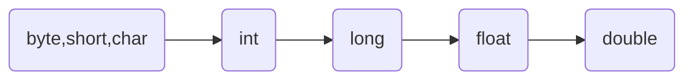
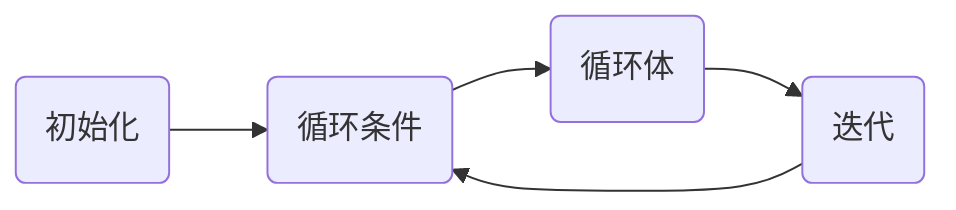
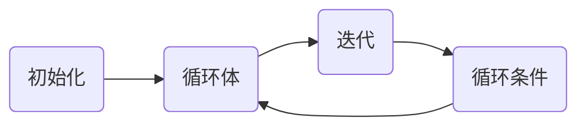
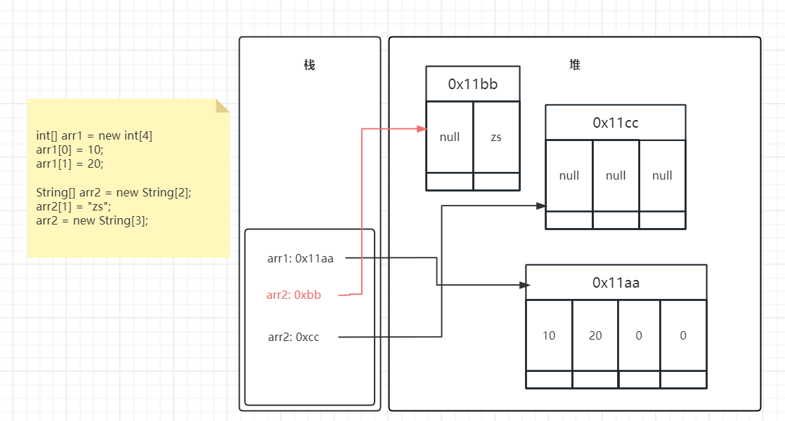

# Java基础

> [官方文档](https://docs.oracle.com/javase/tutorial/reallybigindex.html)</br>
> [详细代码地址](https://github.com/follow1123/java-basics)

## JDK和JRE

* **JDK**(Java Development Kit)：是Java程序开发工具包，包含JRE和开发人员使用工具
* **JRE**(Java Runtime Environment)：是Java程序的运行时环境，包含JVM和运行时所下需要的核心库
* java长期支持版本8、11、17、21
* 使用包管理器或压缩包安装

## Hello World

* 找一个目录，新建一个`HelloWorld.java`文件
* 使用`javac HelloWorld.java`命令编译文件生成`HelloWorld.class`文件
* 使用`java HelloWorld`命令执行

```java
public class HelloWorld {
    public static void main(String[] args) {
        System.out.println("Hello World!");
    }
}
```

## 注释

* 使用`javadoc -encoding UTF-8 -author -version -d comment Comments.java`生成对应文档

```java
/**
 * 文档注释
 * @author a
 * @version 1.0
 */
public class Comments {

    /*
    多行注释
    多行注释
    多行注释
    */
    public static void main(String[] args) {
        // 单行注释
        System.out.println("Hello World!");
    }
}
```

## 变量

<a id="variables-data-type"></a>
### 数据类型

| 数据类型    | 默认值    | 范围    | 占用存储空间 |
|---------------- | --------------- | --------------- | --- |
| byte    | 0    | -128~127    | 1字节=8bit |
| short    | 0    | -32,768~32,767    | 2字节 |
| int    | 0    | -2^31~2^31-1    | 4字节 |
| long    | 0L    | -2^63~2^63-1    | 8字节 |
| <a href="#data-type-float">float</a> | 0.0f    | -3.403E38~3.403E38(3.403E38表示3.403x10^38)    | 4字节 |
| double    | 0.0d    | -1.798E308~1.798E308 | 8字节 |
| char    | '\u0000'    | '\u0000'~'\uffff'| 2字节 |
| boolean    | false    | true/false | 根据JVM规范 |

* 代码示例

```java
boolean result = true;

char c1 = 'C';
char c2 = 65; // 等同于A
char c3 = '\u221a'; // 等同于√
char c4 = '\t'; // 制表符

byte b = 100;
short s = 10000;
int i = 100000;

// 数值较大可以使用下划线分割
long creditCardNumber = 1234_5678_9012_3456L;
long socialSecurityNumber = 999_99_9999L;
float pi =  3.14_15F;
long hexBytes = 0xFF_EC_DE_5E; // 十六进制表示
long hexWords = 0xCAFE_BABE;
long maxLong = 0x7fff_ffff_ffff_ffffL;
byte nybbles = 0b0010_0101; // 二进制表示
long bytes = 0b11010010_01101001_10010100_10010010;
double d = 1.797E308; // 科学计数法表示
```

#### 基本数据类型的自动类型提升



* 范围小的数据类型默认可以赋值给范围大的数据类型
* 其中byte,short,char之间相互操作后的结果默认是int类型，由于这三个数据类型的范围太小，
相互操作很可能超出范围
* 整型字面量默认是int类型，浮点型字面量默认是double类型

```java
int i1 = 100;
long l1 = i1;
float f1 = l1;
double d1 = f1;


byte b1 = 1;
// byte b2 = b1 + 1; // 编译不通过
int i2 = b1 + 1;

short s1 = 434;
short s2 = 4543;
// short s3 = s1 + s2; // 编译不通过

char c1 = 'a';
int i3 = c1 + 1; // 98
```

#### 基本数据类型的强制类型转换

* 浮点型强转为整型小数部分会丢失
* 范围大的数据类型强转为范围小的数据类型时，正数可能变为负数，负数可能变为正数

```java
long l1 = 34;
// int i1 = l1; // 编译不通过
int i1 = (int) l1;

float f1 = 1.9F;
int i2 = (int) f1; // 1

long l2 = 128;
byte b1 = (byte) l2; // -128

long l3 = -130;
byte b2 = (byte) l3; // 126
```

<a id="data-type-float"></a>
#### Float

##### 精度说明

* 并不是所有的小数都可能精确的用二进制浮点数表示。二进制浮点数不能精确的表示
0.1、0.01、0.001这样10的负次幂。
* 浮点类型float、double的数据不适合在**不容许舍入误**差的金融计算领域。如果需要**精确**
数字计算或保留指定位数的精度，需要使用`BigDecimal`类

##### 问题测试

```java
System.out.println(0.1 + 0.2); // 0.30000000000000004

float ff1 = 123123123F;
float ff2 = ff1 + 1;
System.out.println(ff1); // 1.2312312E8
System.out.println(ff1); // 1.2312312E8
System.out.println(ff1 == ff2); // true
```

#### String

* String是引用类型
* String和其他基本数据类型进行`+`操作结果都是String
* 多个数值类型和String相加，如果String放在最后面则前面数值类型全部相加后再拼接为字符串，
如果String放在最前面则全部数值都拼接为字符串

```java
int i1 = 234;
float f1 = 34.55F;
boolean b1 = true;
String s1 = "str";

String s2 = s1 + i1; // str234
String s3 = s1 + f1; // str34.55
String s4 = s1 + b1; // strtrue

String s5 = i1 + f1 + s1; // 268.55str

String s6 = s1 + f1 + i1; // str34.55234
```

## 进制

* **十进制**，0-9组成，满十进一
* **二进制**，0-1组成，满二进一，以`0b`或`0B`开头
* **八进制**，0-7组成，满八进一，以`0`开头
* **十六进制**，0-9，a-f组成，满十六进一，以`0x`或`0X`开头

```java
int n1 = 2134; // 十进制
int n2 = 0b1011; // 二进制
int n3 = 033; // 八进制
int n4 = 0xfa33; // 十六进制
```
### 进制之间的换算

| 十进制    | 二进制    | 八进制    | 十六进制    |
|---------------- | --------------- | --------------- | --------------- |
| 0    | 0    | 0    | 0    |
| 1    | 1   | 1   | 1   |
| 2   | 10   | 2   | 2   |
| 3   | 11   | 3   | 3   |
| 4   | 100   | 4   | 4   |
| 5   | 101   | 5   | 5   |
| 6   | 110   | 6   | 6   |
| 7   | 111   | 7   | 7   |
| 8   | 1000   | 10   | 8   |
| 9   | 1001   | 11   | 9   |
| 10   | 1010   | 12   | A   |
| 11   | 1011   | 13   | B   |
| 12   | 1100   | 14   | C   |
| 13   | 1101   | 15   | D   |
| 14   | 1110   | 16   | E   |
| 15   | 1111   | 17   | F   |
| 16   | 10000   | 20   | 10   |

### 二进制转换

* 计算机数据的存储使用二进制**补码**形式存储，并且**最高位是符号位**
    * 正数最高位是`0`，负数最高位是`1`
* 正数的补码与反码、原码一样，称为**三码合一**
* 负数的补码与反码、原码不一样
    * 负数的**原码**：把十进制转为二进制，然后最高位设置为1
    * 负数的**反码**：在原码的基础上，最高位不变，其余为取反
    * 负数的**补码**：反码+1

#### 二进制转十进制

* 正整数：`00001011`的十进制是`11`

<table>
    <tbody>
        <tr>
            <td>二进制</td>
            <td>0(符号位)</td>
            <td>0</td>
            <td>0</td>
            <td>0</td>
            <td>1</td>
            <td>0</td>
            <td>1</td>
            <td>1</td>
        </tr>
        <tr>
            <td>2的次方</td>
            <td></td>
            <td>2^6</td>
            <td>2^5</td>
            <td>2^4</td>
            <td>2^3</td>
            <td>2^2</td>
            <td>2^1</td>
            <td>2^0</td>
        </tr>
        <tr>
            <td>十进制</td>
            <td></td>
            <td>64</td>
            <td>32</td>
            <td>16</td>
            <td>8</td>
            <td>4</td>
            <td>2</td>
            <td>1</td>
        </tr>
    </tbody>
    <tfoot>
        <tr>
            <td colspan="1">结果</td>
            <td colspan="1">+</td>
            <td colspan="7" style="text-align:center">8+2+111</td>
        </tr>
    </tfoot>
</table>

* 负整数：补码`11110101`的十进制是`-11`

<table>
    <tbody>
        <tr>
            <td>补码</td>
            <td>1(符号位)</td>
            <td>1</td>
            <td>1</td>
            <td>1</td>
            <td>0</td>
            <td>1</td>
            <td>0</td>
            <td>1</td>
        </tr>
        <tr>
            <td>反码</td>
            <td>1</td>
            <td>1</td>
            <td>1</td>
            <td>1</td>
            <td>0</td>
            <td>1</td>
            <td>0</td>
            <td>0</td>
        </tr>
        <tr>
            <td>原码</td>
            <td>1</td>
            <td>0</td>
            <td>0</td>
            <td>0</td>
            <td>1</td>
            <td>0</td>
            <td>1</td>
            <td>1</td>
        </tr>
        <tr>
            <td>2的次方</td>
            <td></td>
            <td>2^6</td>
            <td>2^5</td>
            <td>2^4</td>
            <td>2^3</td>
            <td>2^2</td>
            <td>2^1</td>
            <td>2^0</td>
        </tr>
        <tr>
            <td>十进制</td>
            <td></td>
            <td>64</td>
            <td>32</td>
            <td>16</td>
            <td>8</td>
            <td>4</td>
            <td>2</td>
            <td>1</td>
        </tr>
    </tbody>
    <tfoot>
        <tr>
            <td colspan="1">结果</td>
            <td colspan="1">-</td>
            <td colspan="7" style="text-align:center">8+2+1=11</td>
        </tr>
    </tfoot>
</table>

#### 十进制转二进制

* 除2取余的逆
* `13`的二进制是`1101`

<table>
    <thead>
        <tr>
            <th>商</th>
            <th>余数</th>
        </tr>
    </thead>
    <tbody>
        <tr>
            <td>13/2</td>
            <td>1</td>
        </tr>
        <tr>
            <td>6/2</td>
            <td>0</td>
        </tr>
        <tr>
            <td>3/2</td>
            <td>1</td>
        </tr>
        <tr>
            <td>1/2</td>
            <td>1</td>
        </tr>
        <tr>
            <td>0</td>
            <td></td>
        </tr>
    </tbody>
    <tfoot>
        <tr>
            <td>结果</td>
            <td>1101</td>
        </tr>
    </tfoot>
</table>

#### 二进制与八进制、十六进制之间的转换

* 八进制：十进制`233`对应的八进制是`351`


<table>
    <tbody>
        <tr>
            <td>二进制</td>
            <td>1</td>
            <td>1</td>
            <td>1</td>
            <td>0</td>
            <td>1</td>
            <td>0</td>
            <td>0</td>
            <td>1</td>
        </tr>
        <tr>
            <td>每3位转十进制对应八进制</td>
            <td colspan="2" style="text-align:center">3</td>
            <td colspan="3" style="text-align:center">5</td>
            <td colspan="3" style="text-align:center">1</td>
        </tr>
    </tbody>
    <tfoot>
        <tr>
            <td colspan="1">结果</td>
            <td colspan="8" style="text-align:center">351</td>
        </tr>
    </tfoot>
</table>

* 十六进制：十进制`233`对应的十六进制是`E9`

<table>
    <tbody>
        <tr>
            <td>二进制</td>
            <td>1</td>
            <td>1</td>
            <td>1</td>
            <td>0</td>
            <td>1</td>
            <td>0</td>
            <td>0</td>
            <td>1</td>
        </tr>
        <tr>
            <td>每4位转十进制对应十六进制</td>
            <td colspan="4" style="text-align:center">E</td>
            <td colspan="4" style="text-align:center">9</td>
        </tr>
    </tbody>
    <tfoot>
        <tr>
            <td colspan="1">结果</td>
            <td colspan="8" style="text-align:center">E9</td>
        </tr>
    </tfoot>
</table>

## 运算符

| 分类   | 运算符    |
|--------------- | --------------- |
| 算术运算符（7个）   | `+` `-` `*` `/` `%` `++` `--`   |
| 赋值运算符（12个）   | `=` `+=` `-=` `*=` `/=` `%=` `>>=` `<<=` `>>>=` `&=` <code>&#124;=</code> `^=` |
| 比较（或关系）运算符（6个）   | `>` `>=` `<` `<=` `==` `!=`   |
| 逻辑运算符（6个） | `&` <code>&#124;</code> `^` `!` `&&` <code>&#124;&#124;</code> |
| 位运算符（7个）| `&` <code>&#124;</code> `^` `~` `<<` `>>` `>>>` |
| 条件运算符（1个）| (条件表达式)?结果1:结果2 |
| Lambda运算符（1个）| `->` |

### 算数运算符


| 运算符   | 运算    |
|--------------- | --------------- |
| `+`   | 正号   |
| `-`   | 负号   |
| `+`   | 加     |
| `-`   | 减     |
| `*`   | 乘     |
| `/`   | 除     |
| `%`   | 取模（取余）     |
| `++`   | 自增（前）：先运算后取值     |
| `++`   | 自增（后）：先取值后运算     |
| `--`   | 自减（前）：先运算后取值     |
| `--`   | 自减（后）：先取值后运算     |
| `+`   | 字符串连接     |

```java
// 正号
System.out.println(+3); // 3
// 负号
int i1 = 4;
System.out.println(-i1); // -4
// 加
System.out.println(5+5); // 10
// 减
System.out.println(6-4); // 2
// 乘
System.out.println(3*4); // 12
// 除
System.out.println(5/5); // 1
// 取模（取余）
System.out.println(7%5); // 2
// 自增（前）：先运算后取值
int i2 = 2;
int i3 = ++i2;
System.out.println(i2); // 3
System.out.println(i3); // 3
// 自增（后）：先取值后运算
int i4 = 2;
int i5 = i4++;
System.out.println(i4); // 3
System.out.println(i5); // 2
// 自减（前）：先运算后取值
int i6 = 2;
int i7 = --i6;
System.out.println(i6); // 1
System.out.println(i7); // 1
// 自减（后）：先取值后运算
int i8 = 2;
int i9 = i8--;
System.out.println(i8); // 1
System.out.println(i9); // 2
// 字符串连接
System.out.println("He" + "llo"); // Hello
```

### 赋值运算符

```java
// 将5赋值给变量i1
int i1 = 5;
i1 += 1; // 等同于 i1 = i1 + 1
System.out.println(i1); // 6
i1 -= 1; // 等同于 i1 = i1 - 1
System.out.println(i1); // 5
i1 *= 2; // 等同于 i1 = i1 * 2
System.out.println(i1); // 10
i1 /= 2; // 等同于 i1 = i1 / 2
System.out.println(i1); // 5
i1 %= 2; // 等同于 i1 = i1 % 2
System.out.println(i1); // 1
// 其他类似
```

### 比较（关系）运算符

| 运算符   | 运算    |
|--------------- | --------------- |
| `==`   | 相等于   |
| `!=`   | 不等于   |
| `<`   | 小于   |
| `>`   | 大于   |
| `<=`   | 小于等于   |
| `>=`   | 大于等于   |
| `instanceof`   | 检查是否为类的对象   |

* 比较运算符的结果都是`boolean`类型：`true`/`false`
* `>` `<` `>=` `<=`只适用于基本数据类型（除boolean外），
`==` `!=`适用于基本数据类型和引用数据类型
* `==` `!=`在比较引用数据类型是对比的是对象的地址，如果需要比较两个对象推荐使用`equals`方法

```java
System.out.println(4==3); // false
System.out.println(4!=3); // true
System.out.println(4<3); // false
System.out.println(4>3); // true
System.out.println(4<=3); // false
System.out.println(4>=3); // true
System.out.println("Hello" instanceof String); // true
```

### 逻辑运算符

| a | b | a&b | a&&b | a&#124;b | a&#124;&#124;b | !a | a^b |
| --- | --- | --- | --- | --- | --- | --- | --- |
| true | true | true | true | true | true | false | false |
| true | false | false | false | true | true | false | true |
| false | true | false | false | true | true | true | true |
| false | false | false  | false | false | false | true | false |

* `&`和`&&`表示**且**，两边都是true时，结果为true，否则为false
* <code>&#124;</code>和<code>&#124;&#124;</code>表示**或**，两边其中有一边是true，结果为true，两边都是false时，结果为false
* `!`表示**非**，结果取反
* `^`表示异或，两边结果不同时为true，两边结果相同时为false

```java
boolean a1 = true;
boolean b1 = true;
System.out.println(a1 & b1); // true
System.out.println(a1 && b1); // true
System.out.println(a1 | b1); // true
System.out.println(a1 || b1); // true
System.out.println(!a1); // false
System.out.println(a1 ^ b1); // false
System.out.println("-----------");
boolean a2 = true;
boolean b2 = false;
System.out.println(a2 & b2); // false
System.out.println(a2 && b2); // false
System.out.println(a2 | b2); // true
System.out.println(a2 || b2); // true
System.out.println(!a2); // false
System.out.println(a2 ^ b2); // true
System.out.println("-----------");
boolean a3 = false;
boolean b3 = true;
System.out.println(a3 & b3); // false
System.out.println(a3 && b3); // false
System.out.println(a3 | b3); // true
System.out.println(a3 || b3); // true
System.out.println(!a3); // true
System.out.println(a3 ^ b3); // true
System.out.println("-----------");
boolean a4 = false;
boolean b4 = false;
System.out.println(a4 & b4); // false
System.out.println(a4 && b4); // false
System.out.println(a4 | b4); // false
System.out.println(a4 || b4); // false
System.out.println(!a4); // true
System.out.println(a4 ^ b4); // false
```

#### `&`和`&&`，<code>&#124;</code>和<code>&#124;&#124;</code>之间的关系
* `&&`表示**短路且**
    * 当符号左边是true时，`&`和`&&`一样
    * 当符号左边是false时，`&`会执行符号右边的操作，而`&&`不会
* <code>&#124;&#124;</code>表示**短路或**
    * 当符号左边是false时，<code>&#124;</code>和<code>&#124;&#124;</code>一样
    * 当符号左边是true时，<code>&#124;</code>会执行符号右边的操作，而<code>&#124;&#124;</code>不会

```java
// &和&&，|和||之间的关系
int i = 3;
boolean bool = true;
if (bool & (++i > 3)){
   System.out.println();
}
System.out.println(i); // 4

i = 3;
bool = false;
if (bool && (++i > 3)){
   System.out.println();
}
System.out.println(i); // 3

i = 3;
bool = true;
if (bool | (++i > 3)){
   System.out.println();
}
System.out.println(i); // 4

i = 3;
bool = true;
if (bool || (++i > 3)){
   System.out.println();
}
System.out.println(i); // 3
```

### 位运算符

* 位运算操作可以理解为将十进制的数转换为二进制后，对二进制的相关操作

| 运算符   | 运算    |
|--------------- | --------------- |
| <<   | 左移   |
| >>   | 右移   |
| >>>   | 无符号右移   |
| &   | 与运算   |
| &#124;   | 或运算   |
| ^   | 异或运算   |
| ~   | 取反运算   |

#### 左移

* 将左边的高位移出去后右边的空位补零
* `11`左移2位是`44`

<table>
    <tbody>
        <tr>
            <td>二进制</td>
            <td></td>
            <td></td>
            <td>0</td>
            <td>0</td>
            <td>0</td>
            <td>0</td>
            <td>1</td>
            <td>0</td>
            <td>1</td>
            <td>1</td>
        </tr>
        <tr>
            <td>左移两位</td>
            <td style="background-color:#db5c5c">0</td>
            <td style="background-color:#db5c5c">0</td>
            <td>0</td>
            <td>0</td>
            <td>1</td>
            <td>0</td>
            <td>1</td>
            <td>1</td>
            <td></td>
            <td></td>
        </tr>
        <tr>
            <td>高位丢弃，低位补零</td>
            <td></td>
            <td></td>
            <td>0</td>
            <td>0</td>
            <td>1</td>
            <td>0</td>
            <td>1</td>
            <td>1</td>
            <td style="background-color:#57965c">0</td>
            <td style="background-color:#57965c">0</td>
        </tr>
    </tbody>
    <tfoot>
        <tr>
            <td colspan="1">结果</td>
            <td colspan="12" style="text-align:center">44</td>
        </tr>
    </tfoot>
</table>

```java
System.out.println(11 << 2); // 44
System.out.println(-11 << 2); // -44
```

#### 右移

* 如果是正数，左边空位补零
* 如果是负数，左边空位补一
* `11`右移2位是`2`
<table>
    <tbody>
        <tr>
            <td>二进制</td>
            <td>0</td>
            <td>0</td>
            <td>0</td>
            <td>0</td>
            <td>1</td>
            <td>0</td>
            <td>1</td>
            <td>1</td>
            <td></td>
            <td></td>
        </tr>
        <tr>
            <td>右移两位</td>
            <td></td>
            <td></td>
            <td>0(符号位)</td>
            <td>0</td>
            <td>0</td>
            <td>0</td>
            <td>1</td>
            <td>0</td>
            <td style="background-color:#db5c5c">1</td>
            <td style="background-color:#db5c5c">1</td>
        </tr>
        <tr>
            <td>低位丢弃，高位补零</td>
            <td style="background-color:#57965c">0</td>
            <td style="background-color:#57965c">0</td>
            <td>0</td>
            <td>0</td>
            <td>0</td>
            <td>0</td>
            <td>1</td>
            <td>0</td>
            <td></td>
            <td></td>
        </tr>
    </tbody>
    <tfoot>
        <tr>
            <td colspan="1">结果</td>
            <td colspan="12" style="text-align:center">2</td>
        </tr>
    </tfoot>
</table>

* `-11`右移2位是`-3`
<table>
    <tbody>
        <tr>
            <td>二进制</td>
            <td>1</td>
            <td>1</td>
            <td>1</td>
            <td>1</td>
            <td>0</td>
            <td>1</td>
            <td>0</td>
            <td>1</td>
            <td></td>
            <td></td>
        </tr>
        <tr>
            <td>右移两位</td>
            <td></td>
            <td></td>
            <td>1(符号位)</td>
            <td>1</td>
            <td>1</td>
            <td>1</td>
            <td>0</td>
            <td>1</td>
            <td style="background-color:#db5c5c">0</td>
            <td style="background-color:#db5c5c">1</td>
        </tr>
        <tr>
            <td>低位丢弃，高位补一</td>
            <td style="background-color:#57965c">1</td>
            <td style="background-color:#57965c">1</td>
            <td>1</td>
            <td>1</td>
            <td>1</td>
            <td>1</td>
            <td>0</td>
            <td>1</td>
            <td></td>
            <td></td>
        </tr>
        <tr>
            <td>原码</td>
            <td>1</td>
            <td>0</td>
            <td>0</td>
            <td>0</td>
            <td>0</td>
            <td>0</td>
            <td>1</td>
            <td>1</td>
            <td></td>
            <td></td>
        </tr>
    </tbody>
    <tfoot>
        <tr>
            <td colspan="1">结果</td>
            <td colspan="12" style="text-align:center">-3</td>
        </tr>
    </tfoot>
</table>

```java
System.out.println(11 >> 2); // 2
System.out.println(-11 >> 2); // -3
```

#### 无符号右移

* 无论是正数还是负数，被移出的高位都补零
* `-11`无符号右移2位是`61`
* 由于java内没有无符号类型，需要将`-11`的补码当作原码存入int内操作，将`-11`和`0xFF`进行**与**操作即可

<table>
    <tbody>
        <tr>
            <td>二进制</td>
            <td>1</td>
            <td>1</td>
            <td>1</td>
            <td>1</td>
            <td>0</td>
            <td>1</td>
            <td>0</td>
            <td>1</td>
            <td></td>
            <td></td>
        </tr>
        <tr>
            <td>右移两位</td>
            <td></td>
            <td></td>
            <td>1</td>
            <td>1</td>
            <td>1</td>
            <td>1</td>
            <td>0</td>
            <td>1</td>
            <td style="background-color:#db5c5c">0</td>
            <td style="background-color:#db5c5c">1</td>
        </tr>
        <tr>
            <td>低位丢弃，高位补零</td>
            <td style="background-color:#57965c">0</td>
            <td style="background-color:#57965c">0</td>
            <td>1</td>
            <td>1</td>
            <td>1</td>
            <td>1</td>
            <td>0</td>
            <td>1</td>
            <td></td>
            <td></td>
        </tr>
    </tbody>
    <tfoot>
        <tr>
            <td colspan="1">结果</td>
            <td colspan="12" style="text-align:center">61</td>
        </tr>
    </tfoot>
</table>

```java
/*
无符号右移
                         11110101 b1 -11
                         11111111 & 0xFF
00000000 00000000 00000000 11110101 i1
00000000 00000000 00000000 00111101 61
*/
byte b1 = -11;
int i1 = b1 & 0xFF;
i1 >>>= 2;
System.out.println(i1); // 61
```
#### 与、或、异或、取反

* 操作相同，以与为例，`11`与`19`结果为`3`

<table>
    <tbody>
        <tr>
            <td>11</td>
            <td>0</td>
            <td>0</td>
            <td>0</td>
            <td>0</td>
            <td>1</td>
            <td>0</td>
            <td>1</td>
            <td>1</td>
        </tr>
        <tr>
            <td>19</td>
            <td>0</td>
            <td>0</td>
            <td>0</td>
            <td>1</td>
            <td>0</td>
            <td>0</td>
            <td>1</td>
            <td>1</td>
        </tr>
        <tr>
            <td>3</td>
            <td>0</td>
            <td>0</td>
            <td>0</td>
            <td>0</td>
            <td>0</td>
            <td>0</td>
            <td>1</td>
            <td>1</td>
        </tr>
    </tbody>
</table>

```java
/*
00001011
00010011
00000011 3

00001011
00010011
00011011 27

00001011
00010011
00011000 24

00001011
11110100
10001011
10001100 -12

*/
System.out.println(11 & 19); // 3
System.out.println(11 | 19); // 27
System.out.println(11 ^ 19); // 24
System.out.println(~11); // -12
```

#### 条件运算符（三元运算符）

* 格式：`(条件表达式) ? 表达式1 : 表达式2`

```java
String a = "Hello";
String b = "Wrold!";
boolean c = true;
System.out.println(c ? a : b); // Hello
```
## 流程控制

* **顺序结构**：程序从上到下逐行执行，中间没有任何判断和跳转
* **分支结构**
    * 根据条件，选择性地执行某段代码
    * `if...else`和`switch-case`
* **循环结构**
    * 根据循环条件，重复性的执行某段代码
    * `for`、`while`、`do-while`。`foreach`（jdk5新增）遍历集合和数组

### 分支结构

#### if...else

```java
int i1 = 0;
if (i1 > 0) {
    i1--;
}
System.out.println(i1); // 0
if (i1 > 0) {
    i1--;
}else {
    i1++;
}
System.out.println(i1); // 1
if (i1 > 1) {
    i1--;
} else if (i1 == 1) {
    i1 = 0;
}
System.out.println(i1); // 0
```

#### switch-case

* switch中的表达式只能是特定的类型：byte，short，char，int，枚举（jdk5），String（jdk7）
* switch中必须要有一个default分支用于处理未匹配到的情况
* switch中的每一对case必须对应一个break，如果忘写break则会穿透到下一个分支

```java
int week = 5;
String weekStr;
switch (week) {
    case 1:
        weekStr = "Monday";
        break;
    case 2:
        weekStr = "Tuesday";
        break;
    case 3:
        weekStr = "Wednesday";
        break;
    case 4:
        weekStr = "Thursday";
        break;
    case 5:
        weekStr = "Friday";
        break;
    case 6:
        weekStr = "Saturday";
        break;
    case 7:
        weekStr = "Sunday";
        break;
    default:
        weekStr = "error";
        break;
}
System.out.println(weekStr); // Friday

// case 5 未加上break
switch (week) {
    case 1:
        weekStr = "Monday";
        break;
    case 2:
        weekStr = "Tuesday";
        break;
    case 3:
        weekStr = "Wednesday";
        break;
    case 4:
        weekStr = "Thursday";
        break;
    case 5:
        weekStr = "Friday";
        // break;
    case 6:
        weekStr = "Saturday";
        break;
    case 7:
        weekStr = "Sunday";
        break;
    default:
        weekStr = "error";
        break;
}
System.out.println(weekStr); // Saturday
```

### 循环结构
* 循环结构四要素：
    * 初始化部分
    * 循环条件部分
    * 循环体部分
    * 迭代部分

#### for循环

* 执行过程



```java
/*
 for(初始化; 循环条件; 迭代){
    循环体
 }

 依次输出1到10
 */
for (int i = 1; i <= 10; i++) {
    System.out.println(i);
}
```

#### while循环

* 执行过程，和for循环一样

```java
/*
 初始化
 while(循环条件){
     循环体
     迭代
 }

 依次输出1到10
 */
int i = 1;
while (i <= 10) {
    System.out.println(i);
    i++;
}
```

#### do-while循环

* 执行过程



* do-while循环至少执行一次循环

```java
/*
 初始化
 do {
     循环体
     迭代
 }while(循环条件)

 依次输出1到10
 */
int i = 1;
do {
    System.out.println(i);
    i++;
}while (i <= 10);

/*
 初始化
 do {
     循环体
     迭代
 }while(循环条件)

 依次输出1到10
 */
int i1 = 1;
do {
    System.out.println(i1);
    i1++;
    break;
}while (i1 <= 10);
System.out.println(i1); // 2
```

#### 无限循环

* for实现：`for(;;) {}`
* while实现：`while(true) {}`

#### break和continue关键字

<table>
    <thead>
        <tr>
            <th>关键字</th>
            <th>适用范围</th>
            <th>作用</th>
        </tr>
    </thead>
    <tbody>
        <tr>
            <td rowspan="2" style="vertical-align: middle">break</td>
            <td>switch-case</td>
            <td>跳出分支</td>
        </tr>
        <tr>
            <td>循环结构</td>
            <td>跳出当前循环</td>
        </tr>
        <tr>
            <td>continue</td>
            <td>循环条件</td>
            <td>提前进入下一次循环</td>
        </tr>
    </tbody>
</table>

```java
// 跳出循环
for (int i = 1; i <= 10; i++) {
    if (i > 4){
        break;
    }
    System.out.println(i);
}

System.out.println("---");

// 跳过偶数
for (int i = 1; i <= 10; i++) {
    if (i % 2 == 0){
        continue;
    }
    System.out.println(i);
}
```

## 数组

* 数组（Array），是多个相同类型数据按一定循序排列的集合，并使用一个名字命名，
通过编号的方式对这些数据进行统一管理
* 概念
    * 数组名
    * 下标（索引），从0开始
    * 元素
    * 数组的长度
* 特点
   * 数组中的元素在内存中是依次紧密排列的，有序的
   * 数组属于引用数据类型，数组中的元素可以是基本数据类型或引用数据类型
   * 数组一旦初始化完成，长度确定，不可变
   * 创建数组对象会在内存中开辟一整块**连续的空间**。占用空间的大小，
   取决于数组的长度和数组中元素的类型

### 一维数组

#### 声明数组

```java
int[] integers;
String[] names;
```

#### 初始化

```java
int[] integers;
String[] names;
integers = new int[]{1, 2, 3, 4}; // 静态初始化
int[] integers1 = {5, 6, 7, 8}; // 类型推断
names = new String[4]; // 动态初始化
```

#### 数组元素的调用

```java
System.out.println(integers[0]); // 1
System.out.println(integers[1]); // 2
// System.out.println(integers[4]); // 报错ArrayIndexOutOfBoundsException

names[0] = "zs";
names[1] = "ls";
// names[4] = "ww"; // 报错ArrayIndexOutOfBoundsException
```

#### 数组的长度

```java
System.out.println(integers.length); // 4
System.out.println(names.length); // 4
```

#### 遍历数组

```java
for (int i = 0; i < names.length; i++) {
    System.out.println(names[i]);
}

// foreach遍历
for (int integer : integers) {
    System.out.println(integer);
}
```

#### 数组元素的默认初始化值

* 基本数据类型，参考<a href="#variables-data-type">数据类型</a>默认值
* 引用数据类型默认都是`null`

```java
// 数组默认初始化值
int[] is = new int[3];
double[] ds = new double[4];
String[] strs = new String[5];
System.out.println(is[0]); // 0
System.out.println(ds[0]); // 0.0
System.out.println(strs[1]); // null
```

#### 一维数组的内存解析

```java
int[] arr1 = new int[4];
arr1[0] = 10;
arr1[1] = 20;

String[] arr2 = new String[2];
arr2[1] = "zs";
arr2 = new String[3];
```


### 二维数组

* 二维数组就是一维数组中的元素又是一维数组

#### 二维数组的使用

```java
// 初始化，模拟班级里面分组
String[][] classroom = new String[][]{
    {"zs", "ls"},
    {"aa", "bb", "cc"},
    {"mm", "nn", "xx", "yy", "zz"}
};

// 获取
// 1组里面的第二个成员
System.out.println(classroom[0][1]); // ls
// 3组里面的第三个成员
System.out.println(classroom[2][2]); // xx
System.out.println("---");
// 长度
// 班级里面有多少个组
System.out.println(classroom.length); // 3
// 每个组里面有多少个成员
System.out.println(classroom[0].length); // 2
System.out.println(classroom[1].length); // 3
System.out.println(classroom[2].length); // 5

System.out.println("---");
// 遍历
// 模拟报数
for (int i = 0; i < classroom.length; i++) {
    System.out.println("第" + ( i + 1 ) + "组报数");
    for (int j = 0; j < classroom[i].length; j++) {
        System.out.println(classroom[i][j] + ": " + (j + 1));
    }
}
```

### 数组相关操作

> [详细代码](https://github.com/follow1123/java-basics/blob/main/src/main/java/cn/y/java/syntax/arrays/ArrayOperator.java)

* 最大值

```java
int[] array = getRandomIntegerArray(10, 59, 10);

int max = array[0];
for (int i = 0; i < array.length; i++) {
    if (max < array[i]) {
        max = array[i];
    }
}
printArray(array);
System.out.println(max);
```

* 最小值

```java
int[] array = getRandomIntegerArray(10, 59, 10);

int min = array[0];
for (int i = 0; i < array.length; i++) {
    if (min > array[i]) {
        min = array[i];
    }
}
printArray(array);
System.out.println(min);
```

* 求和

```java
int[] array = getRandomIntegerArray(10, 59, 10);

int count = 0;
for (int i = 0; i < array.length; i++) {
    count += array[i];
}
printArray(array);
System.out.println(count);
```

* 平均数

```java
int[] array = getRandomIntegerArray(10, 59, 10);

int count = 0;
for (int i = 0; i < array.length; i++) {
    count += array[i];
}
printArray(array);
System.out.println(count / array.length);
```

* 杨辉三角

```java
int[][] arrays = new int[10][];

for (int i = 0; i < arrays.length; i++) {
    // 边框
    arrays[i] = new int[i + 1];
    arrays[i][0] = arrays[i][i] = 1;
    // 内部
    for (int j = 1; j < arrays[i].length - 1; j++) {
        arrays[i][j] = arrays[i - 1][j - 1] + arrays[i - 1][j];
    }
}

for (int i = 0; i < arrays.length; i++) {
    for (int j = 0; j < arrays[i].length; j++) {
        System.out.print(arrays[i][j] + "\t");
    }
    System.out.println();
}
```

* 回形数

```java
Scanner scanner = new Scanner(System.in);
int num;
while ((num = scanner.nextInt()) != 0) {
    int[][] arrays = new int[num][num];

    int loopNum = num * num;
    // 1 右 2 下 3 左 4 上
    int direction = 1;

    int i = 0, j = 0;
    for (int data = 1; data <= loopNum; data++) {
        if (direction == 1) {
            if (j < num && arrays[i][j] == 0) {
                arrays[i][j++] = data;
            } else {
                direction = 2;
                i++;
                j--;
                data--;

            }
        } else if (direction == 2) {
            if (i < num && arrays[i][j] == 0) {
                arrays[i++][j] = data;
            } else {
                direction = 3;
                i--;
                j--;
                data--;
            }
        } else if (direction == 3) {
            if (j >= 0 && arrays[i][j] == 0) {
                arrays[i][j--] = data;
            } else {
                direction = 4;
                i--;
                j++;
                data--;
            }
        } else if (direction == 4) {
            if (i >= 0 && arrays[i][j] == 0) {
                arrays[i--][j] = data;
            } else {
                direction = 1;
                i++;
                j++;
                data--;
            }
        }

    }
    for (int m = 0; m < arrays.length; m++) {
        for (int n = 0; n < arrays[m].length; n++) {
            System.out.print(arrays[m][n] + "\t");
        }
        System.out.println();
    }

}
```

* 数组翻转

```java
int[] arr = new int[]{39, 59, 25, 51, 38, 11, 26, 47, 31, 37, 25};


int lastIdx = arr.length - 1;
int halfLen = arr.length / 2;

for (int i = 0; i < halfLen; i++) {
    // 分别将头尾的元素交换
    int tmp = arr[i];
    arr[i] = arr[lastIdx - i];
    arr[lastIdx - i] = tmp;
    // arr[i] = arr[i] ^ arr[lastIdx - i];
    // arr[lastIdx - i] = arr[i] ^ arr[lastIdx - i];
    // arr[i] = arr[i] ^ arr[lastIdx - i];
}
printArray(arr);
```

* 数组扩容

```java
// 38, 11, 26
int[] arr = new int[]{39, 59, 25, 51};
// 创建新数组
int[] newArr = new int[arr.length * 2];
// 将原数组内的数据添加进来
for (int i = 0; i < arr.length; i++) {
    newArr[i] = arr[i];
}
// 添加新元素
newArr[arr.length] = 38;
newArr[arr.length + 1] = 11;
newArr[arr.length + 2] = 26;

printArray(newArr);
```

### 数组相关算法

> [详细代码](https://github.com/follow1123/java-basics/blob/main/src/main/java/cn/y/java/syntax/arrays/ArrayAlgorithm.java)

* 线性查找

```java
for (int i = 0; i < arr.length; i++) {
    if (arr[i] == data){
        return i;
    }
}
return -1;
```

* 二分查找

```java
int head = 0;
int tail = arr.length - 1;
while (head <= tail){
    int mid = (head + tail) / 2;
    if (data == arr[mid]){
        return mid;
    } else if (data > arr[mid]) {
        head = mid + 1;
    }else {
        tail = mid - 1;
    }
}
return -1;
```

* 冒泡排序

```java
int tmp;
for (int i = 0; i < arr.length; i++) {
    for (int j = i + 1; j < arr.length; j++) {
        if (arr[i] > arr[j]){
            tmp = arr[i];
            arr[i] = arr[j];
            arr[j] = tmp;
        }
    }
}
```

* 快速排序

```java
private void swap(int[] arr, int i, int j){
    int tmp = arr[i];
    arr[i] = arr[j];
    arr[j] = tmp;
}
private void quickSort(int[] arr, int start, int end){
    if (start < end) {
        int base = arr[start];
        int low = start;
        int high = end + 1;
        while (true){
            while (low < end && arr[++low] - base <= 0);
            while (high > start && arr[--high] - base >= 0);
            if (low < high) {
                swap(arr, low, high);
            }else {
                break;
            }
        }
        swap(arr, start, high);

        quickSort(arr, start, high - 1);
        quickSort(arr, high + 1, end);
    }
}
```

### Arrsys工具类

```java
int[] arr = new int[]{39, 59, 25, 51, 38, 11, 26, 47, 31, 37};
int[] arr1 = new int[]{39, 59, 25, 51, 38, 11, 26, 47, 31, 37, 25};

System.out.println(Arrays.compare(arr, arr1)); // 比较 0 相同，1 左边数组大，-1左边数组小
System.out.println(Arrays.equals(arr, arr1)); // 比较， true 相同，false 不同

Arrays.sort(arr); // 排序
System.out.println(Arrays.binarySearch(arr, 11)); // 查找

int[] newArr = Arrays.copyOf(arr, arr1.length + 3); // 扩容

System.out.println(Arrays.toString(newArr)); // 打印
```

## 面向对象

* Java类及类的成员：属性、方法、构造器；代码块、内部类 
* 面向对象特性：封装、继承、多态、抽象
* 其他关键字使用：this、super、package、import、static、final、interface、abstract


### 类和对象

* **类**：具有相同特征的事物的抽象描述，是抽象的、概念上的定义
* **对象**：实际存在的该类事物的每个个体，是具体的，也称为**实例(instance)**

#### 类的成员

* Java中用类class来描述事务，类是一组相关**属性**和**行为**的集合，这也是类最基本的两个成员
    * **属性**：该类事物的状态。对应类中的**成员变量(属性、Method)**
    * **行为**：该类事物要做什么操作，或者基于事物的状态能做什么。对应类中的**成员方法（函数、Field）**


##### 定义一个类并且使用

* 定义

```java
public class Phone {
    // 属性
    String name;
    double price;

    // 方法
    public void call(){
        System.out.println("打电话");
    }

    public void playGame(){
        System.out.println("玩游戏");
    }
}
```

* 使用

```java
public static void main(String[] args) {
    Phone phone = new Phone();
    phone.name = "hw";
    phone.price = 6999.0;

    phone.call();
    phone.playGame();
}
```

## 属性（成员变量）和局部变量

* 变量声明的格式相同：`数据类型 变量名 = 变量值`
* 变量都有其有效的作用域，出作用域就失效
* 变量必须先声明，后赋值，再使用

### 成员变量和局部变量的区别

| 不同点 | 属性（成员变量） | 局部变量 |
| --- | --- | --- |
| **类中声明的位置** | 声明在类内，方法外 | 声明在方法、构造器内 |
| **内存中分配的位置** | 随对象的创建存储在堆空间 | 存储在栈空间 |
| **生命周期** | 随着对象创建或消亡 | 方法入栈，局部变量在栈中分配，方法出栈，局部变量消亡|
| **作用域** | 整个类内部有效 | 在声明局部变量的方法、构造器、代码块中有效 |
| **权限修饰符** | 可以 | 不可以 |
| **默认值** | 有 | 没有 | 

```java
/**
 * 员工
 */
public class Employee {
    int id;
    String name;

    public void work(String workName){
        System.out.println("员工：" + name + "正在：" + workName);

    }
}
```

## 方法（Method）

* **方法**是类或对象行为特征的抽象，用来完成某个功能的操作。
在某些语言中也成为**函数**或**过程**
* 将功能封装为方法的目的是，可以实现代码重用，减少冗余，简化代码
* Java里的方法**不能独立存在**，所有方法必须定义在类中
* 方法内可以调用本类中的**其他**方法或属性
* 方法内不能定义方法

### 方法声明的格式说明

```java
权限修饰符 [其他修饰符] 返回值类型 方法名(形参列表) [throws 异常类型]{ // 方法头
    // 方法体
}
```
* 权限修饰符
    * 四种：private，缺省，protected，public
* 返回值类型：调用当前方法，是否需要一个结果
    * 无返回值，使用`void`
    * 有返回值，指明返回值的具体类型，可以是基本数据类型或引用数据类型
    在方法内部使用`return`+返回类型的变量
* 方法名：标识符，描述方法是干什么的
* 形参列表：属于局部变量，可以声明多个
    * 格式：`(形参1, 形参2, 形参3, 形参4, ...)`
    * 无形参直接使用`()`即可
* 方法体：方法的功能，真正执行的代码

```java
/**
 * 人
 */
public class Person {

    String name;

    public void eat(){
        System.out.println(name + "吃饭");
    }

    public void sleep(int hour){
        System.out.println("先睡" + hour + "小时");
    }

    public boolean isHappy(){
        return true;
    }

}
```
### return关键字

* 结束一个方法
* 结束一个方法的同时可以返回数据给调用者

```java
for (int i = 0; i < 10; i++) {
    if (i == 5){
        return; // 提前返回
    }
}
System.out.println("方法结束"); // 未输出
```

### 方法调用内存解析

* 调用方法时，堆空间会新入栈一个栈帧
* 方法的形参和局部变量会保存在这个栈帧内
* 方法结束时，栈帧会弹出，对应的形参和局部变量会销毁

### 方法的重载(overload)

* **方法的重载**：在同一个类中，允许存在一个以上的同名方法，只要它们的形参列表不同即可
* **重载的特点**：与修饰符、返回值类型无关，只看参数列表，且参数列表必须不同，（参数个数或类型）
* **重载方法条用**：JVM通过方法的参数列表，调用匹配的方法
    * 先找个数、类型最匹配的
    * 再找个数和类型可以兼容的，如果同时多个方法可以兼容，将会报错

```java
/**
 * 无返回值
 */
public void add(int a, int b){
    System.out.println(a + b);
}

/**
 * 虽然返回值不同，但形参相同，编译不通过
 */
// public int add(int a, int b){
//     return a + b;
// }

/**
 * 有返回值
 */
public int add(int a, int b, int c){
    return a + b + c;
}

/**
 * 类型不同
 */
public double add(double a, double b){
    return a + b;
}

/**
 * 修饰符不同
 */
private double add(double a, double b, double c){
    return a + b + c;
}
```

### 可变个数形参的方法(jdk5)

* 在调用方法时，可能会出现方法形参类型确定，但个数不确定，此时，我们可以使用可变个数形参的方法
* 格式`(参数类型... 参数名)`
* 同一个类中，可变形参方法可以与相同单个类型的方法构成重载
* 同一个类中，可变形参方不能与相同类型的数组构成重载
* 可变形参必须声明在形参列表的最后面
* 可变形参在一个方法内最多声明一次

```java
/**
 * 可变形参方法
 */
public int add(int... nums){
    int count = 0;
    for (int i = 0; i < nums.length; i++) {
        count += nums[i];
    }
    return count;
}

/**
 * 可变形参方法不能与相同类型的数组的方法存在同一个类中，编译不通过
 */
// public int add(int[] nums){
//     int count = 0;
//     for (int i = 0; i < nums.length; i++) {
//         count += nums[i];
//     }
//     return count;
// }

/**
 * 可变形参必须声明在形参列表的最后面
 */
public boolean equalsAll(long a, int... nums){
    return a ==  add(nums);
}

/**
 * 可变形参在方法内只能声明一次，编译不通过
 */
// public boolean equalsAll(long... a, int... nums){
//    return add(a) == add(nums);
// }
```

### 方法的值传递机制

* 对于方法内声明的局部变量来说，如果出现赋值操作
    * 基本数据类型，将变量保存的数据值传递出去
    * 引用数据类型，将变量保存的地址值传递出去

```java
public void addOne(int i){
    i = + 1;
}

/**
 * 基本数据类型
 */
@Test
public void testBasicDataType() {
    int i = 1;
    addOne(i);
    System.out.println(i); // 1
}

public void addOne(int[] arr){
    for (int i = 0; i < arr.length; i++) {
        arr[i] = arr[i] + 1;
    }
}

/**
 * 数组
 */
@Test
public void testArray(){
    int[] arr = new int[]{1, 1, 1, 1, 1};
    addOne(arr);
    System.out.println(Arrays.toString(arr)); // 2, 2, 2, 2, 2
}

public void growUp(People people){
    people.setAge(people.age + 1);
}

/**
 * 引用数据类型
 */
@Test
public void testReferenceDataType() {
    People people = new People();
    people.setName("zs");
    people.setAge(11);
    System.out.println(people.info()); // 我的名字是：zs, 11岁

    growUp(people);
    System.out.println(people.info()); // 我的名字是：zs, 12岁
}
```

### 递归方法

* 方法内自己调用自己的现象就成为递归
* **递归的分类**：直接递归，间距递归
* 递归方法包含了一种隐式的循环
* 递归方法一定要已知方向递归，否则这种递归就变成了无穷递归，停不下来，类似死循环，最终发生**栈溢出**
* 递归的问题
    * 递归调用会占用大量系统堆栈，内存耗用多，在递归调用层次多时速度要比循环慢，使用递归时要谨慎
    * 在要求高性能的情况下尽量避免使用递归，考虑循环迭代

#### 代码示例

* 直接递归

```java
/**
 * 直接递归
 */
public void a(){
    a();
}
```

* 间接递归

```java
/**
 * 间距递归
 */
public void b(){
    c();
}

public void c(){
    d();

}
public void d(){
    b();
}
```

* 累加数组应用

```java
/**
 * 累加数字
 */
public int getSum(int num){
    if (num == 1){
        return 1;
    }
    return num + getSum(num - 1);
}

@Test
public void testSum() {

    System.out.println(getSum(100));
}
```

## package和import

### package(包)

* 用于指明该文件中定义的类、接口等结构所在的包
* 语法：`package 顶层包名 子包名;`
* 说明
    * 一个源文件只能有一个声明包的package语句
    * package语句作为java源文件的第一条语句出现。若缺省该语句，则指定为无名包
    * 包名，属于标识符，满足标识符命名规则和规范（全部小写）、见名知意
        * 包通常使用所在公司域名的倒置
* 作用
    * 包可以包含类和子包，划分项目层次，便于管理
    * 帮助管理大型软件系统，将功能相近的类划分到同一个包内
    * 解决类命名冲突问题
    * 控制访问权限

### import关键字

* 为了使用定义在其他包内的java类，需要使用import语句显示引入指定包下的需要的类。
相当于import语句告诉编译器到哪里去找这个类
* 语法：`import 包名.类名;`
* 说明
    * import语句声明在包的声明和类的声明之间
    * 导入多个类或接口，直接写多个import语句
    * 一次性导入某个包下的所有类或接口可以使用`import a.*;`
    * 如果导入的类或接口是java.lang包下的，或者是当前包下的，则可以省略此import语句
    * 导入`java.a`包下的某个类后，如果需要导入`java.a.b`包下的某个类仍需要导入
    * 如果有两个同名的类在不同包下，都需要使用的话，需要将其中一个使用全类名方式声明`a.b.c.People people = new a.b.c.People()`
    * `import static`组合使用可以导入指定类下的静态属性或方法

## 封装性（Encapsulation）

* 面向对象的开发原则要遵循**高内聚**、**低耦合**
    * **高内聚**：类的内部数据操作细节自己完成，不允许外部干涉
    * **低耦合**：尽量暴露少量的方法给外部使用，尽量方便外部调用
* 封装就是把客观的事物抽象概念的类，并且类可以把自己的数据和方法只向可信的类或对象开放，向没必要开放的类或对象隐藏信息

### Java实现封装性

* 实现封装就是控制类或成员的可见性范围。需要访问控制修饰符，也称权限修饰符
* 权限修饰符：`public`、`protected`、`缺省`、`private`

| 修饰符    | 本类内部    | 本包内    | 其他包的子类    | 其他包的非子类    |
|---------------- | --------------- | --------------- | --------------- | --------------- |
| private    | √    | ×    | ×    | ×   |
| 缺省   | √   | √   | ×   | ×   |
| protected   | √   | √   | √   | ×   |
| public   | √   | √   | √   | √   |

* 修饰的结构
    * 外部类只能使用`public`和`缺省`两种权限修饰符
    * 成员变量、成员方法、构造器、成员内部类可以使用所有权限修饰符

#### 代码示例

> [详细代码](https://github.com/follow1123/java-basics/blob/main/src/main/java/cn/y/java/oop/encapsulation/A.java)

* 定义一个`A`类，定义4个属性，分别有4种不同的权限修饰符

```java
/**
 * 测试权限修饰符类
 */
public class A {
    /**
     * 私有属性
     */
    private int privateField;

    /**
     * 缺省属性
     */
    int defaultField;

    /**
     * protected数字
     */
    protected int protectedField;

    /**
     * 公开属性
     */
    public int publicField;
}
```

* 在`A`类相同包下定义一个`B`类，使用main方法访问`A`类的所有属性

```java
/**
 * 和A类处在相同的包下
 */
public class B {
    public static void main(String[] args) {
        A a = new A();
        // int privateField a.privateField; // 无法访问
        int defaultField = a.defaultField;
        int protectedField = a.protectedField;
        int publicField = a.publicField;
    }
}
```

* 在`A`类的子包下定义一个`packag1.C`类，并继承`A`类，使用方法访问`A`类的所有属性

```java
/**
 * 和A类处在不同的包下，但是是A类的子类
 */
public class C extends A {
    public void cMethod(){
        // int privateField super.privateField; // 无法访问
        // int defaultField = super.defaultField; // 不在相同包内，无法访问
        int protectedField = super.protectedField;
        int publicField = super.publicField;
    }
}
```

* 在`A`类的子包下定义一个`packag2.D`类，使用main方法访问`A`类的所有属性

```java
/**
 * 和A类处在不同的包下，不是A类的子类
 */
public class D {

    public static void main(String[] args) {
        A a = new A();
        // int privateField a.privateField; // 无法访问
        // int defaultField = a.defaultField; // 不在相同包内，无法访问
        // int protectedField = a.protectedField; // 不在相同包内并且不是子类，无法访问
        int publicField = a.publicField;
    }
}
```

## 构造器（constructor）

* 构造器搭配`new`关键字使用，用于创建类的对象
* 在创建对象的同时，可以给对象相关属性赋值
* 说明
    * 格式：`权限修饰符 类名(形参列表){}`
    * 创建类后，在没有显示提供任何构造器的情况下，系统会默认提供一个空参构造器，构造器权限修饰符与类声明的权限相同
    * 一旦类中显示声明了构造器，系统就不再提供默认的空参构造器
    * 一个类可以声明多个构造器，彼此之间构成重载

### 代码示例

> [详细代码](https://github.com/follow1123/java-basics/blob/main/src/main/java/cn/y/java/oop/constructor)

* 默认构造器

```java
/**
 * 默认构造器
 */
public class DefaultConstructorClass {

    public static void main(String[] args) {
        DefaultConstructorClass defaultConstructorClass = new DefaultConstructorClass();
    }
}
```

* 自定义构造器

```java
/**
 * 自定义构造器
 */
public class CustomConstructorClass {

    String name;

    int age;

    public CustomConstructorClass(String name, int age) {
        this.name = name;
        this.age = age;
    }

    public static void main(String[] args) {
        CustomConstructorClass zs = new CustomConstructorClass("zs", 11);

        // CustomConstructorClass zs1 = new CustomConstructorClass() // 没有无参构造器，编译不通过

        // 给对象的属性赋值
        System.out.println(zs.name); // zs
        System.out.println(zs.age); // 11
    }
}
```

* 构造器重载

```java
/**
 * 构造器重载
 */
public class OverloadConstructorClass {

    String name;

    int age;

    /**
     * 只有age的构造器
     */
    public OverloadConstructorClass(int age) {
        this.age = age;
    }

    /**
     * 全部参数构造器
     */
    public OverloadConstructorClass(String name, int age) {
        this.name = name;
        this.age = age;
    }

    public static void main(String[] args) {
        OverloadConstructorClass zs = new OverloadConstructorClass("zs", 11);
        System.out.println(zs.name); // zs
        System.out.println(zs.age); // 11
        OverloadConstructorClass zs1 = new OverloadConstructorClass(11);
        System.out.println(zs1.name); // null
        System.out.println(zs1.age); // 11
    }
}
```

## 类中属性赋值过程

* 在类的属性中，给属性赋值的位置
    1. 默认赋值
    2. 显示赋值
    3. 构造器赋值
    4. `对象.方法`赋值
    5. `对象.属性`赋值
* 这些位置赋值的顺序：1，2，3，4/5
* 这些位置的执行次数
    * 1、2、3只能执行一次
    * 4、5可以执行多次

### 代码示例

```java
/**
 * 测试属性赋值顺序
 */
public class AssignmentOrder {

    // int integer; // 默认赋值
    int integer = 1; // 显示赋值

    public AssignmentOrder(){}

    public AssignmentOrder(int i){
        integer = i;
    }

    /**
     * 方法赋值
     */
    public void setInteger(int i){
        integer = i;
    }

    public static void main(String[] args) {
        AssignmentOrder assignmentOrder = new AssignmentOrder();
        // 打开默认赋值代码注释
        // System.out.println(assignmentOrder.integer); // 0

        // 打开显示赋值注释
        System.out.println(assignmentOrder.integer); // 1

        // 构造器赋值
        AssignmentOrder ao2 = new AssignmentOrder(2);
        System.out.println(ao2.integer); // 2

        // 对象.属性赋值可以赋值多次
        ao2.integer = 3;
        ao2.integer = 4;
        System.out.println(ao2.integer); // 4

        // 对象.方法赋值可以赋值多次
        ao2.setInteger(5);
        ao2.setInteger(6);
        System.out.println(ao2.integer); // 6
    }
}
```

## JavaBean

* JavaBean是一种java语言写的可重用组件
* 符合以下标准的类
    * 类是公共的
    * 有一个无参的公共构造器
    * 有属性，且有对应的get，set方法

## this关键字

* 在方法中（非static方法）内部使用，表示调用该方法的对象
* 在构造器中，表示该构造器正在初始化的对象
* 使用`this(形参列表)`可以调用构造器
    * 使用这种方式调用构造器必须声明在构造器的首行

```java
/**
 * 测试this调用构造器
 */
public class ThisClass {

    private String name;

    private int age;

    public ThisClass(){
        System.out.println("初始化代码执行");
    }

    public ThisClass(String name) {
        this();
        this.name = name;
    }

    public ThisClass(String name, int age) {
        this();
        this.name = name;
        this.age = age;
    }

    public static void main(String[] args) {
        // 下面三行都会输出 初始化代码执行
        ThisClass thisClass = new ThisClass();
        ThisClass thisClass1 = new ThisClass("zs");
        ThisClass thisClass2 = new ThisClass("zs", 11);
    }
}
```

## 继承（inheritance）

* 在定义类时发现要定义的类与之前的类有相似点，可以考虑继承之前的类，或将相同点抽象出来一个类并继承
* 继承的好处
    * 继承的出现减少了代码的冗余，提高了代码的复用性
    * 继承的出现有利于功能的扩展
    * 继承的出现让类和类之间产生了`is-a`的关系，为多态的使用提供了前提。
        * 描述事物之间的所属关系，这种关系是`is-a`的关系，父类更通用，子类更具体

### 语法

* 通过`extends`关键字实现
* 描述
    * 类A：父类、superClass、超类、基类
    * 类B：子类、subClass、派生类

```java
[修饰符] class 类A {
    ...
}

[修饰符] class 类B extends 类A {
    ...
}
```

### 继承的功能

* 子类可以获取到父类中的属性和方法（受封装性影响）
* 子类继承父类之后，可以扩展自己特有的功能（添加属性或方法）

### Java继承体系

* Java中声明的类，如果没有显式的声明其父类时，默认继承与`java.lang.Object`
* 一个类可以同时拥有多个子类
* 一个类不可以同时继承多个父类（Java只支持单继承，不支持多继承）

### 代码示例

> [详细代码](https://github.com/follow1123/java-basics/blob/main/src/main/java/cn/y/java/oop/inheritance/InheritanceTest.java)

* 定义一个父类

```java
/**
 * 人
 */
public class Person {

    String name;

    int age;

    public void eat(){
        System.out.println("吃饭");
    }
}
```

* 定义一个子类

```java
/**
 * 学生
 */
public class Student extends Person{

    public Student() {
    }

    public Student(String name, int age){
        this.name = name;
        this.age = age;
    }


    public void study(){
        System.out.println("学习");
    }
}
```

* 测试

```java
Student student = new Student("zs", 11);

// 调用父类中的属性
System.out.println(student.name);
System.out.println(student.age);

// 调用父类中的方法
student.eat();
// 调用自己的方法
student.study();
```

## 方法的重写（override）

* 子类对父类继承过来的方法进行覆写的操作，就称为方法的重写

### 方法重写的规则

* 子类重写父类的方法，方法的命令，形参列表必须相同
* 权限不能小于父类方法的修饰符
* 返回值
    * 父类的返回值时void，子类也必须是void
    * 返回值是基本数据类型，子类必须相同
    * 返回值是引用数据类型，子类可以相同，或是其子类
* 异常：子类重写方法抛出的异常必须和父类方法抛出的异常相同或则是其子类
* 方法体没有要求

### 代码示例

> [详细代码](https://github.com/follow1123/java-basics/blob/main/src/main/java/cn/y/java/oop/override/OverrideTest.java)

* 定义父类

```java
/**
 * 人
 */
public class Person {

    String name;

    int age;

    public void eat(){
        System.out.println("吃饭");
    }

    public void read(String word){
        System.out.println("说话：" + word);
    }

    public void sleep(int hour){
        System.out.println("先睡" + hour + "小时");
    }

    public String info(){
        return name + ":" + age;
    }

}
```

* 定义子类

```java
/**
 * 学生
 */
public class Student extends Person {

    public Student() {
    }

    public Student(String name, int age){
        this.name = name;
        this.age = age;
    }


    @Override
    public void eat() {
        System.out.println(name + "正在吃饭");
    }

    @Override
    public void read(String word) {
        System.out.println(name + "读" + word);
    }

    @Override
    public void sleep(int hour) {
        System.out.println(name + "准备睡" + hour + "小时");
    }

    @Override
    public String info() {
        return "姓名：" + name + "\t年龄" + age + "岁";
    }

    public void study(){
        System.out.println("学习");
    }
}
```

* 测试

```java
// 调用父类的方法
Person person = new Person();
person.name = "人";
person.age = 11;
person.eat();
person.read("123");
person.sleep(21);
System.out.println(person.info());

System.out.println("---");
// 调用子类重写后的方法
Student student = new Student("sz", 12);
student.eat();
student.read("书");
student.sleep(6);
System.out.println(student.info());
```

## super关键字

* 子类继承父类后重写了父类的某个方法，但是需要调用这个被重写的方法，可以使用`super.方法`
* 子类继承父类后，定义了一个与父类重名的属性，需要使用父类的这个属性，可以使用`super.属性`
    * 子类出现父类相同的属性是不会覆盖父类的属性，两个属性同时存在
* 子类继承父类后，在初始化该对象时需要调用父类的构造器，可以使用`super(形参列表)`
    * `super(形参列表)`必须声明在构造器的首行
    * `super(形参列表)`和`this(形参列表)`只能二选一
    * 如果首行没有显示调用this或super构造器，则默认调用`super()`空参构造器

### super调用属性、方法

> [详细代码](https://github.com/follow1123/java-basics/blob/main/src/main/java/cn/y/java/oop/keywords/super_keyword/SuperTest.java)

* 定义父类

```java
/**
 * 人
 */
public class Person {

    int id;

    String name;

    int age;

    public Person() {
        System.out.println("初始化Person");
    }

    public Person(int id, String name, int age) {
        this.id = id;
        this.name = name;
        this.age = age;
    }

    public void eat(){
        System.out.println("吃饭");
    }

}
```

* 定义子类

```java
/**
 * 学生
 */
public class Student extends Person {

    int id;

    public Student() {
    }

    public Student(int id, String name, int age) {
        super(id, name, age);
        this.id = id + 1;
    }

    public void showId(){
        System.out.println(this.id);
        System.out.println(super.id);
    }

    @Override
    public void eat() {
        System.out.println(name + "正在吃饭");
        super.eat();
    }


    public void study(){
        System.out.println("学习");
    }
}
```

* 测试

```java
Student zs = new Student(1, "zs", 11);

// 子类重写方法后调用父类的方法
zs.eat();

// 子类打印属性后打印父类的同名属性
zs.showId();
```

### super调用构造器

* 测试（父类子类代码和上面一样）

```java
// 调用子类无参构造器会默认调用父类无参构造器，打印里面的信息
Student student = new Student();


// 使用super(形参列表)会初始化父类里面的属性
Student zs = new Student(1, "zs", 11);
// 由于Student有一个同名的属性，只初始化了父类的属性，两个id属性的值不同
zs.showId();
```


## 多态性

* 对象的多态性：父类的引用指向子类对象
* 格式：`父类类型 变量名 = 子类对象`
* 前提
    * 要有类的继承关系
    * 要有方法的重写
* 多态只适用于方法，不适用于属性
* 好处：极大的减少了代码的冗余，不需要定义多个重载的方法
* 弊端：在多态的场景下，创建了子类的对象，也加载了子类特有的方法和属性，
由于声明的是父类的引用，无法直接调用子类的特有方法

### 代码示例

> [详细代码](https://github.com/follow1123/java-basics/blob/main/src/main/java/cn/y/java/oop/polymorphism/PolymorphismTest.java)

* 定义一个父类

```java
/**
 * 人
 */
public class Person {

    int id = 1;

    public void eat() {
        System.out.println("吃饭");
    }

    public void doWork() {
        System.out.println("工作");
    }
}
```

* 定义一个子类

```java
/**
 * 男人
 */
public class Man extends Person{

    int id = 2;
    @Override
    public void eat() {
        System.out.println("吃一大碗");
    }

    @Override
    public void doWork() {
        super.doWork();
    }

    /**
     * 模拟子类特殊操作
     */
    public void a(){
        System.out.println("a");
    }
}
```
* 另一个子类

```java
/**
 * 女人
 */
public class Woman extends Person {
    int id = 3;
    @Override
    public void eat() {
        System.out.println("吃一碗");
    }


    @Override
    public void doWork() {
        super.doWork();
    }
}
```

* 测试

```java
public class PolymorphismTest {

    @Test
    public void testPolymorphism1() {
        Person person = new Person();

        Person woman = new Woman();

        Person man = new Man();


        person.eat();

        // 多态，实际调用子类方法，这种方式称为虚方法
        woman.eat();
        man.eat();

        // 属性不适用与多态

        System.out.println(person.id); // 1
        System.out.println(woman.id); // 1
        System.out.println(man.id); // 1
    }


    /**
     * 模拟招聘
     */
    private void recruitment(Person person){
        person.doWork();
    }

    /**
     * 多态的好处
     */
    @Test
    public void testPolymorphism2() {
        // 男人女人都能用
        recruitment(new Woman());
        recruitment(new Man());
    }

    /**
     * 多态的弊端
     */
    @Test
    public void testPolymorphism3() {
        Person man = new Man();
        // man.a(); // 无法调用子类的特殊操作
    }

}
```

### 向上转型和向下转型

* instanceof关键字：在类型强转前判断甚至是其子类，增加程序的健壮性

```java
@Test
public void testClassCast() {

    Person man = new Man();

    // 使用强转操作调用子类的特殊方法
    Man m = (Man) man;
    m.a();
}

@Test
public void testInstanceof() {
    Person man = new Man();

    // 错误的强转会报错
    Woman woman = (Woman) man;

    // 使用instanceof判断
    if (man instanceof Man){
        Man m = (Man) man;
    }

}
```

## Object类

* 类`java.lang.Object`是类层次结构的根类，即所有其他类的父类。每个类都使用`Object`作为超类
* Object类型的变量与除Object以外的任意引用数据类型的对象都存在多态引用

### Object类的方法

#### equals()方法

* 自定义类在没有重写Object的equals()方法的情况下，调用的就是Object类中声明的equals()方法，
比较两个对象的引用地址是否相同
* 在需要判断自定义类内的多个属性是否相同的情况下可以使用

##### 代码示例

> [详细代码](https://github.com/follow1123/java-basics/blob/main/src/main/java/cn/y/java/oop/object/equals/EqualsTest.java)

* 定义一个类

```java
public class User {

    private String name;

    private int age;

    public User(String name, int age) {
        this.name = name;
        this.age = age;
    }

    public String getName() {
        return name;
    }

    public void setName(String name) {
        this.name = name;
    }

    public int getAge() {
        return age;
    }

    public void setAge(int age) {
        this.age = age;
    }

    @Override
    public boolean equals(Object obj) {
        if (this == obj) return true;
        if (obj instanceof User){
            User user = (User) obj;
            return this.age == user.age && this.name.equals(user.name);
        }
        return false;
    }
}
```

* 测试

```java
User user1 = new User("zs", 11);
User user2 = new User("zs", 11);

// 重写equals方法前，比较对象地址
System.out.println(user1.equals(user2)); // false

// 重写equals方法前后，比较对象内的属性
System.out.println(user1.equals(user2)); // true
```

#### toString()方法

* toString()方法默认返回当前对象的类名加地址
* `System.out.println()`方法就是使用`toString()`打印
* 用于自定义输出类里面的信息

##### 代码示例

> [详细代码](https://github.com/follow1123/java-basics/blob/main/src/main/java/cn/y/java/oop/object/tostring/ToStringTest.java)

* 定义一个类

```java
public class User {

    String name;

    int age;

    public User(String name, int age) {
        this.name = name;
        this.age = age;
    }

    @Override
    public String toString() {
        return "User{" +
                "name='" + name + '\'' +
                ", age=" + age +
                '}';
    }
}
```

* 测试

```java
User zs = new User("zs", 11);
System.out.println(zs);
```

#### clone()和finalize()方法

* clone()

* 定义一个类，实现Cloneable接口

```java
public class Person implements Cloneable{

    private String name;

    public Person(String name) {
        this.name = name;
    }

    public String getName() {
        return name;
    }

    public void setName(String name) {
        this.name = name;
    }

    @Override
    protected Object clone() throws CloneNotSupportedException {
        return super.clone();
    }
}
```

* 测试

```java
Person zs = new Person("zs");
Person zsCopy = (Person) zs.clone();

// 克隆后两个对象并不是同一个
System.out.println(zs == zsCopy);

// 克隆后修改原始对象内的基本数据类型的属性，不会改变克隆对象内的基本数据类型属性
zs.setName("zhangsan");
System.out.println(zs.getName());
System.out.println(zsCopy.getName());
```
* finalize()

```java
/**
 * 测试finalize方法，（jdk9被废弃了，不推荐使用）
 */
@Test
public void testFinalize() {
    Person zs = new Person("zs");
    zs = null; // 将引用指向为null表示这个对象是垃圾了，等待被回收，但时间不确定

    System.gc(); // 强制释放空间

}
```

## static关键字

* 如果想让一个成员变量被类的所有实例所共享，就用`static`修饰即可，称为类变量（或类属性）

### static修饰属性

* 使用static修饰的成员变量也叫静态变量或类变量
* 静态变量和实例变量的对比

|     | 静态变量    | 实例变量    |
|---------------- | --------------- | --------------- |
| **个数**    | 内存空间中只有一份，被多个对象共享    | 类的每一个实例都保存这自己的实例变量    |
| **内存位置**   | jdk6及之前存在方法区，jdk7及之后存在堆空间    | 存在堆空间的对象实体中    |
| **加载时机** | 随着类的加载而加载，由于类只会加载一次，所有静态变量只有一份 | 随着对象的创建而加载，每个对象拥有一份实例变量 |
| **调用者** | 可以被类之间调用，也可以被对象调用 | 只能被对象调用 |
| **消亡时机** | 随着类的卸载而消亡 | 随着对象的消亡而消亡 |

#### 代码示例

> [详细代码](https://github.com/follow1123/java-basics/blob/main/src/main/java/cn/y/java/oop/keywords/static_keyword/StaticTest.java)

* 定义类

```java
public class Chinese {
    String name;

    int age;

    public static String nation = "中国";

    public Chinese(String name, int age) {
        this.name = name;
        this.age = age;
    }

    public void eat(){
        System.out.println("吃饭");
    }

    public static void show_nation(){
        System.out.println("我的国际是：" + nation);

        // eat(); // 无法调用实例方法，编译不通过
    }

    public void show_info(){
        System.out.println("我的名字是：" + name);
        show_nation(); // 可以调用静态方法
    }

}
```

* 测试

```java
// 在对象创建之前就可以使用
System.out.println(Chinese.nation);

Chinese zs = new Chinese("zs", 11);
Chinese ls = new Chinese("ls", 12);

// 一个对象修改了实例变量，所有对象都生效
zs.nation = "china";
System.out.println(zs.nation); // china
System.out.println(ls.nation); // china
```

### static修饰方法

* static修饰的方法也叫静态方法或类方法
* 静态方法内不用调用对象的实例方法，但实例方法可以调用静态方法
* 静态方法内不能使用`this`或`super`关键字，因为静态方法调用时，对象可能没创建

```java
Chinese.show_nation();

Chinese zs = new Chinese("zs", 11);

// 实例方法内调用静态方法
zs.show_info();
```

## 代码块

* 用来初始化类或对象的成员变量
* 代码块又分为静态代码块和非静态代码块
    * 静态代码块随着类的加载而执行，只会执行一次
    * 非静态代码块随着对象的创建而执行，执行时机是在构造器的前面
    * 多个静态代码块或非静态代码块之间的执行顺序是根据代码块声明的位置而定
    * 静态代码块和非静态代码块调用属性和方法的规则与成员方法和静态方法规则相同
* 父类的代码块加载时机永远在子类之前

### 代码示例

> [详细代码](https://github.com/follow1123/java-basics/blob/main/src/main/java/cn/y/java/oop/block/BlockTest.java)

* 定义父类

```java
public class Person {
    String name;

    static String info = "123";

    public Person(String name) {
        System.out.println("构造器执行");
        this.name = name;
    }

    public void eat(){
        System.out.println("吃饭");
    }

    {
        System.out.println("代码块执行2");
    }
    {
        System.out.println("代码块执行1");
    }

    static {
        System.out.println("静态代码块执行1");
    }
    static {
        System.out.println("静态代码块执行2");
    }
}
```

* 定义子类

```java
public class Man extends Person{

    {
        System.out.println("2 代码块执行");
    }

    static {
        System.out.println("2 静态代码块执行");
    }

    static int a;
    public Man(String name) {
        super(name);
    }
}
```

* 测试

```java
public class BlockTest {
    @Test
    public void testBlock() {
        System.out.println(Person.info);

        Person zs = new Person("zs");
    }

    @Test
    public void testBlockWithExtends() {
        // 加载子类，会先执行父类的静态代码块再执行子类的静态代码块
        System.out.println(Man.a);

        System.out.println("---");

        // 创建子类会先执行父类的代码块，再执行父类构造方法，最后执行子类代码块
        Man zs = new Man("zs");

    }
}
```

## final关键字

* `final`可以用来修饰：**类**、**方法**、**变量**
* 用`final`修饰**类**表示类不能被继承
* 用`final`修饰**方法**表示方法不能被重写
* 用`final`修饰变量
    * 可以修饰**成员变量**，**局部变量**，**形参**
    * 修饰这些变量之后都表示变量不能被修改了，也称为常量
    * `final`配合`static`修饰**成员变量**后称为全局常量

## abstract关键字（抽象类或抽象方法）

* 我们声明的一些几何图形类中：圆、矩形，三角形等，这些类之间都有共同特征，求面积、周长等，
这些共同的特征可以抽取到一个公共的父类中，但这些方法在父类中**无法给出具体的实现**，
而是交给子类各自自己实现。那么父类在声明这些方法时，**就只有方法签名，没有方法体**，
我们把没有方法体的方法称为**抽象方法**，Java语法规定，包含抽象方法的类必须时**抽象类**
* 格式
    * **抽象类**：被`abstract`修饰的类
    * **抽象方法**：被`abstract`修饰没有方法体的方法

```java
public abstract class AbstractClass {
    abstract void abstractMethod();
}
```
* 抽象类
    * 抽象类不能实例化
    * 抽象类可以没有抽象方法，但抽象方法声明所在的类必须是抽象类
* 抽象方法
    * 抽象方法只有方法声明，没有方法体
    * 子类继承抽象类后必须重写父类的所有抽象方法，否则子类也必须要使用`abstract`修饰（编译器会检查）
* `abstract`不能修饰属性、构造器、代码块等
* `abstract`不能与私有方法、静态方法、final方法、final类共用
    * 私有方法不能被子类访问到所以不能共用
    * 避免静态类调用静态方法，静态方法未实现
    * final方法不能被重写
    * final类不能被继承

### 代码示例

> [详细代码](https://github.com/follow1123/java-basics/blob/main/src/main/java/cn/y/java/oop/abstract_class/AbstractTest.java)

* 定义几何图形抽象类

```java
/**
 * 几何图形类
 */
public abstract class Geometry {
    /**
     * 获取几何图形的面积
     */
    abstract double getArea();
}
```

* 定义圆形

```java
/**
 * 圆形
 */
public class Circle extends Geometry{
    int radius;
    @Override
    double getArea() {
        return Math.PI * (radius * radius);
    }
}
```

* 定义正方形

```java
/**
 * 正方形
 */
public class Square extends Geometry{
    int side;
    @Override
    double getArea() {
       return side * side;
    }
}
```

* 测试

```java
Circle circle = new Circle();
circle.radius = 5;
System.out.println(circle.getArea());

Square square = new Square();
square.side = 5;
System.out.println(square.getArea());
```
