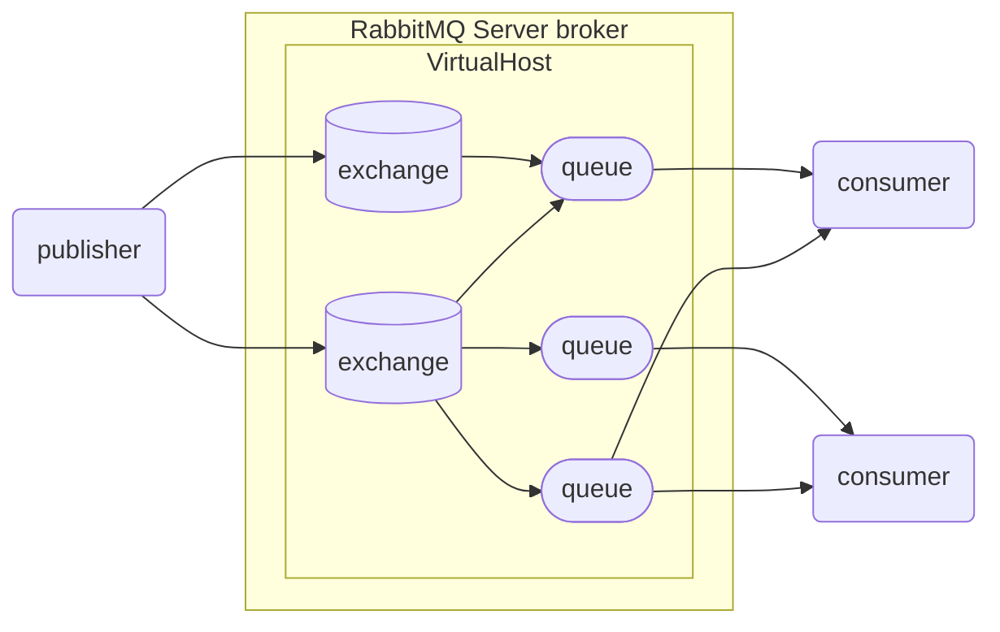

# RabbitMQ

* 三个角色
    * 消息发送者：投递消息的人，就是调用方
    * 消息代理：管理、暂存、转发消息
    * 消息接收者：接收和处理消息的人，就是服务提供方

## 核心概念

* publisher: 消息发送者
* consumer: 消息的消费者
* queue: 队列，存储消息
* exchange: 交换机

### 流程

publisher将消息发送到exchange，exchange将消息路由到一个或多个queue，consumer监听queue获取消息

### VirtualHost

RabbitMQ可以有多个虚拟主机，可以支持多种不同的业务




---

## RabbitMQ管理页面

使用docker安装以`-management`结尾的版本会带一个web管理页面</br>
默认地址：**localhost:15672**</br>
默认用户名密码：**guest**

### Exchanges页面

* 用于管理交换机相关操作
* 在`Add a new exchange`处新建交换机
* 在交换机列表内点击交换机的名称进行详细操作
* 在交换机详细操作页面内的`Bindings`处对queue进行绑定
* 在`Publish message`处测试发送消息
* 在`Delete this exchange`处删除这个交换机

### Queues and Streams页面

* 在`Add a new queue`处新建队列
* 在queue列表内点击queue的名称进行详细操作
* 在queue详细操作页面内的`Bindings`处显示有哪些交换机绑定了当前队列
* 在`Get messages`处可以预览当前队列内的消息
* 在`Delete`处删除当前队列

### Admin页面

* 用于用户管理和虚拟主机的管理

---

## Java客户端

* **AMQP**(Advanced Message Queuing Protocol)
    * 应用之间传递业务消息的开放标准，与语言和平台无关
* Spring **AMQP**
    * 使用Java语言对**AMQP**协议的封装，包含`spring-amqp`抽象和`spring-rabbit`的默认实现

### 基础概念

* 同一条消息只能被一个消费者处理
* 多个consumer绑定在同一个queue上时，这些消息会被所有的消费者共同消费
* 默认情况下RabbitMQ会将消息以轮询的方式投递给绑定队列上的每一个consumer
* 通过在配置文件内设置`spring.rabbitmq.listener.simple.prefetch=1`来控制consumer
获取消息的数量，处理完上一条消息再处理下一条，实现能者多劳

#### 消息发送示例

* publisher

```java
@SpringBootTest
public class SpringAmqpTest {

    @Autowired
    public RabbitTemplate rabbitTemplate;

    @Test
    public void testSendSimpleMessage(){
        String queueName = "simple.queue";
        String message = "Hello rabbitmq!";
        rabbitTemplate.convertAndSend(queueName, message);
    }
}
```

* consumer

```java
@Component
public class AMQPListener {
    @RabbitListener(queues = "simple.queue")
    public void simpleQueueListener(String message){
        System.out.println("message received: " + message);
    }
}
```

---

### 交换机(exchange)

#### Fanout(广播)

* Fanout Exchange会将接收到的消息广播到每一个跟其绑定的queue

##### web管理页面操作

* 新建两个队列
* 新建一个交换机
    * `Type`选择`fanout`
    * 将上面新建的两个队列绑定到当前交换机上

##### 代码

* publisher

```java
@SpringBootTest
public class FanoutTest {
    @Autowired
    public RabbitTemplate rabbitTemplate;

    @Test
    public void testSendSimpleMessage(){
        String exchangeName = "test.fanout";
        String message = "fanout message";
        rabbitTemplate.convertAndSend(exchangeName, null, message);
    }
}
```

* consumer

```java
@Component
public class FanoutListener {

    @RabbitListener(queues = "fanout.queue1")
    public void listenFanout1Exchange(String msg){
        System.out.println("message received: " + msg);
    }

    @RabbitListener(queues = "fanout.queue2")
    public void listenFanout2Exchange(String msg){
        System.out.println("message received: " + msg);
    }
}
```


#### Direct(定向)

* Direct Exchange 会将接收到的消息根据规则路由到指定的queue
* 每一个queue都与exchange设置一个BindingKey
* 发布者发送消息时，指定消息的RoutingKey
* exchange将消息路由到BindingKey与消息RoutingKey一致的队列

##### web管理页面操作

* 新建两个队列`direct.queue1`和`direct.queue2`
* 新建一个交换机
    * `Type`选择`Direct`
    * 将上面新建的两个队列绑定到当前交换机上，绑定时指定对应的`Routing key`
    * `direct.queue1`的`Routing key`指定为red和blue
    * `direct.queue2`的`Routing key`指定为red和yellow

##### 代码

* publisher

```java
@SpringBootTest
public class DirectTest {
    @Autowired
    public RabbitTemplate rabbitTemplate;

    @Test
    public void testSendSimpleMessage() {
        String exchangeName = "test.direct";
        String message = "fanout message";
        rabbitTemplate.convertAndSend(exchangeName, "red", message);
    }
}
```

* consumer

```java
@Component
public class DirectListener {

    @RabbitListener(queues = "direct.queue1")
    public void listenDirect1Exchange(String msg){
        System.out.println("queue1 message received: " + msg);
    }

    @RabbitListener(queues = "direct.queue2")
    public void listenDirect2Exchange(String msg){
        System.out.println("queue2 message received: " + msg);
    }
}
```

#### Topic(话题)

* TopoicExchange与DirectExchange类似，区别在于routingKey可以是多个单词的列表，并且以`.`分割
* Queue与Exchange指定BindingKey时可以使用通配符
    * `#`: 代指0个或多个单词
    * `*`: 代指一个单词

##### web管理页面操作

* 新建两个队列`topic.queue1`和`topic.queue2`
* 新建一个交换机
    * `Type`选择`Topic`
    * 将上面新建的两个队列绑定到当前交换机上，绑定时指定对应的`Routing key`
    * `topic.queue1`的`Routing key`指定为`china.#`
    * `topic.queue2`的`Routing key`指定为`#.news`

##### 代码

* publisher

```java
@SpringBootTest
public class TopicTest {
    @Autowired
    public RabbitTemplate rabbitTemplate;

    @Test
    public void testSendSimpleMessage() {
        String exchangeName = "test.topic";
        String message = "topic message";
        // rabbitTemplate.convertAndSend(exchangeName, "china.weather", message);
        // rabbitTemplate.convertAndSend(exchangeName, "japan.news", message);
        rabbitTemplate.convertAndSend(exchangeName, "china.news", message);
    }
}
```

* consumer

```java
@Component
public class TopicListener {

    @RabbitListener(queues = "topic.queue1")
    public void listenTopic1Exchange(String msg){
        System.out.println("queue1 message received: " + msg);
    }

    @RabbitListener(queues = "topic.queue2")
    public void listenTopic2Exchange(String msg){
        System.out.println("queue2 message received: " + msg);
    }
}
```

---

### 代码声明队列和交换机

* 由于交换机和队列的创建实在web管理页面上操作的，项目发布时需要重新创建一次，
使用代码内声明减少错误

#### 配置类声明

* SpringAMQP提供了几个类，用来声明队列、交换机及其绑定关系：
    * Queue：用于声明队列，可以用工厂类QueueBuilder构建
    * Exchange：用于声明交换机，可以用工厂类ExchangeBuilder构建
    * Binding：用于声明队列和交换机的绑定关系，可以用工厂类BindingBuilder构建

```java
@Configuration
public class RabbitMQConfig {

    @Bean
    public FanoutExchange fanoutExchange(){
        return new FanoutExchange("test.fanout");
    }

    @Bean
    public Queue queue(){
        return new Queue("simple.queue1");
    }

    @Bean
    public Binding binding(FanoutExchange exchange, Queue queue){
        return BindingBuilder.bind(queue).to(exchange);
    }
}
```

#### 注解声明

```java
@Component
public class DirectAnnoListener {

    @RabbitListener(bindings = @QueueBinding(
            value = @Queue(name = "direct.queue1"),
            exchange = @Exchange(name = "test.direct", type = ExchangeTypes.DIRECT),
            key = {"red", "blue"}
    ))
    public void listenDirect1Exchange(String msg){
        System.out.println("queue1 message received: " + msg);
    }

    @RabbitListener(bindings = @QueueBinding(
            value = @Queue(name = "direct.queue2"),
            exchange = @Exchange(name = "test.direct", type = ExchangeTypes.DIRECT),
            key = {"red", "yellow"}
    ))
    public void listenDirect2Exchange(String msg){
        System.out.println("queue2 message received: " + msg);
    }
}
```

---

### 消息转换器

* 用于编解码消息
* consumer和publisher内都需要配置
* 切换消息转换器后，consumer在消费消息时由于新消息和队列内之前的消息格式不同导致报错，这就是消息丢失

```java
@Bean
public MessageConverter messageConverter(){
    return new Jackson2JsonMessageConverter();
}
```

## MQ高级

### 生产者可靠性

#### 生产者重连

* 由于生产者连接RabbitMQ时可能由于网络原因导致无法连接，所以需要配置重连相关操作
* SpringAMQP的重连机制是阻塞式，可能对业务性能有影响

```yaml
spring:
  rebbitmq:
    connection-timeout: 1s # 连接超时时间
    template:
      retry:
        enabled: true # 是否启用默认false
        initial-interval: 1000ms # 首次重连时间
        multiplier: 1 # 下次重连时间=(initial-interval * multiplier)
        max-attempts: 3 # 最大重连次数
```

#### 生产者确认

* RabbitMQ有Publisher Confirm和Publisher Return两种确认机制，开启确认机制后，在MQ成功收到消息后会返回确认消息给生产者。
返回的结果有以下几种情况：
    * 消息投递到了MQ，但是路由失败。此时会通过PublisherReturn返回路由异常原因，然后返回ACK，告知投递成功
    * 临时消息(non durable)投递到了MQ，并且入队成功，返回ACK，告知投递成功
    * 临时消息(durable)投递到了MQ，并且入队完成持久化，返回ACK，告知投递成功
    * 其他情况都会返回NACK，告知投递失败
* PublisherReturn机制是当消息被发布到一个没有匹配队列的交换机时，会触发返回机制
* PublisherConfirm机制是当消息被投递到队列内时触发
* `publisher-confirm-type`配置类型有三种
    * none：关闭confirm机制
    * simple：同步阻塞等待MQ的回执消息
    * correlated：MQ异步回调方式返回回执消息

```yaml
spring:
  rabbitmq:
    publisher-confirm-type: correlated # 异步方式实现消息确
    publisher-returns: true # 开启publisher-returns机制
```

##### PublisherReturn

* 准备一个未和任何队列绑定的交换机
* 由于PublisherReturn机制是全局生效的，所以需要在RabbitTemplate注入成功后就配置

```java
@Configuration
public class CommonConfig implements ApplicationContextAware {
    @Override
    public void setApplicationContext(ApplicationContext applicationContext) throws BeansException {
        RabbitTemplate rabbitTemplate = applicationContext.getBean(RabbitTemplate.class);
        rabbitTemplate.setReturnsCallback(returnedMessage -> {
            System.out.printf("消息发送失败，应答码：%d，原因：%s，交换机：%s，路由链：%s，消息：%s%n",
                    returnedMessage.getReplyCode(), returnedMessage.getReplyText(), returnedMessage.getExchange(),
                    returnedMessage.getRoutingKey(), returnedMessage.getMessage());
        });

    }
}
```

##### PublisherConfirm

```java
@SpringBootTest
public class PublisherConfirmTest {
    @Autowired
    public RabbitTemplate rabbitTemplate;

    @Test
    public void testPublisherConfirm() {
        CorrelationData cd = new CorrelationData();
        cd.getFuture().exceptionally(throwable -> {
                    System.out.println("消息回调失败");
                    return null;
                })
                .thenAccept(confirm -> {
                    if (confirm == null) return;
                    if (confirm.isAck()) {
                        System.out.println("消息发送成功，收到ack");
                    } else {
                        System.out.println("消息发送失败，收到nack，原因：" + confirm.getReason());
                    }
                });
        // rabbitTemplate.convertAndSend("test.direct", "red", "test msg", cd); // 收到ack
        // rabbitTemplate.convertAndSend("test.direct", "red1", "test msg", cd); // 触发publisher-returns机制，收到ack
        rabbitTemplate.convertAndSend("test.direct2", "red", "test msg", cd); // 收到nack
    }
}
```

* 使用PublisherReturn和PublisherConfirm机制需要额外的网络资源开销
* 大部分情况下处理的是nack问题，如果需要消息发送的可靠性，只需要开启PublisherConfirm机制即可

