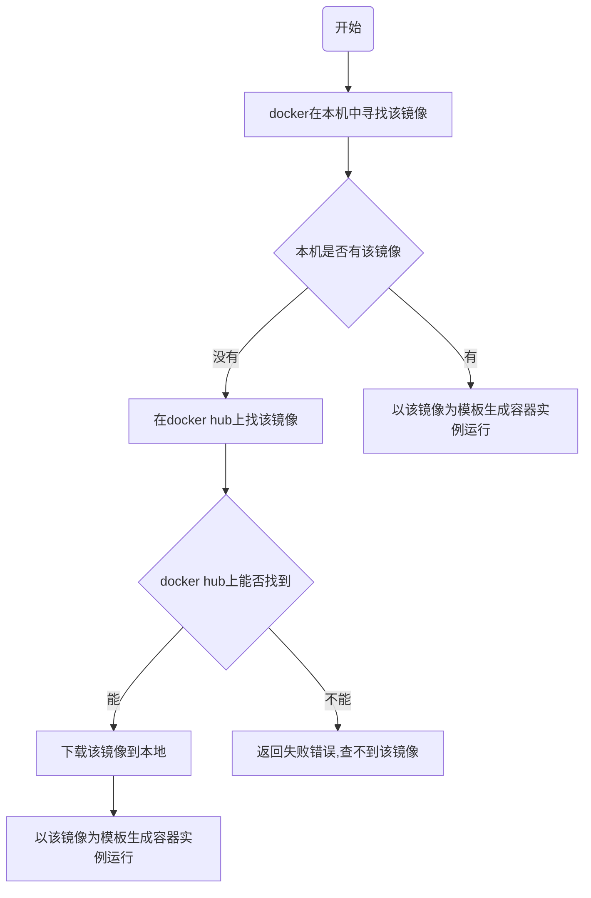

# Docker

* **系统平滑移植**，**容器虚拟化技术**
* docker可以通过镜像（image）将操作系统核心除外，运行程序所需要的系统环境，由下而上打包，达到跨平台无缝接轨运行，代替程序即应用的观念

## 传统虚拟机与容器的对比

### 虚拟机

* 虚拟机架构


* 缺点
    * 资源占用多
    * 冗余步骤多
    * 启动慢

### 容器

* Linux容器（Linux Containers或LXC）
* LInux软驱是云系统其他部分隔离开的一系列进程，从另一个镜像运行，并由该镜像提供支持进程所需的全部文件。
容器提供的镜像包含了应用的所有依赖项，因此在从开发到测试再到生产的整个过程中，它都具有可移植性和一致性。
* Linux容器不是模拟一个完整的操作系统而是堆进程进行隔离。有了容器，
就可以将软件运行所需的所有资源打包到一个隔离的容器中。容器与虚拟机不同，不需要捆绑一整套操作系统,
只需要软件工作所需的库资源和设置。系统因此变得高效轻量并保证部署任何环境中的软件都能始终如一地运行

* 容器化架构


* Docker是在操作系统层面上实现虚拟化，直接复用本地主机操作系统，而传统虚拟机则是在硬件层面实现虚拟化。
与穿透虚拟机相比，Docker优势体现为启动速度快，占用体积小

### 对比

|     | Docker容器    | 虚拟机（VM）    |
|---------------- | --------------- | --------------- |
| 操作系统    | 与宿主机共享OS    | 宿主机上的OS运行虚拟机 |
| 存储大小    | 镜像小，便于存储与传输    | 镜像庞大（vmdk、vdi等） |
| 运行性能 | 几乎无性能损失（根据不同程序，不同运行状态损失不一样） | 操作系统额外的CPU、内存损耗 |
| 移植性 | 轻便、灵活，适应于Linux | 笨重，与虚拟化技术耦合高 |
| 部署速度 | 快速，秒级 | 较慢，10s以上 |


## docker安装

> [官网](https://www.docker.com)</br>
> [官方镜像仓库](https://hub.docker.com/)</br>
> [Docker手册](https://docs.docker.com/manuals/)

* 在Docker手册上查找安装的方式


## docker组成

* 镜像（image）
* 容器（container）
* 仓库（repository）

### 镜像

* docker镜像就是一个只读模板，镜像可以用来创建docker容器，一个镜像可以创建多个容器
* docker的镜像文件类似java的类模板，而docker容器实例类似java中new出来的实例对象

### 容器

* 可以把容器看作是一个简易版的Linux环境（包括root用户权限、进程空间、用户空间和网络空间等）和运行在其中的应用程序

### 仓库

* 集中存放镜像文件的位置，类似Maven存放jar包

## docker工作原理

* docker是一个client-server结构的系统，docker守护进程运行在主机上，
通过socket连接客户端访问，守护进程从客户端接受命令并管理运行在主机上的容器

### docker run 流程



## 添加镜像

* 新建文件`/etc/docker/daemon.json`

```json
{
    "registry-mirrors": [
        "https://registry.docker-cn.com",
        "http://hub-mirror.c.163.com",
        "https://docker.mirrors.ustc.edu.cn",
        "https://cr.console.aliyun.com",
        "https://mirror.ccs.tencentyun.com"
    ]
}
```

* Docker Desktop可以在设置里的Docker Engine选项内添加


## 常用命令

### 帮助启动类

| 命令   | 描述    |
|--------------- | --------------- |
| **systemctl start docker**   | 启动docker   |
| **systemctl stop docker** | 停止docker |
| **systemctl restart docker** | 重启docker |
| **systemctl status docker** | 查看docker状态 |
| **systemctl enable docker** | 开机启动docker |
| **docker info** | 查看docker该药信息 |
| **docker --help** | docker帮助文档 |
| **docker 具体命令 --help** | docker命令帮助文档 |

### 镜像相关

| 命令   | 描述    |
|--------------- | --------------- |
| <a href="#commands-images">docker images</a>   | 列出docker内的镜像   |
| <a href="#commands-search">docker search</a> | 搜索镜像 |
| <a href="#commands-pull">docker pull</a> | 从仓库拉取镜像 |
| **docker system df** | 查看镜像/容器/数据卷所占用空间 |
| <a href="#commands-rmi">docker rmi</a> | 删除镜像 |

<a id="command-volume"></a>
### 容器相关

| 命令   | 描述    |
|--------------- | --------------- |
| <a href="#commands-run">docker run</a>   | 新建+启动容器   |
| <a href="#commands-ps">docker ps</a>   | 列出当前所有正在运行的容器 |
| **docker start** | 启动容器 |
| **docker restart** | 重启容器 |
| **docker stop** | 停止容器 |
| **docker kill** | 强制停止容器 |
| <a href="#commands-rm">docker rm</a>   | 删除已经停止的容器 |
| <a href="#commands-logs">docker logs</a>   | 查看容器日志信息 |
| **docker top** | 查看容器内部运行的进程 |
| **docker inspect** | 查看容器内部细节 |
| <a href="#commands-exec">docker exec</a>   | 进入正在运行的容器以命令行交互 |
| **docker attach** | 进入正在运行的容器以命令行交互，退出时会之间停止容器 |
| <a href="#commands-cp">docker cp</a>   | 将容器内文件复制到主机下 |
| <a href="#commands-export">docker export</a>   | 导出容器 |
| <a href="#commands-import">docker import</a>   | 导入镜像 |
| <a href="#commands-commit">docker commit</a>   | 将容器打包为镜像并提交到本地 |

### 数据卷相关

| 命令   | 描述    |
|--------------- | --------------- |
| **docker volume ls**   | 列出数据卷   |
| **docker volume create**   | 新建数据卷   |
| **docker volume inspect**   | 显示数据卷详细信息   |
| **docker volume rm**   | 删除数据卷   |

<a id="command-network"></a>
### 网络相关

| 命令   | 描述    |
|--------------- | --------------- |
| **docker network ls**   | 列出网络   |
| **docker network create**   | 新建网络   |
| **docker network inspect**   | 显示网络详细信息   |
| **docker network rm**   | 删除网络   |
| **docker network connect**   | 将一个容器连接到某个网络上   |
| **docker network disconnect**   | 将一个容器从某个网络上断开   |
| **docker network prune**   | 删除未使用的网络   |

### 命令详情

<a id="commands-images"></a>
#### docker images

* 列出docker内所有镜像
* 列说明
    * `REPOSITORY`：镜像的仓库源
    * `TAG`：镜像标签版本号
    * `IMAGE ID`：镜像id
    * `CREATED`：镜像创建时间
    * `SIZE`：镜像大小
* 同一个仓库源可以有多个TAG版本，代表这个仓库源的不同版本
* 如果不指定镜像的版本标签，默认使用`镜像名:latest`镜像

```bash
docker images
# 列出本地所有的镜像
docker images -a
# 只显示镜像的id
docker images -q
```

<a id="commands-search"></a>
#### docker search

* 从[官方镜像仓库](https://hub.docker.com/)搜索镜像
* 列说明
    * `NAME`：镜像名称
    * `DESCRIPTION`：镜像说明
    * `STARS`：点赞数
    * `OFFICIAL`：是否官方
    * `AUTOMATED`：是否自动构建

```bash
# 只显示前5条搜索信息
docker search --limit 5 redis
```

<a id="commands-pull"></a>
#### docker pull

* 下载镜像
* 格式：`docker pull 镜像名:[TAG]`

```bash
# 下载最新版
docker pull redis
# 下载指定版本
docker pull redis:6.2
```

<a id="commands-rmi"></a>
#### docker rmi

* 删除镜像
* 格式：`docker rmi 镜像id`

```bash
# 根据镜像id删除镜像id使用docker images查看
docker rmi f7d0a5ed08a2

# 强制删除
docker rmi -f f7d0a5ed08a2

# 删除多个
docker rmi -f redis7.4.0 redis:6.2

# 删除所有镜像
docker rmi -f $(docker images -qa)
```
---

<a id="commands-run"></a>
#### docker run

* 格式：`docker run [OPTIONS] IMAGE [COMMAND] [ARG...]`
* 选项说明
    * `--name='容器名称'`：为容器指定一个名称
    * `-d`：后台运行容器并返回一个容器id，也叫启动守护式容器（后台运行）
    * `-P`：随机端口映射，大写P
    * `-p`：指定端口映射，小写p
    * `-i`：以交互模式运行容器，通常与`-t`同时使用
    * `-t`：为容器重新分配一个伪终端，通常与`-i`同时使用
    * `-v`：指定目录映射
    * `--volumes-from`：继承某个容器的目录映射关系
    * `--network`：指定容器的网络模式

```bash
# 后台启动容器并指定一个名称（启动守护式容器）
docker run -d --name='debian1' debian

# 后台启动容器并将容器的/usr/share/nginx目录映射到主机的/usr/local/web目录
docker run -d -v /usr/local/web:/usr/share/nginx --name='nginx' nginx

# 后台启动名称为n2的nginx容器，目录关系继承至nginx容器
docker run -d -volumes-from nginx --name n2 nginx

# 启动容器并运行容器内的shell与容器进行交互
docker run -it debian /bin/bash
```
<a id="commands-ps"></a>
#### docker ps

* 选项说明
    * `-a`：列出当前所有正在运行的容器+之前运行过的容器
    * `-l`：显示最近创建的容器
    * `-n`：显示最近n个创建的容器
    * `-q`：只显示容器的编号

```bash
# 查看所有容器
docker ps -a

# 显示前3个创建的容器
docker ps -n 3

# 显示所有容器的编号
docker ps -q

# 查看所以从debian镜像启动的容器 
docker ps -af ancestor=debian -q
```

<a id="commands-rm"></a>
#### docker rm

```bash
# 删除指定容器，如果容器正在运行则无法删除
docker rm f7d0a5ed08a2

# 删除指定容器
docker rm -f f7d0a5ed08a2

# 强制删除所有容器
docker rm -f $(docker ps -a -q)
```
<a id="commands-logs"></a>
#### docker logs

```bash
# 查看指定id容器的日志
docker logs f7d0a5ed08a2

# 查看容器日志最后5行
docker logs -n 5 f7d0a5ed08a2 

# 类似linux的tail -f命令
docker logs -f f7d0a5ed08a2
```
<a id="commands-exec"></a>
#### docker exec

* 和`docker attach`的区别是：`docker exec`进入容器后退出不会关闭容器，而`docker attach`会

```bash
# 以交互式命令行进入容器内部
docker exec -it debian1 /bin/bash
```
<a id="commands-cp"></a>
#### docker cp

```bash
# 将debian容器内/tmp目录下的a.txt文件复制到当前目录下
docker cp debian1:/tmp/a.txt ./a.txt
```
<a id="commands-export"></a>
#### docker export

* 将运行中的容器导出为文件
* 可以保存容器内程序生产的内容

```bash
# 将这个容器导出为debian1.tar文件
docker export debian1 > debian1.tar
```

<a id="commands-import"></a>
#### docker import

* 配合`docker export`使用
* 导入后会生成一个新的镜像

```bash
# 导入镜像，导入的镜像名称custom/debian2版本为1.0
docker import debian1.tar custom/debian2:1.0
```
<a id="commands-commit"></a>
#### docker commit

```bash
# 将之间的镜像新加一个软件后提交到本地 
docker commit -m "add new software" -a "y" debian1 y/deb:1.1
```

## docker镜像

* 镜像是一种轻量级、可执行的独立软件包，包含运行某个软件所需的所有内容，
我们把应用程序和配置依赖打包好形成一个可交付的运行环境（包括代码、运行时需要的库、
环境变量和配置文件等），这个打包好的运行环境就是image镜像文件

* docker镜像是由层级文件系统（UnionFS）组成
* docker最底层是由bootfs+rootfs组成，rootfs就是不同的Linux发行版，这些发行版都是最精简的
* 每一个应用程序镜像都是多个镜像组成，例如nginx是由**底层操作系统**+**nginx软件**组成
* docker镜像层都是只读的，容器层是可写的
    * 启动容器后，由于容器是基于镜像启动的，所有在镜像之上叫容器层
* 新建自己的镜像可以从底层开始构建也可以使用<a href="#commands-commit">docker commit</a>命令基于某个镜像构建

## 本地镜像发布到云端流程

* 和git类似先commit到本地再push到远程

### docker私有库

* 下载私有库服务`docker pull registry`后进行配置

## Docker容器数据卷

* 将docker容器内的数据保存进宿主机的磁盘中
* 运行一个带有容器数据卷功能的容器实例，参考<a href="#commands-run">docker run</a>
* 使用`-v`参数创建的目录映射关系默认是匿名的，使用<a href="#command-volume">数据卷</a>相关命令管理数据卷

## Dockerfile

* Dockerfile是用来构建docker镜像的文本文件，是由一条条构建镜像所需的指令和参数构成的脚本。

### Dockerfile指令

* 每个指令必须为大写
* 指令从上到下顺序执行
* `#`表示注释


| 指令   | 说明    |
|--------------- | --------------- |
| **FROM**   | 基础镜像，当前新镜像是基于哪个镜像构建的，指定一个已存在的镜像作为模板，第一条必须是FROM   |
| **MAINTAINER** | 镜像维护者的姓名和邮箱 |
| **RUN** | 容器构建时需要运行的命令 |
| **EXPOSE** | 当前容器对外暴露的端口 |
| **WORKDIR** | 指定容器创建后，终端默认登录进来的目录 |
| **USER** | 指定镜像以什么用户执行，默认root |
| **ENV** | 用来在构建镜像过程中设置环境变量 |
| **ADD** | 将宿主机下的文件拷贝进镜像内，如果是tar文件则会自动解压，支持URL地址下载文件 |
| **COPY** | 拷贝文件或目录到镜像内 |
| **VOLUME** | 容器数据卷 |
| <a href="#dockerfile-instruction-cmd">CMD</a> | 指定容器启动后执行的命令 |
| <a href="#dockerfile-instruction-entrypoint">ENTRYPOINT</a> | 也是用来指定容器启动后执行的命令 |

#### 指令详情

<a id="dockerfile-instruction-cmd"></a>
##### CMD

* 有两种格式：
    * shell格式：`CMD 命令 参数1 参数2`
    * exec格式：`CMD ["可执行文件" "参数1" "参数2"]`
* 配合<a href="#dockerfile-instruction-entrypoint">ENTRYPOINT</a>则CMD后接参数：`CMD ["参数1" "参数2"]`
* Dockerfile中只能有一条CMD指令。如果编写了多个CMD指令，则只有最后一个生效。
* CMD会被`docker run`命令最后一个命令参数覆盖
* CMD在`docker run`的时候执行，RUN是在`docker build`时执行

<a id="dockerfile-instruction-entrypoint"></a>
##### ENTRYPOINT

* 类似CMD指令，但是不会被`docker run`后面的命令覆盖，`docker run`后面的命令会被当作ENTRYPOINT执行可执行程序的参数
* ENTRYPOINT与CMD命令配合则ENTRYPOINT为指定**可执行命令**，而CMD指定**命令的参数**

#### 构建测试

* 基于ubuntu:24.0.4构建一个带jdk17的镜像
* 将jdk压缩包和Dockerfile放在同一个目录下

```Dockerfile
FROM ubuntu:24.04

WORKDIR /usr/local/jdk

ADD ./jdk-17.0.11_linux-x64_bin.tar.gz /usr/local/jdk

ENV JAVA_HOME /usr/local/jdk/jdk-17.0.11
ENV PATH $PATH:$JAVA_HOME/bin

RUN java -version

CMD /bin/bash
```

#### 虚悬镜像

* 测试构建一个虚悬镜像
* Dockerfile

```Dockerfile
FROM ubuntu:24.04
CMD echo 123
```

* 执行`docker build .`命令就会生成一个虚悬镜像
* 使用`docker images -f dangling=true`命令查询所以的虚悬镜像
* 使用`docker rmi $(docker images -qf dangling=true)`命令删除所有的虚悬镜像

## Docker网络（network）

> <a href="#command-network">docker网络命令参考</a>

* 进行容器之间的互联和通信以及端口映射
* 容器ip变动时可以通过服务名连接，通信不受影响 

### Docker网络模式

* docker会在宿主机虚拟一个网桥（docker0），启动一个容器时docker会根据这个虚拟网桥的网段分配给容器一个ip。
可以将虚拟网桥（docker0）理解为一个交换机，宿主机通过这个交换机连接到每一个容器

| 网络模式   | 简介    |
|--------------- | --------------- |
| bridge   | 为每一个容器都分配一个虚拟网络、设置ip等，并将容器连接到一个docker0。虚拟网桥，默认就是这个模式   |
| host | 使用宿主机的ip和端口 |
| none | 不进行任何网络设置 |
| container | 创建的容器和指定的容器共享ip、端口等 |

### bridge

* 将容器的网络连接到虚拟网桥（docker0）上，根据虚拟网桥的的网段分配一个ip给容器

### host

* 直接使用宿主机的ip与外界通信

## 常见问题

### docker虚悬镜像是什么

* 仓库名和标签都是`<none>`

### docker挂载主机目录访问如果出现cannot open directory .: Permission denied

* 在挂在目录后加`--privileged=true`参数即可
