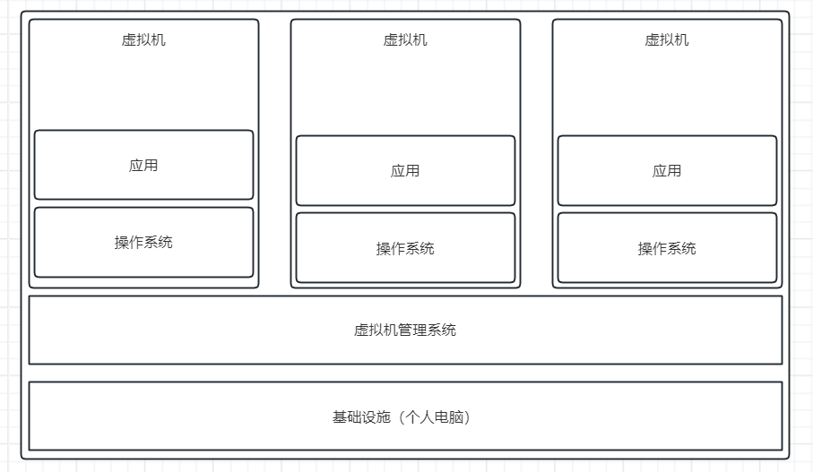
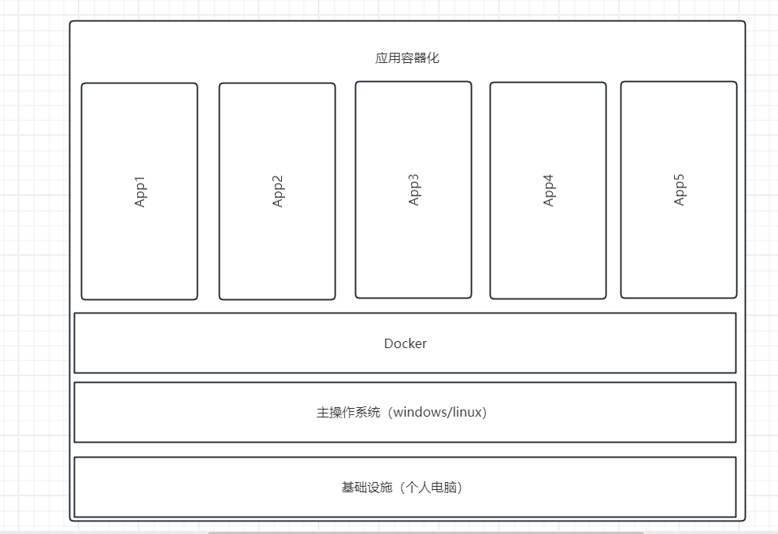

# Docker

* **系统平滑移植**，**容器虚拟化技术**
* docker可以通过镜像（image）将操作系统核心除外，运行程序所需要的系统环境，由下而上打包，达到跨平台无缝接轨运行，代替程序即应用的观念

## 传统虚拟机与容器的对比

### 虚拟机

* 虚拟机架构



* 缺点
    * 资源占用多
    * 冗余步骤多
    * 启动慢

### 容器

* Linux容器（Linux Containers或LXC）
* LInux软驱是云系统其他部分隔离开的一系列进程，从另一个镜像运行，并由该镜像提供支持进程所需的全部文件。
容器提供的镜像包含了应用的所有依赖项，因此在从开发到测试再到生产的整个过程中，它都具有可移植性和一致性。
* Linux容器不是模拟一个完整的操作系统而是堆进程进行隔离。有了容器，
就可以将软件运行所需的所有资源打包到一个隔离的容器中。容器与虚拟机不同，不需要捆绑一整套操作系统,
只需要软件工作所需的库资源和设置。系统因此变得高效轻量并保证部署任何环境中的软件都能始终如一地运行

* 容器化架构



* Docker是在操作系统层面上实现虚拟化，直接复用本地主机操作系统，而传统虚拟机则是在硬件层面实现虚拟化。
与穿透虚拟机相比，Docker优势体现为启动速度快，占用体积小


## docker安装

* [安装文档](https://docs.docker.com/engine/install/debian/#installation-methods)

* 在文档内选择安装方式安装，我使用的apt安装方式


### 添加镜像

* 新建文件`/etc/docker/daemon.json`

```json
{
    "registry-mirrors": [
        "https://registry.docker-cn.com",
        "http://hub-mirror.c.163.com",
        "https://docker.mirrors.ustc.edu.cn",
        "https://cr.console.aliyun.com",
        "https://mirror.ccs.tencentyun.com"
    ]
}
```

## 容器&镜像

> 在[docker hub](https://hub.docker.com/)上搜索镜像

### 镜像

* `docker search image_name` 搜索镜像
* `docker pull [image_repo]image_name[:image_tag]` 下载镜像
* `docker images` 查看已有的镜像
* `docker rmi` 删除镜像

### 容器

* `docker ps -a` 查看所有容器
* `docker rm` 删除容器
    * 删除某个镜像对应的所有容器
    ```powershell
    docker rm $(docker ps -af ancestor=image_name -q)
    ``` 
* `docker run image_name` 运行容器
    * `-d` 后台运行
    * `-it` 交互式运行容器命令最后接需要执行的交互式命令，通常是bash

* `docker exec` 在容器内执行命令
    * `-it` 交互式

* `docker logs container_id` 查看容器的命令
    * `-f` 监听日志

* `docker cp container_id:path path` 复制容器内的文件到本地，反过来一样

* `docker stop container_id` 停止容器

* `docker start container_id` 启动容器

## 数据卷

* `docker volume`

## 网络

* `docker network`

`docker build -t 镜像名称:镜像标签 Dockerfile目录` 制作镜像   

## 其他

###
### docker gitlab备份

* `docker ps`获取 container id
* `docker exec -i -t （这里填container id） /bin/bash`

* `gitlab-rake gitlab:backup:create`
* 输出`Creating backup archive xxx_xxx.tar`备份成功
* 文件在创建容器的命令映射的gitlab数据路径下`data/backups`下

## 参考

* 参考https://blog.csdn.net/weixin_43961117/article/details/126125976教程
