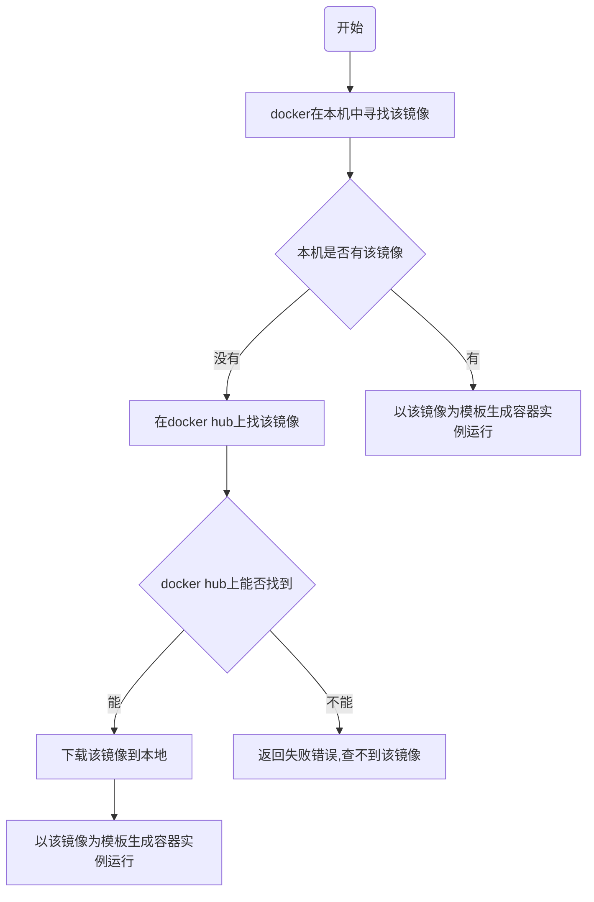

# Docker

* **系统平滑移植**，**容器虚拟化技术**
* docker可以通过镜像（image）将操作系统核心除外，运行程序所需要的系统环境，由下而上打包，达到跨平台无缝接轨运行，代替程序即应用的观念

## 传统虚拟机与容器的对比

### 虚拟机

* 虚拟机架构


* 缺点
    * 资源占用多
    * 冗余步骤多
    * 启动慢

### 容器

* Linux容器（Linux Containers或LXC）
* LInux软驱是云系统其他部分隔离开的一系列进程，从另一个镜像运行，并由该镜像提供支持进程所需的全部文件。
容器提供的镜像包含了应用的所有依赖项，因此在从开发到测试再到生产的整个过程中，它都具有可移植性和一致性。
* Linux容器不是模拟一个完整的操作系统而是堆进程进行隔离。有了容器，
就可以将软件运行所需的所有资源打包到一个隔离的容器中。容器与虚拟机不同，不需要捆绑一整套操作系统,
只需要软件工作所需的库资源和设置。系统因此变得高效轻量并保证部署任何环境中的软件都能始终如一地运行

* 容器化架构


* Docker是在操作系统层面上实现虚拟化，直接复用本地主机操作系统，而传统虚拟机则是在硬件层面实现虚拟化。
与穿透虚拟机相比，Docker优势体现为启动速度快，占用体积小

### 对比

|     | Docker容器    | 虚拟机（VM）    |
|---------------- | --------------- | --------------- |
| 操作系统    | 与宿主机共享OS    | 宿主机上的OS运行虚拟机 |
| 存储大小    | 镜像小，便于存储与传输    | 镜像庞大（vmdk、vdi等） |
| 运行性能 | 几乎无性能损失（根据不同程序，不同运行状态损失不一样） | 操作系统额外的CPU、内存损耗 |
| 移植性 | 轻便、灵活，适应于Linux | 笨重，与虚拟化技术耦合高 |
| 部署速度 | 快速，秒级 | 较慢，10s以上 |


## docker安装

> [官网](https://www.docker.com)</br>
> [官方镜像仓库](https://hub.docker.com/)</br>
> [Docker手册](https://docs.docker.com/manuals/)

* 在Docker手册上查找安装的方式


## docker组成

* 镜像（image）
* 容器（container）
* 仓库（repository）

### 镜像

* docker镜像就是一个只读模板，镜像可以用来创建docker容器，一个镜像可以创建多个容器
* docker的镜像文件类似java的类模板，而docker容器实例类似java中new出来的实例对象

### 容器

* 可以把容器看作是一个简易版的Linux环境（包括root用户权限、进程空间、用户空间和网络空间等）和运行在其中的应用程序

### 仓库

* 集中存放镜像文件的位置，类似Maven存放jar包

## docker工作原理

* docker是一个client-server结构的系统，docker守护进程运行在主机上，
通过socket连接客户端访问，守护进程从客户端接受命令并管理运行在主机上的容器

### docker run 流程



## 添加镜像

* 新建文件`/etc/docker/daemon.json`

```json
{
    "registry-mirrors": [
        "https://registry.docker-cn.com",
        "http://hub-mirror.c.163.com",
        "https://docker.mirrors.ustc.edu.cn",
        "https://cr.console.aliyun.com",
        "https://mirror.ccs.tencentyun.com"
    ]
}
```

* Docker Desktop可以在设置里的Docker Engine选项内添加


## 常用命令

### 帮助启动类

| 命令   | 描述    |
|--------------- | --------------- |
| **systemctl start docker**   | 启动docker   |
| **systemctl stop docker** | 停止docker |
| **systemctl restart docker** | 重启docker |
| **systemctl status docker** | 查看docker状态 |
| **systemctl enable docker** | 开机启动docker |
| **docker info** | 查看docker该药信息 |
| **docker --help** | docker帮助文档 |
| **docker 具体命令 --help** | docker命令帮助文档 |

### 镜像

| 命令   | 描述    |
|--------------- | --------------- |
| <a href="#commands-images">docker images</a>   | 列出docker内的镜像   |
| <a href="#commands-search">docker search</a> | 搜索镜像 |
| <a href="#commands-pull">docker pull</a> | 从仓库拉取镜像 |
| **docker system df** | 查看镜像/容器/数据卷所占用空间 |
| <a href="#commands-rmi">docker rmi</a> | 删除镜像 |

### 容器
| 命令   | 描述    |
|--------------- | --------------- |
| <a href="#commands-run">docker run</a>   | 新建+启动容器   |
| <a href="#commands-ps">docker ps</a>   | 列出当前所有正在运行的容器 |
| **docker start 容器名称或id** | 启动容器 |
| **docker restart 容器名称或id** | 重启容器 |
| **docker stop 容器名称或id** | 停止容器 |
| **docker kill 容器名称或id** | 强制停止容器 |
| <a href="#commands-rm">docker rm</a>   | 删除已经停止的容器 |

### 命令详情

<a id="commands-images"></a>
#### docker images

* 列出docker内所有镜像
* 列说明
    * `REPOSITORY`：镜像的仓库源
    * `TAG`：镜像标签版本号
    * `IMAGE ID`：镜像id
    * `CREATED`：镜像创建时间
    * `SIZE`：镜像大小
* 同一个仓库源可以有多个TAG版本，代表这个仓库源的不同版本
* 如果不指定镜像的版本标签，默认使用`镜像名:latest`镜像

```bash
docker images
# 列出本地所有的镜像
docker images -a
# 只显示镜像的id
docker images -q
```

<a id="commands-search"></a>
#### docker search

* 从[官方镜像仓库](https://hub.docker.com/)搜索镜像
* 列说明
    * `NAME`：镜像名称
    * `DESCRIPTION`：镜像说明
    * `STARS`：点赞数
    * `OFFICIAL`：是否官方
    * `AUTOMATED`：是否自动构建

```bash
# 只显示前5条搜索信息
docker search --limit 5 redis
```

<a id="commands-pull"></a>
#### docker pull

* 下载镜像
* 格式：`docker pull 镜像名:[TAG]`

```bash
# 下载最新版
docker pull redis
# 下载指定版本
docker pull redis:6.2
```

<a id="commands-rmi"></a>
#### docker rmi

* 删除镜像
* 格式：`docker rmi 镜像id`

```bash
# 根据镜像id删除镜像id使用docker images查看
docker rmi f7d0a5ed08a2

# 强制删除
docker rmi -f f7d0a5ed08a2

# 删除多个
docker rmi -f redis7.4.0 redis:6.2

# 删除所有镜像
docker rmi -f $(docker images -qa)
```
---

<a id="commands-run"></a>
#### docker run

* 格式：`docker run [OPTIONS] IMAGE [COMMAND] [ARG...]`
* 选项说明
    * `--name='容器名称'`：为容器指定一个名称
    * `-d`：后台运行容器并返回一个容器id，也叫启动守护式容器（后台运行）
    * `-P`：随机端口映射，大写P
    * `-p`：指定端口映射，小写p
    * `-i`：以交互模式运行容器，通常与`-t`同时使用
    * `-t`：为容器重新分配一个伪终端，通常与`-i`同时使用

```bash
# 后台启动容器并指定一个名称
docker run -d --name='debian1' debian

# 启动容器并运行容器内的shell与容器进行交互
docker run -it debian /bin/bash
```
<a id="commands-ps"></a>
#### docker ps

* 选项说明
    * `-a`：列出当前所有正在运行的容器+之前运行过的容器
    * `-l`：显示最近创建的容器
    * `-n`：显示最近n个创建的容器
    * `-q`：只显示容器的编号

```bash
# 查看所有容器
docker ps -a

# 显示前3个创建的容器
docker ps -n 3

# 显示所有容器的编号
docker ps -q
```

<a id="commands-rm"></a>
#### docker rm

```bash
# 删除指定容器，如果容器正在运行则无法删除
docker rm f7d0a5ed08a2

# 删除指定容器
docker rm -f f7d0a5ed08a2

# 强制删除所有容器
docker rm -f $(docker ps -a -q)
```

## 常见问题

### docker虚悬镜像是什么

* 仓库名和标签都是`<none>`

### 容器

* `docker ps -a` 查看所有容器
* `docker rm` 删除容器
    * 删除某个镜像对应的所有容器
    ```powershell
    docker rm $(docker ps -af ancestor=image_name -q)
    ``` 
* `docker run image_name` 运行容器
    * `-d` 后台运行
    * `-it` 交互式运行容器命令最后接需要执行的交互式命令，通常是bash

* `docker exec` 在容器内执行命令
    * `-it` 交互式

* `docker logs container_id` 查看容器的命令
    * `-f` 监听日志

* `docker cp container_id:path path` 复制容器内的文件到本地，反过来一样

* `docker stop container_id` 停止容器

* `docker start container_id` 启动容器

## 数据卷

* `docker volume`

## 网络

* `docker network`

`docker build -t 镜像名称:镜像标签 Dockerfile目录` 制作镜像   

## 其他

###
### docker gitlab备份

* `docker ps`获取 container id
* `docker exec -i -t （这里填container id） /bin/bash`

* `gitlab-rake gitlab:backup:create`
* 输出`Creating backup archive xxx_xxx.tar`备份成功
* 文件在创建容器的命令映射的gitlab数据路径下`data/backups`下

## 参考

* 参考https://blog.csdn.net/weixin_43961117/article/details/126125976教程
